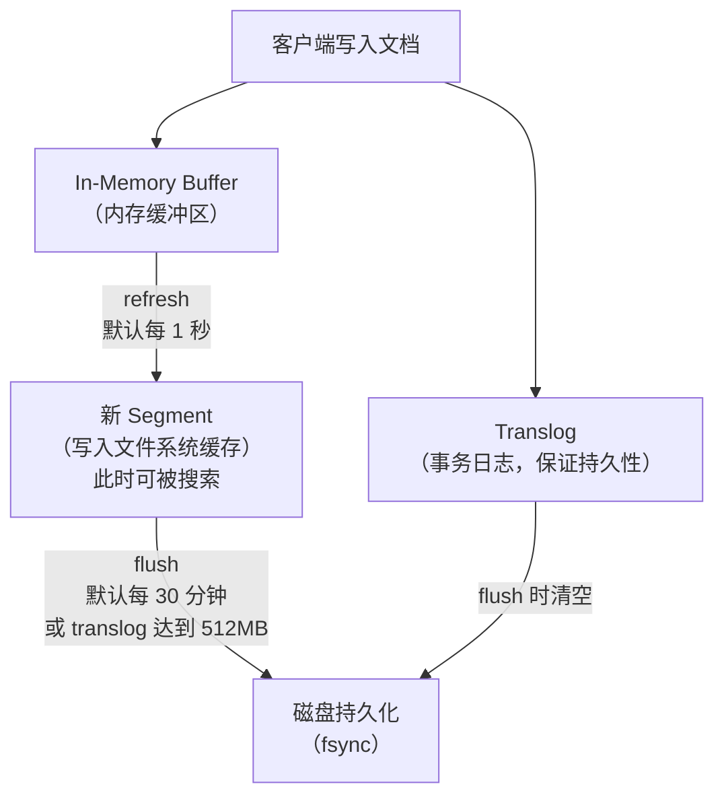
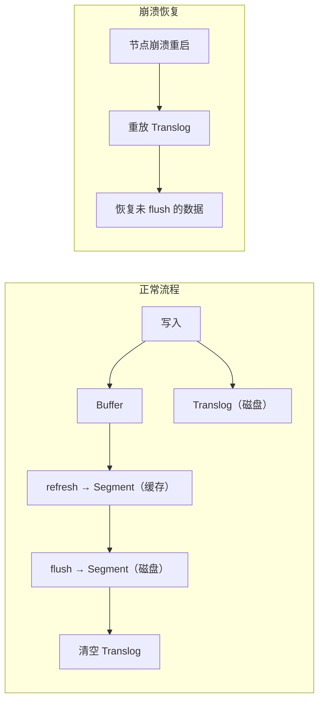
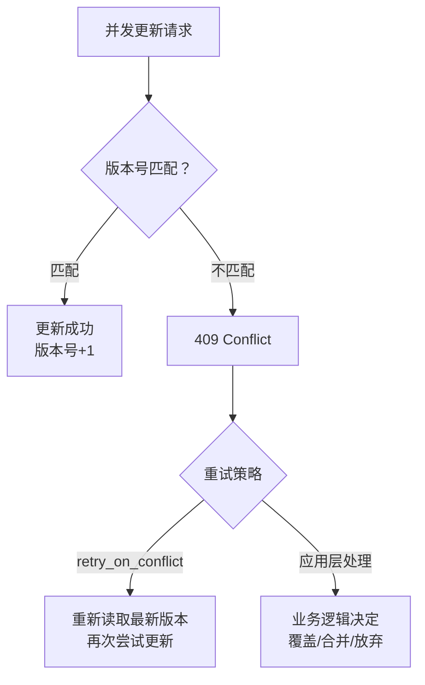
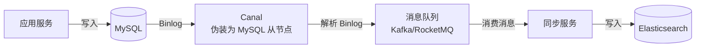
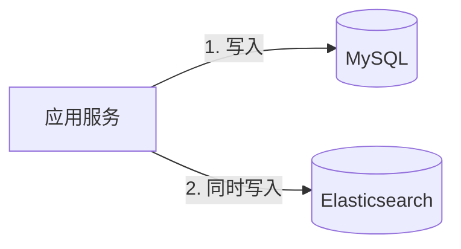
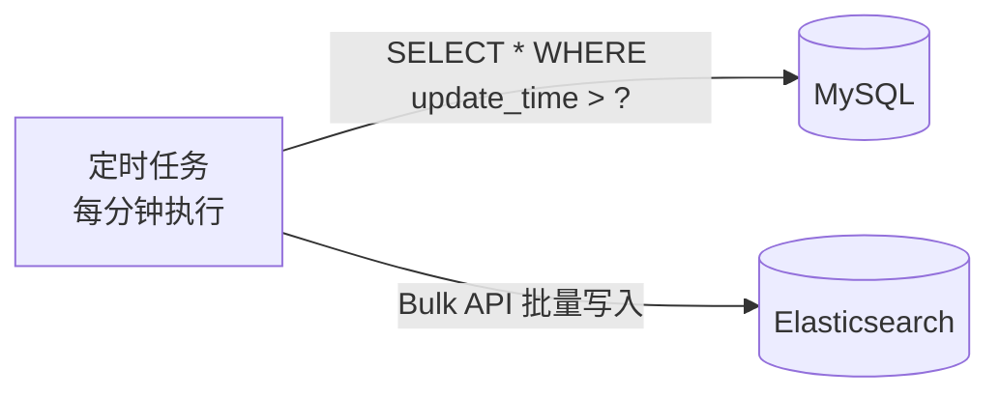
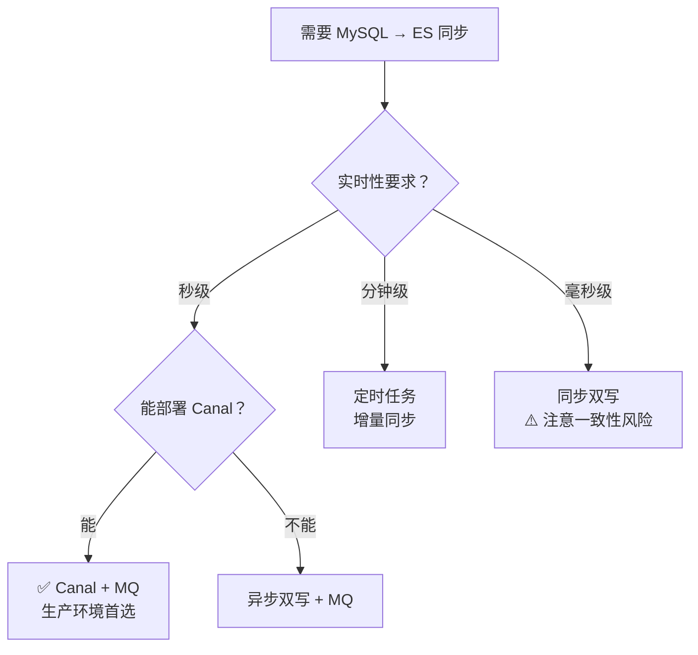

# ES 数据一致性：MySQL 与 ES 同步方案

> **核心问题**：如何保证 MySQL 和 ES 的数据一致性？ES 的 Near Real-Time 机制是什么？写入后为什么不能立即查到？版本冲突如何处理？

---

## 它解决了什么问题？

在实际项目中，MySQL 是主数据源，ES 是搜索引擎。两者之间的数据同步是一个经典的分布式一致性问题：

- MySQL 写入成功，ES 同步失败 → 搜索结果缺失
- ES 同步延迟 → 用户刚发布的内容搜不到
- 并发更新 → ES 中的数据被旧版本覆盖

理解 ES 的写入机制和同步方案，才能在"实时性"和"一致性"之间做出正确的权衡。

---

# 一、ES 的 Near Real-Time 机制

ES 不是实时搜索引擎，而是**近实时（Near Real-Time, NRT）** 搜索引擎。写入的文档需要经过 refresh 才能被搜索到。

### 写入流程



### refresh、flush、fsync 的区别

| 操作 | 触发时机 | 做了什么 | 效果 |
|------|---------|---------|------|
| **refresh** | 默认每 1 秒 | 将内存缓冲区的数据写入新 Segment（文件系统缓存） | 文档变为**可搜索** |
| **flush** | 默认每 30 分钟或 translog 达到 512MB | 执行 fsync 将 Segment 持久化到磁盘，清空 translog | 数据**持久化** |
| **fsync** | flush 时调用 | 操作系统级别的磁盘同步 | 确保数据写入物理磁盘 |

### 为什么写入后不能立即查到？

```
时间线：
  t=0    客户端写入文档 → 进入内存缓冲区（不可搜索）
  t=0    同时写入 translog（保证崩溃恢复）
  t<1s   文档在内存中，搜索不到
  t=1s   refresh 触发 → 生成新 Segment → 文档可搜索
```

**如何让文档立即可搜索？**

```bash
# 方式1：写入时指定 refresh=true（影响性能，不推荐大量使用）
PUT /my_index/_doc/1?refresh=true
{
  "title": "立即可搜索的文档"
}

# 方式2：写入后手动 refresh
POST /my_index/_refresh

# 方式3：设置更短的 refresh_interval（如 500ms）
PUT /my_index/_settings
{
  "index.refresh_interval": "500ms"
}
```

> ⚠️ **注意**：频繁 refresh 会产生大量小 Segment，增加合并压力，降低写入性能。生产环境中，批量写入时建议临时关闭 refresh（设为 `-1`），写入完成后再手动 refresh。

---

# 二、Translog 与崩溃恢复

Translog（事务日志）类似于 MySQL 的 redo log，保证数据在 flush 之前不会因为节点崩溃而丢失。



**Translog 的持久化策略**：

| 配置 | 说明 | 适用场景 |
|------|------|---------|
| `request`（默认） | 每次写入操作后 fsync translog | 数据安全性高，写入性能略低 |
| `async` | 每隔 `sync_interval`（默认 5s）fsync | 写入性能高，但崩溃可能丢失最近 5s 数据 |

```bash
# 设置异步刷盘（提升写入性能，接受少量数据丢失风险）
PUT /my_index/_settings
{
  "index.translog.durability": "async",
  "index.translog.sync_interval": "5s"
}
```

---

# 三、版本控制与并发冲突

ES 使用**乐观并发控制**，通过版本号避免并发更新导致的数据覆盖。

### 3.1 内部版本号（_version）

```bash
# 首次创建文档，_version = 1
PUT /my_index/_doc/1
{ "title": "v1" }

# 更新文档，_version 自增为 2
PUT /my_index/_doc/1
{ "title": "v2" }

# 使用 if_seq_no + if_primary_term 做乐观锁（推荐）
PUT /my_index/_doc/1?if_seq_no=1&if_primary_term=1
{ "title": "v3" }
# 如果 seq_no 或 primary_term 不匹配，返回 409 Conflict
```

### 3.2 外部版本号（version_type=external）

当 MySQL 是主数据源时，可以用 MySQL 的更新时间戳或版本号作为 ES 的外部版本号：

```bash
# 使用外部版本号（如 MySQL 的 update_time 转为时间戳）
PUT /my_index/_doc/1?version=1681234567&version_type=external
{ "title": "从MySQL同步的数据" }

# 只有当提供的版本号 > 当前版本号时才会更新
# 这样即使同步消息乱序，也不会用旧数据覆盖新数据
```

### 3.3 并发冲突处理策略



```bash
# 使用 _update API 的 retry_on_conflict 参数
POST /my_index/_update/1?retry_on_conflict=3
{
  "doc": { "views": 100 }
}
```

---

# 四、MySQL 与 ES 数据同步方案

### 方案一：Canal 监听 MySQL Binlog（推荐）



**优点**：
- 对业务代码**零侵入**，不需要修改任何业务逻辑
- 通过消息队列解耦，支持重试和幂等
- 能捕获所有数据变更（包括直接操作数据库的变更）

**缺点**：
- 有秒级延迟（Binlog 解析 + 消息队列传输）
- 需要维护 Canal + 消息队列组件
- 需要处理 DDL 变更（表结构变化）

**关键配置**：

```yaml
# Canal 配置示例
canal.instance.master.address=127.0.0.1:3306
canal.instance.dbUsername=canal
canal.instance.dbPassword=canal
canal.instance.filter.regex=mydb\\..*  # 监听 mydb 下所有表
```

### 方案二：双写（同步写入）



**优点**：实时性最好，实现简单

**缺点**：
- **一致性风险**：MySQL 成功但 ES 失败，数据不一致
- 代码耦合，每个写操作都要同时操作两个存储
- 性能下降（写入延迟 = MySQL 延迟 + ES 延迟）

**改进方案：先写 MySQL，再异步写 ES**：

```java
@Transactional
public void saveOrder(Order order) {
    // 1. 先写 MySQL（事务保证）
    orderMapper.insert(order);

    // 2. 发送消息到 MQ，异步同步到 ES
    mqTemplate.send("es-sync-topic", JSON.toJSONString(order));
}

// 消费者：从 MQ 消费消息，写入 ES
@KafkaListener(topics = "es-sync-topic")
public void syncToES(String message) {
    Order order = JSON.parseObject(message, Order.class);
    esClient.index(new IndexRequest("orders")
        .id(order.getId().toString())
        .source(JSON.toJSONString(order), XContentType.JSON));
}
```

### 方案三：定时任务（全量/增量同步）



**优点**：实现最简单，适合数据量不大的场景

**缺点**：
- 实时性差（分钟级延迟）
- 依赖 `update_time` 字段，物理删除的数据无法感知
- 全量同步时对 MySQL 有查询压力

---

# 五、方案对比与选型

| 方案 | 实时性 | 一致性 | 复杂度 | 侵入性 | 推荐场景 |
|------|--------|--------|--------|--------|---------|
| **Canal + MQ** | 秒级 | 高 | 中 | 无 | ✅ 生产环境首选 |
| **双写（同步）** | 实时 | 中（有风险） | 低 | 高 | 简单场景、数据量小 |
| **双写（异步MQ）** | 秒级 | 较高 | 中 | 中 | 无法部署 Canal 时 |
| **定时任务** | 分钟级 | 中 | 低 | 无 | 对实时性要求低 |

### 选型建议



---

# 六、同步异常处理

### 6.1 消息丢失

```
问题：MQ 消息丢失导致 ES 数据缺失
解决：
  1. MQ 开启消息持久化
  2. 消费者手动 ACK（确认消费成功后再提交）
  3. 定期全量对账（比对 MySQL 和 ES 的数据量和关键字段）
```

### 6.2 消息乱序

```
问题：同一条数据的多次更新消息乱序到达，旧数据覆盖新数据
解决：
  1. 使用 ES 外部版本号（version_type=external），用 update_time 作为版本号
  2. 同一主键的消息路由到同一分区（保证分区内有序）
```

### 6.3 同步延迟监控

```bash
# 监控同步延迟：比较 MySQL 最新更新时间和 ES 最新更新时间的差值
# MySQL
SELECT MAX(update_time) FROM orders;

# ES
GET /orders/_search
{
  "size": 1,
  "sort": [{"update_time": "desc"}],
  "_source": ["update_time"]
}
```

---

# 七、常见问题

**Q：如何保证 MySQL 和 ES 的数据一致性？**

> 推荐使用 Canal 监听 MySQL Binlog + 消息队列的方案。Canal 伪装为 MySQL 从节点，实时捕获数据变更，通过消息队列异步同步到 ES。配合消息持久化、手动 ACK 和定期对账，可以达到最终一致性。

**Q：写入 ES 后为什么不能立即查到？**

> ES 是近实时搜索引擎，文档写入后先进入内存缓冲区，需要经过 refresh（默认 1 秒）才会生成新的 Segment 变为可搜索。可以通过 `?refresh=true` 参数强制立即 refresh，但会影响写入性能。

**Q：并发更新 ES 文档时如何避免数据覆盖？**

> 使用乐观并发控制：通过 `if_seq_no` + `if_primary_term` 参数实现。更新时携带当前版本信息，如果版本不匹配（说明被其他请求修改过），返回 409 冲突，客户端重新读取最新版本后重试。

**Q：Canal 同步方案中，如何处理 MySQL 表结构变更（DDL）？**

> Canal 可以捕获 DDL 事件。收到 DDL 后，同步服务需要相应地更新 ES 的 Mapping。建议：① 新增字段直接在 ES 中添加；② 修改字段类型需要 Reindex；③ 删除字段可以忽略（ES 不强制 schema）。

**Q：定时同步方案中，如何处理物理删除的数据？**

> 方案一：改为逻辑删除（`is_deleted` 字段），定时任务同步删除标记到 ES；方案二：维护一张删除日志表，记录被删除的主键 ID，定时任务读取后从 ES 中删除。
