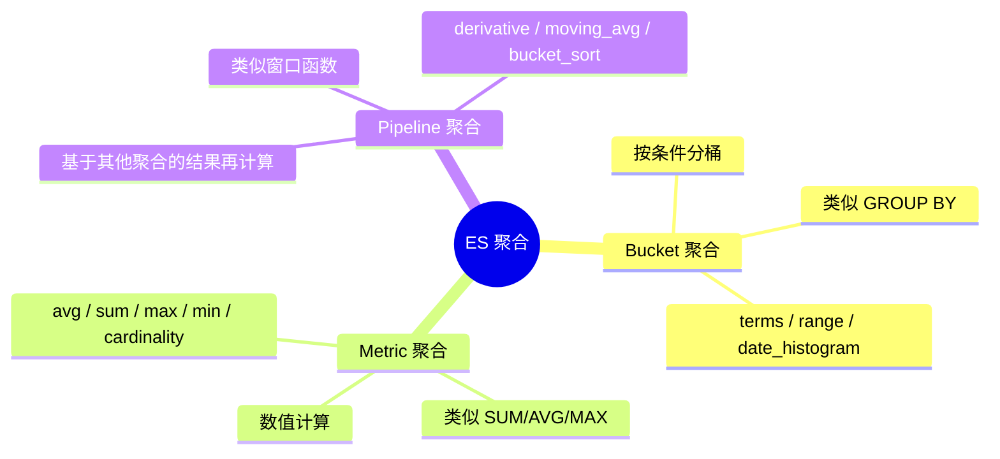

# ES 聚合查询：数据分析与统计

> **核心问题**：ES 除了搜索还能做什么？如何用聚合实现数据统计、分组分析、趋势计算？聚合和 SQL 的 GROUP BY 有什么区别？

---

## 它解决了什么问题？

搜索引擎不只是"搜索"，还需要对搜索结果做**统计分析**。比如：

- 电商：按品牌统计商品数量、按价格区间分布、计算平均评分
- 日志：按时间维度统计错误数量趋势、按服务分组统计响应时间
- 业务：统计每个城市的用户数、计算每月销售额环比增长

ES 的聚合（Aggregation）功能就是为这些场景设计的，类似于 SQL 的 `GROUP BY` + 聚合函数，但更强大——支持嵌套聚合、管道聚合等高级用法。

**生活类比**：搜索是"找到符合条件的商品"，聚合是"找到后还要告诉你——这些商品按品牌分布如何、平均价格多少、最贵的是哪个"。

---

# 一、聚合的三大类型



| 类型 | 作用 | SQL 类比 | 典型场景 |
|------|------|---------|---------|
| **Bucket** | 将文档分到不同的桶中 | `GROUP BY` | 按品牌分组、按价格区间分组 |
| **Metric** | 对桶内文档做数值计算 | `SUM/AVG/MAX/MIN/COUNT` | 计算平均价格、最大值、去重计数 |
| **Pipeline** | 对其他聚合的结果做二次计算 | 窗口函数 | 环比增长、移动平均、排序 |

---

# 二、Bucket 聚合（分桶）

### 2.1 Terms 聚合（按字段值分组）

```bash
# 类似 SQL: SELECT brand, COUNT(*) FROM products GROUP BY brand
GET /products/_search
{
  "size": 0,
  "aggs": {
    "brand_distribution": {
      "terms": {
        "field": "brand.keyword",
        "size": 10,
        "order": { "_count": "desc" }
      }
    }
  }
}
```

**返回结果**：

```json
{
  "aggregations": {
    "brand_distribution": {
      "buckets": [
        { "key": "Apple", "doc_count": 1500 },
        { "key": "Samsung", "doc_count": 1200 },
        { "key": "Huawei", "doc_count": 800 }
      ]
    }
  }
}
```

> ⚠️ **注意**：terms 聚合的 `field` 必须是 `keyword` 类型（或数值类型），不能是 `text` 类型。`text` 类型会被分词，聚合结果会按词项而非完整值分组。

### 2.2 Range 聚合（按范围分组）

```bash
# 类似 SQL: SELECT CASE WHEN price < 100 THEN '便宜' ... END, COUNT(*)
GET /products/_search
{
  "size": 0,
  "aggs": {
    "price_ranges": {
      "range": {
        "field": "price",
        "ranges": [
          { "key": "便宜", "to": 100 },
          { "key": "中等", "from": 100, "to": 500 },
          { "key": "昂贵", "from": 500 }
        ]
      }
    }
  }
}
```

### 2.3 Date Histogram 聚合（按时间分组）

```bash
# 类似 SQL: SELECT DATE_FORMAT(create_time, '%Y-%m'), COUNT(*) GROUP BY 月份
GET /orders/_search
{
  "size": 0,
  "aggs": {
    "monthly_orders": {
      "date_histogram": {
        "field": "create_time",
        "calendar_interval": "month",
        "format": "yyyy-MM",
        "min_doc_count": 0
      }
    }
  }
}
```

**常用时间间隔**：

| 参数 | 说明 |
|------|------|
| `calendar_interval: "day"` | 按天（考虑夏令时等日历因素） |
| `calendar_interval: "month"` | 按月 |
| `fixed_interval: "1h"` | 固定 1 小时间隔 |
| `fixed_interval: "30m"` | 固定 30 分钟间隔 |

### 2.4 Histogram 聚合（按数值间隔分组）

```bash
# 按价格每 100 元一个区间分组
GET /products/_search
{
  "size": 0,
  "aggs": {
    "price_histogram": {
      "histogram": {
        "field": "price",
        "interval": 100,
        "min_doc_count": 1
      }
    }
  }
}
```

### 2.5 Filter / Filters 聚合（按条件分组）

```bash
# 按多个条件分别统计
GET /logs/_search
{
  "size": 0,
  "aggs": {
    "status_groups": {
      "filters": {
        "filters": {
          "errors": { "term": { "level": "ERROR" } },
          "warnings": { "term": { "level": "WARN" } },
          "info": { "term": { "level": "INFO" } }
        }
      }
    }
  }
}
```

---

# 三、Metric 聚合（数值计算）

### 3.1 基础指标

```bash
# 计算平均价格、最高价、最低价、总价、数量
GET /products/_search
{
  "size": 0,
  "aggs": {
    "avg_price": { "avg": { "field": "price" } },
    "max_price": { "max": { "field": "price" } },
    "min_price": { "min": { "field": "price" } },
    "total_price": { "sum": { "field": "price" } },
    "product_count": { "value_count": { "field": "price" } }
  }
}
```

### 3.2 Stats 聚合（一次返回所有基础指标）

```bash
GET /products/_search
{
  "size": 0,
  "aggs": {
    "price_stats": {
      "stats": { "field": "price" }
    }
  }
}
# 返回: count, min, max, avg, sum
```

### 3.3 Cardinality 聚合（去重计数）

```bash
# 类似 SQL: SELECT COUNT(DISTINCT user_id) FROM orders
GET /orders/_search
{
  "size": 0,
  "aggs": {
    "unique_users": {
      "cardinality": {
        "field": "user_id",
        "precision_threshold": 3000
      }
    }
  }
}
```

> **注意**：`cardinality` 使用 HyperLogLog++ 算法，是**近似值**，不是精确值。`precision_threshold` 越大越精确，但内存消耗越大。默认 3000，误差率约 1-6%。

### 3.4 Percentiles 聚合（百分位数）

```bash
# 统计响应时间的 P50、P90、P99
GET /api_logs/_search
{
  "size": 0,
  "aggs": {
    "response_time_percentiles": {
      "percentiles": {
        "field": "response_time",
        "percents": [50, 90, 95, 99]
      }
    }
  }
}
```

---

# 四、嵌套聚合（Bucket + Metric）

聚合可以嵌套：先用 Bucket 分桶，再在每个桶内用 Metric 计算。

```bash
# 按品牌分组，计算每个品牌的平均价格和最高价
# 类似 SQL: SELECT brand, AVG(price), MAX(price) FROM products GROUP BY brand
GET /products/_search
{
  "size": 0,
  "aggs": {
    "by_brand": {
      "terms": {
        "field": "brand.keyword",
        "size": 10
      },
      "aggs": {
        "avg_price": { "avg": { "field": "price" } },
        "max_price": { "max": { "field": "price" } }
      }
    }
  }
}
```

**多层嵌套**：

```bash
# 按品牌分组 → 每个品牌按月统计 → 每月计算销售额
GET /orders/_search
{
  "size": 0,
  "aggs": {
    "by_brand": {
      "terms": { "field": "brand.keyword" },
      "aggs": {
        "monthly": {
          "date_histogram": {
            "field": "create_time",
            "calendar_interval": "month"
          },
          "aggs": {
            "monthly_revenue": { "sum": { "field": "amount" } }
          }
        }
      }
    }
  }
}
```

---

# 五、Pipeline 聚合（二次计算）

Pipeline 聚合基于其他聚合的结果做二次计算，类似 SQL 的窗口函数。

### 5.1 Derivative（求导 / 环比）

```bash
# 计算每月订单量的环比变化
GET /orders/_search
{
  "size": 0,
  "aggs": {
    "monthly": {
      "date_histogram": {
        "field": "create_time",
        "calendar_interval": "month"
      },
      "aggs": {
        "order_count": { "value_count": { "field": "_id" } },
        "monthly_change": {
          "derivative": {
            "buckets_path": "order_count"
          }
        }
      }
    }
  }
}
```

### 5.2 Cumulative Sum（累计求和）

```bash
# 计算累计销售额
GET /orders/_search
{
  "size": 0,
  "aggs": {
    "monthly": {
      "date_histogram": {
        "field": "create_time",
        "calendar_interval": "month"
      },
      "aggs": {
        "monthly_revenue": { "sum": { "field": "amount" } },
        "cumulative_revenue": {
          "cumulative_sum": {
            "buckets_path": "monthly_revenue"
          }
        }
      }
    }
  }
}
```

### 5.3 Bucket Sort（桶排序）

```bash
# 按品牌分组，按平均价格降序排列，取 Top 5
GET /products/_search
{
  "size": 0,
  "aggs": {
    "by_brand": {
      "terms": { "field": "brand.keyword", "size": 100 },
      "aggs": {
        "avg_price": { "avg": { "field": "price" } },
        "sort_by_price": {
          "bucket_sort": {
            "sort": [{ "avg_price": { "order": "desc" } }],
            "size": 5
          }
        }
      }
    }
  }
}
```

---

# 六、聚合性能优化

| 优化手段 | 说明 |
|---------|------|
| **设置 `size: 0`** | 不返回搜索结果，只返回聚合结果，减少数据传输 |
| **使用 `keyword` 类型** | `text` 类型不能直接聚合，需要用 `.keyword` 子字段 |
| **合理设置 `shard_size`** | terms 聚合的 `shard_size` 默认为 `size * 1.5 + 10`，增大可提高精确度但降低性能 |
| **使用 `filter` 缩小范围** | 先用 query 过滤数据，再对过滤后的结果做聚合 |
| **避免高基数 terms 聚合** | 对唯一值非常多的字段（如用户 ID）做 terms 聚合会消耗大量内存 |
| **使用 `composite` 聚合分页** | 当聚合结果很多时，用 composite 聚合分页获取，避免一次性加载 |

---

# 七、聚合 vs SQL 对照表

| SQL | ES 聚合 |
|-----|---------|
| `SELECT COUNT(*) FROM t GROUP BY brand` | `terms` 聚合 |
| `SELECT AVG(price) FROM t` | `avg` 聚合 |
| `SELECT COUNT(DISTINCT user_id) FROM t` | `cardinality` 聚合 |
| `GROUP BY DATE_FORMAT(time, '%Y-%m')` | `date_histogram` 聚合 |
| `HAVING COUNT(*) > 10` | `bucket_selector` Pipeline 聚合 |
| `ORDER BY avg_price DESC LIMIT 5` | `bucket_sort` Pipeline 聚合 |
| 窗口函数 `LAG/LEAD` | `derivative` Pipeline 聚合 |

---

# 八、常见问题

**Q：聚合和 SQL 的 GROUP BY 有什么区别？**

> ES 聚合比 SQL GROUP BY 更强大：① 支持多层嵌套聚合（SQL 需要子查询）；② 支持 Pipeline 聚合做二次计算（类似窗口函数）；③ 可以在全文搜索结果上做聚合（SQL 无法做到）。但 ES 聚合是近似计算（如 cardinality），SQL 是精确计算。

**Q：为什么 text 类型的字段不能直接聚合？**

> `text` 类型会被分词，聚合时会按词项而非完整值分组。比如 "Java 编程" 会被分为 "Java" 和 "编程" 两个词项，聚合结果不符合预期。应该使用 `keyword` 类型或 `.keyword` 子字段。

**Q：cardinality 聚合的结果为什么不精确？**

> `cardinality` 使用 HyperLogLog++ 算法，是一种概率数据结构，用极小的内存（几 KB）估算唯一值数量。`precision_threshold` 参数控制精确度，默认 3000 表示当唯一值 ≤ 3000 时几乎精确，超过后误差率约 1-6%。

**Q：聚合查询很慢怎么优化？**

> ① 设置 `size: 0` 不返回文档；② 用 query 先过滤缩小数据范围；③ 避免对高基数字段做 terms 聚合；④ 使用 `composite` 聚合分页；⑤ 确保聚合字段使用 `keyword` 或数值类型。
