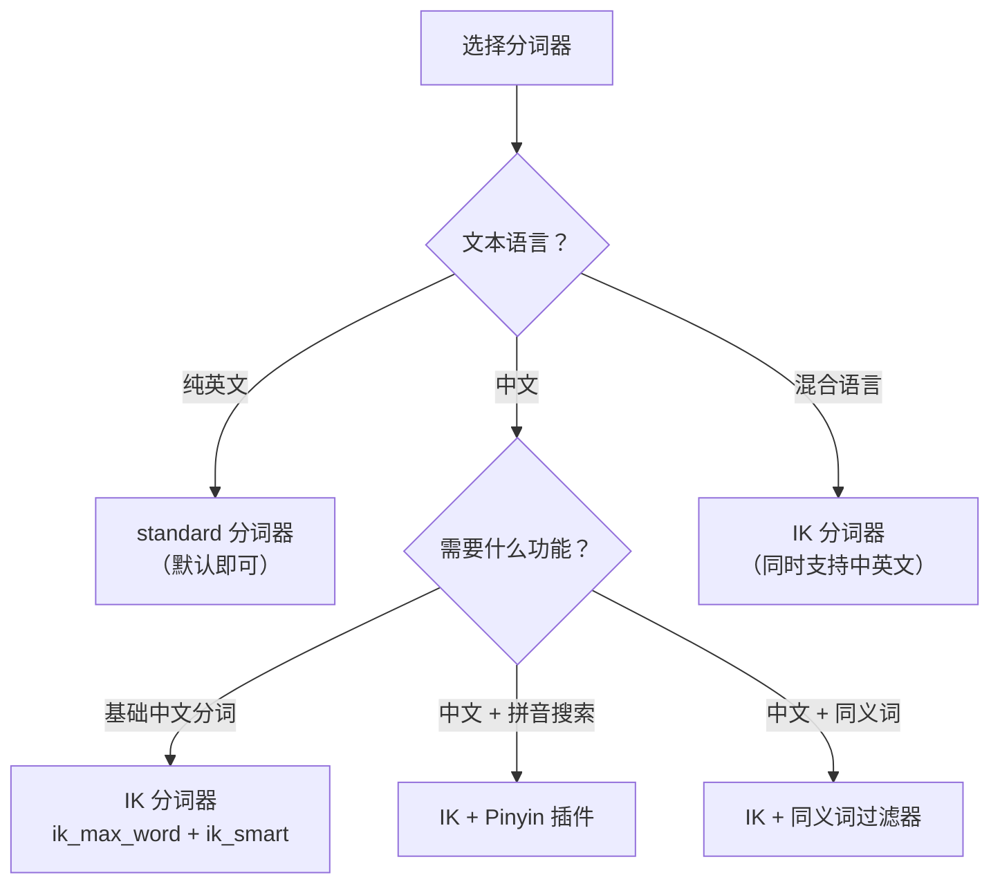

# ES 分词器与中文分词

> **核心问题**：ES 是如何将一段文本拆分成可搜索的词项的？分词器由哪些组件组成？中文分词为什么需要 IK 分词器？如何自定义分词策略？

---

## 它解决了什么问题？

ES 的全文检索依赖倒排索引，而倒排索引的构建依赖**分词**——将一段文本拆分成一个个独立的词项（Term）。分词的质量直接决定了搜索的质量：

- 分词太粗（"Java编程语言" → ["Java编程语言"]）：搜索 "Java" 找不到
- 分词太细（"Java编程语言" → ["J","a","v","a","编","程","语","言"]）：搜索精度差，噪音多
- 分词合理（"Java编程语言" → ["Java", "编程", "语言"]）：搜索 "Java" 或 "编程" 都能找到

英文天然以空格分词，但**中文没有空格分隔**，需要专门的中文分词器（如 IK）来识别词语边界。

**生活类比**：分词器就像一个"断句专家"——英文句子单词之间有空格，断句很简单；中文句子没有空格，需要理解语义才能正确断句。

---

# 一、分词器的三层架构

每个分词器（Analyzer）由三个组件按顺序组成：


| 组件 | 作用 | 示例 |
|------|------|------|
| **Char Filter** | 预处理原始文本（去 HTML、字符替换等） | `<p>Hello</p>` → `Hello` |
| **Tokenizer** | 将文本切分为词项（Token） | `Hello World` → `[Hello, World]` |
| **Token Filter** | 对词项做后处理（小写、去停用词、同义词等） | `[Hello, World]` → `[hello, world]` |

---

# 二、ES 内置分词器

### 2.1 常用内置分词器对比

| 分词器 | 分词规则 | 示例输入 | 分词结果 | 适用场景 |
|--------|---------|---------|---------|---------|
| **standard** | 按 Unicode 文本分割，转小写 | `"Java编程 Very Cool"` | `[java, 编, 程, very, cool]` | 默认分词器，英文效果好，中文逐字切分 |
| **simple** | 按非字母字符分割，转小写 | `"Hello-World 123"` | `[hello, world]` | 简单英文文本 |
| **whitespace** | 按空格分割，不转小写 | `"Hello World"` | `[Hello, World]` | 保留大小写的场景 |
| **keyword** | 不分词，整个文本作为一个词项 | `"Hello World"` | `[Hello World]` | 精确匹配（如 ID、邮箱） |
| **pattern** | 按正则表达式分割 | `"foo-bar_baz"` | `[foo, bar, baz]`（按 `\W+`） | 自定义分隔符 |

### 2.2 测试分词效果

```bash
# 使用 _analyze API 测试分词效果
GET /_analyze
{
  "analyzer": "standard",
  "text": "Java编程语言非常强大"
}

# 返回结果：
# tokens: [java, 编, 程, 语, 言, 非, 常, 强, 大]
# → standard 分词器对中文是逐字切分，效果很差！
```

> ⚠️ **关键问题**：ES 默认的 `standard` 分词器对中文是**逐字切分**，无法识别中文词语边界。搜索 "编程" 时，实际搜索的是 "编" 和 "程" 两个字，会匹配到很多不相关的结果。

---

# 三、IK 中文分词器

IK 分词器是 ES 生态中最常用的中文分词插件，基于词典匹配算法，支持两种分词模式。

### 3.1 安装

```bash
# 安装 IK 分词器（版本必须与 ES 版本一致）
./bin/elasticsearch-plugin install https://github.com/medcl/elasticsearch-analysis-ik/releases/download/v8.x.x/elasticsearch-analysis-ik-8.x.x.zip

# 安装后重启 ES
```

### 3.2 两种分词模式

| 模式 | 分词器名称 | 分词策略 | 适用场景 |
|------|-----------|---------|---------|
| **细粒度** | `ik_max_word` | 尽可能多地切分词项（穷举所有可能的组合） | **索引时使用**，提高召回率 |
| **粗粒度** | `ik_smart` | 做最少切分，不重复 | **搜索时使用**，提高精确度 |

```bash
# 测试 ik_max_word（细粒度）
GET /_analyze
{
  "analyzer": "ik_max_word",
  "text": "Java编程语言非常强大"
}
# 结果: [java, 编程语言, 编程, 语言, 非常, 强大]
# → 尽可能多地切分，"编程语言"、"编程"、"语言" 都会被索引

# 测试 ik_smart（粗粒度）
GET /_analyze
{
  "analyzer": "ik_smart",
  "text": "Java编程语言非常强大"
}
# 结果: [java, 编程语言, 非常, 强大]
# → 最少切分，"编程语言" 不会再拆分为 "编程" 和 "语言"
```

### 3.3 索引时 vs 搜索时使用不同分词器

**最佳实践**：索引时用 `ik_max_word`（多切分，提高召回率），搜索时用 `ik_smart`（少切分，提高精确度）。

```bash
PUT /articles
{
  "mappings": {
    "properties": {
      "title": {
        "type": "text",
        "analyzer": "ik_max_word",
        "search_analyzer": "ik_smart"
      },
      "content": {
        "type": "text",
        "analyzer": "ik_max_word",
        "search_analyzer": "ik_smart"
      }
    }
  }
}
```

**效果**：
- 索引文档 "Java编程语言" 时，会索引 `[java, 编程语言, 编程, 语言]`
- 搜索 "编程" 时，搜索词被分为 `[编程]`，能匹配到索引中的 "编程" 词项 ✅
- 搜索 "编程语言" 时，搜索词被分为 `[编程语言]`，精确匹配 ✅

### 3.4 自定义词典

IK 分词器基于内置词典分词，但业务中经常有专业术语、新词、品牌名等不在词典中的词语。

**本地自定义词典**：

```xml
<!-- config/IKAnalyzer.cfg.xml -->
<?xml version="1.0" encoding="UTF-8"?>
<!DOCTYPE properties SYSTEM "http://java.sun.com/dtd/properties.dtd">
<properties>
    <comment>IK Analyzer 扩展配置</comment>
    <!-- 扩展词典（新增词语） -->
    <entry key="ext_dict">custom/my_dict.dic</entry>
    <!-- 扩展停用词典（需要过滤的词） -->
    <entry key="ext_stopwords">custom/my_stopwords.dic</entry>
</properties>
```

```
# custom/my_dict.dic（每行一个词，UTF-8 编码）
SpringBoot
微服务
分布式锁
布隆过滤器
```

**远程词典（热更新，无需重启）**：

```xml
<!-- 支持从 HTTP 接口加载词典，定期轮询更新 -->
<entry key="remote_ext_dict">http://your-server/api/dict</entry>
<entry key="remote_ext_stopwords">http://your-server/api/stopwords</entry>
```

> 远程词典接口需要返回纯文本（每行一个词），并通过 `Last-Modified` 或 `ETag` 响应头告知 IK 是否有更新。

---

# 四、自定义分词器

当内置分词器和 IK 分词器都不能满足需求时，可以自定义分词器。

### 4.1 自定义分词器结构

```bash
PUT /my_index
{
  "settings": {
    "analysis": {
      "char_filter": {
        "my_char_filter": {
          "type": "mapping",
          "mappings": ["& => and", "| => or"]
        }
      },
      "tokenizer": {
        "my_tokenizer": {
          "type": "pattern",
          "pattern": "[\\s,;]+"
        }
      },
      "filter": {
        "my_stopwords": {
          "type": "stop",
          "stopwords": ["的", "了", "是", "在", "和"]
        }
      },
      "analyzer": {
        "my_analyzer": {
          "type": "custom",
          "char_filter": ["my_char_filter"],
          "tokenizer": "my_tokenizer",
          "filter": ["lowercase", "my_stopwords"]
        }
      }
    }
  }
}
```

### 4.2 同义词过滤器

```bash
PUT /my_index
{
  "settings": {
    "analysis": {
      "filter": {
        "my_synonyms": {
          "type": "synonym",
          "synonyms": [
            "Java, java, JAVA",
            "手机, 手机设备, mobile phone",
            "笔记本, 笔记本电脑, laptop"
          ]
        }
      },
      "analyzer": {
        "ik_with_synonyms": {
          "type": "custom",
          "tokenizer": "ik_max_word",
          "filter": ["lowercase", "my_synonyms"]
        }
      }
    }
  }
}
```

**同义词文件方式**（推荐，便于维护）：

```bash
# 在 config/analysis/ 目录下创建 synonyms.txt
# 格式1：等价同义词
手机, 手机设备, mobile phone
# 格式2：单向映射
笔记本电脑 => laptop
```

### 4.3 拼音分词（支持拼音搜索）

```bash
# 安装拼音分词插件
./bin/elasticsearch-plugin install https://github.com/medcl/elasticsearch-analysis-pinyin/releases/download/v8.x.x/elasticsearch-analysis-pinyin-8.x.x.zip

# 配置拼音分词器
PUT /my_index
{
  "settings": {
    "analysis": {
      "analyzer": {
        "ik_pinyin_analyzer": {
          "type": "custom",
          "tokenizer": "ik_max_word",
          "filter": ["my_pinyin"]
        }
      },
      "filter": {
        "my_pinyin": {
          "type": "pinyin",
          "keep_full_pinyin": true,
          "keep_joined_full_pinyin": true,
          "keep_original": true,
          "limit_first_letter_length": 16,
          "remove_duplicated_term": true
        }
      }
    }
  }
}

# 效果：搜索 "bianchen" 或 "bc" 能匹配到 "编程"
```

---

# 五、Mapping 中的分词器配置

### 5.1 字段级别配置

```bash
PUT /articles
{
  "mappings": {
    "properties": {
      "title": {
        "type": "text",
        "analyzer": "ik_max_word",
        "search_analyzer": "ik_smart"
      },
      "tags": {
        "type": "keyword"
      },
      "content": {
        "type": "text",
        "analyzer": "ik_max_word",
        "search_analyzer": "ik_smart",
        "fields": {
          "pinyin": {
            "type": "text",
            "analyzer": "ik_pinyin_analyzer"
          }
        }
      }
    }
  }
}
```

### 5.2 text vs keyword 与分词的关系

| 类型 | 是否分词 | 适用场景 | 支持的查询 |
|------|---------|---------|-----------|
| **text** | ✅ 分词后建立倒排索引 | 全文搜索（标题、内容、描述） | match, match_phrase |
| **keyword** | ❌ 整个值作为一个词项 | 精确匹配（ID、状态、标签） | term, terms, range |

```bash
# 常见错误：用 term 查询 text 字段
# ❌ 错误：text 字段被分词了，term 查询找不到完整值
GET /articles/_search
{ "query": { "term": { "title": "Java编程" } } }

# ✅ 正确：用 match 查询 text 字段
GET /articles/_search
{ "query": { "match": { "title": "Java编程" } } }

# ✅ 正确：用 term 查询 keyword 字段
GET /articles/_search
{ "query": { "term": { "tags": "Java" } } }
```

---

# 六、分词器选型指南



| 场景 | 推荐方案 |
|------|---------|
| 英文内容搜索 | `standard` 分词器（默认） |
| 中文内容搜索 | `ik_max_word`（索引）+ `ik_smart`（搜索） |
| 中文 + 拼音搜索 | IK + Pinyin 插件，multi-field 配置 |
| 中文 + 同义词 | IK + synonym 过滤器 |
| 精确匹配（ID、标签） | `keyword` 类型，不需要分词器 |
| 日志分析 | `pattern` 分词器，按自定义分隔符切分 |

---

# 七、常见问题

**Q：为什么 ES 默认的 standard 分词器对中文效果差？**

> `standard` 分词器基于 Unicode 文本分割算法，对英文按空格和标点分词效果很好，但中文没有空格分隔，会被逐字切分。"编程语言" 会被切分为 "编"、"程"、"语"、"言" 四个字，搜索 "编程" 时实际搜索的是 "编" 和 "程"，会匹配到很多不相关的结果。

**Q：ik_max_word 和 ik_smart 有什么区别？应该怎么选？**

> `ik_max_word` 尽可能多地切分（穷举组合），适合索引时使用，提高召回率；`ik_smart` 做最少切分，适合搜索时使用，提高精确度。最佳实践是索引时用 `ik_max_word`，搜索时用 `ik_smart`（通过 `search_analyzer` 配置）。

**Q：如何让 IK 分词器识别新词（如品牌名、专业术语）？**

> 两种方式：① 本地自定义词典：在 `config/IKAnalyzer.cfg.xml` 中配置 `ext_dict` 指向自定义词典文件；② 远程词典：配置 `remote_ext_dict` 指向 HTTP 接口，IK 会定期轮询更新，无需重启 ES。

**Q：如何实现拼音搜索（如搜索 "bianchen" 匹配 "编程"）？**

> 安装 elasticsearch-analysis-pinyin 插件，创建自定义分词器组合 IK + Pinyin，在 Mapping 中使用 multi-field 配置，一个字段同时支持中文搜索和拼音搜索。

**Q：修改分词器后，已有数据需要重新索引吗？**

> 是的。分词器的变更只影响新写入的数据，已有数据的倒排索引不会自动更新。需要执行 Reindex 操作将数据重新索引到新的索引中。
