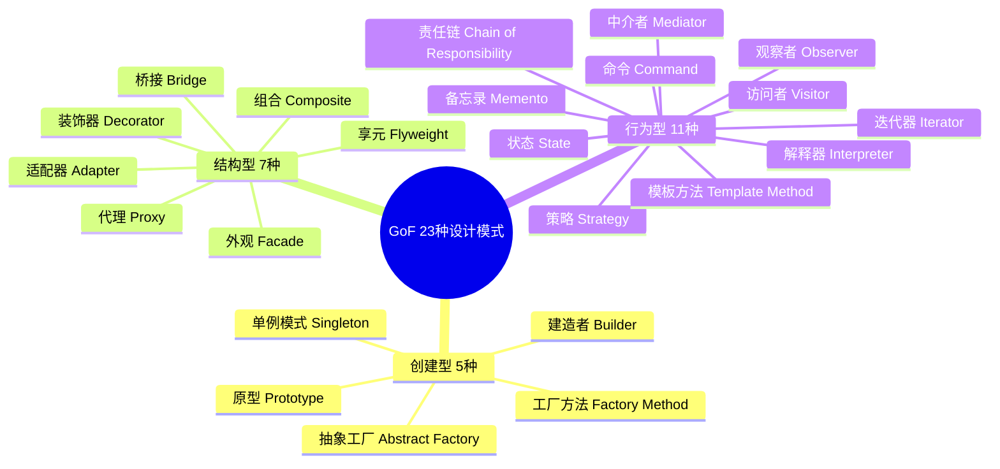
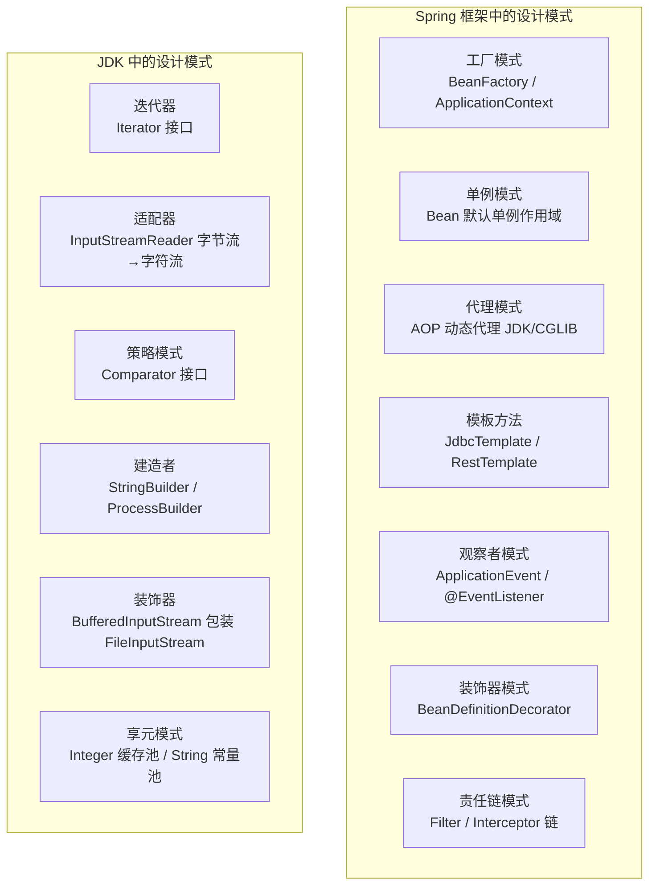

# 设计模式总览

> **学习目标**：从"知道模式名称"升级到"理解解决的问题 → 能在工作中灵活运用 → 能读懂框架源码"
>
> **检验标准**：能口述"这个模式解决了什么问题？不用它会怎样？Spring 中哪里用到了？工作中踩过什么坑？"

---

## 一、为什么要学设计模式？

设计模式是前人总结的**解决特定场景下代码设计问题的最佳实践**。不了解设计模式会导致：

- 重复发明轮子，写出低质量的"自创方案"
- **看不懂框架源码**（Spring 大量使用工厂、代理、模板方法、观察者等模式）
- 代码扩展性差，每次新增功能都要大量修改已有代码（违反开闭原则）

---

## 二、GoF 23 种设计模式全景图

---

## 三、各模式一句话总结与导航

### 创建型模式（5种）

> **核心思想**：将对象的创建与使用分离，让系统不依赖于具体类的实例化过程。

| 模式 | 一句话总结 | 典型应用 | 详细文档 |
|------|-----------|---------|---------|
| **单例模式** | 确保全局唯一实例，DCL 必须加 volatile | Spring Bean 默认单例、配置管理 | [01-单例模式.md](./01-单例模式.md) |
| **工厂方法 & 抽象工厂** | 工厂方法创建一种产品，抽象工厂创建一族产品 | Spring BeanFactory、MyBatis SqlSessionFactory | [02-工厂方法与抽象工厂模式.md](./02-工厂方法与抽象工厂模式.md) |
| **建造者模式** | 链式调用分步构建复杂对象，build() 统一校验 | Lombok @Builder、StringBuilder | [03-建造者模式.md](./03-建造者模式.md) |
| **原型模式** | 通过克隆已有对象创建新对象，注意浅拷贝 vs 深拷贝 | Spring BeanDefinition 复制、对象缓存预热 | [11-创建型补充-原型模式.md](./11-创建型补充-原型模式.md) |

### 结构型模式（7种）

> **核心思想**：通过组合类或对象，形成更大的结构，同时保持结构的灵活和高效。

| 模式 | 一句话总结 | 典型应用 | 详细文档 |
|------|-----------|---------|---------|
| **代理模式** | 控制对对象的访问，JDK 代理基于接口，CGLIB 基于继承 | Spring AOP、MyBatis Mapper | [04-代理模式.md](./04-代理模式.md) |
| **装饰器模式** | 动态叠加功能，比继承更灵活（N 个装饰器 vs 2^N 个子类） | Java IO 流、HttpServletRequestWrapper | [05-装饰器模式.md](./05-装饰器模式.md) |
| **适配器模式** | 转换接口让不兼容的类协同工作，优先用组合 | Arrays.asList()、Spring HandlerAdapter | [06-适配器模式.md](./06-适配器模式.md) |
| **外观模式** | 为复杂子系统提供简化的统一入口 | JdbcTemplate、SLF4J 日志门面 | [12-结构型补充-外观桥接组合享元.md](./12-结构型补充-外观桥接组合享元.md) |
| **桥接模式** | 抽象与实现分离，避免继承导致的类爆炸 | JDBC 驱动、PlatformTransactionManager | [12-结构型补充-外观桥接组合享元.md](./12-结构型补充-外观桥接组合享元.md) |
| **组合模式** | 树形结构统一处理单个对象和组合对象 | 文件系统、菜单树、MyBatis SqlNode | [12-结构型补充-外观桥接组合享元.md](./12-结构型补充-外观桥接组合享元.md) |
| **享元模式** | 共享细粒度对象减少内存占用 | String 常量池、Integer 缓存池、连接池 | [12-结构型补充-外观桥接组合享元.md](./12-结构型补充-外观桥接组合享元.md) |

### 行为型模式（11种）

> **核心思想**：关注对象之间的通信与职责分配，让系统更灵活、更易扩展。

| 模式 | 一句话总结 | 典型应用 | 详细文档 |
|------|-----------|---------|---------|
| **策略模式** | Map 消灭 if-else，封装算法族可互换 | Comparator、线程池拒绝策略 | [07-策略模式.md](./07-策略模式.md) |
| **观察者模式** | 一对多通知，Spring @EventListener 最优雅 | Spring 事件机制、消息队列 | [08-观察者模式.md](./08-观察者模式.md) |
| **模板方法模式** | final 方法定骨架，抽象方法子类实现 | JdbcTemplate、Spring refresh() | [09-模板方法模式.md](./09-模板方法模式.md) |
| **责任链模式** | 请求沿链传递，某节点可终止 | Servlet FilterChain、Spring Security 过滤器链 | [10-责任链模式.md](./10-责任链模式.md) |
| **命令模式** | 将请求封装为对象，支持撤销/重做/排队 | Runnable、线程池任务队列、Spring Batch Step | [13-行为型补充-命令迭代器中介者等.md](./13-行为型补充-命令迭代器中介者等.md) |
| **迭代器模式** | 顺序访问集合元素而不暴露内部表示 | java.util.Iterator、MyBatis Cursor | [13-行为型补充-命令迭代器中介者等.md](./13-行为型补充-命令迭代器中介者等.md) |
| **中介者模式** | 用中介对象封装对象间交互，降低耦合 | Spring ApplicationEventPublisher、MQ | [13-行为型补充-命令迭代器中介者等.md](./13-行为型补充-命令迭代器中介者等.md) |
| **备忘录模式** | 捕获并保存对象状态，支持后续恢复 | 编辑器撤销、数据库 Undo Log | [13-行为型补充-命令迭代器中介者等.md](./13-行为型补充-命令迭代器中介者等.md) |
| **状态模式** | 内部状态改变时改变行为，消灭状态 if-else | 订单状态机、TCP 连接状态 | [13-行为型补充-命令迭代器中介者等.md](./13-行为型补充-命令迭代器中介者等.md) |
| **访问者模式** | 数据结构与操作分离，双分派机制 | 编译器 AST 遍历、Spring BeanDefinitionVisitor | [13-行为型补充-命令迭代器中介者等.md](./13-行为型补充-命令迭代器中介者等.md) |
| **解释器模式** | 定义文法表示并解释语言中的句子 | Spring EL (SpEL)、正则表达式、MyBatis 动态 SQL | [13-行为型补充-命令迭代器中介者等.md](./13-行为型补充-命令迭代器中介者等.md) |

---

## 四、设计模式在 Spring / JDK 中的应用

---

## 五、常见问题索引

| 问题 | 详见 |
|------|------|
| 单例模式 DCL 为什么需要 volatile？ | [单例模式](./01-单例模式.md) |
| 代理模式和装饰器模式有什么区别？ | [代理模式](./04-代理模式.md) / [装饰器模式](./05-装饰器模式.md) |
| 策略模式如何消除 if-else？ | [策略模式](./07-策略模式.md) |
| 工厂方法和抽象工厂的区别？ | [工厂方法与抽象工厂模式](./02-工厂方法与抽象工厂模式.md) |
| Spring 中用到了哪些设计模式？ | 见上方"Spring / JDK 应用"章节 |
| 模板方法 vs 策略模式怎么选？ | [模板方法模式](./09-模板方法模式.md) / [策略模式](./07-策略模式.md) |
| 状态模式 vs 策略模式的区别？ | [行为型补充](./13-行为型补充-命令迭代器中介者等.md) |

---

## 六、学完设计模式能解决什么问题？

1. **读懂框架源码**：Spring、MyBatis 源码中大量使用设计模式，掌握后不再是"黑盒"
2. **重构 if-else 地狱**：用策略模式 + 工厂模式替代复杂的条件分支
3. **设计可扩展的系统**：遵循开闭原则，新增功能不修改已有代码
4. **代码评审时识别坏味道**：看到大量 if-else、上帝类、重复代码，能给出重构方案
5. **面试加分项**：能结合实际项目说出"我在 XX 场景用了 XX 模式，解决了 XX 问题"

---

> **复习检验标准**：能否口述"这个模式解决了什么问题？不用它会怎样？Spring 中哪里用到了？工作中踩过什么坑？"