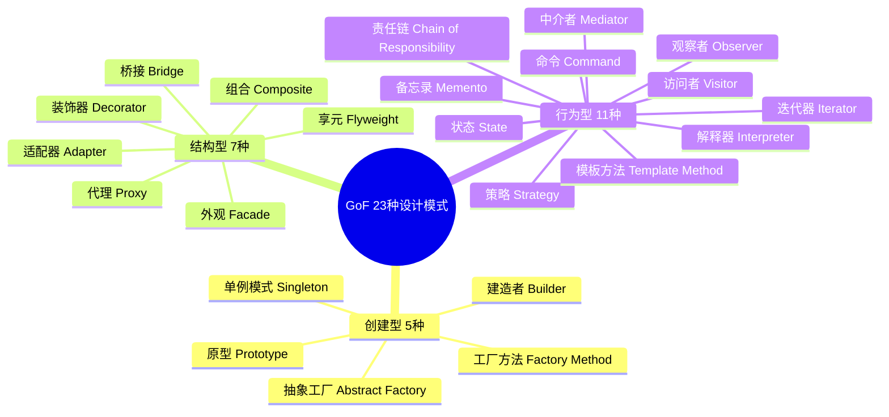
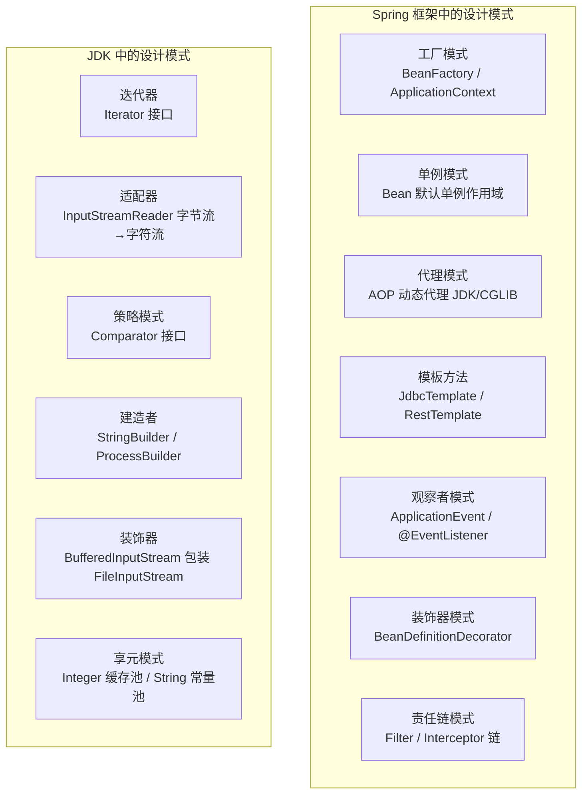

# 设计模式总览

## 一、为什么要复习设计模式？

### 整体视角：设计模式是框架源码的"语言"

设计模式是前人总结的**解决特定场景下代码设计问题的最佳实践**。不了解设计模式会导致：
- 重复发明轮子，写出低质量的"自创方案"
- **看不懂框架源码**（Spring 大量使用工厂、代理、模板方法、观察者等模式）
- 代码扩展性差，每次新增功能都要大量修改已有代码（违反开闭原则）

### 局部视角：解决具体的代码设计问题

| 设计模式 | 解决的问题 | 工作中的应用场景 | 常见错误 |
|---------|-----------|----------------|---------| 
| 单例模式 | 全局唯一实例、资源共享 | 配置管理、连接池、Spring Bean | 双重检查锁未加 volatile，指令重排导致返回未初始化对象 |
| 工厂模式 | 对象创建与使用解耦 | Spring BeanFactory、各种 xxxFactory | 工厂类过于复杂，违反单一职责 |
| 代理模式 | 在不修改原类的前提下增强功能 | AOP、MyBatis Mapper 接口 | 混淆静态代理与动态代理的适用场景 |
| 策略模式 | 消除大量 if-else 分支 | 支付方式选择、不同算法切换 | 策略类过多导致类爆炸，可结合工厂模式管理 |
| 观察者模式 | 事件驱动、解耦发布者与订阅者 | Spring 事件机制、消息队列 | 同步观察者阻塞主流程，应改为异步 |
| 模板方法 | 固定算法骨架，子类实现细节 | JdbcTemplate、各种 AbstractXxx 类 | 过度使用继承，应考虑组合替代 |
| 责任链模式 | 请求依次经过多个处理器 | Filter 链、拦截器链、审批流 | 链过长导致性能问题，缺少短路机制 |
| 建造者模式 | 复杂对象的分步构建 | Lombok @Builder、各种 Builder API | 对简单对象也用 Builder，过度设计 |

---

## 二、GoF 23 种设计模式全景图



---

## 三、创建型模式（5种）

> **核心思想**：将对象的创建与使用分离，让系统不依赖于具体类的实例化过程。

### 3.1 单例模式（Singleton）

→ 详见 [01-单例模式.md](./01-单例模式.md)

**核心要点**：确保一个类只有一个实例，并提供全局访问点。

| 实现方式 | 线程安全 | 延迟加载 | 推荐度 |
|---------|---------|---------|-------|
| 饿汉式 | ✅ | ❌ | ⭐⭐⭐ |
| 双重检查锁（DCL） | ✅ | ✅ | ⭐⭐⭐⭐⭐ |
| 静态内部类 | ✅ | ✅ | ⭐⭐⭐⭐⭐ |
| 枚举 | ✅ | ❌ | ⭐⭐⭐⭐（防反射/序列化攻击） |

**面试高频**：DCL 为什么必须加 `volatile`？→ 防止 `new` 操作的指令重排，避免返回未初始化的对象。

---

### 3.2 工厂方法模式（Factory Method）& 抽象工厂模式（Abstract Factory）

→ 详见 [02-工厂方法与抽象工厂模式.md](./02-工厂方法与抽象工厂模式.md)

**核心要点**：
- **工厂方法**：一个工厂创建**一种**产品，子类决定实例化哪个类
- **抽象工厂**：一个工厂创建**一族**相关产品，保证产品间兼容性

**面试高频**：Spring 的 `BeanFactory`、`FactoryBean` 是工厂方法模式；MyBatis `SqlSessionFactory` 是抽象工厂模式。

---

### 3.3 建造者模式（Builder）

→ 详见 [03-建造者模式.md](./03-建造者模式.md)

**核心要点**：解决构造函数参数爆炸问题，链式调用分步构建复杂对象，`build()` 统一校验。

**面试高频**：Lombok `@Builder` 的 `@Builder.Default` 注意事项；`StringBuilder` 为什么是建造者模式。

---

### 3.4 原型模式（Prototype）

**解决的问题**：通过复制（克隆）已有对象来创建新对象，避免重复的初始化开销。

**核心机制**：实现 `Cloneable` 接口，重写 `clone()` 方法。

```java
// 浅拷贝（clone 默认行为）
public class UserProfile implements Cloneable {
    private String name;
    private List<String> roles; // 引用类型，浅拷贝后共享同一个 List！

    @Override
    public UserProfile clone() {
        try {
            return (UserProfile) super.clone(); // 浅拷贝
        } catch (CloneNotSupportedException e) {
            throw new RuntimeException(e);
        }
    }
}

// 深拷贝（引用类型也要复制）
@Override
public UserProfile clone() {
    try {
        UserProfile copy = (UserProfile) super.clone();
        copy.roles = new ArrayList<>(this.roles); // 深拷贝 List
        return copy;
    } catch (CloneNotSupportedException e) {
        throw new RuntimeException(e);
    }
}
```

**浅拷贝 vs 深拷贝**：

| 对比 | 浅拷贝 | 深拷贝 |
|------|-------|-------|
| 基本类型字段 | 复制值 | 复制值 |
| 引用类型字段 | 复制引用（共享对象） | 递归复制对象 |
| 实现方式 | `super.clone()` | 手动复制引用字段 / 序列化 |
| 风险 | 修改引用字段会影响原对象 | 无此风险 |

**实际应用**：Spring `BeanDefinition` 的复制、对象缓存预热后的快速复制。

---

## 四、结构型模式（7种）

> **核心思想**：通过组合类或对象，形成更大的结构，同时保持结构的灵活和高效。

### 4.1 代理模式（Proxy）

→ 详见 [04-代理模式.md](./04-代理模式.md)

**核心要点**：控制对对象的访问，JDK 动态代理基于接口，CGLIB 基于继承，Spring Boot 2.x 默认 CGLIB。

**面试高频**：Spring AOP 自调用失效原因及解决方案；JDK 代理 vs CGLIB 代理的区别。

---

### 4.2 装饰器模式（Decorator）

→ 详见 [05-装饰器模式.md](./05-装饰器模式.md)

**核心要点**：动态叠加功能，比继承更灵活（N 个装饰器 vs 2^N 个子类），Java IO 流是经典案例。

**面试高频**：装饰器 vs 代理的区别（增强功能 vs 控制访问）；IO 流为什么用装饰器模式。

---

### 4.3 适配器模式（Adapter）

→ 详见 [06-适配器模式.md](./06-适配器模式.md)

**核心要点**：转换接口，让不兼容的类协同工作，优先用组合（对象适配器）而非继承（类适配器）。

**面试高频**：`Arrays.asList()` 为什么不能 add/remove；Spring MVC `HandlerAdapter` 的作用。

---

### 4.4 外观模式（Facade）

**解决的问题**：为复杂子系统提供一个简化的统一入口，降低客户端与子系统的耦合。

```java
// 场景：家庭影院系统，包含投影仪、音响、灯光、播放器等子系统
// ❌ 不用外观：客户端需要了解并操作所有子系统
projector.on();
amplifier.on();
amplifier.setVolume(10);
lights.dim(10);
player.on();
player.play(movie);

// ✅ 使用外观模式：一个方法搞定
public class HomeTheaterFacade {
    private Projector projector;
    private Amplifier amplifier;
    private Lights lights;
    private Player player;

    public void watchMovie(String movie) {
        lights.dim(10);
        projector.on();
        amplifier.on();
        amplifier.setVolume(10);
        player.on();
        player.play(movie);
    }

    public void endMovie() {
        player.stop();
        projector.off();
        amplifier.off();
        lights.on();
    }
}
```

**实际应用**：Spring 的 `JdbcTemplate`（封装了 JDBC 的连接、执行、关闭等复杂操作）；`SLF4J` 日志门面；各种 `xxxUtils` 工具类。

**外观模式 vs 适配器模式**：

| 对比 | 外观模式 | 适配器模式 |
|------|---------|----------|
| 目的 | 简化接口，提供统一入口 | 转换接口，解决不兼容 |
| 接口数量 | 多个接口 → 一个简化接口 | 一对一转换 |
| 使用时机 | 简化复杂子系统 | 集成已有系统/第三方库 |

---

### 4.5 桥接模式（Bridge）

**解决的问题**：将抽象部分与实现部分分离，使它们可以独立变化，避免继承导致的类爆炸。

```java
// 场景：不同形状（圆形、方形）× 不同颜色（红色、蓝色）
// ❌ 用继承：需要 2×2=4 个类，N种形状×M种颜色 = N×M 个类
class RedCircle extends Circle { ... }
class BlueCircle extends Circle { ... }
class RedSquare extends Square { ... }
class BlueSquare extends Square { ... }

// ✅ 用桥接模式：形状和颜色独立变化，只需 N+M 个类
// 实现接口（颜色）
public interface Color {
    void applyColor();
}
public class Red implements Color {
    public void applyColor() { System.out.println("红色"); }
}
public class Blue implements Color {
    public void applyColor() { System.out.println("蓝色"); }
}

// 抽象类（形状），持有颜色的引用（桥接）
public abstract class Shape {
    protected Color color; // 桥接：持有实现部分的引用
    public Shape(Color color) { this.color = color; }
    public abstract void draw();
}
public class Circle extends Shape {
    public Circle(Color color) { super(color); }
    public void draw() {
        System.out.print("圆形 - ");
        color.applyColor(); // 委托给颜色实现
    }
}
```

**实际应用**：JDBC 驱动（`DriverManager` 是桥接，不同数据库驱动是实现）；Spring `PlatformTransactionManager`（抽象事务管理，不同数据库有不同实现）。

---

### 4.6 组合模式（Composite）

**解决的问题**：将对象组合成树形结构，使客户端对单个对象和组合对象的使用具有一致性。

```java
// 场景：文件系统（文件和文件夹统一处理）
public interface FileComponent {
    void display(String indent);
    long getSize();
}

// 叶子节点（文件）
public class File implements FileComponent {
    private String name;
    private long size;
    public void display(String indent) {
        System.out.println(indent + "📄 " + name + " (" + size + "B)");
    }
    public long getSize() { return size; }
}

// 组合节点（文件夹）
public class Folder implements FileComponent {
    private String name;
    private List<FileComponent> children = new ArrayList<>();

    public void add(FileComponent component) { children.add(component); }

    public void display(String indent) {
        System.out.println(indent + "📁 " + name);
        children.forEach(c -> c.display(indent + "  ")); // 递归显示
    }

    public long getSize() {
        return children.stream().mapToLong(FileComponent::getSize).sum(); // 递归求和
    }
}
```

**实际应用**：文件系统、菜单树、组织架构树；Spring 的 `CompositePropertySource`；MyBatis 的 `SqlNode`（动态 SQL 节点树）。

---

### 4.7 享元模式（Flyweight）

**解决的问题**：通过共享技术有效支持大量细粒度对象，减少内存占用。

```java
// 场景：文字编辑器中，每个字符对象如果都单独创建会占用大量内存
// 享元：共享字符的"内在状态"（字体、大小），每个字符实例只存"外在状态"（位置）

public class CharacterFlyweight {
    private final char character; // 内在状态（共享）
    private final String font;
    private final int size;

    // 享元工厂（缓存已创建的享元对象）
    private static final Map<String, CharacterFlyweight> pool = new HashMap<>();

    public static CharacterFlyweight get(char c, String font, int size) {
        String key = c + font + size;
        return pool.computeIfAbsent(key, k -> new CharacterFlyweight(c, font, size));
    }

    public void render(int x, int y) { // x, y 是外在状态（不共享）
        System.out.printf("在(%d,%d)渲染字符'%c'，字体:%s，大小:%d%n", x, y, character, font, size);
    }
}
```

**实际应用**：
- **JDK `String` 常量池**：相同字符串字面量共享同一对象
- **JDK `Integer.valueOf(-128~127)`**：整数缓存池，`Integer.valueOf(100) == Integer.valueOf(100)` 为 `true`
- **数据库连接池**：连接对象复用

**享元模式 vs 单例模式**：单例是一个类只有一个实例；享元是同类对象中相同内在状态的实例共享（可以有多个享元对象，但相同状态的只有一个）。

---

## 五、行为型模式（11种）

> **核心思想**：关注对象之间的通信与职责分配，让系统更灵活、更易扩展。

### 5.1 策略模式（Strategy）

→ 详见 [07-策略模式.md](./07-策略模式.md)

**核心要点**：封装算法族，`Map<String, Strategy>` 消灭 if-else，`Comparator` 和线程池拒绝策略是经典案例。

**面试高频**：策略模式如何消灭 if-else；Lambda 如何简化策略模式；策略 vs 模板方法的区别。

---

### 5.2 观察者模式（Observer）

→ 详见 [08-观察者模式.md](./08-观察者模式.md)

**核心要点**：一对多通知，Spring `@EventListener` 是最优雅的实现，注意异常隔离和 `@Async` 异步处理。

**面试高频**：观察者 vs 发布-订阅的区别；Spring 事件机制的使用；同步观察者的问题。

---

### 5.3 模板方法模式（Template Method）

→ 详见 [09-模板方法模式.md](./09-模板方法模式.md)

**核心要点**：`final` 方法定骨架，抽象方法强制子类实现，钩子方法让子类影响流程，`HttpServlet.service()` 和 Spring `refresh()` 是经典案例。

**面试高频**：模板方法为什么要加 `final`；Spring `refresh()` 的 12 步骤；模板方法 vs 策略模式。

---

### 5.4 责任链模式（Chain of Responsibility）

→ 详见 [10-责任链模式.md](./10-责任链模式.md)

**核心要点**：请求沿链传递，某节点可终止，Servlet `FilterChain` 和 Spring Security 过滤器链是经典案例，注意链末端要有默认处理者。

**面试高频**：责任链 vs 装饰器的区别；Spring Security 过滤器链的工作原理；链过长的性能优化。

---

### 5.5 命令模式（Command）

**解决的问题**：将请求封装为对象，支持请求的排队、撤销、重做、日志记录。

```java
// 场景：文本编辑器的撤销/重做功能
public interface Command {
    void execute();
    void undo();
}

public class InsertTextCommand implements Command {
    private final TextEditor editor;
    private final String text;
    private final int position;

    public InsertTextCommand(TextEditor editor, String text, int position) {
        this.editor = editor;
        this.text = text;
        this.position = position;
    }

    @Override
    public void execute() { editor.insert(position, text); }

    @Override
    public void undo() { editor.delete(position, text.length()); }
}

// 命令管理器（支持撤销/重做）
public class CommandManager {
    private final Deque<Command> history = new ArrayDeque<>();
    private final Deque<Command> redoStack = new ArrayDeque<>();

    public void execute(Command command) {
        command.execute();
        history.push(command);
        redoStack.clear(); // 执行新命令后清空重做栈
    }

    public void undo() {
        if (!history.isEmpty()) {
            Command cmd = history.pop();
            cmd.undo();
            redoStack.push(cmd);
        }
    }

    public void redo() {
        if (!redoStack.isEmpty()) {
            Command cmd = redoStack.pop();
            cmd.execute();
            history.push(cmd);
        }
    }
}
```

**实际应用**：`java.lang.Runnable`（命令接口）；线程池的任务队列；Spring Batch 的 Step；数据库事务日志（WAL）。

---

### 5.6 迭代器模式（Iterator）

**解决的问题**：提供一种方法顺序访问集合中的各个元素，而不暴露集合的内部表示。

```java
// JDK 中 Iterator 接口就是迭代器模式的标准实现
// 所有实现 Iterable 接口的集合都支持 for-each 循环（语法糖）
List<String> list = Arrays.asList("a", "b", "c");
Iterator<String> it = list.iterator();
while (it.hasNext()) {
    String item = it.next();
    // it.remove(); // 安全删除，避免 ConcurrentModificationException
}

// 自定义迭代器示例
public class Range implements Iterable<Integer> {
    private final int start;
    private final int end;

    public Range(int start, int end) {
        this.start = start;
        this.end = end;
    }

    @Override
    public Iterator<Integer> iterator() {
        return new Iterator<>() {
            private int current = start;

            @Override
            public boolean hasNext() { return current < end; }

            @Override
            public Integer next() { return current++; }
        };
    }
}

// 使用
for (int i : new Range(1, 5)) {
    System.out.println(i); // 1 2 3 4
}
```

**实际应用**：JDK `java.util.Iterator`；`ResultSet`（JDBC 结果集遍历）；MyBatis `Cursor`（流式查询）。

---

### 5.7 中介者模式（Mediator）

**解决的问题**：用一个中介对象封装一系列对象的交互，使对象间不需要显式相互引用，降低耦合。

```java
// 场景：聊天室（用户之间不直接通信，通过聊天室中转）
public interface ChatMediator {
    void sendMessage(String message, User sender);
    void addUser(User user);
}

public class ChatRoom implements ChatMediator {
    private final List<User> users = new ArrayList<>();

    @Override
    public void addUser(User user) { users.add(user); }

    @Override
    public void sendMessage(String message, User sender) {
        users.stream()
             .filter(u -> u != sender) // 不发给自己
             .forEach(u -> u.receive(message, sender.getName()));
    }
}

public class User {
    private final String name;
    private final ChatMediator mediator;

    public User(String name, ChatMediator mediator) {
        this.name = name;
        this.mediator = mediator;
    }

    public void send(String message) {
        System.out.println(name + " 发送: " + message);
        mediator.sendMessage(message, this); // 通过中介者发送
    }

    public void receive(String message, String from) {
        System.out.println(name + " 收到来自 " + from + " 的消息: " + message);
    }
}
```

**实际应用**：Spring `ApplicationEventPublisher`（事件总线，本质是中介者）；MQ 消息中间件；`java.util.concurrent.Exchanger`。

---

### 5.8 备忘录模式（Memento）

**解决的问题**：在不破坏封装性的前提下，捕获并保存对象的内部状态，以便后续恢复。

```java
// 场景：游戏存档/读档
public class GameState {
    private int level;
    private int score;
    private String position;

    // 创建备忘录（快照）
    public Memento save() {
        return new Memento(level, score, position);
    }

    // 从备忘录恢复
    public void restore(Memento memento) {
        this.level = memento.getLevel();
        this.score = memento.getScore();
        this.position = memento.getPosition();
    }

    // 备忘录类（不可变，只有 getter）
    public static class Memento {
        private final int level;
        private final int score;
        private final String position;

        private Memento(int level, int score, String position) {
            this.level = level;
            this.score = score;
            this.position = position;
        }
        // getters...
    }
}

// 存档管理器
public class SaveManager {
    private final Deque<GameState.Memento> saves = new ArrayDeque<>();

    public void save(GameState state) { saves.push(state.save()); }

    public void load(GameState state) {
        if (!saves.isEmpty()) state.restore(saves.pop());
    }
}
```

**实际应用**：文本编辑器撤销功能；数据库事务回滚（Undo Log）；Spring `@Transactional` 的回滚机制。

---

### 5.9 状态模式（State）

**解决的问题**：允许对象在内部状态改变时改变它的行为，消除大量状态判断的 if-else。

```java
// 场景：订单状态机（待支付→已支付→已发货→已完成/已取消）
public interface OrderState {
    void pay(Order order);
    void ship(Order order);
    void complete(Order order);
    void cancel(Order order);
}

public class PendingPaymentState implements OrderState {
    @Override
    public void pay(Order order) {
        System.out.println("支付成功");
        order.setState(new PaidState()); // 状态转换
    }

    @Override
    public void ship(Order order) {
        throw new IllegalStateException("未支付，不能发货");
    }

    @Override
    public void cancel(Order order) {
        System.out.println("取消订单");
        order.setState(new CancelledState());
    }
    // ...
}

public class Order {
    private OrderState state = new PendingPaymentState(); // 初始状态

    public void setState(OrderState state) { this.state = state; }

    // 委托给当前状态处理
    public void pay() { state.pay(this); }
    public void ship() { state.ship(this); }
    public void complete() { state.complete(this); }
    public void cancel() { state.cancel(this); }
}
```

**实际应用**：订单状态机、工作流引擎；Spring Statemachine 框架；TCP 连接状态（LISTEN/SYN_SENT/ESTABLISHED/CLOSE_WAIT 等）。

**状态模式 vs 策略模式**：两者结构相似，但意图不同。策略模式中，策略由外部注入，客户端主动选择；状态模式中，状态由对象自身管理，状态转换在内部发生。

---

### 5.10 访问者模式（Visitor）

**解决的问题**：在不修改已有类的前提下，为类的对象添加新的操作，将数据结构与操作分离。

```java
// 场景：对文件系统（文件/文件夹）执行不同操作（统计大小、搜索、压缩）
public interface FileVisitor {
    void visit(File file);
    void visit(Folder folder);
}

// 统计大小的访问者
public class SizeCalculator implements FileVisitor {
    private long totalSize = 0;

    @Override
    public void visit(File file) { totalSize += file.getSize(); }

    @Override
    public void visit(Folder folder) {
        folder.getChildren().forEach(child -> child.accept(this));
    }

    public long getTotalSize() { return totalSize; }
}

// 元素接口（支持访问者）
public interface FileComponent {
    void accept(FileVisitor visitor); // 双分派
}

public class File implements FileComponent {
    @Override
    public void accept(FileVisitor visitor) {
        visitor.visit(this); // 将自身传给访问者
    }
}
```

**实际应用**：编译器的 AST（抽象语法树）遍历；Spring `BeanDefinitionVisitor`；MyBatis `SqlNode` 的处理。

**注意**：访问者模式适合数据结构稳定但操作频繁变化的场景；如果数据结构经常变化，则不适合（每次新增元素类型都要修改所有访问者）。

---

### 5.11 解释器模式（Interpreter）

**解决的问题**：给定一个语言，定义它的文法的一种表示，并定义一个解释器来解释该语言中的句子。

```java
// 场景：简单的布尔表达式解析（AND/OR/NOT）
public interface Expression {
    boolean interpret(Map<String, Boolean> context);
}

public class VariableExpression implements Expression {
    private final String name;
    public VariableExpression(String name) { this.name = name; }

    @Override
    public boolean interpret(Map<String, Boolean> context) {
        return context.getOrDefault(name, false);
    }
}

public class AndExpression implements Expression {
    private final Expression left, right;
    public AndExpression(Expression left, Expression right) {
        this.left = left;
        this.right = right;
    }

    @Override
    public boolean interpret(Map<String, Boolean> context) {
        return left.interpret(context) && right.interpret(context);
    }
}

// 使用：解析 "isAdmin AND isActive"
Expression expr = new AndExpression(
    new VariableExpression("isAdmin"),
    new VariableExpression("isActive")
);
Map<String, Boolean> ctx = Map.of("isAdmin", true, "isActive", true);
System.out.println(expr.interpret(ctx)); // true
```

**实际应用**：Spring EL 表达式（SpEL）；正则表达式引擎；SQL 解析器；MyBatis 动态 SQL（`<if>`、`<choose>` 等标签）。

**注意**：解释器模式适合简单文法，复杂文法会导致类爆炸，实际项目中通常使用 ANTLR 等专业解析器框架。

---

## 六、设计模式在 Spring / JDK 中的应用



---

## 七、常见问题

### Q1：单例模式双重检查锁为什么需要 volatile？

`new Singleton()` 在 JVM 层面分为三步：
1. 分配内存空间
2. 初始化对象
3. 将引用指向内存地址

JVM 和 CPU 可能对指令进行**重排序**，导致执行顺序变为 1→3→2。若线程 A 执行到步骤 3（引用已赋值但对象未初始化），线程 B 进入第一次 `if (instance == null)` 判断时发现 `instance != null`，直接返回了一个**未初始化的对象**。

`volatile` 通过**内存屏障**禁止指令重排，确保对象初始化完成后才赋值引用。

→ 详见 [01-单例模式.md](./01-单例模式.md)

---

### Q2：代理模式和装饰器模式有什么区别？

| 维度 | 代理模式 | 装饰器模式 |
|------|---------|-----------| 
| 目的 | 控制访问（权限校验、日志、缓存） | 增强功能（叠加新行为） |
| 对象关系 | 代理通常在内部创建真实对象 | 装饰器从外部接收被装饰对象 |
| 典型场景 | Spring AOP、MyBatis Mapper | Java IO 流、咖啡加配料 |

→ 详见 [04-代理模式.md](./04-代理模式.md) 和 [05-装饰器模式.md](./05-装饰器模式.md)

---

### Q3：策略模式如何消除 if-else？

将每个分支逻辑封装为独立的策略类，通过 Map 或工厂管理策略，用 `map.get(type)` 替代 `if-else`。新增策略只需新增类 + 注册，不修改已有代码，满足**开闭原则**。

→ 详见 [07-策略模式.md](./07-策略模式.md)

---

### Q4：Spring 中用到了哪些设计模式？

1. **工厂模式**：`BeanFactory`、`ApplicationContext` 负责创建和管理 Bean → [02-工厂方法与抽象工厂模式.md](./02-工厂方法与抽象工厂模式.md)
2. **单例模式**：Bean 默认是单例作用域（`scope="singleton"`） → [01-单例模式.md](./01-单例模式.md)
3. **代理模式**：AOP 通过 JDK 动态代理或 CGLIB 生成代理对象 → [04-代理模式.md](./04-代理模式.md)
4. **模板方法**：`JdbcTemplate`、`RestTemplate`、`TransactionTemplate` 定义操作骨架 → [09-模板方法模式.md](./09-模板方法模式.md)
5. **观察者模式**：`ApplicationEvent` + `@EventListener` 实现事件驱动 → [08-观察者模式.md](./08-观察者模式.md)
6. **责任链模式**：`Filter` 链、`HandlerInterceptor` 链 → [10-责任链模式.md](./10-责任链模式.md)
7. **装饰器模式**：`BeanDefinitionDecorator`、`HttpServletRequestWrapper` → [05-装饰器模式.md](./05-装饰器模式.md)

---

### Q5：工厂方法模式和抽象工厂模式的区别？

- **工厂方法**：一个工厂接口，每个子工厂创建**一种**产品。关注单个产品的创建。
- **抽象工厂**：一个工厂接口，每个子工厂创建**一族相关产品**（如 Windows 工厂创建 Windows 按钮 + Windows 文本框）。关注产品族的一致性。

→ 详见 [02-工厂方法与抽象工厂模式.md](./02-工厂方法与抽象工厂模式.md)

---

## 八、学完设计模式能解决什么问题？

1. **读懂框架源码**：Spring、MyBatis 源码中大量使用设计模式，掌握后不再是"黑盒"
2. **重构 if-else 地狱**：用策略模式 + 工厂模式替代复杂的条件分支
3. **设计可扩展的系统**：遵循开闭原则，新增功能不修改已有代码
4. **代码评审时识别坏味道**：看到大量 if-else、上帝类、重复代码，能给出重构方案
5. **面试加分项**：能结合实际项目说出"我在 XX 场景用了 XX 模式，解决了 XX 问题"

---

> **复习检验标准**：能否口述"这个模式解决了什么问题？不用它会怎样？Spring 中哪里用到了？工作中踩过什么坑？"