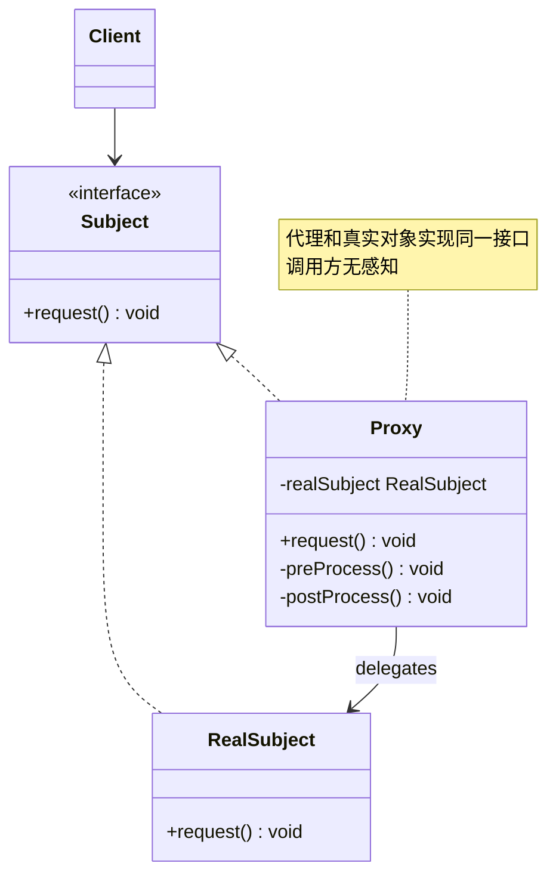
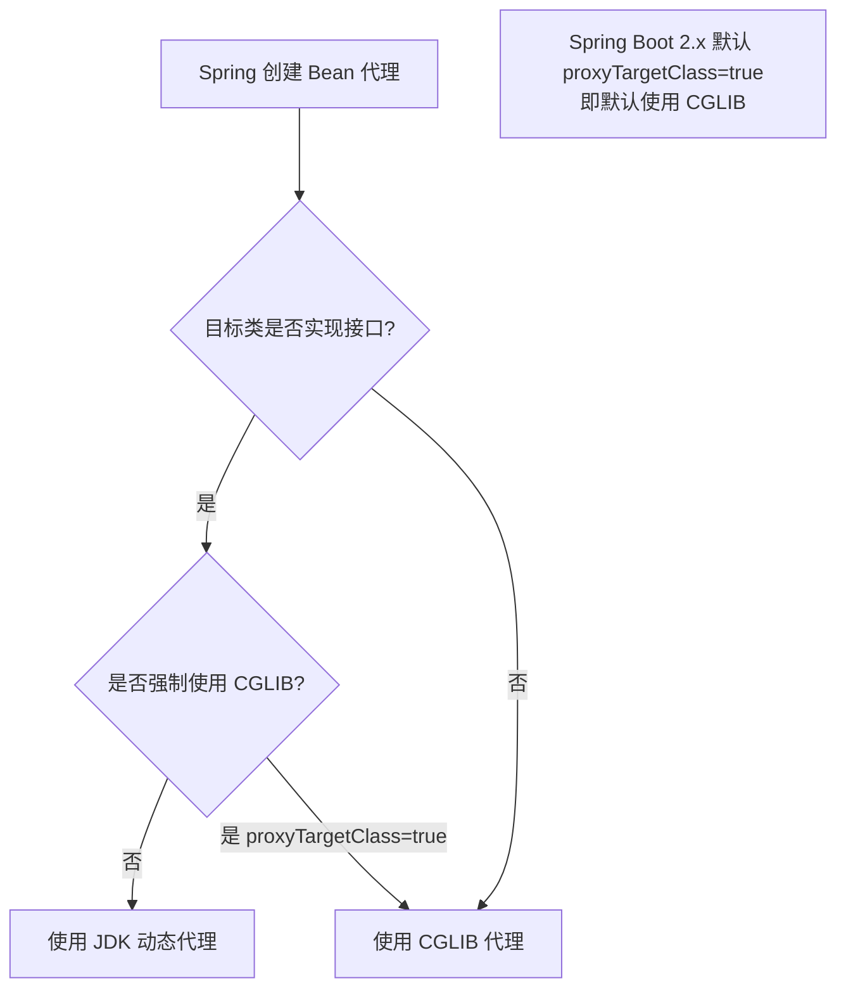

# 代理模式（Proxy Pattern）

> **一句话记忆口诀**：代理控制访问，静态代理编译期织入，JDK 动态代理基于接口，CGLIB 基于继承，Spring AOP 优先 JDK 代理。

---

## 1. 引入：它解决了什么问题？

### 没有代理模式时的问题

在不修改原始类的前提下，需要为方法添加日志、权限校验、事务管理等横切逻辑时：

```java
// ❌ 反例：直接在业务方法中混入非业务逻辑
public class OrderService {
    public void createOrder(Order order) {
        // 权限校验（非业务逻辑）
        if (!SecurityContext.hasPermission("ORDER_CREATE")) {
            throw new UnauthorizedException();
        }
        // 开启事务（非业务逻辑）
        TransactionManager.begin();
        try {
            // 记录日志（非业务逻辑）
            log.info("开始创建订单: {}", order.getId());

            // ===== 真正的业务逻辑 =====
            orderRepository.save(order);
            inventoryService.deduct(order);
            // ===========================

            log.info("订单创建成功: {}", order.getId());
            TransactionManager.commit();
        } catch (Exception e) {
            TransactionManager.rollback();
            throw e;
        }
    }
    // 每个方法都要重复这些非业务代码！
}
```

**问题根因**：业务逻辑与横切关注点（日志、事务、权限）混在一起，违反**单一职责原则**，且横切逻辑无法复用。

### 工作中的典型应用场景

| 场景 | Spring/JDK 中的例子 |
|------|-------------------|
| AOP 事务管理 | `@Transactional` — Spring 动态代理 |
| 权限控制 | `@PreAuthorize` — Spring Security 代理 |
| 缓存 | `@Cacheable` — Spring Cache 代理 |
| 远程调用 | Feign Client — JDK 动态代理 |
| MyBatis Mapper | `@Mapper` 接口 — JDK 动态代理 |

---

## 2. 类比：用生活模型建立直觉

### 生活类比：明星经纪人

一位明星（真实对象）只负责表演（核心业务）。经纪人（代理）负责处理合同谈判、档期安排、费用收取（横切逻辑）。粉丝（调用方）联系经纪人，经纪人在适当时候让明星出场。

- **接口/抽象角色**：演出合同（`Performer` 接口），定义"表演"行为
- **具体实现角色**：明星本人（`RealStar`），实现真正的表演
- **代理角色**：经纪人（`AgentProxy`），控制对明星的访问，在表演前后处理杂务
- **调用方**：演出商（`Client`），只与经纪人打交道

### 抽象定义

> 代理模式为另一个对象提供一个替身或占位符，以控制对这个对象的访问。

---

## 3. 原理：逐步拆解核心机制

### UML 类图



### 三种代理方式逐一对比

#### 方式一：静态代理（编译期确定）

```java
// ===== 公共接口 =====
public interface OrderService {
    void createOrder(Order order);
    Order getOrder(Long id);
}

// ===== 真实对象（核心业务）=====
public class OrderServiceImpl implements OrderService {
    @Override
    public void createOrder(Order order) {
        System.out.println("创建订单: " + order.getId());
        // 真正的业务逻辑
    }

    @Override
    public Order getOrder(Long id) {
        System.out.println("查询订单: " + id);
        return new Order(id);
    }
}

// ===== 静态代理（编译期确定，手动编写）=====
// 设计原因：在不修改 OrderServiceImpl 的前提下，添加日志功能
// 代价：每个接口都要写一个代理类，接口方法增加时代理类也要同步修改，维护成本高
public class LoggingOrderServiceProxy implements OrderService {
    private final OrderService realService; // 持有真实对象的引用

    public LoggingOrderServiceProxy(OrderService realService) {
        this.realService = realService;
    }

    @Override
    public void createOrder(Order order) {
        System.out.println("[LOG] 开始创建订单");
        long start = System.currentTimeMillis();
        realService.createOrder(order); // 委托给真实对象
        System.out.println("[LOG] 创建订单耗时: " + (System.currentTimeMillis() - start) + "ms");
    }

    @Override
    public Order getOrder(Long id) {
        System.out.println("[LOG] 开始查询订单");
        Order order = realService.getOrder(id);
        System.out.println("[LOG] 查询订单完成");
        return order;
    }
}
```

> ⚠️ **静态代理的代价**：接口有 N 个方法，代理类就要实现 N 个方法，且每个方法都要写重复的前置/后置逻辑。如果有 100 个 Service 接口，就要写 100 个代理类。

#### 方式二：JDK 动态代理（运行期生成，基于接口）

```java
import java.lang.reflect.InvocationHandler;
import java.lang.reflect.Method;
import java.lang.reflect.Proxy;

// ===== InvocationHandler：统一处理所有方法调用 =====
// 设计原因：运行期动态生成代理类，一个 Handler 可以代理任意接口
// 代价：被代理类必须实现接口（JDK 动态代理的核心限制）
//       原因：JDK 生成的代理类继承了 Proxy 类，Java 单继承限制导致无法再继承目标类
public class LoggingInvocationHandler implements InvocationHandler {
    private final Object target; // 被代理的真实对象

    public LoggingInvocationHandler(Object target) {
        this.target = target;
    }

    @Override
    public Object invoke(Object proxy, Method method, Object[] args) throws Throwable {
        // 前置处理（对所有方法生效，无需逐一实现）
        System.out.println("[LOG] 调用方法: " + method.getName());
        long start = System.currentTimeMillis();

        // 通过反射调用真实对象的方法
        Object result = method.invoke(target, args);

        // 后置处理
        System.out.println("[LOG] 方法耗时: " + (System.currentTimeMillis() - start) + "ms");
        return result;
    }
}

// ===== 使用 JDK 动态代理 =====
public class Main {
    public static void main(String[] args) {
        OrderService realService = new OrderServiceImpl();

        // Proxy.newProxyInstance 在运行期动态生成代理类
        // 参数1：类加载器（用于加载生成的代理类）
        // 参数2：代理类要实现的接口列表
        // 参数3：InvocationHandler（方法调用的处理器）
        OrderService proxy = (OrderService) Proxy.newProxyInstance(
                realService.getClass().getClassLoader(),
                new Class[]{OrderService.class},
                new LoggingInvocationHandler(realService)
        );

        proxy.createOrder(new Order(1L)); // 实际调用 InvocationHandler.invoke()
        proxy.getOrder(1L);
    }
}
```

> **JDK 动态代理的底层原理**：
> `Proxy.newProxyInstance()` 在运行期通过 `ProxyGenerator` 生成一个继承 `Proxy` 类并实现目标接口的字节码，加载到 JVM 中。代理类的每个方法都调用 `InvocationHandler.invoke()`，实现统一拦截。

#### 方式三：CGLIB 动态代理（运行期生成，基于继承）

```java
import net.sf.cglib.proxy.Enhancer;
import net.sf.cglib.proxy.MethodInterceptor;
import net.sf.cglib.proxy.MethodProxy;

// ===== CGLIB MethodInterceptor =====
// 设计原因：目标类没有实现接口时，通过继承目标类生成子类代理
// 代价：
//   1. 目标类和方法不能是 final（final 类/方法无法被继承/覆盖）
//   2. 需要额外引入 CGLIB 依赖（Spring 已内置）
//   3. 生成子类的开销比 JDK 代理略大，但方法调用性能更好（FastClass 机制）
public class LoggingMethodInterceptor implements MethodInterceptor {
    @Override
    public Object intercept(Object obj, Method method, Object[] args, MethodProxy proxy)
            throws Throwable {
        System.out.println("[CGLIB LOG] 调用方法: " + method.getName());
        long start = System.currentTimeMillis();

        // invokeSuper 调用父类（真实对象）的方法，避免反射开销
        Object result = proxy.invokeSuper(obj, args);

        System.out.println("[CGLIB LOG] 方法耗时: " + (System.currentTimeMillis() - start) + "ms");
        return result;
    }
}

// ===== 使用 CGLIB 代理 =====
public class Main {
    public static void main(String[] args) {
        Enhancer enhancer = new Enhancer();
        enhancer.setSuperclass(OrderServiceImpl.class); // 设置父类（被代理类）
        enhancer.setCallback(new LoggingMethodInterceptor());

        // 生成 OrderServiceImpl 的子类实例
        OrderServiceImpl proxy = (OrderServiceImpl) enhancer.create();
        proxy.createOrder(new Order(1L));
    }
}
```

### 核心流程图

```mermaid
flowchart TD
    subgraph JDK 动态代理流程
        A1[Client 调用 proxy.method] --> B1[代理类 invoke 方法]
        B1 --> C1[InvocationHandler.invoke]
        C1 --> D1[前置处理]
        D1 --> E1[method.invoke 反射调用真实对象]
        E1 --> F1[后置处理]
        F1 --> G1[返回结果]
    end

    subgraph CGLIB 代理流程
        A2[Client 调用 proxy.method] --> B2[子类覆盖方法]
        B2 --> C2[MethodInterceptor.intercept]
        C2 --> D2[前置处理]
        D2 --> E2[proxy.invokeSuper 调用父类方法]
        E2 --> F2[后置处理]
        F2 --> G2[返回结果]
    end
```



---

## 4. 特性：关键对比

### 三种代理方式对比

| 对比维度 | 静态代理 | JDK 动态代理 | CGLIB 动态代理 |
|---------|---------|------------|--------------|
| **生成时机** | 编译期 | 运行期 | 运行期 |
| **实现机制** | 手动实现接口 | 实现接口，反射调用 | 继承目标类，字节码增强 |
| **接口要求** | 需要接口 | **必须有接口** | **不需要接口** |
| **final 限制** | 无 | 无 | final 类/方法无法代理 |
| **性能** | 最好（直接调用） | 较好（JDK 8+ 优化后） | 好（FastClass 避免反射） |
| **维护成本** | 高（每个接口写一个代理类） | 低 | 低 |
| **Spring 使用** | 不使用 | 有接口时优先使用 | 无接口时使用 |

### 代理模式 vs 装饰器模式（最容易混淆）

| 对比维度 | 代理模式 | 装饰器模式 |
|---------|---------|----------|
| **目的** | 控制对对象的**访问**（权限、延迟加载） | **增强**对象的功能 |
| **关系** | 代理通常自己创建真实对象 | 装饰器由外部传入被装饰对象 |
| **透明性** | 调用方不知道在访问代理 | 调用方知道在使用装饰器 |
| **典型例子** | Spring AOP、Feign Client | `BufferedInputStream`、`Collections.unmodifiableList()` |

### Spring AOP 代理选择策略



> ⚠️ **Spring Boot 2.x 的变化**：Spring Boot 2.0 开始默认将 `spring.aop.proxy-target-class=true`，即默认使用 CGLIB 代理，即使目标类有接口。原因是避免某些场景下 JDK 代理导致的类型转换异常。

### 在 Spring / JDK 中的应用

| 框架/类 | 代理类型 | 说明 |
|--------|---------|------|
| Spring `@Transactional` | JDK/CGLIB | 事务管理 AOP |
| Spring `@Cacheable` | JDK/CGLIB | 缓存 AOP |
| Feign Client | JDK 动态代理 | 接口生成 HTTP 客户端 |
| MyBatis `@Mapper` | JDK 动态代理 | 接口生成 SQL 执行器 |
| `Collections.synchronizedList()` | 静态代理 | 线程安全包装 |

---

## 5. 边界：异常情况与常见误区

### 误区一：Spring AOP 自调用失效（运行期问题）

```java
// ❌ 错误：同一个类中方法 A 调用方法 B，B 上的 @Transactional 不生效
@Service
public class OrderService {
    public void createOrder(Order order) {
        // 直接调用同类方法，绕过了代理！
        // this.saveOrder() 中的 this 是真实对象，不是代理对象
        this.saveOrder(order);
    }

    @Transactional
    public void saveOrder(Order order) {
        // 事务不会生效！
        orderRepository.save(order);
    }
}

// 原因：Spring AOP 是基于代理的，只有通过代理对象调用方法才会触发拦截。
// 同类内部调用使用 this 引用，绕过了代理对象。

// ✅ 解决方案一：注入自身代理
@Service
public class OrderService {
    @Autowired
    private OrderService self; // 注入自身的代理对象

    public void createOrder(Order order) {
        self.saveOrder(order); // 通过代理调用，事务生效
    }

    @Transactional
    public void saveOrder(Order order) {
        orderRepository.save(order);
    }
}

// ✅ 解决方案二：拆分到不同 Service 类
```

### 误区二：CGLIB 代理 final 类/方法（运行期异常）

```java
// ❌ 错误：对 final 类使用 CGLIB 代理
@Service
public final class UserService { // final 类！
    @Transactional
    public void createUser(User user) { ... }
}
// 运行时抛出：Cannot subclass final class UserService
// 原因：CGLIB 通过继承生成子类，final 类无法被继承

// ✅ 正确：去掉 final 修饰符，或改用接口 + JDK 动态代理
public interface UserService {
    void createUser(User user);
}
@Service
public class UserServiceImpl implements UserService {
    @Transactional
    public void createUser(User user) { ... }
}
```

### 误区三：JDK 动态代理强转为实现类（运行期 ClassCastException）

```java
// ❌ 错误：将 JDK 动态代理对象强转为实现类
OrderService proxy = (OrderService) Proxy.newProxyInstance(...);
OrderServiceImpl impl = (OrderServiceImpl) proxy; // ClassCastException！

// 原因：JDK 动态代理生成的类继承自 Proxy，实现了 OrderService 接口，
// 但与 OrderServiceImpl 没有继承关系，强转失败

// ✅ 正确：只能转为接口类型
OrderService proxy = (OrderService) Proxy.newProxyInstance(...);
proxy.createOrder(order); // 通过接口调用
```

---

## 6. 总结：面试标准化表达

### 高频面试题

**Q1：JDK 动态代理和 CGLIB 代理有什么区别？Spring 如何选择？**

> JDK 动态代理基于接口，运行期通过 `Proxy.newProxyInstance()` 生成实现目标接口的代理类，目标类必须实现接口；CGLIB 基于继承，通过字节码增强生成目标类的子类，不需要接口，但 final 类/方法无法代理。Spring 的选择策略：Spring Boot 2.x 默认使用 CGLIB（`proxyTargetClass=true`）；若显式配置 `proxyTargetClass=false`，则有接口时用 JDK 代理，无接口时用 CGLIB。

**Q2：Spring AOP 为什么会出现事务失效？**

> Spring AOP 基于代理实现，只有通过代理对象调用方法才会触发拦截逻辑（如事务管理）。当同一个类中方法 A 调用方法 B 时，使用的是 `this` 引用（真实对象），绕过了代理，导致 B 上的 `@Transactional` 失效。解决方案：①将方法拆分到不同 Service 类；②通过 `ApplicationContext` 获取代理对象后调用；③注入自身代理（`@Autowired` 注入自身）。

**Q3：代理模式和装饰器模式有什么区别？**

> 两者结构相似，都持有被包装对象的引用，但目的不同：代理模式的目的是**控制访问**，代理通常自己创建或持有真实对象，调用方不知道在访问代理（透明代理），典型例子是 Spring AOP、Feign Client；装饰器模式的目的是**增强功能**，被装饰对象由外部传入，调用方知道在使用装饰器，典型例子是 `BufferedInputStream` 包装 `FileInputStream`。

---

> **一句话记忆口诀**：代理控制访问，JDK 代理基于接口（必须有接口），CGLIB 基于继承（不能 final），Spring Boot 2.x 默认 CGLIB，自调用会绕过代理导致 AOP 失效。