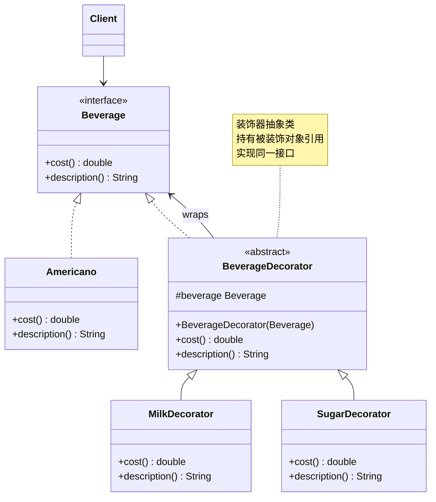
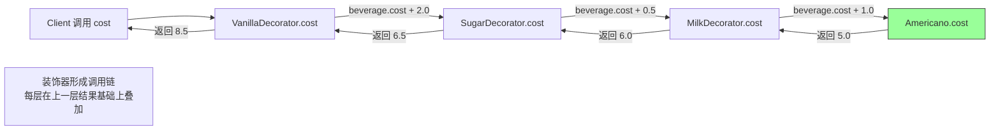

# 装饰器模式（Decorator Pattern）

> **一句话记忆口诀**：装饰器动态叠加功能，`BufferedInputStream` 套 `FileInputStream` 是最经典的例子，比继承更灵活。

---

## 1. 引入：它解决了什么问题？

### 没有装饰器模式时的问题

当需要为一个类动态添加功能时，继承会导致类爆炸：

```java
// ❌ 反例：用继承扩展功能，导致类爆炸
// 基础咖啡
class Coffee { double cost() { return 5.0; } }

// 加奶的咖啡
class MilkCoffee extends Coffee { double cost() { return 6.0; } }

// 加糖的咖啡
class SugarCoffee extends Coffee { double cost() { return 5.5; } }

// 加奶又加糖的咖啡
class MilkSugarCoffee extends Coffee { double cost() { return 6.5; } }

// 加奶又加糖又加香草的咖啡
class MilkSugarVanillaCoffee extends Coffee { double cost() { return 7.5; } }

// N 种配料的组合 = 2^N 个子类！完全不可维护
```

**问题根因**：继承是静态的，编译期确定，无法在运行期动态组合功能。N 种配料的组合需要 2^N 个子类，类数量指数级增长。

### 工作中的典型应用场景

| 场景 | Spring/JDK 中的例子 |
|------|-------------------|
| IO 流包装 | `BufferedInputStream(new FileInputStream(...))` |
| 线程安全包装 | `Collections.synchronizedList(list)` |
| 不可变包装 | `Collections.unmodifiableList(list)` |
| Spring 缓存 | `CachingConfigurer` 装饰 |
| MyBatis 插件 | `Plugin.wrap()` 装饰 Executor |

---

## 2. 类比：用生活模型建立直觉

### 生活类比：咖啡加配料

星巴克点咖啡时，基础咖啡（美式、拿铁）是核心，配料（牛奶、糖、香草、焦糖）是可以自由叠加的装饰。每加一种配料，价格就增加一点。

- **接口/抽象角色**：饮品（`Beverage` 接口），定义 `cost()` 和 `description()` 方法
- **具体实现角色**：美式咖啡、拿铁（`Americano`、`Latte`），基础饮品
- **装饰器角色**：牛奶装饰器、糖装饰器（`MilkDecorator`、`SugarDecorator`），包装饮品并增加功能
- **调用方**：收银员（`Client`），计算最终价格

关键点：装饰器和被装饰对象实现**同一接口**，装饰器持有被装饰对象的引用，可以无限叠加。

### 抽象定义

> 装饰器模式动态地给一个对象添加一些额外的职责，就增加功能来说，装饰器模式比生成子类更为灵活。

---

## 3. 原理：逐步拆解核心机制

### UML 类图



### Java 代码示例

```java
// ===== 组件接口 =====
public interface Beverage {
    double cost();
    String description();
}

// ===== 具体组件（被装饰的基础对象）=====
public class Americano implements Beverage {
    @Override
    public double cost() { return 5.0; }

    @Override
    public String description() { return "美式咖啡"; }
}

public class Latte implements Beverage {
    @Override
    public double cost() { return 8.0; }

    @Override
    public String description() { return "拿铁"; }
}

// ===== 抽象装饰器（核心：实现同一接口，持有被装饰对象）=====
// 设计原因：抽象装饰器实现接口，保证装饰器和组件对调用方透明
// 持有 Beverage 引用，可以装饰任何 Beverage 实现（包括其他装饰器！）
public abstract class BeverageDecorator implements Beverage {
    protected final Beverage beverage; // 被装饰的对象

    public BeverageDecorator(Beverage beverage) {
        this.beverage = beverage;
    }

    // 默认委托给被装饰对象，子类可以选择性覆盖
    @Override
    public double cost() { return beverage.cost(); }

    @Override
    public String description() { return beverage.description(); }
}

// ===== 具体装饰器（添加具体功能）=====
public class MilkDecorator extends BeverageDecorator {
    public MilkDecorator(Beverage beverage) {
        super(beverage);
    }

    @Override
    public double cost() {
        return beverage.cost() + 1.0; // 在原有基础上增加价格
    }

    @Override
    public String description() {
        return beverage.description() + " + 牛奶";
    }
}

public class SugarDecorator extends BeverageDecorator {
    public SugarDecorator(Beverage beverage) {
        super(beverage);
    }

    @Override
    public double cost() {
        return beverage.cost() + 0.5;
    }

    @Override
    public String description() {
        return beverage.description() + " + 糖";
    }
}

public class VanillaDecorator extends BeverageDecorator {
    public VanillaDecorator(Beverage beverage) {
        super(beverage);
    }

    @Override
    public double cost() {
        return beverage.cost() + 2.0;
    }

    @Override
    public String description() {
        return beverage.description() + " + 香草";
    }
}

// ===== 使用示例（动态叠加装饰）=====
public class Main {
    public static void main(String[] args) {
        // 基础美式咖啡
        Beverage coffee = new Americano();
        System.out.println(coffee.description() + " = ¥" + coffee.cost());
        // 输出：美式咖啡 = ¥5.0

        // 加牛奶
        coffee = new MilkDecorator(coffee);
        System.out.println(coffee.description() + " = ¥" + coffee.cost());
        // 输出：美式咖啡 + 牛奶 = ¥6.0

        // 再加糖
        coffee = new SugarDecorator(coffee);
        System.out.println(coffee.description() + " = ¥" + coffee.cost());
        // 输出：美式咖啡 + 牛奶 + 糖 = ¥6.5

        // 再加香草
        coffee = new VanillaDecorator(coffee);
        System.out.println(coffee.description() + " = ¥" + coffee.cost());
        // 输出：美式咖啡 + 牛奶 + 糖 + 香草 = ¥8.5

        // JDK IO 流的经典用法（同样的装饰器模式）
        // BufferedInputStream 装饰 FileInputStream，添加缓冲功能
        // GZIPInputStream 装饰 BufferedInputStream，添加解压功能
        InputStream is = new java.util.zip.GZIPInputStream(
                new java.io.BufferedInputStream(
                        new java.io.FileInputStream("data.gz")));
    }
}
```

### JDK IO 流的装饰器结构

```
InputStream（抽象组件）
├── FileInputStream（具体组件）
├── ByteArrayInputStream（具体组件）
└── FilterInputStream（抽象装饰器）
    ├── BufferedInputStream（具体装饰器：添加缓冲）
    ├── DataInputStream（具体装饰器：添加基本类型读取）
    └── GZIPInputStream（具体装饰器：添加解压）
```

### 核心流程图（方法调用链）



---

## 4. 特性：关键对比

### 装饰器模式 vs 代理模式（最容易混淆）

| 对比维度 | 装饰器模式 | 代理模式 |
|---------|----------|---------|
| **目的** | **增强**对象功能，叠加新行为 | **控制**对象访问（权限、延迟加载） |
| **被包装对象来源** | 由**外部传入**（构造方法参数） | 代理通常**自己创建**真实对象 |
| **透明性** | 调用方**知道**在使用装饰器 | 调用方**不知道**在访问代理 |
| **叠加性** | ✅ 可以多层叠加 | ❌ 通常只有一层 |
| **典型例子** | `BufferedInputStream`、IO 流 | Spring AOP、Feign Client |

### 装饰器模式 vs 继承

| 对比维度 | 装饰器模式 | 继承 |
|---------|----------|------|
| **扩展时机** | 运行期动态组合 | 编译期静态确定 |
| **类数量** | O(N)，N 种装饰器 | O(2^N)，N 种功能的所有组合 |
| **灵活性** | ✅ 可以任意组合 | ❌ 组合固定 |
| **耦合度** | 低（面向接口） | 高（父子类强耦合） |

### 在 Spring / JDK 中的应用

| 框架/类 | 说明 |
|--------|------|
| `BufferedInputStream` | 为 InputStream 添加缓冲功能 |
| `Collections.synchronizedList()` | 为 List 添加线程安全 |
| `Collections.unmodifiableList()` | 为 List 添加不可变保护 |
| `HttpServletRequestWrapper` | 装饰 HttpServletRequest，扩展请求处理 |
| MyBatis `Plugin` | 通过 `Plugin.wrap()` 装饰 Executor/StatementHandler |

---

## 5. 边界：异常情况与常见误区

### 误区一：装饰器层数过多导致调试困难（设计问题）

```java
// ❌ 问题：装饰器嵌套过深，出错时难以定位
InputStream is = new CheckedInputStream(
        new CipherInputStream(
                new GZIPInputStream(
                        new BufferedInputStream(
                                new FileInputStream("data.gz"), 8192), 1024)));
// 出现异常时，堆栈信息穿越多层装饰器，难以定位根因

// ✅ 建议：装饰器层数不超过3层；复杂场景考虑用 Builder 模式封装装饰器的组合逻辑
public class InputStreamBuilder {
    private InputStream stream;
    public InputStreamBuilder from(String path) throws IOException {
        this.stream = new FileInputStream(path);
        return this;
    }
    public InputStreamBuilder buffered() {
        this.stream = new BufferedInputStream(stream);
        return this;
    }
    public InputStreamBuilder gzip() throws IOException {
        this.stream = new java.util.zip.GZIPInputStream(stream);
        return this;
    }
    public InputStream build() { return stream; }
}
```

### 误区二：装饰器没有实现同一接口，破坏透明性（编译期/设计问题）

```java
// ❌ 错误：装饰器没有实现被装饰对象的接口
public class LoggingList {
    private final List<String> list; // 持有引用，但没有实现 List 接口！

    public void add(String item) {
        System.out.println("添加: " + item);
        list.add(item);
    }
    // 调用方必须知道 LoggingList 的存在，无法透明替换
}

// ✅ 正确：装饰器实现同一接口，对调用方透明
public class LoggingList<E> implements List<E> {
    private final List<E> delegate;
    // 实现所有 List 方法，在需要的方法中添加日志
    @Override
    public boolean add(E e) {
        System.out.println("添加元素: " + e);
        return delegate.add(e);
    }
    // ... 其他方法委托给 delegate
}
```

### 误区三：与代理模式混淆，在不该用装饰器的地方用装饰器（设计问题）

```java
// ❌ 错误：用装饰器实现权限控制（应该用代理）
public class AuthOrderService implements OrderService {
    private final OrderService delegate;
    public AuthOrderService(OrderService delegate) {
        this.delegate = delegate;
    }
    @Override
    public void createOrder(Order order) {
        // 权限控制不是"增强功能"，而是"控制访问"，应该用代理模式
        if (!hasPermission()) throw new UnauthorizedException();
        delegate.createOrder(order);
    }
}

// ✅ 正确：权限控制用代理（Spring AOP @PreAuthorize），功能增强用装饰器
// 区分标准：是否需要"控制访问"？是 → 代理；是否需要"叠加功能"？是 → 装饰器
```

---

## 6. 总结：面试标准化表达

### 高频问题

**Q1：装饰器模式和继承有什么区别？为什么说装饰器比继承更灵活？**

> 继承是编译期静态扩展，N 种功能的所有组合需要 2^N 个子类，类数量指数级增长，且组合关系固定无法在运行期改变。装饰器模式是运行期动态组合，只需 N 个装饰器类，通过嵌套包装实现任意组合，类数量线性增长。JDK IO 流就是最好的例子：`BufferedInputStream`、`GZIPInputStream` 等装饰器可以任意组合，而不需要为每种组合创建子类。

**Q2：JDK 的 IO 流为什么使用装饰器模式？**

> IO 流有多种数据源（文件、网络、内存）和多种处理能力（缓冲、压缩、加密、字符转换），如果用继承，每种数据源和处理能力的组合都需要一个子类，会产生类爆炸。装饰器模式让这些能力可以自由组合：`new GZIPInputStream(new BufferedInputStream(new FileInputStream(...)))` 实现了"从文件读取 + 缓冲 + 解压"，每种能力独立封装，按需叠加。

**Q3：装饰器模式和代理模式有什么区别？**

> 两者结构相似，都持有被包装对象的引用，但意图不同：装饰器的目的是**增强功能**，被装饰对象由外部传入，可以多层叠加，调用方知道在使用装饰器；代理的目的是**控制访问**，代理通常自己管理真实对象，调用方不知道在访问代理（透明代理）。判断标准：如果是为了叠加新功能（如缓冲、压缩），用装饰器；如果是为了控制访问（如权限、事务、延迟加载），用代理。

---

> **一句话记忆口诀**：装饰器动态叠加功能，实现同一接口可透明替换，`BufferedInputStream` 套 `FileInputStream` 是最经典的例子，比继承更灵活（N 个装饰器 vs 2^N 个子类）。