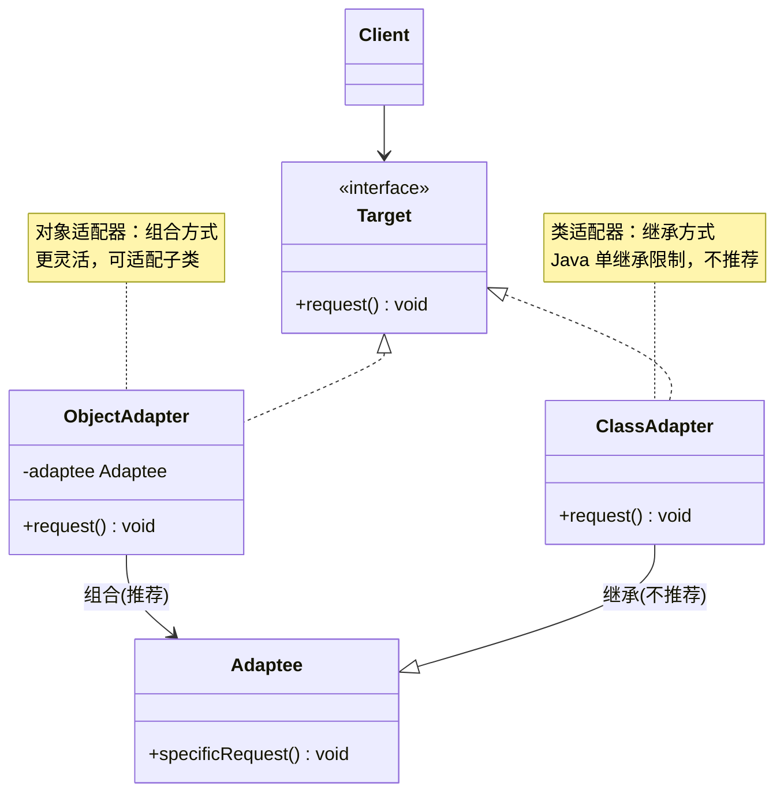
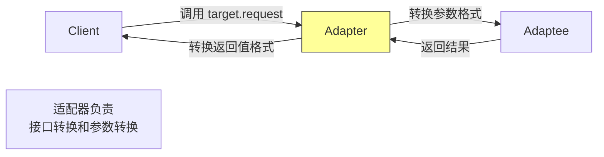

# 适配器模式（Adapter Pattern）

> **一句话记忆口诀**：适配器转换接口，让不兼容的类协同工作，`Arrays.asList()` 和 Spring MVC `HandlerAdapter` 是最熟悉的例子。

---

## 1. 引入：它解决了什么问题？

### 没有适配器模式时的问题

当需要使用一个已有的类，但其接口与当前系统要求的接口不匹配时：

```java
// ❌ 反例：第三方支付库的接口与系统要求不匹配
// 系统要求的支付接口
public interface PaymentGateway {
    boolean charge(String userId, double amount, String currency);
}

// 第三方支付库（无法修改）
public class StripePaymentSDK {
    public PaymentResult processPayment(PaymentRequest request) {
        // Stripe 的支付逻辑
        return new PaymentResult(true, "txn_123");
    }
}

// ❌ 直接使用：调用方必须了解 Stripe SDK 的细节，与第三方强耦合
public class OrderService {
    private StripePaymentSDK stripe = new StripePaymentSDK();

    public void pay(String userId, double amount) {
        PaymentRequest req = new PaymentRequest(userId, amount, "USD");
        PaymentResult result = stripe.processPayment(req); // 直接依赖第三方
        // 如果换成 PayPal，这里所有代码都要改！
    }
}
```

**问题根因**：调用方与第三方实现强耦合，更换实现时需要修改大量代码。

### 工作中的典型应用场景

| 场景 | Spring/JDK 中的例子 |
|------|-------------------|
| 数组转集合 | `Arrays.asList(array)` |
| Spring MVC 请求处理 | `HandlerAdapter` 适配不同类型的 Handler |
| SLF4J 日志门面 | 适配 Log4j、Logback 等不同实现 |
| 旧系统集成 | 将旧 API 适配为新接口 |
| 第三方 SDK 集成 | 将第三方 SDK 适配为系统内部接口 |

---

## 2. 类比：用生活模型建立直觉

### 生活类比：电源适配器

出国旅行时，中国的两孔插头（被适配者）无法直接插入美国的三孔插座（目标接口）。电源适配器（Adapter）解决了这个问题：一端接中国插头，另一端符合美国插座规格。

- **接口/抽象角色**：美国插座规格（`USSocket` 接口），定义三孔插入行为
- **被适配者**：中国插头（`ChinaPlug`），有自己的接口但与目标不兼容
- **适配器角色**：电源适配器（`PowerAdapter`），实现目标接口，内部调用被适配者
- **调用方**：美国电器（`Client`），只认识美国插座规格

### 抽象定义

> 适配器模式将一个类的接口转换成客户希望的另外一个接口，使得原本由于接口不兼容而不能一起工作的那些类可以一起工作。

---

## 3. 原理：逐步拆解核心机制

### UML 类图（对象适配器 vs 类适配器）



### Java 代码示例

```java
// ===== 目标接口（系统期望的接口）=====
public interface PaymentGateway {
    boolean charge(String userId, double amount, String currency);
}

// ===== 被适配者（第三方 SDK，无法修改）=====
public class StripePaymentSDK {
    public PaymentResult processPayment(PaymentRequest request) {
        System.out.println("Stripe 处理支付: " + request.getAmount());
        return new PaymentResult(true, "stripe_txn_" + System.currentTimeMillis());
    }
}

public class PayPalSDK {
    public boolean executePayment(String payerId, double amount) {
        System.out.println("PayPal 处理支付: " + amount);
        return true;
    }
}

// ===== 对象适配器（推荐：组合方式）=====
// 设计原因：通过组合持有被适配者，比继承更灵活（可以适配被适配者的子类）
// 代价：需要实现目标接口的所有方法
public class StripeAdapter implements PaymentGateway {
    private final StripePaymentSDK stripe; // 持有被适配者的引用

    public StripeAdapter(StripePaymentSDK stripe) {
        this.stripe = stripe;
    }

    @Override
    public boolean charge(String userId, double amount, String currency) {
        // 接口转换：将目标接口的参数转换为被适配者的参数格式
        PaymentRequest request = new PaymentRequest(userId, amount, currency);
        PaymentResult result = stripe.processPayment(request);
        return result.isSuccess();
    }
}

public class PayPalAdapter implements PaymentGateway {
    private final PayPalSDK paypal;

    public PayPalAdapter(PayPalSDK paypal) {
        this.paypal = paypal;
    }

    @Override
    public boolean charge(String userId, double amount, String currency) {
        // PayPal 不支持多币种，这里做转换处理
        double convertedAmount = convertCurrency(amount, currency, "USD");
        return paypal.executePayment(userId, convertedAmount);
    }

    private double convertCurrency(double amount, String from, String to) {
        // 货币转换逻辑
        return amount; // 简化示例
    }
}

// ===== 调用方（只依赖目标接口，不依赖具体实现）=====
public class OrderService {
    private final PaymentGateway paymentGateway; // 只依赖接口

    public OrderService(PaymentGateway paymentGateway) {
        this.paymentGateway = paymentGateway;
    }

    public void processOrder(String userId, double amount) {
        boolean success = paymentGateway.charge(userId, amount, "CNY");
        if (success) {
            System.out.println("订单支付成功");
        }
    }
}

// ===== 使用示例（切换支付方式只需换适配器）=====
public class Main {
    public static void main(String[] args) {
        // 使用 Stripe
        OrderService stripeOrder = new OrderService(
                new StripeAdapter(new StripePaymentSDK()));
        stripeOrder.processOrder("user_001", 100.0);

        // 切换到 PayPal，OrderService 代码不变！
        OrderService paypalOrder = new OrderService(
                new PayPalAdapter(new PayPalSDK()));
        paypalOrder.processOrder("user_001", 100.0);
    }
}
```

### Spring MVC HandlerAdapter 示例

```java
// Spring MVC 中，HandlerAdapter 适配不同类型的 Handler
// 目标接口
public interface HandlerAdapter {
    boolean supports(Object handler);
    ModelAndView handle(HttpServletRequest request,
                        HttpServletResponse response,
                        Object handler) throws Exception;
}

// 适配 @Controller 注解的方法
public class RequestMappingHandlerAdapter implements HandlerAdapter {
    @Override
    public boolean supports(Object handler) {
        return handler instanceof HandlerMethod; // 支持注解方式的 Handler
    }
    // ...
}

// 适配实现 Controller 接口的旧式 Handler
public class SimpleControllerHandlerAdapter implements HandlerAdapter {
    @Override
    public boolean supports(Object handler) {
        return handler instanceof Controller; // 支持接口方式的 Handler
    }
    // ...
}
```

### 核心流程图



---

## 4. 特性：关键对比

### 对象适配器 vs 类适配器

| 对比维度 | 对象适配器（组合） | 类适配器（继承） |
|---------|----------------|--------------|
| **实现方式** | 持有被适配者的引用 | 继承被适配者 |
| **灵活性** | ✅ 可适配被适配者的子类 | ❌ 只能适配特定类 |
| **Java 限制** | 无 | Java 单继承，无法同时继承多个类 |
| **推荐度** | ✅ 推荐 | ❌ 不推荐（Java 中） |

### 适配器模式 vs 外观模式（Facade）

| 对比维度 | 适配器模式 | 外观模式 |
|---------|----------|---------|
| **目的** | 转换接口，解决**不兼容**问题 | 简化接口，提供**统一入口** |
| **接口数量** | 一对一转换 | 多个接口 → 一个简化接口 |
| **使用时机** | 集成已有系统/第三方库 | 简化复杂子系统的使用 |
| **典型例子** | `Arrays.asList()`、SLF4J | Spring `JdbcTemplate`、Facade 门面 |

### 在 Spring / JDK 中的应用

| 框架/类 | 说明 |
|--------|------|
| `Arrays.asList()` | 将数组适配为 List 接口 |
| `Collections.enumeration()` | 将 Collection 适配为 Enumeration |
| Spring `HandlerAdapter` | 适配不同类型的 MVC Handler |
| SLF4J | 将不同日志框架适配为统一 API |
| `InputStreamReader` | 将字节流适配为字符流 |

---

## 5. 边界：异常情况与常见误区

### 误区一：Arrays.asList() 返回的 List 不支持增删（运行期 UnsupportedOperationException）

```java
// ❌ 错误：以为 Arrays.asList() 返回普通 ArrayList
String[] array = {"a", "b", "c"};
List<String> list = Arrays.asList(array);
list.add("d"); // 运行时抛出 UnsupportedOperationException！

// 原因：Arrays.asList() 返回的是 Arrays 内部的 ArrayList（适配器），
// 它是固定大小的，底层直接引用原数组，不支持 add/remove 操作
// 这是适配器模式的"接口不完全兼容"问题

// ✅ 正确：如果需要可变 List，用 new ArrayList<>() 包装
List<String> mutableList = new ArrayList<>(Arrays.asList(array));
mutableList.add("d"); // 正常工作
```

### 误区二：适配器中忘记处理异常转换（运行期问题）

```java
// ❌ 错误：适配器直接抛出被适配者的异常，暴露了内部实现细节
public class StripeAdapter implements PaymentGateway {
    @Override
    public boolean charge(String userId, double amount, String currency) {
        try {
            return stripe.processPayment(new PaymentRequest(userId, amount, currency)).isSuccess();
        } catch (StripeException e) {
            throw e; // 直接抛出 Stripe 特有异常，调用方被迫依赖 Stripe SDK！
        }
    }
}

// ✅ 正确：将被适配者的异常转换为目标接口定义的异常
public class StripeAdapter implements PaymentGateway {
    @Override
    public boolean charge(String userId, double amount, String currency) {
        try {
            return stripe.processPayment(new PaymentRequest(userId, amount, currency)).isSuccess();
        } catch (StripeException e) {
            // 转换为系统内部异常，隐藏第三方实现细节
            throw new PaymentException("支付处理失败: " + e.getMessage(), e);
        }
    }
}
```

### 误区三：过度使用适配器，掩盖了真正的设计问题（设计问题）

```java
// ❌ 问题：系统内部接口设计混乱，到处用适配器"打补丁"
// 如果发现需要大量适配器，说明系统接口设计本身有问题
// 适配器应该用于集成外部系统，而不是修复内部设计缺陷

// ✅ 正确使用场景：
// 1. 集成第三方库/遗留系统
// 2. 统一多个相似但接口不同的实现
// 3. 不能修改源码的情况下复用已有类
```

---

## 6. 总结：面试标准化表达

### 高频面试题

**Q1：适配器模式解决了什么问题？有哪两种实现方式？**

> 适配器模式解决接口不兼容问题，让原本无法协同工作的类可以一起工作，常用于集成第三方库或遗留系统。有两种实现：①对象适配器（推荐），通过组合持有被适配者引用，灵活性高，可适配被适配者的子类；②类适配器，通过继承被适配者，Java 单继承限制使其不推荐使用。工作中最常见的是对象适配器，如将 Stripe、PayPal 等第三方支付 SDK 适配为系统内部的统一支付接口。

**Q2：Arrays.asList() 为什么不能 add/remove？**

> `Arrays.asList()` 是适配器模式的应用，它返回的是 `Arrays` 内部的私有 `ArrayList` 类（不是 `java.util.ArrayList`），这个类继承自 `AbstractList`，底层直接引用原数组，没有实现 `add`/`remove` 方法（调用会抛 `UnsupportedOperationException`）。这是适配器"接口不完全兼容"的典型问题——适配器只转换了读取操作，没有支持修改操作。如需可变 List，应使用 `new ArrayList<>(Arrays.asList(array))`。

**Q3：Spring MVC 中的 HandlerAdapter 是什么设计模式？**

> Spring MVC 的 `HandlerAdapter` 是适配器模式的经典应用。Spring MVC 支持多种 Handler 类型（注解 `@Controller`、实现 `Controller` 接口、实现 `HttpRequestHandler` 接口等），`DispatcherServlet` 通过 `HandlerAdapter` 统一调用这些不同类型的 Handler，而无需关心具体类型。每种 Handler 类型对应一个 `HandlerAdapter` 实现（如 `RequestMappingHandlerAdapter`、`SimpleControllerHandlerAdapter`），这样新增 Handler 类型只需新增对应的 Adapter，不需要修改 `DispatcherServlet`。

---

> **一句话记忆口诀**：适配器转换接口，让不兼容的类协同工作，优先用组合（对象适配器）而非继承（类适配器），`Arrays.asList()` 和 Spring `HandlerAdapter` 是最熟悉的例子。