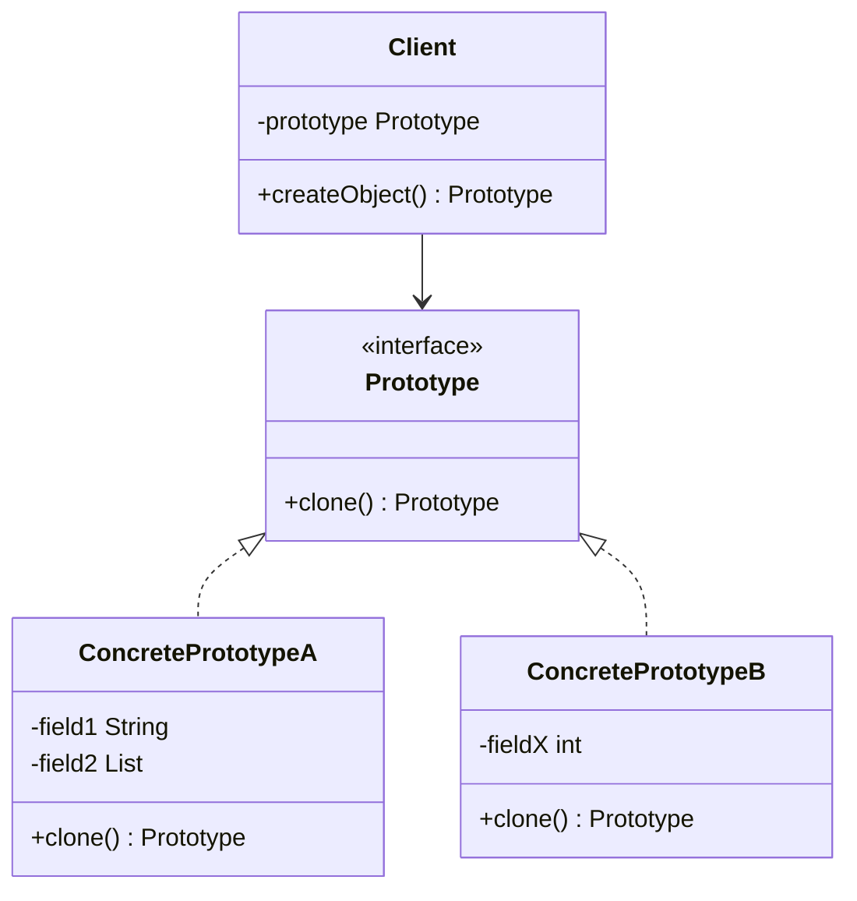
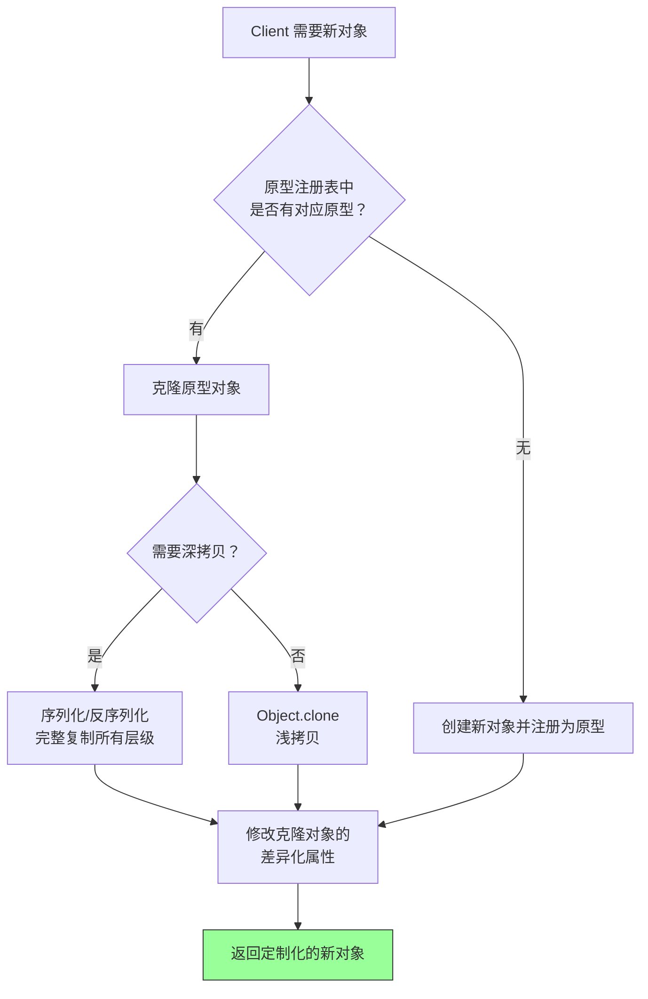

# 原型模式（Prototype Pattern）

> **一句话记忆口诀**：通过克隆已有对象创建新对象，避免重复初始化的开销，注意浅拷贝 vs 深拷贝的陷阱。

---

## 1. 引入：它解决了什么问题？

### 没有原型模式时的问题

当创建对象的成本很高（如需要复杂计算、数据库查询、网络请求），或者需要创建大量相似对象时：

```java
// ❌ 反例：每次都从数据库加载配置创建对象
public class ReportGenerator {
    public Report createReport(String type) {
        // 每次都要查数据库获取模板配置 —— 耗时操作！
        ReportTemplate template = db.queryTemplate(type);
        // 每次都要解析模板 —— CPU 密集操作！
        Report report = parseTemplate(template);
        // 每次都要加载默认样式 —— IO 操作！
        report.loadDefaultStyles();
        return report;
    }
}

// 如果需要生成 100 份同类型报表，上述代码会执行 100 次数据库查询！
```

**问题根因**：
1. 重复执行昂贵的初始化操作（数据库查询、文件解析、网络请求）
2. 无法高效创建大量相似对象（只有少量属性不同）
3. 创建逻辑与业务逻辑耦合，难以扩展新类型

### 工作中的典型应用场景

| 场景 | Spring/JDK 中的例子 |
|------|-------------------|
| Bean 定义复制 | Spring `BeanDefinition` 的 clone |
| 对象缓存预热 | 缓存原型对象，需要时克隆后修改 |
| 线程安全的对象创建 | 克隆线程安全的原型，避免共享可变状态 |
| 测试数据构建 | 克隆基础测试对象，修改个别字段 |
| 配置对象复制 | 基于默认配置克隆后定制化修改 |

---

## 2. 类比：用生活模型建立直觉

### 生活类比：复印文件

你有一份精心排版的合同模板（原型对象），每次签新客户时：
- **不用原型模式**：从头打字排版一份新合同（重新创建对象）—— 耗时且容易出错
- **用原型模式**：复印一份模板，只修改客户姓名和金额（克隆后修改）—— 快速且一致

关键点：
- **浅拷贝** = 黑白复印：文字复制了，但附件只是引用（指向同一份附件原件）
- **深拷贝** = 彩色复印 + 附件也复印：所有内容都是独立副本

### 抽象定义

> 原型模式用一个已经创建的实例作为原型，通过**复制**该原型对象来创建一个和原型相同或相似的新对象，而无需知道其具体创建细节。

---

## 3. 原理：逐步拆解核心机制

### UML 类图



### 实现方式一：Java Cloneable 接口（浅拷贝）

```java
// ===== 原型类 =====
public class ReportTemplate implements Cloneable {
    private String title;
    private String type;
    private List<String> sections;  // 引用类型字段

    public ReportTemplate(String title, String type, List<String> sections) {
        this.title = title;
        this.type = type;
        this.sections = sections;
        // 模拟耗时的初始化操作
        System.out.println("执行耗时初始化：加载模板配置...");
    }

    // 浅拷贝：基本类型复制值，引用类型复制引用（共享同一对象）
    @Override
    public ReportTemplate clone() {
        try {
            return (ReportTemplate) super.clone();
        } catch (CloneNotSupportedException e) {
            throw new RuntimeException("克隆失败", e);
        }
    }

    // getter/setter 省略
}

// ===== 使用示例 =====
public class Main {
    public static void main(String[] args) {
        // 只执行一次耗时初始化
        ReportTemplate prototype = new ReportTemplate(
            "月度报表", "MONTHLY", new ArrayList<>(Arrays.asList("概述", "数据", "结论"))
        );

        // 克隆 —— 不会再执行耗时初始化！
        ReportTemplate report1 = prototype.clone();
        report1.setTitle("1月报表");

        ReportTemplate report2 = prototype.clone();
        report2.setTitle("2月报表");

        // ⚠️ 浅拷贝陷阱：修改 sections 会影响所有克隆对象！
        report1.getSections().add("附录");
        // prototype、report2 的 sections 也被修改了！
    }
}
```

### 实现方式二：深拷贝（序列化方式）

```java
public class ReportTemplate implements Serializable {
    private String title;
    private String type;
    private List<String> sections;

    // 通过序列化实现深拷贝 —— 所有引用类型字段都会被完整复制
    public ReportTemplate deepClone() {
        try {
            ByteArrayOutputStream bos = new ByteArrayOutputStream();
            ObjectOutputStream oos = new ObjectOutputStream(bos);
            oos.writeObject(this);

            ByteArrayInputStream bis = new ByteArrayInputStream(bos.toByteArray());
            ObjectInputStream ois = new ObjectInputStream(bis);
            return (ReportTemplate) ois.readObject();
        } catch (Exception e) {
            throw new RuntimeException("深拷贝失败", e);
        }
    }
}
```

### 实现方式三：原型注册表（Prototype Registry）

```java
// ===== 原型注册表：缓存预创建的原型对象 =====
public class PrototypeRegistry {
    private static final Map<String, ReportTemplate> registry = new HashMap<>();

    // 应用启动时预热：创建各类型的原型对象
    static {
        registry.put("MONTHLY", new ReportTemplate("月度报表", "MONTHLY",
            new ArrayList<>(Arrays.asList("概述", "数据", "结论"))));
        registry.put("WEEKLY", new ReportTemplate("周报", "WEEKLY",
            new ArrayList<>(Arrays.asList("本周进展", "下周计划"))));
    }

    // 获取时返回克隆对象，保护原型不被修改
    public static ReportTemplate getTemplate(String type) {
        ReportTemplate prototype = registry.get(type);
        if (prototype == null) {
            throw new IllegalArgumentException("未知模板类型: " + type);
        }
        return prototype.deepClone();
    }
}
```

### 核心流程图



---

## 4. 特性：关键对比

### 浅拷贝 vs 深拷贝

| 对比维度 | 浅拷贝（Shallow Copy） | 深拷贝（Deep Copy） |
|---------|----------------------|-------------------|
| **基本类型** | ✅ 复制值 | ✅ 复制值 |
| **引用类型** | ❌ 复制引用（共享对象） | ✅ 递归复制（独立对象） |
| **性能** | ✅ 快（只复制一层） | ❌ 慢（递归复制所有层） |
| **安全性** | ❌ 修改会互相影响 | ✅ 完全独立 |
| **实现方式** | `Object.clone()` | 序列化 / 手动递归复制 |

### 原型模式 vs 工厂模式

| 对比维度 | 原型模式 | 工厂模式 |
|---------|---------|---------|
| **创建方式** | 克隆已有对象 | 通过 new 创建新对象 |
| **适用场景** | 创建成本高、对象相似度高 | 根据条件创建不同类型对象 |
| **初始化** | 跳过初始化（已在原型中完成） | 每次都执行初始化 |
| **灵活性** | 运行时动态添加/删除原型 | 编译时确定产品类型 |

### 在 Spring / JDK 中的应用

| 框架/类 | 说明 |
|--------|------|
| `Object.clone()` | JDK 原生克隆支持（浅拷贝） |
| `ArrayList.clone()` | 列表浅拷贝 |
| Spring `scope="prototype"` | 每次获取 Bean 时创建新实例（概念相关，非严格原型模式） |
| Spring `BeanDefinition` | Bean 定义的复制与合并 |
| `Arrays.copyOf()` | 数组复制 |

---

## 5. 边界：异常情况与常见误区

### 误区一：浅拷贝导致数据污染（运行期问题）

```java
// ❌ 错误：浅拷贝后修改引用类型字段，影响了原型对象
ReportTemplate prototype = new ReportTemplate("模板", "DEFAULT",
    new ArrayList<>(Arrays.asList("章节1", "章节2")));

ReportTemplate copy = prototype.clone(); // 浅拷贝
copy.getSections().add("章节3");

// prototype 的 sections 也变成了 ["章节1", "章节2", "章节3"]！
// 原因：浅拷贝只复制了 List 的引用，两个对象共享同一个 List

// ✅ 正确：对包含引用类型字段的对象使用深拷贝
ReportTemplate copy = prototype.deepClone();
copy.getSections().add("章节3"); // 不影响 prototype
```

### 误区二：clone() 方法不调用构造方法（设计问题）

```java
// ⚠️ 注意：clone() 不会调用任何构造方法！
public class Singleton implements Cloneable {
    private static final Singleton INSTANCE = new Singleton();
    private Singleton() { System.out.println("构造方法被调用"); }

    @Override
    public Singleton clone() {
        return (Singleton) super.clone(); // 不会调用构造方法！
    }
}

// 这意味着：
// 1. 单例模式的类不应该实现 Cloneable，否则可以通过 clone 破坏单例
// 2. 如果构造方法中有重要的初始化逻辑，clone 后的对象可能状态不完整

// ✅ 防御措施：在 clone() 中抛出异常
@Override
public Object clone() throws CloneNotSupportedException {
    throw new CloneNotSupportedException("单例对象不允许克隆");
}
```

### 误区三：循环引用导致深拷贝栈溢出（运行期问题）

```java
// ❌ 错误：对象之间存在循环引用时，手动递归深拷贝会栈溢出
public class Node {
    private String name;
    private Node next;  // 如果 A.next = B, B.next = A，递归复制会死循环

    // ✅ 解决方案：使用序列化方式深拷贝（Java 序列化能正确处理循环引用）
    // 或者使用 Map 记录已复制的对象，避免重复复制
}
```

---

## 6. 总结：面试标准化表达

### 高频问题

**Q1：原型模式解决了什么问题？**

> 原型模式解决了对象创建成本高的问题。当创建对象需要复杂的初始化操作（如数据库查询、文件解析、网络请求）时，通过克隆已有的原型对象来创建新对象，可以跳过耗时的初始化过程。同时，原型模式也适用于需要创建大量相似对象的场景，只需克隆后修改差异化属性即可。

**Q2：浅拷贝和深拷贝的区别？**

> 浅拷贝只复制对象的第一层：基本类型复制值，引用类型复制引用（新旧对象共享同一个引用对象）。深拷贝递归复制所有层级，新旧对象完全独立。Java 中 `Object.clone()` 默认是浅拷贝，深拷贝可以通过序列化/反序列化或手动递归复制实现。工作中需要根据对象是否包含可变引用类型字段来选择拷贝方式。

**Q3：原型模式和 Spring 的 prototype 作用域有什么关系？**

> Spring 的 `scope="prototype"` 表示每次获取 Bean 时都创建新实例，这与原型模式的"克隆"思想有概念上的相似性（都是创建新对象），但实现方式不同：Spring prototype 作用域是通过反射调用构造方法创建新对象，而原型模式是通过克隆已有对象。严格来说，Spring 的 prototype 作用域不是原型模式的实现。

---

> **一句话记忆口诀**：通过克隆已有对象创建新对象，避免重复初始化的开销，浅拷贝共享引用、深拷贝完全独立，`Object.clone()` 不调用构造方法。
