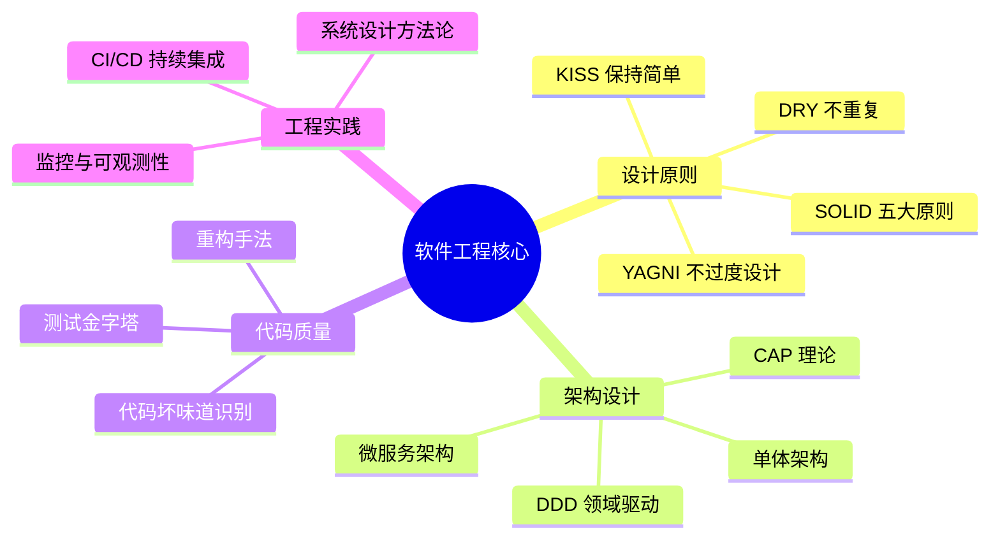

# 软件工程核心知识

> **学习目标**：从"写代码的人"升级到"做工程的人"——解决的不是"代码能不能跑"，而是"系统能不能长期演进、团队能不能高效协作"
>
> **检验标准**：学完每个模块后，能口述"这个理论解决了什么问题？不用它会怎样？工作中如何落地？"

---

## 整体知识地图

---

## 知识点导航

| # | 知识点 | 核心一句话 | 详细文档 |
|---|--------|-----------|---------|
| 01 | **SOLID 原则** | OCP 是核心目标，其他四条是实现手段；SRP 一个类只做一件事 | [01-SOLID原则.md](./01-SOLID原则.md) |
| 02 | **软件架构演进** | 初创用单体，团队 > 10 人再考虑微服务拆分 | [02-软件架构演进.md](./02-软件架构演进.md) |
| 03 | **DDD 领域驱动设计** | 复杂业务用充血模型，简单 CRUD 用贫血模型；聚合根保证一致性 | [03-DDD领域驱动设计.md](./03-DDD领域驱动设计.md) |
| 04 | **CAP 理论与 BASE 理论** | 网络分区客观存在（P 不可放弃），只能在 C 和 A 之间权衡 | [04-CAP理论与BASE理论.md](./04-CAP理论与BASE理论.md) |
| 05 | **代码质量与重构** | 方法 > 20 行、类 > 200 行、相同代码出现 3 次就该重构 | [05-代码质量与重构.md](./05-代码质量与重构.md) |
| 06 | **CI/CD 持续集成与交付** | 自动化流水线保证质量，蓝绿/金丝雀/滚动发布降低风险 | [06-CICD持续集成与交付.md](./06-CICD持续集成与交付.md) |
| 07 | **系统设计方法论** | 需求澄清 → 容量估算 → 架构设计 → DB 设计 → 接口设计 → 扩展性 | [07-系统设计方法论.md](./07-系统设计方法论.md) |

---

## 高频问题索引

| 问题 | 详见 |
|------|------|
| SOLID 哪条最重要？各自解决什么问题？ | [SOLID原则](./01-SOLID原则.md) |
| 微服务 vs 单体如何选型？ | [软件架构演进](./02-软件架构演进.md) |
| 贫血模型 vs 充血模型？限界上下文怎么划分？ | [DDD领域驱动设计](./03-DDD领域驱动设计.md) |
| CAP 中 P 为何不可放弃？BASE 理论是什么？ | [CAP理论与BASE理论](./04-CAP理论与BASE理论.md) |
| 何时需要重构？常见代码坏味道有哪些？ | [代码质量与重构](./05-代码质量与重构.md) |
| 系统设计面试如何答题？ | [系统设计方法论](./07-系统设计方法论.md) |

---

## 一句话口诀

> **SOLID** 是设计准则，**DDD** 是业务建模，**CAP** 是分布式选型，**CI/CD** 是工程实践，**测试金字塔**是质量保障。
