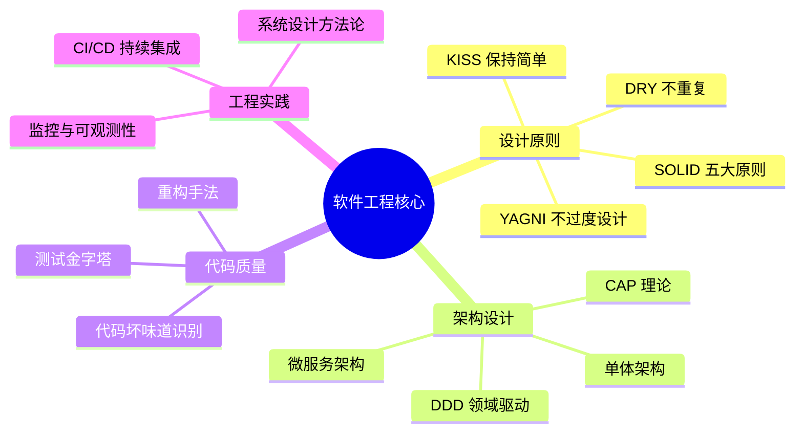

# 软件工程核心知识复习

> 软件工程是区分"写代码的人"和"做工程的人"的核心能力——它解决的不是"代码能不能跑"，而是"系统能不能长期演进、团队能不能高效协作"。

---

## 知识结构

---

## 知识点导航

| # | 知识点 | 核心内容 | 重要程度 |
|---|--------|---------|---------|
| 1 | [SOLID 原则](./01-SOLID原则.md) | SRP / OCP / LSP / ISP / DIP | ⭐⭐⭐⭐⭐ |
| 2 | [软件架构演进](./02-软件架构演进.md) | 单体 vs 微服务、核心组件 | ⭐⭐⭐⭐⭐ |
| 3 | [DDD 领域驱动设计](./03-DDD领域驱动设计.md) | 贫血/充血模型、聚合根、限界上下文 | ⭐⭐⭐⭐ |
| 4 | [CAP 理论与 BASE 理论](./04-CAP理论与BASE理论.md) | CP vs AP 选型、最终一致性 | ⭐⭐⭐⭐⭐ |
| 5 | [代码质量与重构](./05-代码质量与重构.md) | 坏味道识别、重构手法、测试金字塔 | ⭐⭐⭐⭐ |
| 6 | [CI/CD 持续集成与交付](./06-CICD持续集成与交付.md) | 流水线、蓝绿/金丝雀/滚动发布 | ⭐⭐⭐⭐ |
| 7 | [系统设计方法论](./07-系统设计方法论.md) | 答题框架、常见错误避坑 | ⭐⭐⭐⭐⭐ |

---

## 核心问题速查

| 问题 | 关键答案 | 详见 |
|------|---------|------|
| SOLID 哪条最重要？ | OCP 是核心目标，其他四条是实现手段 | [SOLID 原则](./01-SOLID原则.md) |
| 微服务 vs 单体如何选？ | 初创用单体，团队 > 10 人再考虑拆分 | [软件架构演进](./02-软件架构演进.md) |
| 贫血模型 vs 充血模型？ | 复杂业务用充血，简单 CRUD 用贫血 | [DDD 领域驱动设计](./03-DDD领域驱动设计.md) |
| CAP 中 P 为何不可放弃？ | 网络分区客观存在，P 是前提 | [CAP 理论与 BASE 理论](./04-CAP理论与BASE理论.md) |
| 何时需要重构？ | 方法 > 20 行、类 > 200 行、相同代码出现 3 次 | [代码质量与重构](./05-代码质量与重构.md) |
| 系统设计如何答题？ | 需求澄清 → 容量估算 → 架构 → DB → 接口 → 扩展性 | [系统设计方法论](./07-系统设计方法论.md) |

---

## 一句话口诀

> **SOLID** 是设计准则，**DDD** 是业务建模，**CAP** 是分布式选型，**CI/CD** 是工程实践，**测试金字塔**是质量保障。