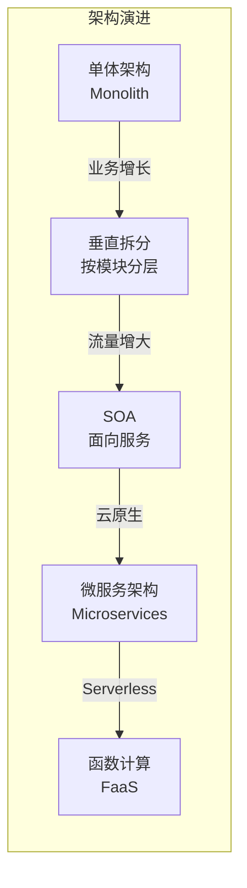
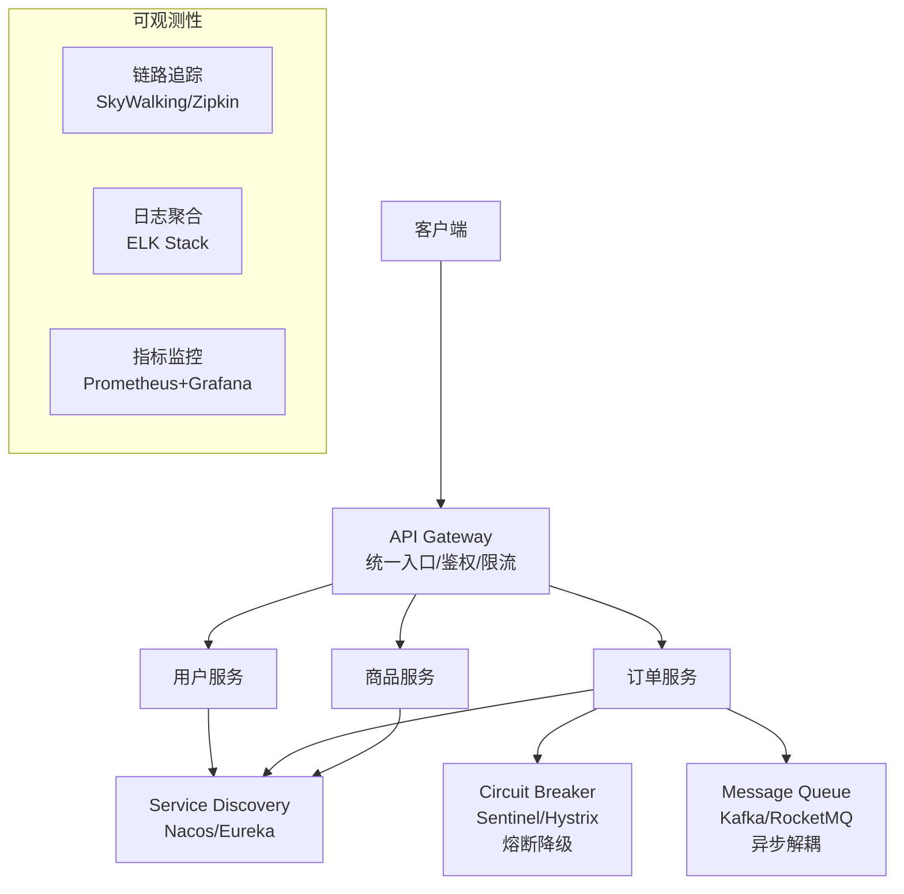

# 软件架构演进

---

## 架构演进路径

---

## 单体架构 vs 微服务架构

| 维度 | 单体架构 | 微服务架构 | 选择依据 |
|------|---------|-----------|---------|
| **部署** | 整体部署，简单 | 独立部署，灵活 | 团队规模和发布频率 |
| **扩展** | 整体扩展，浪费资源 | 按需扩展，精细化 | 各模块负载是否差异大 |
| **开发** | 简单，适合小团队 | 复杂，需要 DevOps 能力 | 团队是否有微服务运维能力 |
| **故障隔离** | 一处故障影响全局 | 故障隔离，影响范围小 | 对可用性的要求 |
| **数据一致性** | 事务简单 | 分布式事务复杂 | 业务对一致性的要求 |
| **适用场景** | 初创项目、小型系统 | 大型系统、多团队协作 | 团队规模 > 10 人时考虑拆分 |

> **为什么不要一开始就用微服务**：微服务需要服务注册发现、分布式追踪、分布式事务等基础设施，运维复杂度极高。初创项目业务不稳定，过早拆分会导致频繁的跨服务重构。**先单体，再拆分**是更务实的选择。

---

## 微服务核心组件

---

## 常见问题

**Q：微服务和单体架构如何选择？**
> 初创项目优先单体，快速验证业务。当团队超过 10 人、模块间耦合严重、需要独立扩展时，再考虑微服务拆分。**不要为了微服务而微服务**，微服务的运维复杂度远高于单体。

**Q：服务拆分常见错误？**
> 拆分过细，每个接口都跨服务调用，导致网络开销和分布式事务问题。应按业务域拆分，保持高内聚低耦合。