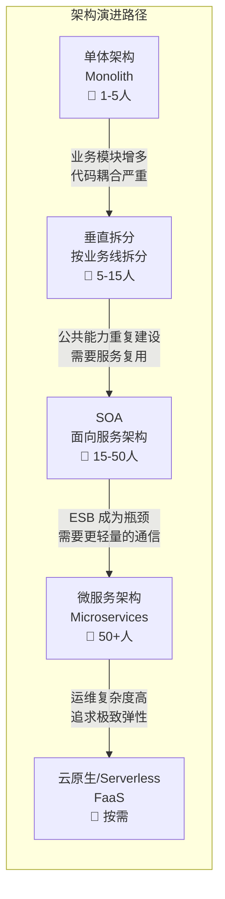
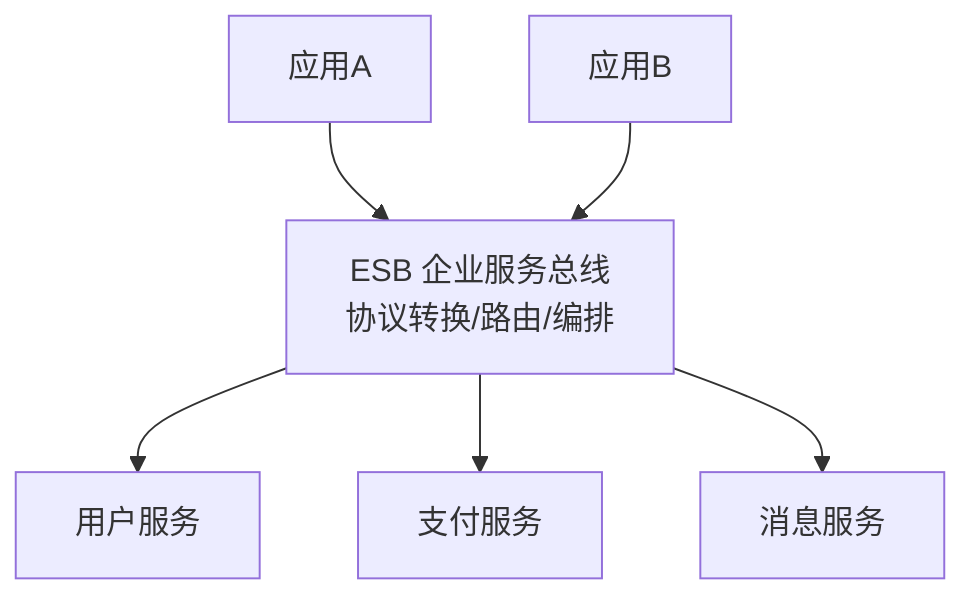
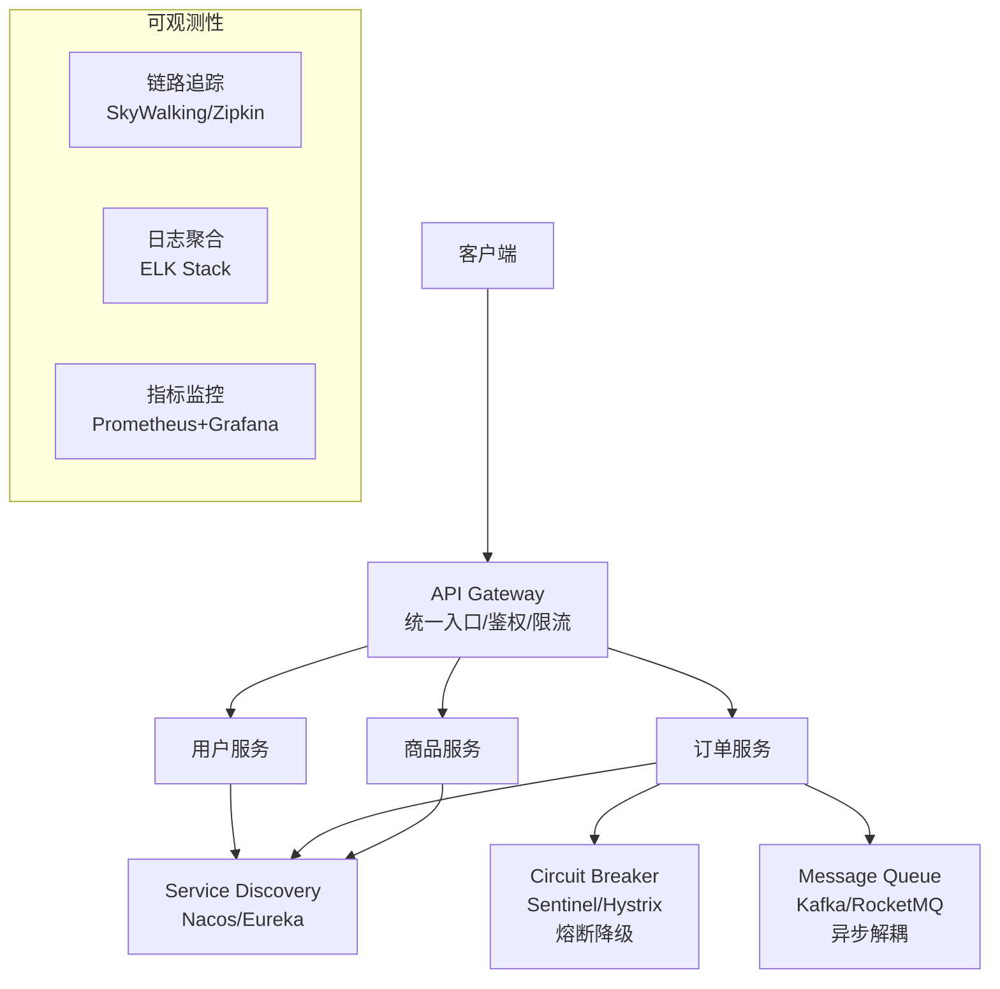
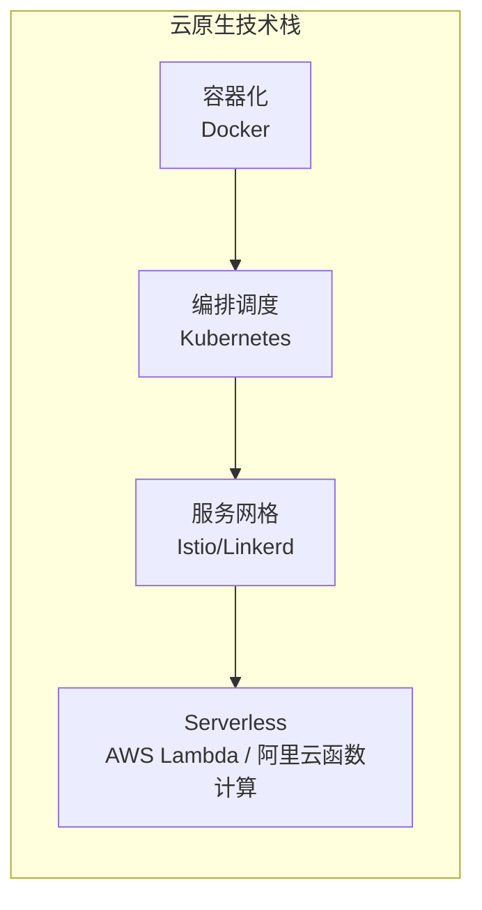
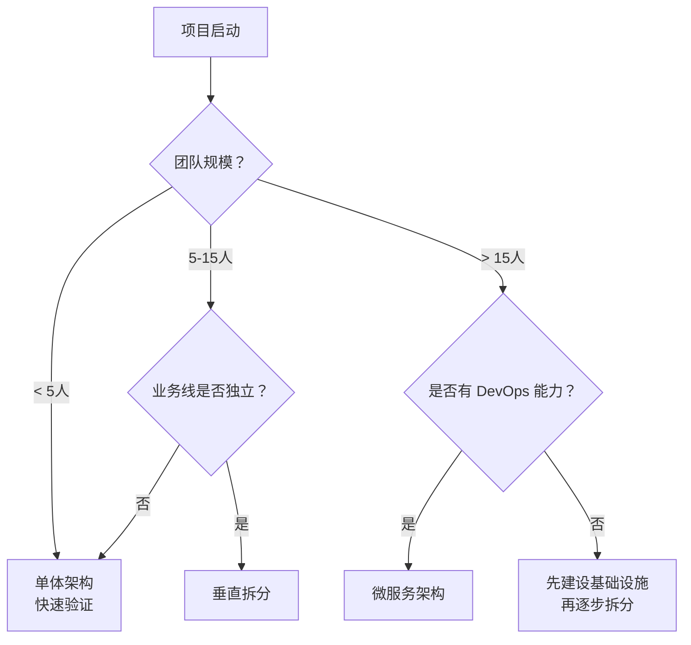
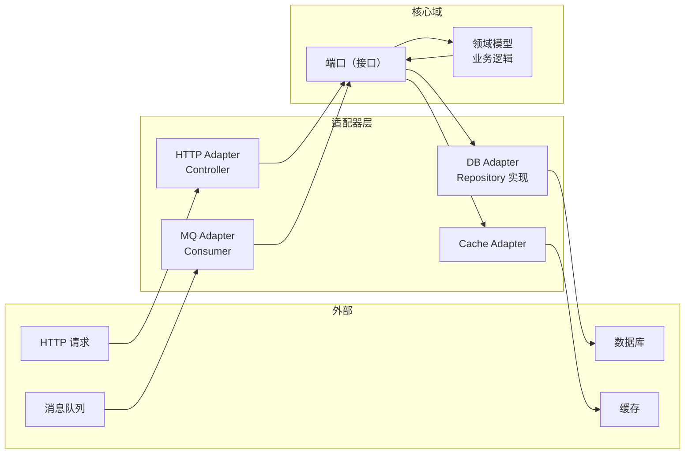

# 软件架构演进

> **核心问题**：软件架构经历了哪些演进阶段？每种架构解决了什么问题、引入了什么新问题？如何根据业务阶段选择合适的架构？

---

## 它解决了什么问题？

架构不是一成不变的，而是随着业务规模、团队规模、技术能力的变化而演进的。理解架构演进的脉络，能帮助你：

- 在正确的时间点做出正确的架构决策（不过度设计，也不欠设计）
- 理解每种架构的适用场景和局限性
- 避免"为了微服务而微服务"的常见陷阱

---

# 一、架构演进全景



---

# 二、各阶段架构详解

## 2.1 单体架构（Monolith）

所有功能模块打包在一个应用中，共享一个数据库，一次部署。

```
┌─────────────────────────────────┐
│           单体应用               │
│  ┌─────┐ ┌─────┐ ┌─────┐      │
│  │用户  │ │订单  │ │商品  │      │
│  │模块  │ │模块  │ │模块  │      │
│  └──┬──┘ └──┬──┘ └──┬──┘      │
│     └───────┼───────┘          │
│          ┌──┴──┐               │
│          │ DB  │               │
│          └─────┘               │
└─────────────────────────────────┘
```

| 优势 | 劣势 |
|------|------|
| 开发简单，IDE 直接调试 | 代码耦合，改一处影响全局 |
| 部署简单，一个 JAR/WAR | 启动慢，编译慢（代码量大时） |
| 事务简单，本地事务即可 | 无法按模块独立扩展 |
| 适合快速验证业务 | 技术栈绑定，无法混合使用 |

**适用场景**：初创项目、MVP 验证、团队 1-5 人、业务逻辑简单。

## 2.2 垂直拆分架构

按业务线将单体拆分为多个独立应用，每个应用有自己的数据库。

```
┌──────────┐  ┌──────────┐  ┌──────────┐
│ 用户系统  │  │ 订单系统  │  │ 商品系统  │
│          │  │          │  │          │
│  ┌────┐  │  │  ┌────┐  │  │  ┌────┐  │
│  │ DB │  │  │  │ DB │  │  │  │ DB │  │
│  └────┘  │  │  └────┘  │  │  └────┘  │
└──────────┘  └──────────┘  └──────────┘
```

| 优势 | 劣势 |
|------|------|
| 各业务线独立开发部署 | 公共功能重复建设（如用户认证） |
| 故障隔离，一个系统挂了不影响其他 | 系统间调用方式不统一 |
| 可以按业务线独立扩展 | 数据冗余，跨系统查询困难 |

**适用场景**：业务线明确分离、团队 5-15 人、各业务线相对独立。

## 2.3 SOA（面向服务架构）

将公共能力抽取为独立服务，通过 ESB（企业服务总线）统一通信。



| 优势 | 劣势 |
|------|------|
| 服务复用，避免重复建设 | ESB 是单点瓶颈和故障点 |
| 统一的服务治理 | ESB 配置复杂，学习成本高 |
| 支持异构系统集成 | 服务粒度粗，仍然偏重量级 |

**适用场景**：大型企业内部系统集成、异构系统互通。

## 2.4 微服务架构（Microservices）

每个服务围绕一个业务能力构建，独立开发、部署、扩展，服务间通过轻量级协议（HTTP/gRPC）通信。



| 优势 | 劣势 |
|------|------|
| 独立部署，快速迭代 | 分布式事务复杂 |
| 按需扩展，资源利用率高 | 服务间通信有网络开销 |
| 技术栈自由，各服务可选不同语言 | 需要完善的基础设施（注册发现、链路追踪等） |
| 故障隔离，熔断降级 | 运维复杂度高，需要 DevOps 能力 |

**适用场景**：大型系统、多团队协作（50+ 人）、需要独立扩展和快速迭代。

> **与 Spring 微服务文档的分工**：本文聚焦架构理论和选型决策，具体的 Spring Cloud 组件原理和落地实践请参考 [Spring Cloud 核心组件](../02-spring/03-微服务与安全/02-Spring-Cloud核心组件.md) 和 [微服务架构深度实践](../02-spring/03-微服务与安全/03-微服务架构深度实践.md)。

## 2.5 云原生与 Serverless



| 特性 | 说明 |
|------|------|
| **容器化** | 应用打包为容器镜像，环境一致性，秒级启动 |
| **Kubernetes** | 自动化部署、扩缩容、自愈，声明式管理 |
| **服务网格** | 将服务治理（熔断、限流、重试）下沉到基础设施层，业务代码无感知 |
| **Serverless** | 按调用次数计费，无需管理服务器，极致弹性 |

---

# 三、架构选型决策框架

## 选型决策树



## 关键决策因素

| 决策因素 | 倾向单体 | 倾向微服务 |
|---------|---------|-----------|
| **团队规模** | < 10 人 | > 10 人，多团队 |
| **业务复杂度** | CRUD 为主 | 复杂业务逻辑，多业务域 |
| **发布频率** | 每周/每月 | 每天多次 |
| **扩展需求** | 各模块负载均匀 | 各模块负载差异大 |
| **技术栈** | 统一技术栈 | 需要混合技术栈 |
| **基础设施** | 无 K8s/DevOps | 有完善的 CI/CD 和监控 |

> **核心原则**：**先单体，再拆分**。不要一开始就用微服务，微服务需要服务注册发现、分布式追踪、分布式事务等基础设施，运维复杂度极高。初创项目业务不稳定，过早拆分会导致频繁的跨服务重构。

---

# 四、分层架构模式

无论选择哪种部署架构，应用内部的分层设计都很重要。

## 传统三层架构

```
Controller（表现层）→ Service（业务层）→ DAO（数据层）
```

**问题**：业务逻辑全部堆在 Service 层，Entity 只有 getter/setter（贫血模型），Service 越来越臃肿。

## 六边形架构（端口与适配器）



**核心思想**：业务逻辑在中心，通过端口（接口）与外部交互，适配器负责技术细节。更换数据库、消息队列等只需替换适配器，不影响核心业务。

## 整洁架构（Clean Architecture）

```
外层（框架/驱动）→ 接口适配器 → 用例层 → 实体层（核心）
```

**依赖规则**：依赖方向只能从外向内，内层不知道外层的存在。

| 层次 | 职责 | 示例 |
|------|------|------|
| **实体层** | 核心业务规则，与框架无关 | Order、User 领域对象 |
| **用例层** | 应用业务规则，编排领域对象 | CreateOrderUseCase |
| **接口适配器** | 转换数据格式 | Controller、Repository |
| **框架层** | 技术细节 | Spring、MyBatis、Redis |

---

# 五、架构反模式

| 反模式 | 描述 | 后果 | 正确做法 |
|--------|------|------|---------|
| **分布式单体** | 拆成了微服务，但服务间强耦合，必须一起部署 | 兼具单体和微服务的缺点 | 按业务域拆分，保持高内聚低耦合 |
| **过早优化** | 业务还没验证就搭建复杂架构 | 浪费时间，增加维护成本 | 先用最简单的方案，遇到瓶颈再优化 |
| **简历驱动开发** | 为了用新技术而引入不必要的复杂度 | 团队学习成本高，稳定性差 | 技术选型以解决问题为导向 |
| **大泥球** | 没有清晰的模块边界，代码随意调用 | 牵一发动全身，无法维护 | 明确模块边界，通过接口通信 |
| **拆分过细** | 每个接口都是一个服务 | 网络开销大，分布式事务多 | 按业务域拆分，一个域一个服务 |

---

# 六、常见问题

**Q：微服务和单体架构如何选择？**

> 初创项目优先单体，快速验证业务。当团队超过 10 人、模块间耦合严重、需要独立扩展时，再考虑微服务拆分。**不要为了微服务而微服务**，微服务的运维复杂度远高于单体。

**Q：服务拆分的常见错误是什么？**

> ① 拆分过细，每个接口都跨服务调用，导致网络开销和分布式事务问题；② 拆分后服务间仍然强耦合，必须一起部署（分布式单体）；③ 没有建设好基础设施（注册发现、链路追踪、CI/CD）就急于拆分。应按业务域拆分，保持高内聚低耦合。

**Q：SOA 和微服务的区别是什么？**

> SOA 通过重量级的 ESB 集中管理服务通信，服务粒度较粗；微服务去掉了 ESB，服务间直接通过轻量级协议（HTTP/gRPC）通信，服务粒度更细，每个服务独立部署。微服务可以看作是 SOA 的轻量化演进。

**Q：什么是六边形架构？它和传统三层架构有什么区别？**

> 六边形架构将业务逻辑放在中心，通过端口（接口）与外部交互，适配器负责技术细节。与三层架构的区别在于：三层架构的依赖方向是从上到下（Controller → Service → DAO），业务层依赖数据层；六边形架构通过依赖倒置，核心域不依赖任何外部技术，更容易测试和替换技术组件。

**Q：如何判断是否需要从单体迁移到微服务？**

> 出现以下信号时考虑迁移：① 团队超过 10 人，代码合并冲突频繁；② 某个模块需要独立扩展（如秒杀模块需要 10 倍资源，其他模块不需要）；③ 发布频率受限，一个模块的变更需要等待整体发布；④ 技术栈需要多样化（如 AI 模块用 Python，其他用 Java）。
