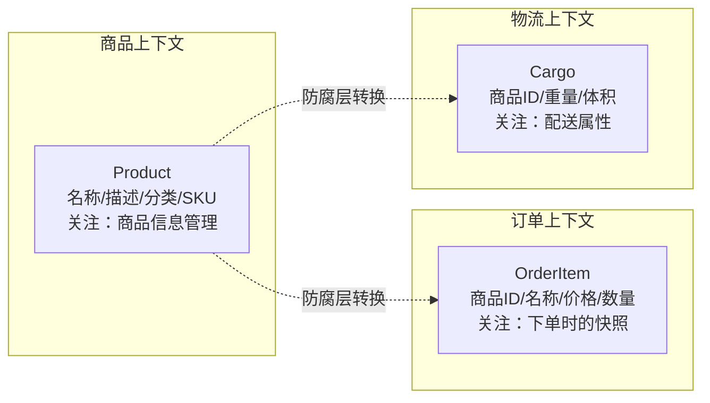
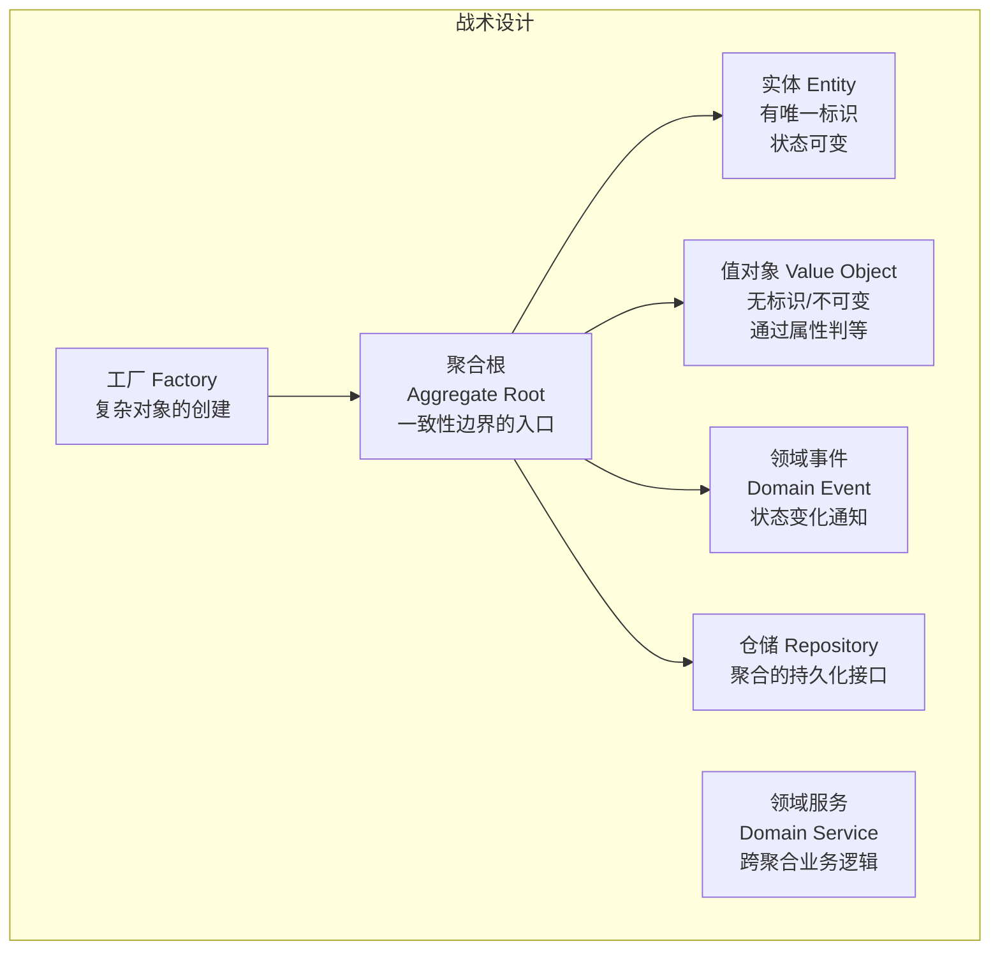
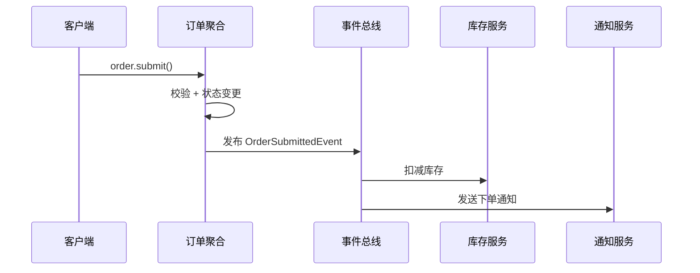

# DDD 领域驱动设计

> **核心问题**：为什么传统三层架构在复杂业务中会失控？DDD 如何通过战略设计和战术设计来管理业务复杂度？

---

## 为什么需要 DDD？

**问题根源**：传统三层架构（Controller → Service → DAO）中，业务逻辑全部堆在 Service 层，Entity 只有 getter/setter，这就是**贫血模型**。

```java
// ❌ 贫血模型：Order 只是数据容器，业务逻辑在 Service
public class Order {
    private Long id;
    private String status;
    // 只有 getter/setter，没有业务行为
}

public class OrderService {
    public void cancelOrder(Long orderId) {
        Order order = orderRepository.findById(orderId);
        if (!"PAID".equals(order.getStatus())) {
            throw new BusinessException("只有已支付订单才能取消");
        }
        order.setStatus("CANCELLED");
        // 业务逻辑全在 Service，Order 是贫血的
    }
}

// ✅ 充血模型：业务逻辑在领域对象内
public class Order {
    private Long id;
    private OrderStatus status;

    // 业务行为封装在领域对象中
    public void cancel() {
        if (this.status != OrderStatus.PAID) {
            throw new DomainException("只有已支付订单才能取消");
        }
        this.status = OrderStatus.CANCELLED;
        DomainEvents.raise(new OrderCancelledEvent(this.id));
    }
}
```

> **为什么充血模型更好**：业务逻辑内聚在领域对象中，修改取消逻辑只需改 `Order.cancel()`，不需要在多个 Service 中查找。同时，领域对象可以保证自身状态的合法性（不需要外部校验）。

**贫血模型的典型症状**：

| 症状 | 表现 | 后果 |
|------|------|------|
| Service 类膨胀 | 一个 OrderService 几千行 | 难以理解和维护 |
| 逻辑分散 | 取消订单的校验在 3 个 Service 中都有 | 修改时容易遗漏 |
| Entity 无行为 | Order 只有 getter/setter | 违反 OOP 封装原则 |
| 无法保证一致性 | 任何地方都能 `order.setStatus()` | 绕过业务规则的风险 |

---

# 一、战略设计（Strategic Design）

战略设计解决的是**如何划分系统边界**的问题，是 DDD 中最重要的部分。

## 1.1 统一语言（Ubiquitous Language）

**核心思想**：开发团队和业务专家使用同一套词汇，代码中的命名直接反映业务概念。

```
❌ 技术语言：UserDO、OrderDTO、updateStatusById()
✅ 统一语言：Customer、PurchaseOrder、order.cancel()
```

| 业务概念 | 错误命名 | 正确命名 | 原因 |
|---------|---------|---------|------|
| 下单 | insertOrder() | placeOrder() | "下单"不是"插入" |
| 取消订单 | updateStatus(CANCELLED) | order.cancel() | 业务动作，不是字段更新 |
| 支付 | setPayStatus(1) | payment.complete() | 支付完成是业务事件 |
| 退款 | updateRefundFlag(true) | order.refund(reason) | 退款有原因，不是改标记 |

## 1.2 限界上下文（Bounded Context）

**核心思想**：同一个业务概念在不同上下文中含义不同，每个上下文有自己的模型。



> **关键洞察**：不要试图用一个 `Product` 类满足所有上下文的需求，这会导致 God Class。每个上下文有自己的 `Product` 定义，通过防腐层（Anti-Corruption Layer）进行转换。

## 1.3 上下文映射（Context Mapping）

限界上下文之间的关系模式：

| 关系模式 | 说明 | 示例 |
|---------|------|------|
| **合作关系（Partnership）** | 两个团队共同演进，互相协调 | 订单团队和支付团队紧密合作 |
| **客户-供应商（Customer-Supplier）** | 上游提供服务，下游消费 | 商品服务（上游）→ 订单服务（下游） |
| **防腐层（ACL）** | 下游通过适配层隔离上游模型变化 | 对接第三方支付 API |
| **开放主机服务（OHS）** | 上游提供标准化 API | 提供 RESTful API 给多个下游 |
| **共享内核（Shared Kernel）** | 两个上下文共享一小部分模型 | 共享 Money 值对象 |
| **各行其道（Separate Ways）** | 两个上下文完全独立 | 日志系统和订单系统 |

---

# 二、战术设计（Tactical Design）

战术设计解决的是**如何在代码层面实现 DDD**的问题。

## 2.1 核心概念全景



## 2.2 实体 vs 值对象

| 特性 | 实体（Entity） | 值对象（Value Object） |
|------|---------------|---------------------|
| **标识** | 有唯一 ID | 无 ID，通过属性值判等 |
| **可变性** | 状态可变 | 不可变（Immutable） |
| **相等性** | ID 相同即相等 | 所有属性相同即相等 |
| **生命周期** | 有独立生命周期 | 依附于实体 |
| **示例** | User、Order | Money、Address、DateRange |

```java
// 值对象示例：Money（不可变，通过属性判等）
public final class Money {
    private final BigDecimal amount;
    private final Currency currency;

    public Money(BigDecimal amount, Currency currency) {
        if (amount.compareTo(BigDecimal.ZERO) < 0) {
            throw new DomainException("金额不能为负");
        }
        this.amount = amount;
        this.currency = currency;
    }

    // 业务行为：加法
    public Money add(Money other) {
        if (!this.currency.equals(other.currency)) {
            throw new DomainException("币种不同，不能相加");
        }
        return new Money(this.amount.add(other.amount), this.currency);
    }

    // 通过属性判等，不是通过 ID
    @Override
    public boolean equals(Object o) {
        if (this == o) return true;
        if (!(o instanceof Money)) return false;
        Money money = (Money) o;
        return amount.equals(money.amount) && currency.equals(money.currency);
    }
}
```

## 2.3 聚合与聚合根

**聚合**是一组相关对象的集合，作为数据修改的单元。**聚合根**是聚合的入口，外部只能通过聚合根访问聚合内的对象。

```java
// 聚合根：Order
public class Order {
    private OrderId id;                    // 实体标识
    private CustomerId customerId;         // 关联其他聚合（只存 ID，不存引用）
    private OrderStatus status;
    private Money totalAmount;             // 值对象
    private List<OrderItem> items;         // 聚合内的实体
    private Address shippingAddress;       // 值对象

    // ✅ 通过聚合根的方法修改聚合内数据
    public void addItem(ProductId productId, String name, Money price, int quantity) {
        if (this.status != OrderStatus.DRAFT) {
            throw new DomainException("只有草稿状态的订单才能添加商品");
        }
        OrderItem item = new OrderItem(productId, name, price, quantity);
        this.items.add(item);
        recalculateTotal();
    }

    // ✅ 聚合根保证内部一致性
    public void submit() {
        if (this.items.isEmpty()) {
            throw new DomainException("订单不能为空");
        }
        this.status = OrderStatus.SUBMITTED;
        DomainEvents.raise(new OrderSubmittedEvent(this.id, this.totalAmount));
    }

    private void recalculateTotal() {
        this.totalAmount = items.stream()
            .map(OrderItem::subtotal)
            .reduce(Money.ZERO, Money::add);
    }
}
```

**聚合设计原则**：

| 原则 | 说明 | 示例 |
|------|------|------|
| **小聚合** | 聚合尽量小，只包含必须保持一致性的对象 | Order 包含 OrderItem，但不包含 Product |
| **通过 ID 引用** | 聚合之间通过 ID 引用，不持有对象引用 | Order 存 customerId，不存 Customer 对象 |
| **一个事务一个聚合** | 一个事务只修改一个聚合 | 下单和扣库存在不同事务中 |
| **最终一致性** | 聚合之间通过领域事件实现最终一致性 | OrderSubmittedEvent → 库存服务扣减库存 |

## 2.4 领域事件

领域事件用于解耦聚合之间的依赖，实现最终一致性。



> **为什么用事件而不是直接调用**：如果 Order.submit() 直接调用 InventoryService.deduct()，那么订单聚合就依赖了库存服务，耦合度高。通过事件解耦后，订单聚合不需要知道谁会处理这个事件。

## 2.5 仓储（Repository）

仓储是聚合的持久化接口，**只为聚合根定义仓储**。

```java
// 仓储接口（领域层定义）
public interface OrderRepository {
    Order findById(OrderId id);
    void save(Order order);
    void remove(Order order);
    // 不暴露 SQL 细节，不返回 OrderItem（通过聚合根访问）
}

// 仓储实现（基础设施层实现）
public class JpaOrderRepository implements OrderRepository {
    @Override
    public Order findById(OrderId id) {
        // JPA 实现细节，领域层不关心
        OrderPO po = jpaRepository.findById(id.getValue());
        return OrderMapper.toDomain(po);  // PO → 领域对象
    }
}
```

---

# 三、DDD 分层架构

```
┌─────────────────────────────────────────┐
│  用户接口层（Interfaces）                 │  Controller、DTO
├─────────────────────────────────────────┤
│  应用层（Application）                    │  ApplicationService、命令/查询
├─────────────────────────────────────────┤
│  领域层（Domain）                         │  聚合根、实体、值对象、领域事件、仓储接口
├─────────────────────────────────────────┤
│  基础设施层（Infrastructure）              │  仓储实现、消息队列、外部 API 调用
└─────────────────────────────────────────┘

依赖方向：上层依赖下层，领域层不依赖任何层（依赖倒置）
```

| 层次 | 职责 | 包含内容 | 不应包含 |
|------|------|---------|---------|
| **用户接口层** | 接收请求，返回响应 | Controller、DTO、参数校验 | 业务逻辑 |
| **应用层** | 编排领域对象，协调业务流程 | ApplicationService、事务管理 | 业务规则（应在领域层） |
| **领域层** | 核心业务逻辑 | 聚合根、实体、值对象、领域事件 | 技术细节（如 SQL、HTTP） |
| **基础设施层** | 技术实现 | Repository 实现、MQ 发送、缓存 | 业务逻辑 |

---

# 四、CQRS（命令查询职责分离）

当读写模型差异较大时，可以将命令（写）和查询（读）分离。

```mermaid
flowchart LR
    subgraph 写端（Command）
        CMD["Command"] --> AS["Application Service"]
        AS --> AGG["聚合根"]
        AGG --> WDB["写库<br>MySQL"]
        AGG --> EVT["领域事件"]
    end

    subgraph 读端（Query）
        Q["Query"] --> QS["Query Service"]
        QS --> RDB["读库<br>ES / Redis"]
    end

    EVT -->|"事件同步"| RDB
```

| 场景 | 是否需要 CQRS | 原因 |
|------|-------------|------|
| 简单 CRUD | 不需要 | 读写模型一致，引入 CQRS 是过度设计 |
| 复杂查询 + 简单写入 | 考虑 | 读模型可以用 ES 优化查询性能 |
| 读写比例悬殊（读 >> 写） | 推荐 | 读写分离，各自优化 |
| 多维度报表查询 | 推荐 | 报表模型和写入模型差异大 |

---

# 五、DDD 落地常见问题

**Q：贫血模型和充血模型哪个更好？**

> 充血模型更符合 OOP 思想，业务逻辑内聚在领域对象中，更易维护。但贫血模型更简单，适合 CRUD 为主的简单业务。**复杂业务用充血模型，简单 CRUD 用贫血模型**。

**Q：DDD 适合所有项目吗？**

> 不适合。DDD 的学习成本和实施成本较高，适合**业务复杂度高**的项目。如果项目以 CRUD 为主，用传统三层架构就够了。判断标准：如果 Service 类经常超过 500 行，if-else 嵌套超过 3 层，说明业务复杂度已经需要 DDD 了。

**Q：聚合应该设计多大？**

> 尽量小。一个聚合只包含必须在同一个事务中保持一致性的对象。常见错误是把整个业务域做成一个大聚合，导致并发冲突和性能问题。例如，Order 和 Product 不应该在同一个聚合中，因为修改订单不需要锁定商品。

**Q：如何处理跨聚合的业务逻辑？**

> 两种方式：① **领域事件**：聚合 A 发布事件，聚合 B 订阅处理，实现最终一致性；② **领域服务**：当业务逻辑不属于任何一个聚合时，放在领域服务中。优先使用领域事件，因为耦合度更低。

**Q：DDD 中的 Repository 和 DAO 有什么区别？**

> Repository 面向聚合根，操作的是领域对象，隐藏持久化细节；DAO 面向数据库表，操作的是数据行。Repository 只为聚合根定义（不会有 OrderItemRepository），而 DAO 可以为任何表定义。Repository 是领域层的接口，实现在基础设施层。

**Q：如何从传统三层架构迁移到 DDD？**

> 渐进式迁移，不要一步到位：① 先识别核心域，只对核心域应用 DDD；② 先做战略设计（划分限界上下文），再做战术设计；③ 从一个聚合开始重构，验证效果后再推广；④ 保持旧代码运行，新功能用 DDD 实现，逐步替换。
