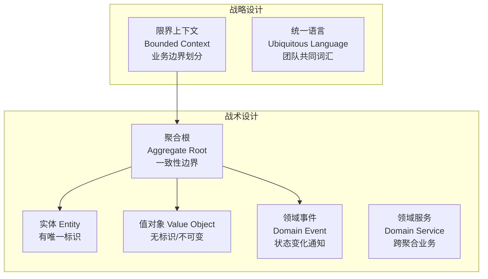

# DDD 领域驱动设计

---

## 为什么需要 DDD？

**问题根源**：传统三层架构（Controller → Service → DAO）中，业务逻辑全部堆在 Service 层，Entity 只有 getter/setter，这就是**贫血模型**。

```java
// ❌ 贫血模型：Order 只是数据容器，业务逻辑在 Service
public class Order {
    private Long id;
    private String status;
    // 只有 getter/setter，没有业务行为
}

public class OrderService {
    public void cancelOrder(Long orderId) {
        Order order = orderRepository.findById(orderId);
        if (!"PAID".equals(order.getStatus())) {
            throw new BusinessException("只有已支付订单才能取消");
        }
        order.setStatus("CANCELLED");
        // 业务逻辑全在 Service，Order 是贫血的
    }
}

// ✅ 充血模型：业务逻辑在领域对象内
public class Order {
    private Long id;
    private OrderStatus status;

    // 业务行为封装在领域对象中
    public void cancel() {
        if (this.status != OrderStatus.PAID) {
            throw new DomainException("只有已支付订单才能取消");
        }
        this.status = OrderStatus.CANCELLED;
        DomainEvents.raise(new OrderCancelledEvent(this.id));
    }
}
```

> **为什么充血模型更好**：业务逻辑内聚在领域对象中，修改取消逻辑只需改 `Order.cancel()`，不需要在多个 Service 中查找。同时，领域对象可以保证自身状态的合法性（不需要外部校验）。

---

## DDD 核心概念



| 概念 | 说明 | 示例 | 为什么这样设计 |
|------|------|------|-------------|
| **聚合根** | 聚合的入口，保证聚合内数据一致性 | Order（包含 OrderItem） | 外部只能通过聚合根修改聚合内数据，保证一致性 |
| **实体** | 有唯一标识，生命周期内状态可变 | User（有 userId） | 通过 ID 区分不同实体，即使属性相同也是不同对象 |
| **值对象** | 无标识，不可变，通过属性值判断相等 | Money（金额+币种）、Address | 不可变对象天然线程安全，可以安全共享 |
| **领域事件** | 领域内发生的重要业务事件 | OrderPlacedEvent | 解耦聚合间的依赖，通过事件通知而非直接调用 |
| **限界上下文** | 业务边界，同一概念在不同上下文含义不同 | "商品"在商品域 vs 订单域含义不同 | 防止概念污染，每个上下文有自己的模型 |

---

## 常见问题

**Q：贫血模型和充血模型哪个更好？**
> 充血模型更符合 OOP 思想，业务逻辑内聚在领域对象中，更易维护。但贫血模型更简单，适合 CRUD 为主的简单业务。**复杂业务用充血模型，简单 CRUD 用贫血模型**。