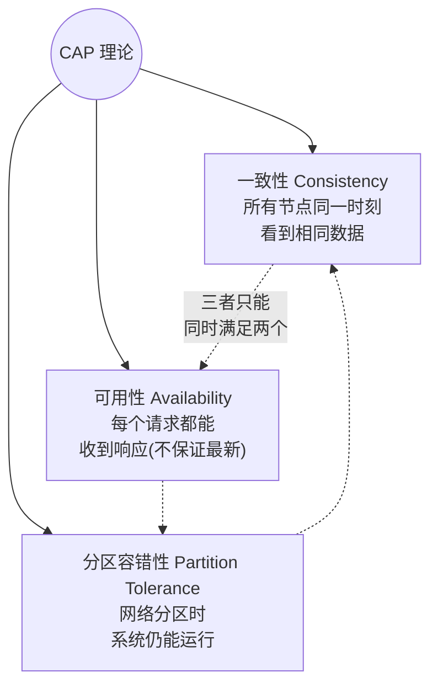
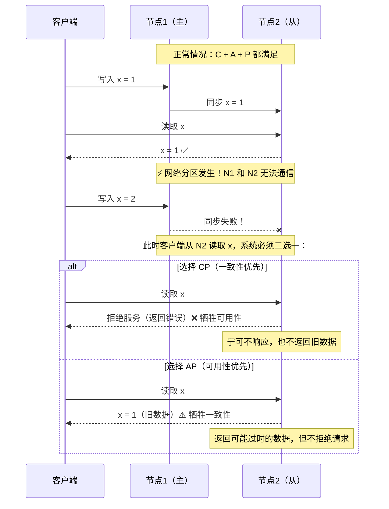
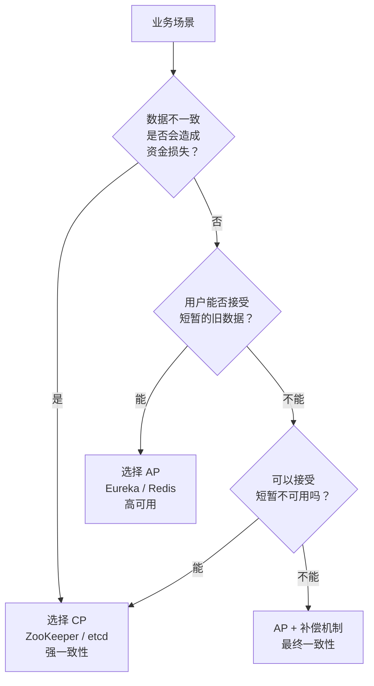
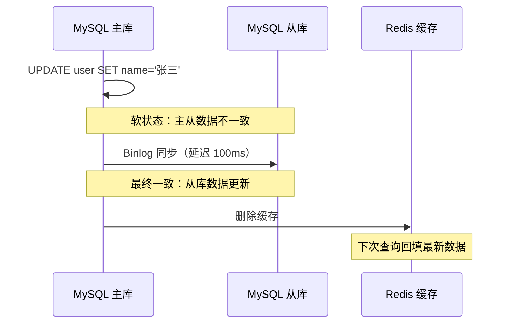
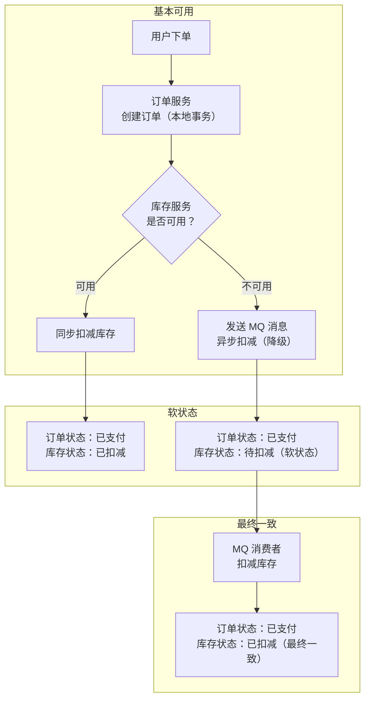

# CAP 理论与 BASE 理论

> **核心问题**：分布式系统为什么不能同时满足一致性、可用性和分区容错性？工程实践中如何在 C 和 A 之间做取舍？BASE 理论如何指导系统设计？

---

## 类比：分布式系统的"不可能三角"

就像"便宜、好、快"三者只能选两个，分布式系统中"一致性、可用性、分区容错性"也只能同时满足两个。

---

# 一、CAP 三要素



### 三要素详解

| 要素 | 含义 | 通俗理解 | 衡量标准 |
|------|------|---------|---------|
| **一致性（C）** | 所有节点在同一时刻看到相同的数据 | 你在 ATM-A 存了 100 元，立刻在 ATM-B 能查到 | 线性一致性（Linearizability） |
| **可用性（A）** | 每个请求都能在合理时间内收到非错误响应 | 系统不会返回超时或错误，但数据可能不是最新的 | 每个请求都有响应 |
| **分区容错性（P）** | 网络分区（节点间通信中断）时系统仍能运行 | 机房之间网络断了，系统还能工作 | 网络故障时系统不停机 |

---

# 二、为什么 CAP 不可兼得？

**分布式系统中，网络分区（P）是必然发生的**（网络不可靠），因此实际上只能在 **C 和 A 之间做取舍**。

### 用一个例子说明



> **为什么 P 不可放弃**：分布式系统中，网络分区是客观存在的（网络抖动、机器宕机、光纤被挖断），无法避免。因此 P 是前提，只能在 C 和 A 之间权衡。单机系统没有网络分区问题，所以可以同时满足 CA。

---

# 三、CP vs AP：如何选择？

## 3.1 常见系统的 CAP 选择

| 系统 | 类型 | 原因 | 适用场景 |
|------|------|------|---------|
| **MySQL（单机）** | CA | 单机无网络分区问题 | 单机 OLTP |
| **MySQL（主从）** | CP | 主库宕机时从库不提供写服务 | 需要强一致性的业务 |
| **ZooKeeper** | CP | Leader 选举期间不可用，但数据强一致 | 配置中心、分布式锁 |
| **etcd** | CP | Raft 协议保证强一致，少数节点故障时可能不可用 | K8s 元数据存储 |
| **Redis Cluster** | AP | 主节点宕机时副本可能数据不一致，但仍可用 | 缓存、会话存储 |
| **Eureka** | AP | 节点间同步失败时仍提供服务发现 | 服务注册发现 |
| **Nacos** | CP/AP 可配置 | 注册中心用 AP，配置中心用 CP | 微服务基础设施 |
| **Elasticsearch** | AP | 优先可用性，允许短暂不一致 | 搜索、日志分析 |
| **Cassandra** | AP（可调） | 默认最终一致，可配置一致性级别 | 大规模写入场景 |
| **MongoDB** | CP（默认） | 默认读写主节点，主节点故障时选举期间不可用 | 文档存储 |

## 3.2 选型决策指南



| 业务场景 | 推荐选型 | 原因 |
|---------|---------|------|
| **金融转账** | CP | 数据不一致会导致资金损失 |
| **分布式锁** | CP | 锁不一致会导致并发问题 |
| **配置中心** | CP | 配置不一致会导致系统行为异常 |
| **服务注册发现** | AP | 短暂的服务列表不一致可以容忍 |
| **缓存** | AP | 缓存不一致可以通过过期策略解决 |
| **搜索引擎** | AP | 搜索结果短暂不一致用户无感知 |
| **电商下单** | AP + 补偿 | 优先可用（用户能下单），通过消息队列保证最终一致 |

---

# 四、一致性模型

CAP 中的"一致性"只是最严格的线性一致性，实际工程中有多种一致性级别可选。

| 一致性级别 | 含义 | 延迟 | 示例 |
|-----------|------|------|------|
| **强一致性（线性一致性）** | 写入后立即可读到最新值 | 高 | ZooKeeper、etcd |
| **顺序一致性** | 所有节点看到的操作顺序一致 | 中 | 分布式锁 |
| **因果一致性** | 有因果关系的操作顺序一致 | 中 | 社交网络（先发帖再评论） |
| **最终一致性** | 一段时间后所有节点数据一致 | 低 | DNS、Redis 主从 |
| **读己之写** | 自己写的数据自己能立即读到 | 低 | 用户修改个人信息后刷新页面 |

```
强一致性 ← 一致性越强，延迟越高，可用性越低 → 最终一致性
```

> **工程建议**：大多数业务场景不需要强一致性，**最终一致性 + 读己之写**就能满足 90% 的需求。只有金融、库存等场景才需要强一致性。

---

# 五、BASE 理论（CAP 的工程实践）

> **BASE**：**B**asically **A**vailable（基本可用）+ **S**oft State（软状态）+ **E**ventually Consistent（最终一致性）

BASE 是对 CAP 中 AP 方案的工程化总结，核心思想是：**不追求强一致性，允许数据在一段时间内不一致，但最终会达到一致状态**。

## 5.1 三要素详解

### 基本可用（Basically Available）

系统出现故障时，允许损失部分功能，但核心功能仍然可用。

| 场景 | 正常情况 | 基本可用（降级） |
|------|---------|---------------|
| 电商搜索 | 返回精确结果 + 个性化推荐 | 返回基础搜索结果，关闭推荐 |
| 秒杀 | 所有用户都能访问 | 部分用户被引导到排队页面 |
| 支付 | 实时到账 | 显示"处理中"，异步到账 |

### 软状态（Soft State）

允许系统中的数据存在中间状态（不同节点的数据副本之间可以有延迟）。

```
硬状态：数据要么是 A，要么是 B，没有中间状态
软状态：数据可以处于"同步中"的中间状态

示例：
- 订单状态：已支付 → 同步中（软状态）→ 已发货
- MySQL 主从：主库写入 → 同步延迟（软状态）→ 从库更新
```

### 最终一致性（Eventually Consistent）

经过一段时间后，所有节点的数据最终会达到一致状态。



## 5.2 最终一致性的实现模式

| 模式 | 原理 | 适用场景 | 示例 |
|------|------|---------|------|
| **读时修复** | 读取时发现不一致，触发修复 | 读多写少 | Cassandra Read Repair |
| **写时修复** | 写入时同步修复其他副本 | 写入时可接受额外延迟 | Dynamo Hinted Handoff |
| **异步修复** | 后台定时任务对比修复 | 对实时性要求不高 | 反熵（Anti-Entropy）协议 |
| **消息队列** | 通过 MQ 异步同步数据 | 跨服务数据同步 | 订单 → MQ → 库存扣减 |
| **Binlog 订阅** | 订阅数据库变更日志 | DB 与缓存/ES 同步 | Canal 监听 MySQL Binlog |

## 5.3 工程实践案例

### 案例：电商下单流程中的 BASE



---

# 六、CAP 的常见误解

| 误解 | 真相 |
|------|------|
| CAP 只能三选二 | 更准确地说：P 是前提，在 C 和 A 之间做取舍。而且不是全局二选一，可以针对不同操作做不同选择 |
| CP 系统完全不可用 | CP 系统在网络分区时**部分不可用**，分区恢复后立即可用。正常情况下 C、A、P 都满足 |
| AP 系统数据永远不一致 | AP 系统在网络分区时**暂时不一致**，分区恢复后数据会同步到一致状态（最终一致性） |
| 单机系统不需要考虑 CAP | 单机系统没有 P 的问题，可以同时满足 CA。但单机系统有单点故障风险 |
| CAP 是精确的数学定理 | CAP 更像是一个指导原则，实际系统中 C 和 A 都有程度之分，不是非黑即白 |

---

# 七、常见问题

**Q：CAP 理论中，为什么 P 不可放弃？**

> 分布式系统中，网络分区是客观存在的（网络抖动、机器宕机、光纤被挖断），无法避免。因此 P 是前提，只能在 C 和 A 之间权衡。如果放弃 P，那就是单机系统，不是分布式系统。

**Q：CAP 选型常见错误？**

> ① 强一致性场景（如金融转账）选了 AP 系统，导致数据不一致造成资金损失；② 高可用场景（如服务注册发现）选了 CP 系统，导致 Leader 选举期间服务不可用；③ 不区分场景，全部用 CP 或全部用 AP，正确做法是根据不同业务场景选择不同策略。

**Q：最终一致性的"最终"是多久？**

> 取决于具体实现。MySQL 主从同步通常是毫秒到秒级；消息队列异步处理通常是秒级；DNS 传播可能是分钟到小时级。关键是业务能否接受这个延迟窗口。

**Q：如何在代码中实现最终一致性？**

> 最常用的模式是**本地消息表 + 消息队列**：① 业务操作和消息写入在同一个本地事务中；② 后台任务扫描消息表，发送到 MQ；③ 消费者处理消息，实现跨服务数据同步。这样即使 MQ 暂时不可用，消息也不会丢失。

**Q：Nacos 为什么同时支持 CP 和 AP？**

> Nacos 针对不同场景使用不同协议：注册中心使用 AP 模式（Distro 协议），因为服务发现需要高可用，短暂的服务列表不一致可以容忍；配置中心使用 CP 模式（Raft 协议），因为配置不一致会导致系统行为异常。这是"按场景选择"的最佳实践。
