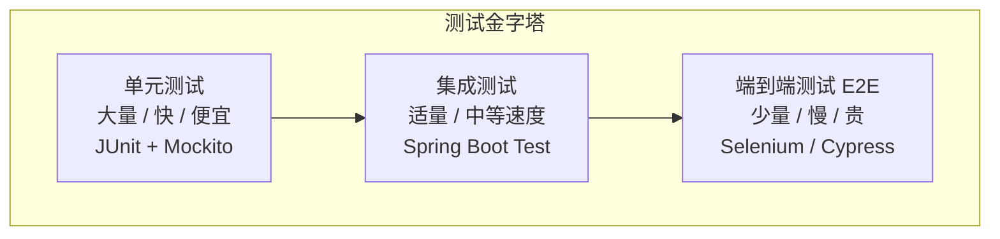

# 代码质量与重构

---

## 常见代码坏味道

| 坏味道 | 描述 | 重构手法 | 为什么是坏味道 |
|--------|------|---------|-------------|
| **Long Method** | 方法超过 20 行，做了太多事 | 提取方法（Extract Method） | 难以理解、测试和复用 |
| **God Class** | 一个类几千行，承担所有职责 | 提取类（Extract Class） | 违反 SRP，修改影响面大 |
| **Magic Number** | 代码中出现无意义的数字/字符串 | 提取常量（Extract Constant） | 含义不明，修改时容易遗漏 |
| **Duplicate Code** | 相同代码出现在多处 | 提取方法/父类 | 修改时需要同步多处，容易遗漏 |
| **Long Parameter List** | 方法参数超过 4 个 | 引入参数对象 | 调用方难以记住参数顺序 |
| **Feature Envy** | 方法大量使用其他类的数据 | 移动方法（Move Method） | 方法应该在它使用数据最多的类中 |
| **Shotgun Surgery** | 一个变更需要修改多个类 | 移动方法/字段，合并相关类 | 违反高内聚原则 |

---

## 重构示例：消除 Magic Number

```java
// ❌ Magic Number
public double calculateDiscount(int userLevel, double price) {
    if (userLevel == 1) return price * 0.9;      // 1 是什么？0.9 是什么？
    if (userLevel == 2) return price * 0.8;
    if (userLevel == 3) return price * 0.7;
    return price;
}

// ✅ 提取常量 + 策略模式
public enum UserLevel {
    SILVER(1, 0.9),
    GOLD(2, 0.8),
    PLATINUM(3, 0.7);

    private final int code;
    private final double discountRate;

    public double applyDiscount(double price) {
        return price * discountRate;
    }
}
// 好处：新增会员等级只需加枚举值，不需要修改 calculateDiscount 方法（开闭原则）
```

---

## 测试金字塔



| 测试类型 | 数量比例 | 速度 | 成本 | 覆盖范围 |
|---------|---------|------|------|---------|
| **单元测试** | 70% | 毫秒级 | 低 | 单个方法/类 |
| **集成测试** | 20% | 秒级 | 中 | 多个组件协作 |
| **E2E 测试** | 10% | 分钟级 | 高 | 完整业务流程 |

> **为什么单元测试占比最高**：单元测试运行快（毫秒级），反馈及时；成本低，可以大量编写；覆盖边界条件和异常情况。E2E 测试成本高，只覆盖核心流程。

---

## 面试高频问题

**Q：如何识别代码需要重构？**
> 出现以下信号时重构：方法超过 20 行、类超过 200 行、if-else 超过 3 层嵌套、相同代码出现 3 次以上、修改一处需要改多个文件。

**Q：只写 E2E 测试有什么问题？**
> E2E 测试慢且脆弱，无法快速反馈。应遵循测试金字塔，以单元测试为主，集成测试为辅，E2E 测试只覆盖核心流程。