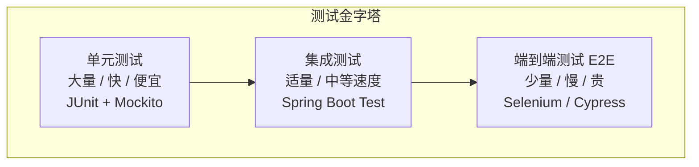
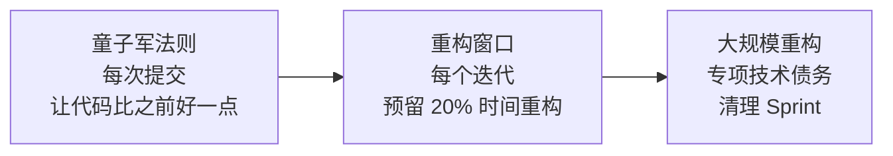

# 代码质量与重构

> **核心问题**：如何识别代码中的坏味道？常见的重构手法有哪些？如何通过 SOLID 原则和测试金字塔保证代码质量？

---

## 它解决了什么问题？

代码质量不是锦上添花，而是**降低长期维护成本**的核心手段。烂代码的代价是指数级增长的：

```
第 1 个月：写得快，跑得通
第 3 个月：改一个 bug 引入两个新 bug
第 6 个月：没人敢改，只能绕着走
第 12 个月：推倒重写（然后重复以上循环）
```

---

# 一、SOLID 原则

SOLID 是面向对象设计的五大基本原则，是写出可维护代码的基石。

| 原则 | 全称 | 一句话总结 | 违反后果 |
|------|------|-----------|---------|
| **S** | 单一职责原则（SRP） | 一个类只做一件事 | 类膨胀，改一处影响多处 |
| **O** | 开闭原则（OCP） | 对扩展开放，对修改关闭 | 每次新增功能都要改旧代码 |
| **L** | 里氏替换原则（LSP） | 子类可以替换父类 | 继承体系混乱，多态失效 |
| **I** | 接口隔离原则（ISP） | 接口要小而专 | 实现类被迫实现不需要的方法 |
| **D** | 依赖倒置原则（DIP） | 依赖抽象，不依赖具体 | 高层模块被底层实现绑定 |

### SRP 示例

```java
// ❌ 违反 SRP：UserService 做了太多事
public class UserService {
    public User register(String name, String email) { /* 注册逻辑 */ }
    public void sendWelcomeEmail(User user) { /* 发邮件 */ }
    public String exportUserReport() { /* 导出报表 */ }
    public void syncToES(User user) { /* 同步到 ES */ }
}

// ✅ 遵循 SRP：每个类只负责一件事
public class UserService { /* 只负责用户核心业务 */ }
public class EmailService { /* 只负责邮件发送 */ }
public class UserReportService { /* 只负责报表导出 */ }
public class UserSyncService { /* 只负责数据同步 */ }
```

### OCP 示例

```java
// ❌ 违反 OCP：每新增一种折扣都要改这个方法
public double calculateDiscount(String type, double price) {
    if ("VIP".equals(type)) return price * 0.8;
    if ("SVIP".equals(type)) return price * 0.7;
    if ("NEW_USER".equals(type)) return price * 0.9;
    // 每次新增折扣类型都要改这里...
    return price;
}

// ✅ 遵循 OCP：新增折扣只需加一个实现类
public interface DiscountStrategy {
    double apply(double price);
}

public class VipDiscount implements DiscountStrategy {
    public double apply(double price) { return price * 0.8; }
}
// 新增折扣类型：只需新增一个类，不修改已有代码
```

### DIP 示例

```java
// ❌ 违反 DIP：高层直接依赖底层实现
public class OrderService {
    private MySQLOrderDao dao = new MySQLOrderDao(); // 绑定了 MySQL
}

// ✅ 遵循 DIP：依赖抽象接口
public class OrderService {
    private final OrderRepository repository; // 依赖接口

    public OrderService(OrderRepository repository) {
        this.repository = repository; // 注入实现，可以是 MySQL、MongoDB、内存
    }
}
```

---

# 二、常见代码坏味道与重构手法

## 2.1 坏味道速查表

| 坏味道 | 描述 | 重构手法 | 为什么是坏味道 |
|--------|------|---------|-------------|
| **Long Method** | 方法超过 20 行，做了太多事 | 提取方法（Extract Method） | 难以理解、测试和复用 |
| **God Class** | 一个类几千行，承担所有职责 | 提取类（Extract Class） | 违反 SRP，修改影响面大 |
| **Magic Number** | 代码中出现无意义的数字/字符串 | 提取常量（Extract Constant） | 含义不明，修改时容易遗漏 |
| **Duplicate Code** | 相同代码出现在多处 | 提取方法/父类 | 修改时需要同步多处，容易遗漏 |
| **Long Parameter List** | 方法参数超过 4 个 | 引入参数对象 | 调用方难以记住参数顺序 |
| **Feature Envy** | 方法大量使用其他类的数据 | 移动方法（Move Method） | 方法应该在它使用数据最多的类中 |
| **Shotgun Surgery** | 一个变更需要修改多个类 | 移动方法/字段，合并相关类 | 违反高内聚原则 |
| **Primitive Obsession** | 用基本类型表示领域概念 | 引入值对象 | 缺少类型安全和业务约束 |
| **Switch/If-Else 链** | 大量 if-else 或 switch 判断 | 策略模式 / 多态替换 | 每次新增分支都要改旧代码 |
| **过深嵌套** | if 嵌套超过 3 层 | 卫语句（Guard Clause）提前返回 | 难以理解执行路径 |

## 2.2 重构示例：消除 Magic Number

```java
// ❌ Magic Number
public double calculateDiscount(int userLevel, double price) {
    if (userLevel == 1) return price * 0.9;      // 1 是什么？0.9 是什么？
    if (userLevel == 2) return price * 0.8;
    if (userLevel == 3) return price * 0.7;
    return price;
}

// ✅ 提取常量 + 策略模式
public enum UserLevel {
    SILVER(1, 0.9),
    GOLD(2, 0.8),
    PLATINUM(3, 0.7);

    private final int code;
    private final double discountRate;

    public double applyDiscount(double price) {
        return price * discountRate;
    }
}
// 好处：新增会员等级只需加枚举值，不需要修改 calculateDiscount 方法（开闭原则）
```

## 2.3 重构示例：消除过深嵌套

```java
// ❌ 嵌套过深，难以理解
public void processOrder(Order order) {
    if (order != null) {
        if (order.getStatus() == OrderStatus.PAID) {
            if (order.getItems() != null && !order.getItems().isEmpty()) {
                for (OrderItem item : order.getItems()) {
                    if (item.getStock() > 0) {
                        // 真正的业务逻辑埋在第 4 层嵌套中...
                        deductStock(item);
                    }
                }
            }
        }
    }
}

// ✅ 卫语句提前返回，减少嵌套
public void processOrder(Order order) {
    if (order == null) return;
    if (order.getStatus() != OrderStatus.PAID) return;
    if (order.getItems() == null || order.getItems().isEmpty()) return;

    for (OrderItem item : order.getItems()) {
        if (item.getStock() <= 0) continue;
        deductStock(item);
    }
}
```

## 2.4 重构示例：消除 Primitive Obsession

```java
// ❌ 用 String 表示手机号，缺少校验
public void bindPhone(Long userId, String phone) {
    userDao.updatePhone(userId, phone); // phone 可能是任意字符串
}

// ✅ 引入值对象，封装校验逻辑
public final class PhoneNumber {
    private final String value;

    public PhoneNumber(String value) {
        if (!value.matches("^1[3-9]\\d{9}$")) {
            throw new IllegalArgumentException("手机号格式不正确: " + value);
        }
        this.value = value;
    }

    public String getValue() { return value; }
}

public void bindPhone(Long userId, PhoneNumber phone) {
    userDao.updatePhone(userId, phone.getValue()); // 类型安全，一定是合法手机号
}
```

---

# 三、测试金字塔



| 测试类型 | 数量比例 | 速度 | 成本 | 覆盖范围 | 关注点 |
|---------|---------|------|------|---------|--------|
| **单元测试** | 70% | 毫秒级 | 低 | 单个方法/类 | 业务逻辑正确性 |
| **集成测试** | 20% | 秒级 | 中 | 多个组件协作 | 组件间交互、数据库操作 |
| **E2E 测试** | 10% | 分钟级 | 高 | 完整业务流程 | 核心业务链路 |

> **为什么单元测试占比最高**：单元测试运行快（毫秒级），反馈及时；成本低，可以大量编写；覆盖边界条件和异常情况。E2E 测试成本高，只覆盖核心流程。

### 好的单元测试标准（FIRST 原则）

| 原则 | 含义 | 反例 |
|------|------|------|
| **F**ast | 运行快（毫秒级） | 测试中连接真实数据库 |
| **I**ndependent | 测试之间互不依赖 | 测试 B 依赖测试 A 的结果 |
| **R**epeatable | 任何环境下结果一致 | 依赖当前时间或外部服务 |
| **S**elf-validating | 自动判断通过/失败 | 需要人工检查日志 |
| **T**imely | 在写代码时就写测试 | 代码写完几周后补测试 |

### 单元测试示例

```java
// 被测试的方法
public class Order {
    public void cancel() {
        if (this.status != OrderStatus.PAID) {
            throw new DomainException("只有已支付订单才能取消");
        }
        this.status = OrderStatus.CANCELLED;
    }
}

// 单元测试
@Test
void should_cancel_paid_order() {
    Order order = new Order(OrderStatus.PAID);
    order.cancel();
    assertEquals(OrderStatus.CANCELLED, order.getStatus());
}

@Test
void should_throw_when_cancel_unpaid_order() {
    Order order = new Order(OrderStatus.CREATED);
    assertThrows(DomainException.class, () -> order.cancel());
}

@Test
void should_throw_when_cancel_already_cancelled_order() {
    Order order = new Order(OrderStatus.CANCELLED);
    assertThrows(DomainException.class, () -> order.cancel());
}
```

---

# 四、代码审查（Code Review）最佳实践

## 4.1 审查清单

| 维度 | 检查项 | 说明 |
|------|--------|------|
| **正确性** | 逻辑是否正确？边界条件是否处理？ | 空指针、数组越界、并发安全 |
| **可读性** | 命名是否清晰？注释是否必要？ | 好的代码自解释，注释解释"为什么" |
| **设计** | 是否遵循 SOLID？是否有坏味道？ | 类/方法是否过大？职责是否单一？ |
| **性能** | 是否有明显的性能问题？ | N+1 查询、循环中创建对象、大对象 |
| **安全** | 是否有 SQL 注入、XSS 等风险？ | 参数校验、输入过滤 |
| **测试** | 是否有对应的单元测试？ | 核心逻辑必须有测试覆盖 |

## 4.2 好的命名规范

| 类型 | 坏命名 | 好命名 | 原因 |
|------|--------|--------|------|
| 布尔变量 | flag, status | isActive, hasPermission | 布尔变量用 is/has/can 开头 |
| 方法 | process(), handle() | calculateDiscount(), validateOrder() | 方法名应表达具体动作 |
| 类 | Manager, Helper, Utils | OrderValidator, PriceCalculator | 类名应表达具体职责 |
| 常量 | NUM1, MAX | MAX_RETRY_COUNT, DEFAULT_PAGE_SIZE | 常量名应表达业务含义 |

---

# 五、重构的时机与策略

## 5.1 何时重构？

| 信号 | 描述 | 紧急程度 |
|------|------|---------|
| **方法超过 20 行** | 做了太多事，难以理解 | 中 |
| **类超过 200 行** | 职责过多，违反 SRP | 中 |
| **if-else 超过 3 层嵌套** | 逻辑复杂，难以维护 | 高 |
| **相同代码出现 3 次以上** | 违反 DRY 原则 | 高 |
| **修改一处需要改多个文件** | 高耦合，Shotgun Surgery | 高 |
| **新人看不懂代码** | 可读性差 | 中 |
| **加新功能越来越慢** | 技术债务累积 | 紧急 |

## 5.2 重构策略



> **核心原则**：**小步重构，持续改进**。不要等到代码烂到不可维护才重构，而是每次提交都让代码比之前好一点（童子军法则：离开营地时比来时更干净）。

## 5.3 安全重构的保障

| 保障措施 | 说明 |
|---------|------|
| **充分的测试覆盖** | 重构前确保有测试，重构后测试全部通过 |
| **小步提交** | 每次只做一个小的重构，立即提交 |
| **IDE 重构工具** | 使用 IDE 的自动重构功能（Rename、Extract Method 等） |
| **Code Review** | 重构代码也需要 Review |

---

# 六、常见问题

**Q：如何识别代码需要重构？**

> 出现以下信号时重构：方法超过 20 行、类超过 200 行、if-else 超过 3 层嵌套、相同代码出现 3 次以上、修改一处需要改多个文件。最直观的信号是：**加新功能越来越慢**。

**Q：只写 E2E 测试有什么问题？**

> E2E 测试慢且脆弱，无法快速反馈。一个 E2E 测试可能需要几分钟，而单元测试只需几毫秒。应遵循测试金字塔，以单元测试为主（70%），集成测试为辅（20%），E2E 测试只覆盖核心流程（10%）。

**Q：SOLID 原则中最重要的是哪个？**

> **单一职责原则（SRP）**。如果每个类只做一件事，代码自然就容易理解、测试和修改。其他原则（OCP、DIP 等）在很大程度上是 SRP 的延伸。

**Q：重构和重写有什么区别？**

> 重构是在**不改变外部行为**的前提下改善代码内部结构，是渐进式的、安全的（有测试保障）。重写是推倒重来，风险极高，通常意味着之前的代码已经烂到无法重构。**优先选择重构，避免走到需要重写的地步**。

**Q：如何说服团队重视代码质量？**

> 用数据说话：① 统计 bug 修复时间的趋势（烂代码会导致修复时间越来越长）；② 统计新功能开发速度的趋势（技术债务会拖慢开发速度）；③ 统计线上事故与代码质量的关联。让团队看到代码质量对**交付速度**的直接影响。

**Q：注释越多越好吗？**

> 不是。好的代码应该**自解释**（通过清晰的命名和合理的结构）。注释应该解释**"为什么"**（业务背景、设计决策），而不是**"做了什么"**（代码本身已经表达了）。过多的注释反而是代码不够清晰的信号。
