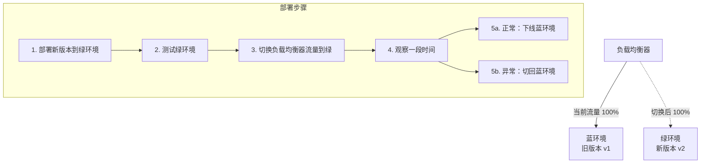
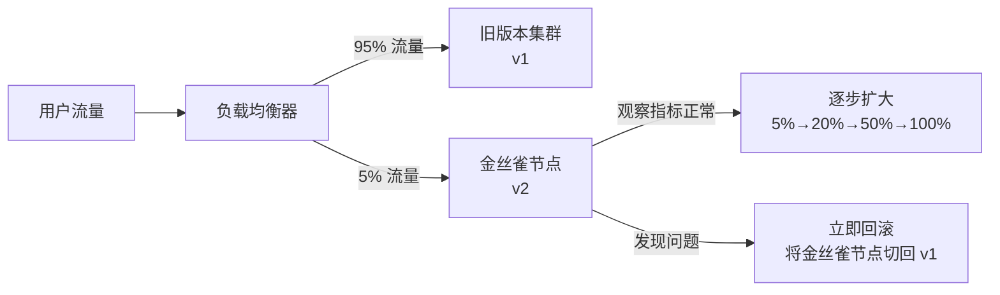
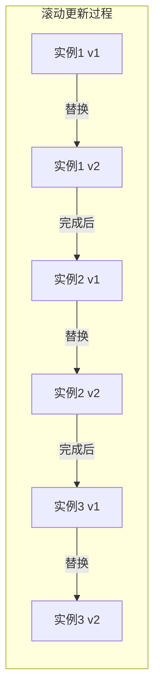

# CI/CD 持续集成与持续交付

---

## 一、为什么需要 CI/CD？

### 没有 CI/CD 的痛点

| 问题 | 具体表现 |
|------|---------|
| **集成地狱** | 多人开发，代码合并时大量冲突，"最后一天合代码"噩梦 |
| **手动部署不可靠** | 人工执行命令，步骤遗漏、环境差异导致线上故障 |
| **发布周期长** | 测试→修复→测试循环，一个版本发布需要数周 |
| **回滚困难** | 出问题不知道回滚到哪个版本，回滚步骤复杂 |
| **环境不一致** | "在我机器上能跑"，开发/测试/生产环境差异导致 bug |

### CI/CD 解决的核心问题


---

## 二、CI/CD 流水线全流程


### 各阶段说明

| 阶段 | 工具 | 目的 |
|------|------|------|
| 代码托管 | GitLab / GitHub | 版本管理，触发流水线 |
| 编译构建 | Maven / Gradle | 验证代码可编译 |
| 单元测试 | JUnit / Mockito | 验证核心逻辑正确性 |
| 代码扫描 | SonarQube | 检测代码质量、安全漏洞 |
| 镜像构建 | Docker | 打包为可部署的镜像 |
| 镜像仓库 | Harbor / ECR | 存储和管理镜像版本 |
| 部署编排 | Kubernetes / Helm | 自动化部署到集群 |
| 监控告警 | Prometheus + Grafana | 实时监控，异常告警 |

---

## 三、常见部署策略

### 3.1 蓝绿部署（Blue-Green Deployment）



| 维度 | 说明 |
|------|------|
| **优点** | 回滚极快（秒级切换），零停机发布 |
| **缺点** | 资源成本翻倍，需要维护两套环境 |
| **适用场景** | 对回滚速度要求极高的核心系统 |

---

### 3.2 金丝雀发布（Canary Release）



| 维度 | 说明 |
|------|------|
| **优点** | 风险可控，真实流量验证，问题影响范围小 |
| **缺点** | 需要流量控制能力，新旧版本共存期间需兼容 |
| **适用场景** | 大型系统，功能变更影响面广，需要灰度验证 |

---

### 3.3 滚动更新（Rolling Update）



| 维度 | 说明 |
|------|------|
| **优点** | 资源利用率高，无需额外环境 |
| **缺点** | 回滚慢，更新期间新旧版本共存，需要接口向后兼容 |
| **适用场景** | 资源有限，可接受短暂新旧版本共存 |
| **Kubernetes 支持** | `kubectl rollout` 原生支持，`maxSurge` 和 `maxUnavailable` 控制节奏 |

---

### 三种策略对比

| 策略 | 资源成本 | 回滚速度 | 风险控制 | 复杂度 |
|------|---------|---------|---------|-------|
| 蓝绿部署 | 高（2倍） | ⭐⭐⭐⭐⭐ 秒级 | 中（全量切换） | 低 |
| 金丝雀发布 | 低 | ⭐⭐⭐ 需要操作 | 高（小流量验证） | 高 |
| 滚动更新 | 低 | ⭐⭐ 较慢 | 低（全量替换） | 中 |

---

## 四、Dockerfile 与镜像构建最佳实践

```dockerfile
# 多阶段构建：减小最终镜像体积
# 第一阶段：构建
FROM maven:3.9-openjdk-17 AS builder
WORKDIR /app
COPY pom.xml .
# 先复制 pom.xml 并下载依赖（利用 Docker 层缓存）
RUN mvn dependency:go-offline
COPY src ./src
RUN mvn package -DskipTests

# 第二阶段：运行（只包含 JRE，不包含 Maven 和源码）
FROM openjdk:17-jre-slim
WORKDIR /app
COPY --from=builder /app/target/*.jar app.jar
EXPOSE 8080
ENTRYPOINT ["java", "-jar", "app.jar"]
```

**最佳实践**：
- 使用**多阶段构建**，最终镜像只包含运行时依赖
- 将**不常变化的层**（依赖）放在前面，利用 Docker 层缓存加速构建
- 不要在镜像中存储敏感信息（密码、密钥），通过环境变量或 Secret 注入

---

## 五、常见问题

**Q1：CI 和 CD 的区别是什么？**

> - **CI（持续集成）**：开发者频繁提交代码，自动触发构建和测试，快速发现集成问题。目标是"代码随时可构建"。
> - **CD（持续交付）**：在 CI 基础上，自动部署到测试环境，人工审批后部署到生产。目标是"代码随时可发布"。
> - **CD（持续部署）**：更进一步，通过所有测试后自动部署到生产，无需人工干预。

**Q2：蓝绿部署和金丝雀发布如何选择？**

> - 对**回滚速度**要求极高（核心支付、交易系统）→ 蓝绿部署
> - 需要**真实流量验证**、风险控制（大型电商、社交平台）→ 金丝雀发布
> - **资源有限**、变更风险低 → 滚动更新

**Q3：如何保证生产环境和测试环境的一致性？**

> 使用 **Docker 镜像**：同一个镜像在测试和生产环境运行，消除环境差异。配合 **Kubernetes** 的 ConfigMap 和 Secret 管理环境差异配置，而不是修改镜像。

**Q4：流水线中哪个阶段最容易出问题？**

> 实践中最常见的问题：
> 1. **测试覆盖率不足**：单元测试只覆盖 happy path，边界情况漏测
> 2. **环境配置差异**：测试环境数据库版本、配置与生产不一致
> 3. **数据库变更未纳入流水线**：代码部署了但 DDL 没执行，导致启动失败

---

> **复习检验标准**：能否画出 CI/CD 流水线的完整流程？能否说出三种部署策略的适用场景？能否解释蓝绿部署的回滚原理？