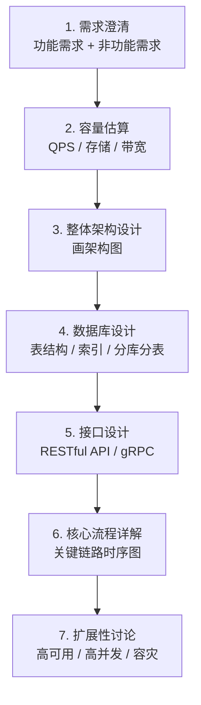
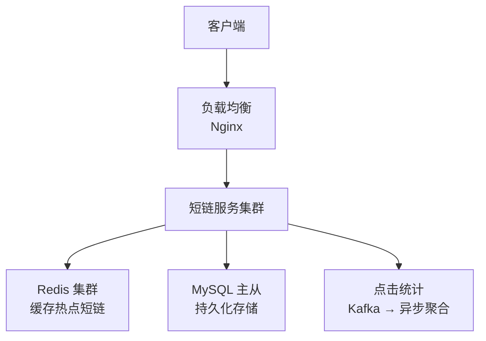
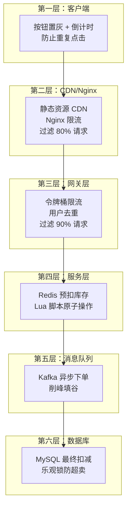
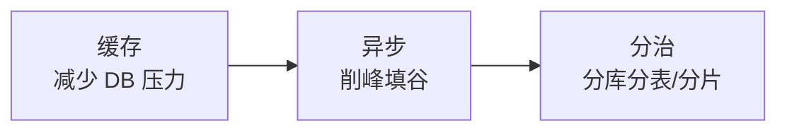

# 系统设计方法论

> **核心问题**：面对"设计一个 XXX 系统"的问题，如何系统化地思考和回答？有哪些经典的系统设计案例可以参考？

---

## 它解决了什么问题？

系统设计不是凭感觉画架构图，而是有一套结构化的方法论。掌握这套方法论，你可以：

- 面对任何系统设计问题，都有清晰的分析框架
- 从需求出发，逐步推导出合理的架构方案
- 在关键决策点上做出有理有据的技术选型

---

# 一、系统设计答题框架

## 1.1 标准流程



## 1.2 各步骤要点

| 步骤 | 关键动作 | 常见陷阱 |
|------|---------|---------|
| **需求澄清** | 明确核心功能、用户规模、性能要求 | 没有澄清就开始设计，方向跑偏 |
| **容量估算** | 估算 QPS、存储量、带宽，确定量级 | 忽略峰值流量，只按平均值设计 |
| **架构设计** | 画出核心组件和数据流向 | 一上来就画细节，缺少全局视角 |
| **数据库设计** | 确定表结构、索引、读写分离策略 | 不考虑数据量增长，缺少分库分表方案 |
| **接口设计** | 定义核心 API，明确输入输出 | 接口粒度不合理，过粗或过细 |
| **核心流程** | 用时序图描述关键链路 | 只画正常流程，忽略异常处理 |
| **扩展性** | 讨论高可用、高并发、容灾方案 | 过度设计，引入不必要的复杂度 |

## 1.3 容量估算速查

```
日活用户 (DAU) → 每日请求量 → QPS → 峰值 QPS

常用换算：
- 1 天 ≈ 86400 秒 ≈ 10^5 秒（方便估算）
- 峰值 QPS ≈ 平均 QPS × 2~5 倍
- 1 亿次/天 → 平均 QPS ≈ 1000，峰值 ≈ 3000~5000

存储估算：
- 每条数据大小 × 每日新增量 × 保留天数
- 1KB × 1亿/天 × 365天 ≈ 36TB/年

带宽估算：
- QPS × 每次响应大小
- 3000 QPS × 10KB = 30MB/s ≈ 240Mbps
```

---

# 二、经典系统设计案例

## 案例一：短链接系统（TinyURL）

### 需求澄清

- **功能需求**：长链转短链、短链跳转原链接、统计点击量
- **非功能需求**：低延迟（< 50ms）、高可用（99.99%）、短链不可预测

### 容量估算

```
写入：每天 100 万条新短链 → 写 QPS ≈ 12
读取：每天 1 亿次跳转 → 读 QPS ≈ 1200，峰值 ≈ 5000
存储：每条 500B × 100万/天 × 365天 × 5年 ≈ 900GB
```

### 架构设计



### 核心算法：短码生成

| 方案 | 原理 | 优点 | 缺点 |
|------|------|------|------|
| **哈希截取** | MD5/SHA256 取前 6 位 | 实现简单 | 有碰撞风险，需要检测 |
| **自增 ID + Base62** | 数据库自增 ID 转 Base62 | 无碰撞，有序 | ID 可预测，有安全风险 |
| **分布式 ID + Base62** | Snowflake 生成 ID 转 Base62 | 无碰撞，不可预测 | 短码较长（10-11 位） |
| **预生成 + 随机分配** | 预先生成短码池，用时分配 | 无碰撞，长度可控 | 需要维护短码池 |

**推荐方案**：自增 ID + Base62 编码（62^6 ≈ 560 亿，6 位短码足够），配合随机偏移量防止 ID 可预测。

### 关键优化

- **缓存策略**：热点短链缓存到 Redis，TTL 24h，命中率可达 80%+
- **301 vs 302**：301 永久重定向（浏览器缓存，减少服务端压力）vs 302 临时重定向（每次经过服务端，方便统计）
- **高可用**：MySQL 主从 + Redis 集群 + 多机房部署

---

## 案例二：秒杀系统

### 需求澄清

- **功能需求**：商品秒杀、库存扣减、订单生成
- **非功能需求**：超高并发（10 万+ QPS）、不超卖、不少卖、用户体验流畅
- **核心挑战**：瞬时流量极高，库存是共享资源，需要防止超卖

### 容量估算

```
假设：100 万用户同时抢 1000 件商品
瞬时 QPS：100 万（集中在 1-2 秒内）
实际有效请求：1000（只有 1000 件库存）
核心思路：尽早过滤无效请求，层层削峰
```

### 架构设计：层层削峰



### 核心方案：Redis + Lua 预扣库存

```lua
-- Redis Lua 脚本：原子性扣减库存
local stock = tonumber(redis.call('GET', KEYS[1]))
if stock <= 0 then
    return -1  -- 库存不足
end
redis.call('DECR', KEYS[1])
return stock - 1  -- 返回剩余库存
```

### 防超卖三道防线

| 防线 | 机制 | 说明 |
|------|------|------|
| **第一道** | Redis Lua 原子扣减 | 单线程执行，天然防并发 |
| **第二道** | 消息队列串行化 | 下单请求排队处理 |
| **第三道** | MySQL 乐观锁 | `UPDATE SET stock = stock - 1 WHERE stock > 0` |

---

## 案例三：分布式 ID 生成器

### 需求澄清

- **功能需求**：生成全局唯一 ID，支持多机房多实例
- **非功能需求**：高性能（> 10 万/秒）、趋势递增（方便数据库索引）、高可用

### 常见方案对比

| 方案 | 原理 | 优点 | 缺点 | 适用场景 |
|------|------|------|------|---------|
| **UUID** | 128 位随机数 | 本地生成，无依赖 | 无序，索引性能差，太长 | 非数据库主键场景 |
| **数据库自增** | AUTO_INCREMENT | 简单，有序 | 单点瓶颈，性能有限 | 低并发场景 |
| **号段模式** | 批量获取 ID 段，本地分配 | 高性能，DB 压力小 | 重启可能浪费号段 | 中高并发，如美团 Leaf |
| **Snowflake** | 时间戳 + 机器 ID + 序列号 | 高性能，趋势递增 | 依赖时钟，时钟回拨有风险 | 高并发分布式系统 |
| **Redis INCR** | Redis 原子自增 | 简单，高性能 | 依赖 Redis，持久化风险 | 中等并发场景 |

### Snowflake 算法详解

```
0 | 0000000000 0000000000 0000000000 0000000000 0 | 00000 | 00000 | 000000000000
│   │                                              │       │       │
│   └── 41位时间戳（毫秒级，可用69年）               │       │       │
│                                                   │       │       └── 12位序列号（每毫秒4096个）
│                                                   │       └── 5位机器ID（32台）
│                                                   └── 5位数据中心ID（32个）
└── 1位符号位（固定为0）
```

**时钟回拨问题解决方案**：

1. **等待追上**：检测到回拨时，等待时钟追上上次时间戳
2. **备用机器 ID**：切换到备用机器 ID 继续生成
3. **扩展位**：预留几位作为时钟回拨序列

---

# 三、系统设计通用模式

## 3.1 高并发三板斧



| 模式 | 手段 | 适用场景 |
|------|------|---------|
| **缓存** | Redis、本地缓存、CDN | 读多写少，热点数据 |
| **异步** | 消息队列、异步线程池 | 非核心链路，允许延迟 |
| **分治** | 分库分表、ES 分片、Redis 集群 | 单机容量/性能不足 |

## 3.2 高可用核心策略

| 策略 | 说明 | 示例 |
|------|------|------|
| **冗余** | 多副本，消除单点 | MySQL 主从、Redis 集群 |
| **熔断** | 下游故障时快速失败 | Sentinel、Hystrix |
| **降级** | 非核心功能关闭，保核心 | 秒杀时关闭推荐功能 |
| **限流** | 控制请求速率 | 令牌桶、滑动窗口 |
| **超时重试** | 设置合理超时，失败重试 | 重试需要幂等保证 |

## 3.3 数据一致性方案

| 方案 | 一致性级别 | 复杂度 | 适用场景 |
|------|-----------|--------|---------|
| **本地事务** | 强一致 | 低 | 单库操作 |
| **2PC/XA** | 强一致 | 高 | 跨库但对一致性要求极高 |
| **TCC** | 最终一致 | 高 | 资金类业务 |
| **Saga** | 最终一致 | 中 | 长事务，多步骤流程 |
| **消息队列** | 最终一致 | 低 | 异步场景，允许短暂不一致 |
| **本地消息表** | 最终一致 | 中 | 可靠消息投递 |

---

# 四、工作中常见错误与避坑指南

| 场景 | 常见错误 | 正确做法 | 根本原因 |
|------|---------|---------|---------|
| **服务拆分** | 拆分过细，每个接口都跨服务调用 | 按业务域拆分，高内聚低耦合 | 过度拆分导致网络开销和分布式事务问题 |
| **分布式事务** | 用本地事务处理跨服务数据一致性 | 使用 Saga 模式或最终一致性 | 跨服务无法使用数据库事务 |
| **CAP 选型** | 强一致性场景选了 AP 系统 | 根据业务需求选择 CP 或 AP | 不了解 CAP 理论，选型错误 |
| **缓存设计** | 缓存和 DB 双写不一致 | Cache Aside 模式：先更新 DB，再删缓存 | 缓存更新策略不当 |
| **代码设计** | Service 类几千行，违反 SRP | 按职责拆分，使用领域事件解耦 | 缺乏 SOLID 意识，代码越来越难维护 |
| **测试** | 只写 E2E 测试，不写单元测试 | 遵循测试金字塔，单元测试为主 | E2E 测试慢且脆弱，无法快速反馈 |
| **发布** | 手动部署，无回滚方案 | 建立 CI/CD 流水线，蓝绿/金丝雀发布 | 手动操作不可靠，出错无法快速回滚 |
| **容量规划** | 只按平均流量设计 | 按峰值 3-5 倍预留，配合弹性扩缩容 | 峰值流量可能是平均的 10 倍以上 |

---

# 五、常见问题

**Q：系统设计面试中最重要的是什么？**

> 不是给出"完美"的方案，而是展示你的**思考过程**：如何分析需求、如何做取舍、为什么选择这个方案而不是那个。面试官更看重你的思维方式，而不是记住了多少架构图。

**Q：如何估算系统容量？**

> 从日活用户（DAU）出发：DAU → 每日请求量（DAU × 每人每日操作次数）→ 平均 QPS（÷ 86400）→ 峰值 QPS（× 3~5）。存储 = 每条数据大小 × 日增量 × 保留天数。带宽 = QPS × 响应大小。

**Q：秒杀系统如何防止超卖？**

> 三道防线：① Redis Lua 脚本原子扣减库存（第一道）；② 消息队列串行化下单请求（第二道）；③ MySQL 乐观锁 `WHERE stock > 0`（第三道）。核心思路是层层削峰，尽早过滤无效请求。

**Q：分布式 ID 用什么方案？**

> 低并发用数据库自增；中等并发用号段模式（如美团 Leaf）；高并发用 Snowflake 算法。UUID 不适合做数据库主键（无序，索引性能差）。选择时需要考虑：唯一性、有序性、性能、可用性。

**Q：如何保证缓存和数据库的一致性？**

> 推荐 Cache Aside 模式：读时先查缓存，未命中查 DB 并回填缓存；写时先更新 DB，再删除缓存。不要用"先更新缓存再更新 DB"，因为并发场景下会导致数据不一致。对于强一致性要求，可以用延迟双删或订阅 binlog 更新缓存。
