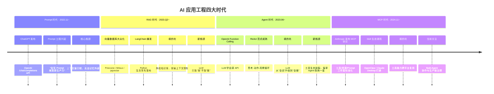
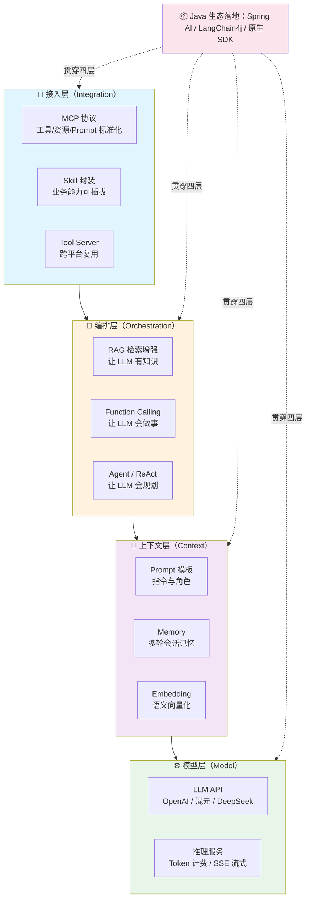
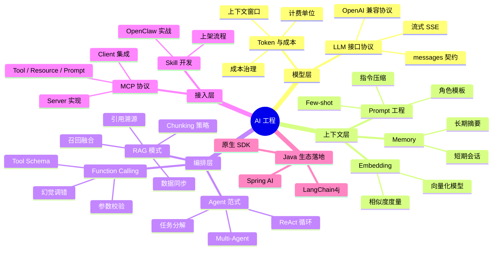
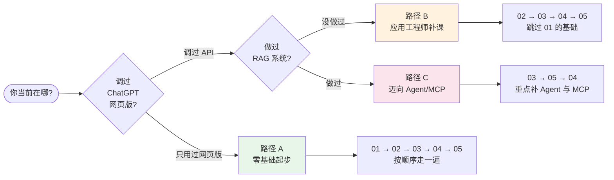

# AI 工程概览 —— Java 工程师视角下的大模型应用地图

---

## 1. 一句话定义：本站说的"AI 工程"到底是什么

> **AI 工程 ≠ 训练模型，≠ 推导算法，≠ 微调参数。**
> **AI 工程 = 把已经训练好的大模型（LLM）的能力，接入到真实业务系统的一门工程学科。**

这套专题的目标读者只有一种画像：

> 📌 **你会写 Spring Boot，但第一次看到 RAG / Agent / MCP / Function Calling 这些词时，知道它们"好像很重要"，又说不清它们之间是什么关系。**

本专题就是为这个画像写的。

!!! note "本专题讲什么、不讲什么"
    **✅ 讲**：LLM 接口协议与 Prompt 设计、RAG 工程落地、Function Calling 与 Agent 范式、Spring AI 接入、MCP 协议与 Skill 开发

    **❌ 不讲**：Transformer 架构原理、注意力机制推导、模型预训练与微调、深度学习框架（PyTorch / TensorFlow）

    **🎯 视角**：**"应用工程师视角"**——把 LLM 当作一个"会说话的远程服务"，重点关注怎么调它、怎么给它加记忆/知识/动作、怎么把它接入 Java 技术栈，而不是它内部是怎么训出来的。

---

## 2. 发展历程：从"调 API"到"Agent 时代"的四次范式跃迁

AI 应用工程从 2022 年底 ChatGPT 发布至今，经历了四次清晰的范式跃迁。**每一次跃迁都解决了前一代的核心瓶颈**，呈现出"挖坑 → 填坑 → 挖新坑"的工程演进规律。

**四个时代的工程师画像对比**：

| 时代 | 时间锚点 | 核心工具 | 工程师每天在做什么 |
| :-- | :-- | :-- | :-- |
| **Prompt** | 2022.11 | OpenAI SDK、Playground | 调 API、反复改 Prompt、控 Token |
| **RAG** | 2023.Q2 | LangChain、Embedding、向量库 | 切文档、做 Embedding、调召回阈值 |
| **Agent** | 2023.06 | Function Calling、ReAct、LangGraph | 写 Tool Schema、设计工具编排策略 |
| **MCP** | 2024.11 | MCP Server/Client、Skill SDK | 把业务能力封装成 Skill 跨平台复用 |

!!! tip "你可能已经跨越了多个时代"
    如果你做过"同步其他平台数据 → 生成向量 → 关键字召回 → 喂给大模型 → 回答并索引文章"的 RAG 系统，你已经走完了 **Prompt + RAG** 两个时代；如果你还写过 Skill（例如基于 OpenClaw 做网易云歌单生成），那你已经一只脚踩进 **MCP 时代** 了。

---

## 3. 框架版图：AI 应用的四层工程栈

把 AI 应用拆开看，它和你熟悉的 Web 应用分层（接入层 / 业务层 / 数据层）**高度同构**——只不过层与层之间不是 HTTP 调用，而是"**让 LLM 理解并行动**"。

**四层职责一句话总结**：

| 层 | 一句话职责 | 对标 Web 应用 | 本专题对应文档 |
| :-- | :-- | :-- | :-- |
| **接入层** | 把 AI 能力变成可插拔的外部组件 | 网关 / OpenAPI | 05 篇 |
| **编排层** | 让 LLM 能"查"能"做"能"规划" | Service 业务层 | 02、03 篇 |
| **上下文层** | 管理 LLM 的"短期记忆"与"知识表示" | DTO / Cache | 01、02 篇 |
| **模型层** | 最底层的"智力引擎"（调用协议） | RPC / DB | 01 篇 |

!!! note "为什么这样分层"
    这个分层不是照抄论文，而是从**工程落地角度**反推出来的。下游的每一层都在"收敛上游的不确定性"——模型层只管"会说话"，上下文层补上"记忆"，编排层补上"知识和动作"，接入层补上"生态标准"。理解了这个分层，你看任何 AI 框架（LangChain、LlamaIndex、Spring AI、LangChain4j）都能一眼定位它在哪一层做了什么。

---

## 4. 知识地图：本专题的全景结构

!!! tip "脑图的正确用法"
    第一次看这张图时，找到你**已经熟悉**的分支（比如调过 OpenAI API 的人熟悉"模型层"），以它为锚点扩展到相邻分支——**从熟悉到陌生**比"从零硬啃"快得多。

---

## 5. 核心术语速查表

| 术语 | 一句话解释 | 首次深度讲解位置 |
| :-- | :-- | :-- |
| **LLM** | Large Language Model，本质是"**会预测下一个词的概率引擎**" | 01 篇 §2 |
| **Token** | LLM 的计费与长度单位，≈ 英文 0.75 词 / 中文 1.5 字 | 01 篇 §3 |
| **Prompt** | 给 LLM 的"工作交接文档"——告诉它扮演什么角色、做什么事 | 01 篇 §4 |
| **Context Window** | 上下文窗口，单次对话能塞进去的最大 Token 数 | 01 篇 §3 |
| **Embedding** | 把文本变成高维向量的映射函数，用于语义相似度计算 | 02 篇 §3 |
| **向量数据库** | 专门存 Embedding 并支持相似度检索的存储（pgvector / Milvus / ES kNN） | 02 篇 §4 |
| **RAG** | Retrieval-Augmented Generation，**先查后答**的范式 | 02 篇 §2 |
| **Function Calling** | LLM 的"调 API 能力"——返回结构化 JSON 而非自由文本 | 03 篇 §3 |
| **Agent** | 会"**思考-动作-观察**"循环的 LLM 应用 | 03 篇 §4 |
| **ReAct** | Reason + Act，Agent 的基础推理范式 | 03 篇 §4 |
| **MCP** | Model Context Protocol，Anthropic 推动的工具调用标准协议 | 05 篇 §2 |
| **Skill** | MCP 生态下可复用、可跨平台加载的能力封装单元 | 05 篇 §3 |
| **Spring AI** | Spring 官方的 AI 接入抽象层，Java 工程师的"最短路径" | 04 篇 全文 |

> 📌 框架级术语家族（如 MCP 的 `Tool` / `Resource` / `Prompt` 三件套）首次在对应深度文档中按 [Project Rule](../README.md) §4.5 以"术语家族卡片"展开，本综览不重复。

---

## 6. 知识点导航：专题 5 篇文档一站直达 ⭐

| # | 知识点 | 核心一句话 | 详细文档 |
| :-- | :-- | :-- | :-- |
| **01** | **LLM 接口与 Prompt 工程** | 调 API 的协议契约 + Prompt 设计套路 + Token 计费治理 | [LLM接口与提示词工程](@ai-engineering-LLM接口与提示词工程) |
| **02** | **RAG 架构与工程落地** ⭐ | 从数据同步到引用溯源的完整链路，含生产系统实战 | [RAG架构与工程落地](@ai-engineering-RAG架构与工程落地) |
| **03** | **Function Calling 与 Agent 范式** | 从 LLM"会说话"到"会做事"的跃迁路径 | [FunctionCalling与Agent范式](@ai-engineering-FunctionCalling与Agent范式) |
| **04** | **Spring AI 入门与 MCP 集成** | Java 工程师 5 分钟接入 AI 的最短路径 | [SpringAI入门与MCP集成](@ai-engineering-SpringAI入门与MCP集成) |
| **05** | **MCP 协议与 OpenClaw Skill 实战** | 基于 OpenClaw 写一个网易云歌单 Skill 的全流程 | [MCP协议与OpenClawSkill实战](@ai-engineering-MCP协议与OpenClawSkill实战) |

> 📌 `@doc_id` 均为预登记。5 篇详细文档逐篇落地时，`tools/gen_nav.py` 会自动扫描并把它们登记到 `tools/doc_id_registry.json`。

---

## 7. 高频问题索引（Q&A 导航）

| 问题 | 详见 |
| :-- | :-- |
| LLM 接口都长什么样？为什么国产大模型都"像 OpenAI"？ | 01 篇 §3 |
| Prompt 怎么写才不废话？有没有工程化的模板套路？ | 01 篇 §4 |
| Token 成本怎么治理？长对话怎么防失控？ | 01 篇 §5 |
| 做 RAG 时 Chunking 策略怎么选？切多大块合适？ | 02 篇 §4 |
| 召回不准怎么调？关键词检索和向量检索怎么融合？ | 02 篇 §6 |
| RAG 回答的引用溯源怎么做？怎么让用户点回原文？ | 02 篇 §7 |
| Function Calling 和 Agent 是什么关系？有 FC 还需要 Agent 吗？ | 03 篇 §2 |
| ReAct 循环里 LLM 幻觉调错 API 怎么办？怎么加兜底？ | 03 篇 §5 |
| Spring AI 和 LangChain4j 怎么选？各自擅长什么？ | 04 篇 §3 |
| Spring AI 的 `ChatClient` / `Advisor` / `VectorStore` 三大抽象怎么用？ | 04 篇 §4 |
| MCP 的 Tool / Resource / Prompt 三件套有什么区别？ | 05 篇 §2 |
| 怎么在 OpenClaw 上写并上架一个 Skill？ | 05 篇 §4 |

---

## 8. 学习路径建议

**三条路径详细说明**：

| 路径 | 适合你 | 推荐顺序 | 预计投入 |
| :-- | :-- | :-- | :-- |
| **A · 零基础起步** | 只用过 ChatGPT 网页版，没写过 API 代码 | 01 → 02 → 03 → 04 → 05 | 2~3 周 |
| **B · 应用工程师补课** | 调过 `/chat/completions`，但没系统做过 RAG 或 Agent | 02 → 03 → 04 → 05 | 1~2 周 |
| **C · 迈向 Agent/MCP** | 已做过 RAG 生产系统，想进阶 Agent 与 MCP | 03 → 05 → 04 | 1 周 |

---

## 9. 工程实践建议：边读边动手

空看文档记不住，配套动手项目能让知识真正落地：

| 项目 | 目标 | 对应文档 |
| :-- | :-- | :-- |
| 🔧 **起步项** | 用 OpenAI 兼容 SDK 调一次 `/chat/completions`，感受 `messages` 协议 | 01 篇 |
| 🔧 **RAG Demo** | 用 `pgvector` / Elasticsearch kNN 搭一个最小 RAG 系统（喂一份内部文档） | 02 篇 |
| 🔧 **Function Calling** | 写一个"根据自然语言查询订单状态"的 Tool，让 LLM 调你的 Controller | 03 篇 |
| 🔧 **Spring AI** | 用 Spring AI 复刻一个带 Memory 的多轮客服机器人 | 04 篇 |
| 🔧 **MCP Skill** | 写一个 MCP Server，把你自己的业务能力接入 OpenClaw / Claude Desktop | 05 篇 |

!!! tip "强烈建议的学习姿势"
    **先动手，后看原理**。每一篇文档配一个动手项目，做完再回头看原理，吸收率是纯看文档的 3~5 倍——因为你已经在真实调用中遇到过 Token 超限、召回不准、幻觉调错 API 这些具体问题，带着问题回看理论会有"原来如此"的感觉。

---

## 10. 一句话口诀

> **💡 AI 工程 = 让 LLM 有记忆（Memory）、有知识（RAG）、有动作（Agent）、有接口（MCP）。**
> 四件事做全了，你就从"Prompt 工程师"变成了"AI 应用工程师"。
