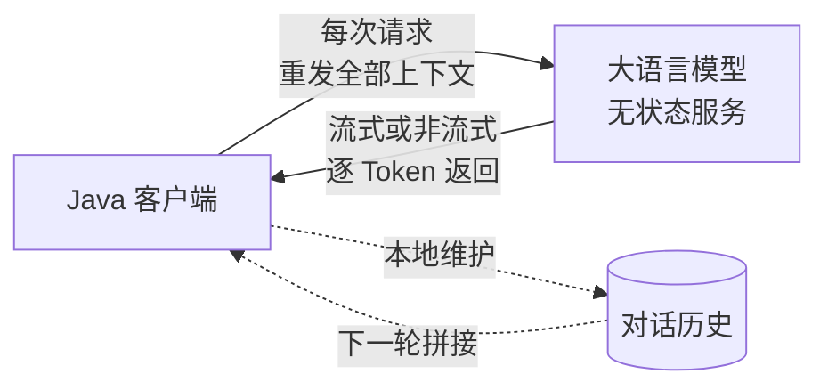

# LLM 接口与提示词工程

> 📖 **本篇定位**：专题 `10-ai-engineering` 的第 1 篇，面向"调过 HTTP API、但首次对接大模型"的 Java 工程师。目标是把 LLM 调用这件事从"能用"打磨到"可工程化"——搞清协议契约、写出可控 Prompt、守住 Token 成本。后续几篇（RAG、Function Calling / Agent、Spring AI、MCP）都建立在本篇的"调用三元组"（messages / Token / 流式）之上。

---

## 1. 类比：LLM 就是一个"按字收费的远程打字员"

在讨论任何参数、任何 SDK 之前，先把 LLM 的**本质画像**立起来。用 Java 工程师熟悉的场景打比方：

> **LLM ≈ 一个按字符收费的远程打字员**
>
> - 他**文化很好**（预训练灌了海量语料），但**毫无记忆**——每次都是全新雇佣，必须把背景资料重新交接一遍；
> - **按字数双向计费**（Token 计价），**你说的和他回的都算钱**；
> - 有**精力上限**（上下文窗口），交接资料太长他直接罢工；
> - **只会打字，不会做事**——除非你额外给他工具和"操作手册"（这是 03 篇 Function Calling 的伏笔）。

把这四条牢牢钉死，后面所有 API 参数、Prompt 套路、成本治理，都只是在解决这四条里的某一条限制。



**一图看懂的关键点**：记忆不在 LLM 侧，而在**客户端**。每次调用都是"无状态"的纯函数 —— `f(messages) → reply`。这是后面所有"多轮对话""上下文截断""Memory 机制"的根因。

---

## 2. 为什么需要"提示词工程"：从"能用"到"好用"的鸿沟

很多 Java 工程师第一次调 LLM 的反应是："我写了 `'帮我写代码'`，它回了一堆我根本用不上的 Python。"——不是 LLM 不行，是**交接文档写得烂**。对比一下两种写法：

| Prompt 写法 | 输出质量 | 工程属性 |
| :-- | :-- | :-- |
| ❌ `"帮我写代码"` | 语言不定、功能随意、结构漂移 | **不可控**，无法纳入 CI |
| ✅ `"你是 Java 资深工程师。用 Spring Boot 3 写一个 REST Controller：接收订单号`orderId`，返回订单详情 JSON，字段包含`id/price/status`。只输出代码，不要解释。"` | 可直接粘到 IDE 编译 | **可工程化**，可模板化 |

差别在哪？好 Prompt 里藏着**五个维度的约束**：角色（Java 工程师）、技术栈（Spring Boot 3）、输入输出契约（`orderId` → JSON）、字段 schema（`id/price/status`）、格式要求（只输出代码）。这五维**就是 Prompt 工程的本质**——把需求写成一份类似接口文档的"交接材料"。

!!! tip "Prompt 的工程师心智模型"
    把 Prompt 当作**调用对方的接口文档**来写：参数表、返回值 schema、副作用说明、异常约定一样都不能少。你写接口文档越规范，下游越不会来 `@` 你；你写 Prompt 越结构化，LLM 越不会跑偏。

---

## 3. 核心协议：OpenAI 兼容接口与 messages 契约

这是本篇的**技术骨干**。掌握了它，你就拿到了国内国外**所有主流大模型**的通用钥匙。

### 3.1 为什么国产大模型"都像 OpenAI"

2023 年 OpenAI 的 `/v1/chat/completions` 一声不响地成了**事实标准**。今天你能叫得上名字的厂商里——

| 厂商 | 模型代表 | OpenAI 兼容端点 |
| :-- | :-- | :-- |
| OpenAI | `gpt-4o` / `gpt-4o-mini` | `https://api.openai.com/v1` |
| Anthropic | `claude-3.5-sonnet` | 原生协议为主，亦有兼容层 |
| DeepSeek | `deepseek-chat` / `deepseek-reasoner` | `https://api.deepseek.com/v1` |
| 阿里通义 | `qwen-plus` / `qwen-max` | `https://dashscope.aliyuncs.com/compatible-mode/v1` |
| 智谱 | `glm-4` | `https://open.bigmodel.cn/api/paas/v4` |
| 腾讯混元 | `hunyuan-*` | `https://api.hunyuan.cloud.tencent.com/v1` |

**对 Java 工程师意味着什么**：同一份 OkHttp / RestTemplate 调用代码，**只要换 `baseUrl` 和 `apiKey`** 就能切换模型。这个兼容性是你未来做"多模型路由""成本优化"的基石。

### 3.2 messages 协议结构

一个完整的请求体：

```json
{
  "model": "gpt-4o-mini",
  "messages": [
    {"role": "system",    "content": "你是一位资深 Java 架构师，回答精炼，只给结论不废话。"},
    {"role": "user",      "content": "Spring Bean 的生命周期包含哪几步？"},
    {"role": "assistant", "content": "1) 实例化 2) 属性填充 3) Aware 回调 4) BeanPostProcessor..."},
    {"role": "user",      "content": "那循环依赖是怎么解决的？"}
  ],
  "temperature": 0.2,
  "stream": false
}
```

注意 `messages` 是一个**按时序排列的对话数组**，不是某个"session"——每次请求都**把完整历史**发过去。LLM 对这个数组的处理方式是"一次性全部读一遍，然后续写一句 `assistant`"。

!!! note "📖 术语家族：`role`"
    **字面义**：角色。
    **在 LLM 协议中的含义**：标识一条消息在对话中的身份与权重。每个 `message` 必须带 `role`，LLM 根据 `role` 决定如何对待这段文本。
    **同家族成员**：

    | 成员 | 用途 | 备注 |
    | :-- | :-- | :-- |
    | `system` | 人设、规则、约束 | **优先级最高**，放对话最前；改动它会显著改变整体行为 |
    | `user` | 用户真实输入 | 可出现多次（多轮对话） |
    | `assistant` | LLM 上一轮的回答 | 多轮对话时由客户端**原样重放**回去 |
    | `tool` | 工具调用的结果 | 与 `tool_calls` 字段配套，详见 03 篇 Function Calling |

    **命名规律**：`role` 是对话消息的**身份标签**，每个身份对应一种"优先级与处理方式"。`system > user > assistant > tool` 的优先级次序是记忆口诀。

### 3.3 Java 最小调用示例（裸 OkHttp）

刻意**不用**任何 LLM SDK——让你看清底层就是一个普通的 HTTPS `POST`：

```java
package com.example.llm;

import okhttp3.*;
import com.fasterxml.jackson.databind.ObjectMapper;
import com.fasterxml.jackson.databind.JsonNode;
import java.io.IOException;
import java.util.List;
import java.util.Map;

/**
 * 最小可运行的 LLM 调用示例：
 * - 不依赖任何 LLM SDK
 * - 走 OpenAI 兼容端点
 * - 换 baseUrl + apiKey 可切到 DeepSeek / 通义 / 混元
 */
public class LlmClient {

    private static final MediaType JSON = MediaType.parse("application/json");
    private final OkHttpClient http = new OkHttpClient();
    private final ObjectMapper mapper = new ObjectMapper();

    private final String baseUrl;   // 例如 https://api.deepseek.com/v1
    private final String apiKey;
    private final String model;     // 例如 deepseek-chat

    public LlmClient(String baseUrl, String apiKey, String model) {
        this.baseUrl = baseUrl;
        this.apiKey  = apiKey;
        this.model   = model;
    }

    public String chat(String systemPrompt, String userQuestion) throws IOException {
        // ⭐ 关键逻辑：拼装 messages 数组
        Map<String, Object> body = Map.of(
            "model", model,
            "messages", List.of(
                Map.of("role", "system", "content", systemPrompt),
                Map.of("role", "user",   "content", userQuestion)
            ),
            "temperature", 0.2,
            "stream", false
        );

        Request request = new Request.Builder()
            .url(baseUrl + "/chat/completions")
            .addHeader("Authorization", "Bearer " + apiKey)  // 📌 鉴权用 Bearer
            .post(RequestBody.create(mapper.writeValueAsBytes(body), JSON))
            .build();

        try (Response resp = http.newCall(request).execute()) {
            if (!resp.isSuccessful()) {
                // ❌ 典型错误：401 鉴权失败 / 429 限流 / 400 参数不合法 / 413 超窗口
                throw new IOException("LLM call failed: " + resp.code() + " " + resp.message());
            }
            JsonNode root = mapper.readTree(resp.body().byteStream());
            // 响应结构：choices[0].message.content
            return root.path("choices").get(0).path("message").path("content").asText();
        }
    }
}
```

**这段代码里没有任何"大模型魔法"**——HTTP POST、JSON 序列化、Bearer 鉴权，全是 Java 工程师每天在做的事。Spring AI 也好、LangChain4j 也好，底层都在干这件事，它们只是加了一层"类型安全的外壳"，04 篇会展开。

### 3.4 关键参数速查

调 LLM 时你会反复打交道的几个参数：

| 参数 | 作用 | 推荐值 | 踩坑提示 |
| :-- | :-- | :-- | :-- |
| `temperature` | 随机性，0~2 | 代码/SQL 场景 `0~0.2`；文案场景 `0.7~1.0` | 设成 `0` **也不是严格确定性**，见 §7 |
| `top_p` | 核采样概率阈值，0~1 | 默认 `1.0`，一般不动 | **不要同时改 `temperature` 和 `top_p`**，二者只调一个 |
| `max_tokens` | 回复长度上限 | 按场景估算，留余量 | 设太小会被**硬截断**（不是优雅结束） |
| `stream` | 是否流式返回 | 交互场景 `true`；批处理 `false` | 流式模式下错误处理更复杂，见 §6 |
| `response_format` | 强制 JSON 等结构化输出 | 结构化场景 `{"type":"json_object"}` | 各厂商兼容度不一，先查文档 |
| `seed` | 采样随机种子 | 需要可复现时指定 | 部分模型支持，不保证 100% 稳定 |

---

## 4. Prompt 工程的 5 个工程化套路

"Prompt 工程"听起来玄乎，其实就是**5 个可模板化的套路**——每个都有清晰的输入输出，**可以沉淀成团队共享模板**。

| # | 套路 | 一句话 | 典型场景 |
| :-- | :-- | :-- | :-- |
| 1 | **角色锚定** | `system` 里先立人设 | 限定领域专家身份、统一回答风格 |
| 2 | **Few-shot 示例** | 给 2~3 个输入输出样例 | 让 LLM "看样学样"，格式稳定 |
| 3 | **结构化输出** | 强制返回 JSON / XML / YAML | 需要程序解析结果时必选 |
| 4 | **思维链 (CoT)** | 让 LLM 先想后答 | 逻辑题、SQL 生成、方案推导 |
| 5 | **输出约束** | 限制格式/长度/语气 | 防止 LLM 啰嗦、加防护带 |

### 4.1 角色锚定

```txt
system: 你是一位 10 年经验的 Spring 架构师，只用中文回答，
       回答精炼，只给结论与关键代码，不废话。
user:   @Autowired 和 @Resource 有什么区别？
```

**核心作用**：用 `system` 消息把"回答口径"锁死，后续对话都继承这个口径。

### 4.2 Few-shot 示例 ⭐ 戏剧性对比

这是 Prompt 工程**最反直觉但最有效**的套路——**给例子比讲规则更管用**。看一个真实案例：把用户问题分类为 `BUG / FEATURE / QUESTION`。

**❌ Zero-shot（只讲规则，不给例子）**：

```txt
system: 把用户问题分类为 BUG / FEATURE / QUESTION，只输出分类标签。
user:   登录按钮点不动了
```

LLM 常见输出（**不可预测**）：

```txt
"这看起来是一个 Bug 问题，建议你检查一下前端代码..."
```

即使你反复强调"只输出标签"，LLM 偶尔还是会加解释 —— **不稳定**。

**✅ Few-shot（给 3 个样例）**：

```txt
system: 把用户问题分类为 BUG / FEATURE / QUESTION，只输出分类标签。

示例：
输入：登录后 500 报错     → 输出：BUG
输入：希望支持钉钉登录      → 输出：FEATURE
输入：怎么修改密码？        → 输出：QUESTION

user:   登录按钮点不动了
```

LLM 输出（**稳如老狗**）：

```txt
BUG
```

**为什么差别这么大**：LLM 本质是"续写"模型，给它看了 3 条"输入 → 输出：标签"的模式后，它会**强烈倾向于续写同样的模式**。这比任何"请只输出标签"的指令都更有效。

!!! tip "Few-shot 的工程启示"
    需要**格式稳定**的场景（分类、结构化抽取、代码风格统一）**优先考虑 Few-shot**，每个示例就是一行"测试用例"，成本极低，收益极高。

### 4.3 结构化输出

别再让 LLM 返回自然语言然后正则解析——**直接让它返回 JSON**：

```txt
system: 抽取用户订单信息，只返回 JSON，字段为 {orderId, amount, status}，不要任何解释，不要用 ```json 包裹。
user:   订单 20240512001 金额 299 元已经支付成功
```

输出：

```json
{"orderId":"20240512001","amount":299,"status":"paid"}
```

**加固技巧**：请求里加上 `"response_format":{"type":"json_object"}`，开启厂商的 JSON Mode 保证**一定是合法 JSON**（不再附加 ```json 包裹、不再多余解释）。

### 4.4 思维链（CoT）

适用**需要推理的任务**（SQL、算法、方案设计）。核心咒语是：

> **"一步步思考，先列出推理步骤，再给最终结论。"**

对简单题没必要（浪费 Token），对复杂题立竿见影——LLM 把推理过程"展开"出来后，最终答案的准确率显著上升（有论文证实这是"上下文中的 Scratch Pad 效应"）。

### 4.5 输出约束

在 Prompt 结尾加"**硬约束清单**"：

```txt
要求：
1. 只输出代码，不要解释；
2. 不超过 50 行；
3. 使用 Java 17 语法；
4. 不要引用外部库，只用 JDK 标准库。
```

**经验**：约束放在 Prompt **末尾**比放开头更有效（LLM 对"最近看到的指令"更敏感）。

---

## 5. Token 治理：长度、成本、上下文窗口

一个"有 Token 意识"和"没有 Token 意识"的工程师，在同一个 LLM 需求上写出来的代码差异，可能是**10 倍成本**。

### 5.1 Token 是什么

LLM 既不按字符、也不按词计费，而是按 **Token**（子词单元）——模型内部 Tokenizer 切出来的最小单位。

| 语言 | 粗略换算 |
| :-- | :-- |
| 英文 | `1 Token ≈ 0.75 词 ≈ 4 字符` |
| 中文 | `1 汉字 ≈ 1.5~2 Token`（汉字被拆得更碎） |
| 代码 | 介于英文和中文之间，`{ } ;` 等符号常独占一个 Token |

!!! note "📖 术语家族：`Token`"
    **字面义**：记号、标记。
    **在 LLM 中的含义**：模型 Tokenizer 切分文本的最小单元，计费、上下文窗口、生成速度**全都以 Token 为单位**。
    **同家族成员**：

    | 成员 | 含义 | 与你的关系 |
    | :-- | :-- | :-- |
    | `Input Token` / `Prompt Token` | 你发给 LLM 的所有内容（含 system/user/历史） | 影响**输入成本** |
    | `Output Token` / `Completion Token` | LLM 返回的内容 | 影响**输出成本**（**通常单价更贵**） |
    | `Context Window` | 模型一次能"看到"的 Token 上限 | 超了就报错或被截断 |
    | `Cached Token` | 命中 Prompt 缓存的 Token | 单价降至 10%~25% |

    **命名规律**：`* Token` = "某一类按 Token 计数的文本"，`Input/Output/Cached` 用于**区分不同计费档位**。

### 5.2 上下文窗口的硬约束

每个模型都有**一次对话能吃下的最大 Token 数**：

| 模型 | 上下文窗口 | 备注 |
| :-- | :-- | :-- |
| `gpt-4o-mini` | 128K | 性价比档 |
| `gpt-4o` | 128K | 旗舰 |
| `claude-3.5-sonnet` | 200K | Anthropic 旗舰 |
| `deepseek-chat` / `deepseek-reasoner` | 64K~128K | 国产高性价比 |
| `qwen-plus` | 128K | — |
| `hunyuan-*` | 32K~256K（按模型） | 腾讯系 |

**工程含义**：多轮对话**不能无限拼接历史**——到窗口上限前必须**截断**或**摘要**。这是 02 篇 RAG（用外部检索避开窗口限制）和 03 篇 Agent Memory（对话历史压缩）的源头问题。

### 5.3 成本治理的 3 个硬手段

| 手段 | 做法 | 节省量 |
| :-- | :-- | :-- |
| **模型分级** | 简单任务用 mini 模型，复杂任务才上旗舰 | 30%~90% |
| **Prompt Caching** | 把稳定的 `system` / 长文档放在 Prompt 前段，开启厂商的缓存 | 命中缓存时输入 Token 降至 10%~25% 单价 |
| **Prompt 精简** | 去寒暄、去冗余示例、压缩 Few-shot | 10%~30% |

**截至 2025-04 主流模型输入/输出参考单价**（以下数字**仅作决策参考**，实际请以官网为准）：

| 模型 | 输入（$/M Tokens） | 输出（$/M Tokens） | 档位定位 |
| :-- | :-- | :-- | :-- |
| `gpt-4o` | ~$2.50 | ~$10 | 国际旗舰 |
| `gpt-4o-mini` | ~$0.15 | ~$0.60 | 国际性价比 |
| `claude-3.5-sonnet` | ~$3 | ~$15 | 代码能力强 |
| **`deepseek-chat`** | **~$0.27** | **~$1.10** | **国产超低成本代表** |
| `qwen-plus` | 低价档 | 低价档 | 国产性价比 |

!!! warning "定价快照的注意事项"
    以上为**截至 2025-04**的定价快照，且已**简化**（不同时区、不同缓存命中、不同上下文长度可能差异显著）。**决策前请查对应厂商的官方定价页**。

**选型启示**：做"批量分类 / 简单抽取 / 格式转换"这类任务，**优先用 `gpt-4o-mini` 或 `deepseek-chat`**，成本比旗舰低 1~2 个数量级。别上来就堆最贵的模型。

---

## 6. 流式输出 SSE：让用户 1 秒内看到响应

### 6.1 为什么要流式

同一个"写一段 500 字说明"的请求：

| 模式 | 首字延迟 | 体验 |
| :-- | :-- | :-- |
| **非流式** | 约 8~15 秒（等整段生成完） | 长时间白屏，像卡死 |
| **流式** | 约 0.3~1 秒（首 Token 就返回） | 逐字打字机效果，接近 ChatGPT 网页版 |

**用户感知差异是数量级的**——任何面向终端用户的 LLM 应用都该上流式。

### 6.2 SSE 响应格式

流式调用把 `"stream": true` 加到请求体，响应头变成 `Content-Type: text/event-stream`，Body 变成一系列 **SSE 事件**：

```txt
data: {"choices":[{"delta":{"role":"assistant","content":""}}]}

data: {"choices":[{"delta":{"content":"你"}}]}

data: {"choices":[{"delta":{"content":"好"}}]}

data: {"choices":[{"delta":{"content":"，Java"}}]}

data: {"choices":[{"delta":{"content":" 是"}}]}

data: [DONE]
```

**关键点**：

- 每条 `data:` 行是一个 JSON 片段，其 `delta.content` 是**本次新增的文本**（不是累积）；
- 客户端负责**拼接**所有 `delta.content`；
- 收到 `data: [DONE]` 表示结束，连接可以关闭。

### 6.3 Java 接入 SSE 的三种方式

| 方式 | 难度 | 适用场景 |
| :-- | :-- | :-- |
| `OkHttp` + 手动解析 SSE | ⭐⭐⭐ | 学习理解底层 / 深度定制 |
| Spring WebFlux `WebClient` + `Flux<String>` | ⭐⭐ | 已上 Reactor 响应式栈 |
| **Spring AI `ChatClient.prompt().stream()`** | ⭐ | **推荐**，只要一行链式调用（04 篇展开） |

!!! tip "完整的 SSE Java 解析代码"
    为保持本篇聚焦"协议与概念"，完整可运行的 SSE 解析代码本文不展开——真正落地时建议直接走 Spring AI 或 LangChain4j，底层 SSE 细节交给框架处理即可，详见 04 篇 `@ai-engineering-SpringAI入门与MCP集成`（待补）。

---

## 7. 经典坑与不生效场景

| 场景 | 现象 | 原因 | 解决方案 |
| :-- | :-- | :-- | :-- |
| `temperature=0` 也不确定 | 同一 Prompt 每次回答略有差异 | 浮点采样的尾部仍有扰动；集群路由带来微差 | 同时指定 `seed`（部分模型支持），仍不保证 100% |
| JSON 输出偶尔带 ``` 包裹 | LLM 自作主张加 `json` 代码块 | Prompt 未开 JSON Mode | 加 `response_format: {"type":"json_object"}`，Prompt 里也显式说"不要 markdown 包裹" |
| 多轮对话突然失忆 | 新问题的回答开始跑偏 | 拼接历史超过上下文窗口，被静默截断 | 加**对话摘要**或走 RAG，详见 02 / 03 篇 |
| SSE 超时中断 | 长回答中途 502 | 反向代理（Nginx / 网关）默认 60s 超时 | 调大 `proxy_read_timeout` / `idle_timeout`，前端加断线重连 |
| 国产模型参数名对不上 | `max_tokens` 改名 `max_output_tokens` 或限制更严 | 各家 OpenAI 兼容度不完全一致 | 每家模型**第一次接入前查官方 API 文档** |
| 回答说一半就没了 | 被 `max_tokens` 硬截断 | 留的上限太小 | 放大 `max_tokens`，或在 Prompt 里要求"分条回答，先给结论" |
| 高并发下偶发 429 | 请求被限流 | 厂商按分钟 TPM/RPM 限流 | 客户端加**指数退避重试** + 分桶限流 + 模型分级降级 |

---

## 8. 常见问题 Q&A

**Q1：为什么 `temperature=0` 还不是完全确定的输出？**

> 底层原因有三条：① 采样阶段 softmax 之后仍有浮点数尾部扰动；② 推理集群做负载均衡，不同 GPU 的浮点顺序略有差别；③ 部分模型混合了**专家路由**（MoE），每次路由结果可能不同。要追求强复现性，需同时指定 `seed`，且限定在"支持 `seed` 的特定模型版本"上——即便如此，也只是**近似确定性**。

**Q2：`system` 消息和 `user` 消息谁的优先级更高？**

> `system` 优先级最高，可以理解为"雇主交给员工的上岗手册"，LLM 对它的**遵从权重显著大于 `user`**。但优先级**不是铁律**——恶意构造的 `user` 消息可以诱导 LLM 违反 `system`（这就是"Prompt 注入攻击"）。生产系统里**不要把安全边界只押在 `system` 上**，关键动作要在 Java 侧二次校验（例如 SQL 生成后再走白名单）。

**Q3：多轮对话是怎么"记住"上下文的？**

> **LLM 本身完全无状态**——每次调用都是独立的函数。所谓"记忆"的真相是：**客户端**把历史所有的 `user` / `assistant` 消息**原样重放**到 `messages` 数组里。这意味着：① 历史越长，每轮输入 Token 越多，成本呈线性增长；② 历史超过上下文窗口就被截断；③ 想"持久化记忆"必须借助外部存储（数据库、向量库），这正是 03 篇 Agent Memory 的切入点。

**Q4：模型这么多（GPT / Claude / 国产），我该选哪个？**

> 先按**三个维度**打分再决定：① **任务类型**——代码和复杂推理选 Claude / GPT-4o / DeepSeek-Reasoner；批量简单任务选 `gpt-4o-mini` / `deepseek-chat`；② **合规与部署**——数据不能出境就选国产或私有化；③ **成本预算**——高并发低单价场景（客服、分类）首选 DeepSeek / 国产低价档。**不要一上来就全量用旗舰模型**——做一次小规模对比实验，让数据说话。

---

## 9. 一句话口诀

> **Prompt 是交接文档，Token 是计费单位，`messages` 是状态载体，流式是交互标配。**
>
> 把这四件事吃透，你就握住了 LLM 调用的"四把钥匙"——下一篇 RAG、再下一篇 Function Calling / Agent、再往后 Spring AI 与 MCP，所有复杂场景都是在这四把钥匙上做乘法。
