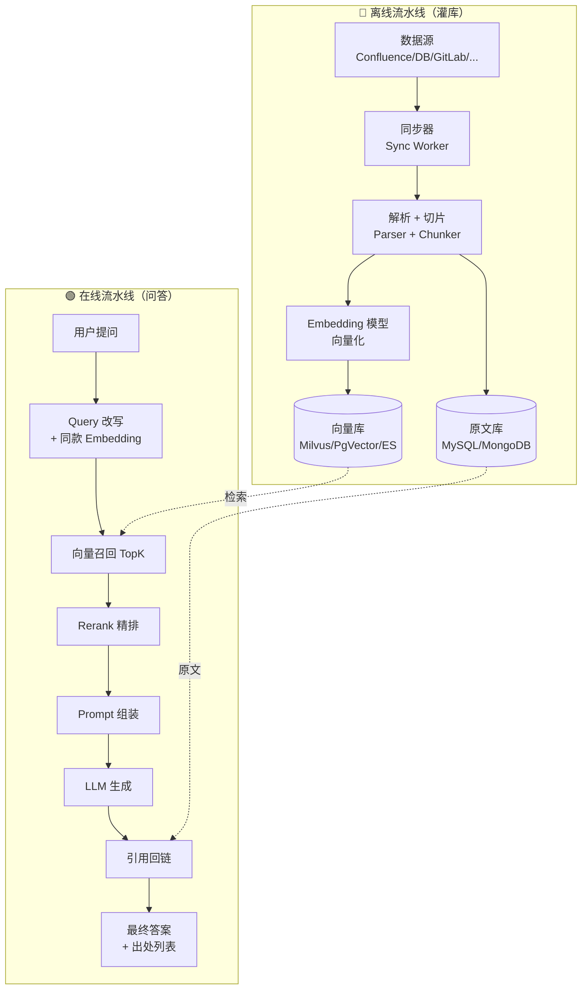

# RAG 架构与工程落地

> 📖 **本篇定位**：专题 `10-ai-engineering` 的第 2 篇，承接 [LLM 接口与提示词工程](@ai-engineering-LLM接口与提示词工程) 的三大限制——**无状态、上下文窗口有限、训练数据会过时**。本篇讲清一件事：**当你需要让 LLM 回答"我们公司内部的知识"时，为什么 RAG 是当前唯一经济可行的答案**，以及一个生产级 RAG 系统从"数据同步"到"答案引用回链"的完整工程链路应该怎么搭。

---

## 1. 类比：RAG ≈ 给 LLM 配了一个"开卷考试的小抄"

闭卷考试 vs 开卷考试，这就是**原生 LLM** 和 **RAG** 的关系：

| 维度 | 闭卷（原生 LLM） | 开卷（RAG） |
| :-- | :-- | :-- |
| 知识来源 | 大脑里背过的（预训练数据，**会过时**） | 考试时现场翻书（**实时检索**） |
| 答错的后果 | "一本正经地胡说八道"（幻觉） | 翻错页会答错，但翻对了就有凭据 |
| 更新成本 | 要重新训练（几十万~千万美金） | 往书架里加本新书就行（增量灌库） |
| 能否引用出处 | 不能 | **能**——直接贴原文+页码 |

> **RAG ≈ 给 LLM 配一个私有图书馆 + 一个精准的图书管理员**：
>
> - **图书馆**：把你的内部文档全部加工成"LLM 读得懂的卡片"（向量化）
> - **图书管理员**：用户提问时，管理员先去架子上**挑几本最相关的书**（检索），把书页和问题一起递给 LLM
> - **LLM**：拿到"问题 + 原材料"后续写答案，答完顺带标注"这段来自哪本书第几页"（引用回链）

这个类比建立后，RAG 的每一个组件——向量库、Embedding、Chunking、Rerank、Citation——都只是在优化"**图书管理员怎么更快更准地把对的书挑出来**"。

---

## 2. 为什么需要 RAG：原生 LLM 落地内部知识的三道死锁

直接拿 `gpt-4o` / `deepseek-chat` 回答"我们公司的请假流程"，你会同时撞上三堵墙：

| 死锁 | 现象 | 原生 LLM 为什么解决不了 |
| :-- | :-- | :-- |
| **知识不在** | "我不知道贵司的 HR 政策" | 训练数据里没有你的私有文档 |
| **知识过时** | 回答的是 2023 年截止的通识 | 模型训练有 Cut-off，最新政策它没见过 |
| **没法溯源** | 自信满满地编一段 | LLM 续写的本质决定它无法标注"这段从哪来" |

### 2.1 对比：三种"让 LLM 懂内部知识"的方案

| 方案 | 原理 | 成本 | 更新成本 | 能否溯源 | 适用场景 |
| :-- | :-- | :-- | :-- | :-- | :-- |
| **① 继续预训练** | 把私有数据塞进训练语料重训 | 💰💰💰💰 百万级 | 💰💰💰 每次重训 | ❌ | 几乎不做 |
| **② Fine-tuning（微调）** | 在小样本上调模型权重 | 💰💰 万~十万级 | 💰💰 增量微调 | ❌ | 改口吻/格式、非知识注入 |
| **③ RAG（检索增强生成）** | 问的时候现查，把原文塞进 Prompt | 💰 接入成本 | 💰 **增量灌库秒级** | ✅ | **95% 企业知识问答场景** |

!!! tip "一个被反复验证的行业共识"
    **"先上 RAG，别上微调。"** 微调解决的是"模型不会说话"，RAG 解决的是"模型不知道事实"。绝大多数"我们公司的 AI 助手"需求都是后者——你需要的不是一个"更懂你"的模型，而是一个"能查你资料"的模型。

### 2.2 RAG 的本质：把 `P(回答|问题)` 改造成 `P(回答|问题, 检索到的上下文)`

用一个公式说清所有花哨概念的本质：

```txt
原生 LLM：answer = LLM(question)
RAG：    answer = LLM(question + retrieve(question, knowledgeBase))
```

整个 RAG 体系所有的优化，都只是在优化 `retrieve()` 这一个函数——**怎么把最相关的几段原文从知识库里挑出来**。

---

## 3. RAG 架构全景：两条流水线 + 五个核心组件

生产级 RAG 系统**一定是两条独立流水线**——一条离线灌库，一条在线问答。混在一起做是新手最常见的设计错误。



**两条流水线必须独立**的工程理由：

1. **时序完全不同**：灌库是小时/天级的批处理；问答是百毫秒级的在线请求
2. **失败策略不同**：灌库失败可重试补跑；问答失败必须秒级降级
3. **扩缩容模式不同**：灌库吃 CPU + Embedding API 配额；问答吃向量库 QPS + LLM 配额
4. **版本演化不同**：换 Embedding 模型时**整库要重灌**，在线服务却要平滑切换

### 3.1 五个核心组件的职责矩阵

| 组件 | 所属流水线 | 核心职责 | 选型代表 |
| :-- | :-- | :-- | :-- |
| **Chunker**（切片器） | 离线 | 把长文档切成 200~1000 Token 的片段 | LangChain `RecursiveCharacterTextSplitter` / 自研语义切片 |
| **Embedding 模型** | 离线 + 在线 | 把文本映射为固定维度的向量（768/1024/1536 维） | `text-embedding-3-small` / `bge-m3` / `bce-embedding` |
| **向量库** | 离线写 + 在线读 | 存向量 + ANN 检索 | Milvus / Qdrant / Weaviate / **PgVector** / ES dense_vector |
| **Rerank 模型**（可选） | 在线 | 对召回的 TopK 二次精排 | `bge-reranker` / `bce-reranker` / Cohere Rerank |
| **Citation 组件** | 在线 | 把答案里的事实对回原文片段与 URL | 自研（Prompt 约束 + 后处理） |

---

## 4. 离线流水线：数据怎么进到知识库

### 4.1 数据同步：最被低估的脏活累活

所有 RAG 项目 **80% 的事故**发生在这一步，而不是什么"RAG 架构选型"。真实生产场景的数据源：

| 数据源类型 | 典型代表 | 同步方式 | 坑 |
| :-- | :-- | :-- | :-- |
| **Wiki / 文档平台** | Confluence / iwiki / 飞书文档 | REST API 定时拉取 | 权限语义、软删除识别、附件下载 |
| **数据库表** | MySQL 业务表 | Binlog 订阅 / JDBC 轮询 | 字段拼接策略、关联表展开 |
| **代码仓库** | GitLab / GitHub | Clone + 定时 pull | 二进制文件过滤、`.md` / 代码要分类处理 |
| **业务对象** | 工单 / CRM / 订单 | MQ 事件订阅 | 事件幂等、乱序 |
| **外部网页** | 官网 / 标准文档 | 爬虫 + sitemap | 反爬、JS 渲染、版权 |

**关键设计：增量同步 + 幂等 + 软删除标记**。一个生产级同步器的典型伪代码：

```java
@Service
public class ConfluenceSyncWorker {

    @Scheduled(cron = "0 0 * * * *")   // 每小时跑一次
    public void syncHourly() {
        String lastSyncCursor = cursorRepo.load("confluence");  // 📌 断点
        List<ConfluencePage> pages = confluenceApi.pullSince(lastSyncCursor);

        for (ConfluencePage p : pages) {
            if (p.isDeleted()) {
                // ⭐ 软删除：不删向量，打 tombstone，在线查询时过滤
                vectorStore.markDeleted(p.id());
                continue;
            }
            // 📌 幂等 upsert：按 (source, docId, version) 唯一
            DocumentRecord doc = parser.parse(p);
            List<Chunk> chunks = chunker.split(doc);
            List<float[]> vectors = embedding.embedAll(chunks);
            vectorStore.upsert(doc.id(), chunks, vectors);
            docRepo.upsert(doc);   // 📌 原文落 MySQL，向量库只存 chunk 文本 + metadata
        }
        cursorRepo.save("confluence", pages.lastCursor());
    }
}
```

### 4.2 Chunking 切片：RAG 效果的天花板

**Chunk 切得好不好，直接决定召回质量的上限**。常见切片策略：

| 策略 | 做法 | 适合 | 问题 |
| :-- | :-- | :-- | :-- |
| **定长切分** | 固定 500 字一片 | 纯文本、风格单一 | 会把一句话、一张表切断 |
| **按分隔符递归切分** | 优先按段落→句子→字符切 | 多数 Markdown / 文档 | 对代码、表格仍然不友好 |
| **语义切分** | 用 Embedding 相似度找"语义跳变点" | 长文、演讲稿 | 实现复杂、成本高 |
| **结构化切分** | 按 Markdown 标题树 / HTML DOM 切 | Wiki、API 文档 | 需要解析器按源类型定制 |

!!! tip "Chunking 的 3 条工程口诀"
    1. **带重叠**：相邻 chunk 重叠 10%~20%（例如 512 Token chunk + 64 Token overlap），防止跨块切断语义。
    2. **带 metadata**：每个 chunk 强制带 `{doc_id, title, section, url, updated_at, tenant_id}`——这些是后续过滤与引用回链的命脉。
    3. **标题路径注入**：给每个 chunk 的文本前面加上"所属文档标题 → 章节标题"（例如"《请假流程》→ 2.3 病假"），**让每个 chunk 都能独立被理解**。

!!! note "📖 术语家族：`Chunk`"
    **字面义**：块、段。
    **在 RAG 中的含义**：一段被切分出来、独立向量化、独立被召回的文本单元。"提问-检索-生成"的最小检索粒度。
    **同家族成员**：

    | 成员 | 含义 | 常见取值/单位 |
    | :-- | :-- | :-- |
    | `Chunk Size` | 单个 chunk 的长度 | 200~1000 Token（推荐 512） |
    | `Chunk Overlap` | 相邻 chunk 的重叠 | Chunk Size 的 10%~20% |
    | `Parent Chunk` / `Child Chunk` | 大块用于上下文、小块用于检索（Hierarchical） | 大小 2~4 倍关系 |
    | `Chunk Metadata` | 附加结构化信息 | `{doc_id, section, url, tenant_id, updated_at}` |

    **命名规律**：`Chunk *` 永远是在回答"检索单元的**形状**是什么"——长度、重叠、层级、附加信息。

### 4.3 Embedding：把文本变成向量的关键一步

!!! note "📖 术语家族：`Embedding`"
    **字面义**：嵌入、映射。
    **在 RAG 中的含义**：把任意文本映射为**固定维度的稠密向量**（如 1024 维浮点数组），使得"语义相近的文本 → 向量距离近"。
    **同家族成员**：

    | 成员 | 含义 | 说明 |
    | :-- | :-- | :-- |
    | `Text Embedding` | 通用文本向量 | RAG 主力，本文默认类型 |
    | `Query Embedding` | 问题向量化 | 必须和 `Passage Embedding` 用同一个模型 |
    | `Passage Embedding` | 知识库片段向量化 | 同上 |
    | `Sparse Embedding` | 稀疏向量（如 SPLADE） | 兼顾关键词命中，可与稠密向量混合检索 |
    | `Multi-vector Embedding` | 一段文本产出多个向量（如 ColBERT） | 精度高但存储成本高 |

    **命名规律**：`* Embedding` = 某一类"向量化动作"的产物，命名里的前缀说明"这是给谁/从哪来的向量"。

**Embedding 模型选型参考**（截至 2025-04，建议以各厂商官方 MTEB 榜单为准）：

| 模型 | 维度 | 特点 | 典型单价 |
| :-- | :-- | :-- | :-- |
| `text-embedding-3-small` (OpenAI) | 1536（可降维） | 国际通用，性价比高 | ~$0.02 / M Tokens |
| `text-embedding-3-large` (OpenAI) | 3072 | 更高精度 | ~$0.13 / M Tokens |
| `bge-m3` (BAAI) | 1024 | **中文最强开源**，同时出稠密/稀疏/多向量 | 自部署，免费 |
| `bce-embedding-base_v1` (网易有道) | 768 | 中英双语，专为 RAG 优化 | 自部署，免费 |
| `voyage-3` / `cohere-embed-v3` | 1024 | 国际闭源高精度档 | 中等 |

!!! warning "换 Embedding 模型 = 整库重灌"
    `Query Embedding` 和 `Passage Embedding` **必须来自同一个模型**。一旦上线后决定换模型（例如从 `text-embedding-ada-002` 升到 `text-embedding-3-small`），**整个向量库必须全量重灌**——这是生产级 RAG 最沉重的运维成本之一。选型阶段务必**跑 ≥ 500 条业务样本的召回率对比**，别凭榜单拍板。

### 4.4 向量库：存向量 + ANN 检索

核心 API 极简——`insert(vector, metadata)` + `search(queryVector, topK, filter)`。选型对比：

| 方案 | 定位 | 优点 | 劣势 |
| :-- | :-- | :-- | :-- |
| **Milvus** | 独立向量数据库 | 专业、高性能、水平扩展强 | 需独立运维、组件多 |
| **Qdrant** | 独立向量数据库 | 轻量、Rust 实现、过滤强 | 生态稍小 |
| **PgVector** | PostgreSQL 扩展 | **已有 PG 的团队首选**，事务一致、运维零新增 | 百万级以上性能瓶颈 |
| **ES `dense_vector`** | ES 扩展 | **已有 ES 的团队首选**，天然支持混合检索 | 向量检索性能弱于专用库 |
| **Redis Stack** | Redis 模块 | 低延迟、已有 Redis 即可 | 容量成本高 |

!!! tip "向量库选型 3 条经验法则"
    1. **数据 < 100 万 chunk**：用 PgVector / ES，不新增组件；
    2. **数据 ≥ 1000 万 chunk 或 QPS > 100**：上 Milvus / Qdrant；
    3. **需要"向量 + 关键词混合检索"**：ES / Milvus 2.4+（支持 BM25 + dense）最省心。

---

## 5. 在线流水线：用户提问到 LLM 回答

### 5.1 端到端链路分解


每一步都有独立的优化空间，下面挑 4 个最关键的展开。

### 5.2 Query 改写：提问质量的第一道闸门

用户原始提问**通常很烂**——短、有代词、有口语。直接拿去检索效果很差。四个改写套路：

| 套路 | 原问题 | 改写后 | 作用 |
| :-- | :-- | :-- | :-- |
| **问题澄清** | "多少天要审批？" | "病假多少天需要上级审批？" | 补全主语 |
| **同义扩写** | "年假怎么请？" | "年假 / 带薪休假 / annual leave 申请流程" | 提高召回率 |
| **多轮消解** | "那生病呢？"（上一轮问的是年假） | "那生病请假怎么请？" | 把历史对话里的代词换掉 |
| **HyDE** | 给一个"假设答案"，再拿这个假设答案去检索 | — | 文档风格和问题差异大时特别有效 |

落地技巧：Query 改写本身就是一次小 LLM 调用（用廉价模型如 `gpt-4o-mini` / `deepseek-chat`），**把改写和意图识别合并在一个 Prompt 里一次拿到**，不要拆成多次调用。

### 5.3 混合检索与召回策略

**只用向量召回≠最优**——稠密向量擅长"语义相似"，但会漏掉"精确术语匹配"。例如检索"iPhone 15 Pro Max"这种型号编码，BM25 关键词检索反而更准。

| 检索方式 | 擅长 | 缺陷 |
| :-- | :-- | :-- |
| **稠密向量检索** | 语义相似、同义词、跨语言 | 专有名词、代码、数字识别弱 |
| **BM25 关键词检索** | 术语精确命中 | 不懂同义词 |
| **混合检索（Hybrid）** | 两者结合，用 **RRF**（Reciprocal Rank Fusion）合并结果 | 实现稍复杂 |

**生产推荐**：向量召回 TopK=20 + BM25 召回 TopK=20 → **RRF 融合去重** → 进入 Rerank。

### 5.4 Rerank 精排：性价比最高的一步优化

"粗排 TopK=20 → 精排 TopN=5" 是业界共识的黄金模式。Reranker（典型如 `bge-reranker-large` / `bce-reranker-base_v1`）是一个"**句对打分**"模型——输入 `(query, chunk)`，输出相关性分数。

| 维度 | 向量召回（Bi-Encoder） | Reranker（Cross-Encoder） |
| :-- | :-- | :-- |
| 计算方式 | query/passage 独立编码 | query 与 passage 拼起来一起编码 |
| 精度 | 中 | **高**（看到 query 才编码 passage） |
| 速度 | **极快**（向量预存） | 慢（每对都要跑一次） |
| 用法 | 从千万文档中召回 20 条 | 对这 20 条重排序选 Top 5 |

!!! tip "Rerank 的 ROI 极高"
    加一个 Reranker 通常能把"最终命中率"从 `~70%` 拉到 `~90%`，但延迟只增加 50~200ms（在 TopK=20 级别）。**几乎是 RAG 所有优化里性价比最高的一步**。

### 5.5 Prompt 组装：把检索结果塞进 `messages`

Prompt 模板结构（和 01 篇 §3.2 的 `messages` 协议呼应）：

```txt
system: 你是公司内部文档问答助手。
       严格基于<已知信息>回答，<已知信息>里没有的内容，直接回复"未在文档中找到"。
       回答中涉及的事实必须用 [doc_id:chunk_id] 的格式标注出处。

user:   <已知信息>
        [doc=HR-001, chunk=3] 病假请假：3 天以内由直接主管审批，超过 3 天需 HR 复核...
        [doc=HR-001, chunk=4] 年假请假：提前 3 个工作日提交...
        [doc=HR-002, chunk=1] 调休规则：加班 2 小时可兑换 0.25 天调休...
        </已知信息>

        用户问题：病假多少天需要 HR 审批？
```

**3 个关键工程约束**：

1. **`system` 里约束"无中生有"的行为**——用"文档里没有就说没有"来压抑幻觉，不要让 LLM 强行续写
2. **每个 chunk 都标注 ID**（`[doc=xxx, chunk=y]`），这是下一步引用回链的锚
3. **不要塞满上下文窗口**——把"更相关的放前面 + 后面"（LLM 对开头和结尾最敏感，中间容易被稀释，即"Lost in the Middle"现象）

### 5.6 引用回链（Citation）：让答案"有据可依"

LLM 按上面的 Prompt 生成的答案长这样：

```txt
病假 3 天以内由直接主管审批，超过 3 天需要 HR 复核 [doc=HR-001, chunk=3]。
```

后处理程序做两件事：

1. **提取 `[doc=xxx, chunk=y]`**，查回原文库拿到 `{标题, URL, 章节路径}`；
2. **把 `[doc=xxx, chunk=y]` 渲染成可点击的脚注**，或在答案末尾附一个"引用来源"列表。

!!! tip "Citation 是 RAG 相比原生 LLM 的最大信任杠杆"
    企业场景里，没有 Citation 的 AI 回答 = "一个不敢签字的专家意见"。**Citation 让用户一眼就能判断这个答案能不能信**——这是 RAG 能在严肃业务场景（法务、医疗、HR、运维）落地、而原生 LLM 不能的关键差异。

---

## 6. 生产系统踩坑清单

| 场景 | 现象 | 根因 | 解决方案 |
| :-- | :-- | :-- | :-- |
| **召回不准** | Top 5 经常没有真正相关的 chunk | Chunk 切太大 / Embedding 模型不适配中文 | 减小 Chunk Size（512 左右）；换 `bge-m3` / `bce-embedding` |
| **长文档被拆丢主语** | "它的审批流程是..."召回时无法理解"它"指什么 | 切片没注入标题路径 | 每个 chunk 前加"《文档标题》→ 章节标题"前缀（见 §4.2） |
| **换模型后全线崩溃** | Embedding 模型升级后召回完全不对 | Query / Passage 使用了不同模型 | 全库重灌，**且新旧向量不可混存** |
| **幻觉引用虚构出处** | 答案里出现 `[doc=XYZ]` 但库里根本没有 | Prompt 约束不严 / LLM 编 ID | 后处理校验 ID 是否存在，不存在的整句降级/丢弃 |
| **Lost in the Middle** | Top 1 在 Prompt 中间位置被忽略 | LLM 对长上下文中段敏感度低 | 把 Rerank 后的 Top 1、Top 2 分别放在 Prompt 首尾 |
| **权限泄露** | A 租户的员工查到了 B 租户的文档 | 向量库检索没做 metadata 过滤 | `search(queryVec, filter={tenant_id: 'A'})` 必须强制；在召回后再做一次二次校验 |
| **软删除没生效** | 文档在 Wiki 删除后一周还能被查到 | 只删原文库，没同步删向量 | 同步器识别删除事件后立即 `vectorStore.markDeleted()`，在线检索加 `is_deleted=false` 过滤 |
| **增量灌库越灌越慢** | 灌库任务 QPS 随时间下降 | 向量库没建索引 / 索引参数不当 | Milvus / PgVector / ES 初始化时即建 HNSW / IVF 索引；定期 compact |
| **RAG 答非所问** | 召回对了，但答案跑偏 | 用户问题和检索到的 chunk 主题相关但意图不同 | 加 Query 意图识别，意图不是"知识问答"的走旁路（闲聊 / 工具调用） |

---

## 7. 评估体系：RAG 效果怎么量化

**没有评估，RAG 就是薛定谔的系统**——你改了切片参数、换了模型、加了 Rerank，到底有没有变好？只能靠数据说话。三层指标：

| 层次 | 指标 | 度量什么 |
| :-- | :-- | :-- |
| **检索层** | `Recall@K`（召回率）、`MRR`（平均倒数排名）、`nDCG` | 该被召回的 chunk 有没有在 Top K 出现 |
| **生成层** | `Faithfulness`（忠实度）、`Answer Relevancy`（答案相关性） | 答案有没有忠实于检索到的原文、有没有真正回答用户 |
| **端到端** | 人工打分 `点踩率` / A/B 测试 | 真实用户的满意度 |

**工程化做法**：

1. **构建 `(question, 标准答案, 必含引用 chunk_id)` 的评测集**，至少 200 条覆盖主要场景
2. **用 `Ragas` / `TruLens` / `DeepEval` 等开源框架**自动跑指标
3. **把评测集跑进 CI**——任何对 Chunker / Embedding / Rerank / Prompt 的改动都要先过评测基线再合入

---

## 8. 常见问题 Q&A

**Q1：我应该选 RAG 还是 Fine-tuning？**

> 先问三个问题：① 要注入的是**事实知识**还是**语气/格式**？② 知识是否需要**实时更新**？③ 是否需要**引用出处**？——三个问题里只要有任何一个答案是"事实/实时/要出处"，**一律先选 RAG**。微调解决的是"怎么说"，RAG 解决的是"说什么"，它俩不是二选一而是正交关系。真实生产往往是"RAG 为主 + 轻量 SFT 改口吻"的组合。

**Q2：Chunk Size 到底应该设多大？**

> 没有万能值，但有个**起点公式**：`Chunk Size ≈ Embedding 模型最佳长度 × 0.5~1.0`——`bge-m3` / `text-embedding-3-small` 这类模型在 256~512 Token 区间效果最好，落到中文约 200~400 字。**真正重要的不是大小，而是用业务样本评测集跑几个档位对比 `Recall@5`**——让数据告诉你，别靠调参直觉。

**Q3：为什么我加了 RAG 之后答案反而变糟了？**

> 5 个最常见的根因按发生概率排序：① **召回根本没命中**——先单独测检索层 `Recall@K`，别盯着最终答案；② **Chunk 切断了语义**——检查是不是把一句话或一张表切开了；③ **Prompt 模板错了**——`system` 没约束"只基于已知信息"，LLM 一混合自己的记忆就跑偏；④ **Lost in the Middle**——把 Top 1 挪到 Prompt 末尾立竿见影；⑤ **问题本身不该走 RAG**——用户其实是闲聊或者要调工具，走错流水线了（这就是 03 篇 Function Calling / Agent 要解决的问题）。

**Q4：向量库到底该选 Milvus、PgVector 还是 ES？**

> 按**"减少新组件"** 原则决策：已经有 PG 就用 PgVector，已经有 ES 就用 ES `dense_vector`，这两种方案**百万级 chunk 以内完全够用**且运维成本为 0。当且仅当数据规模上到千万级 chunk 或查询 QPS > 100 时，才值得引入 Milvus / Qdrant 这类专用向量库——**新组件意味着新的监控、备份、运维人力**，这笔账一定要提前算清。

**Q5：RAG 上线后，知识库数据怎么做权限隔离？**

> 必须在**每一层**都做：① **灌库时**每个 chunk 的 metadata 必须带 `{tenant_id, visibility, acl_tags}`；② **检索时**强制走 `filter={tenant_id: X, visibility: {$in: userRoles}}`，**不要在召回后靠应用层兜底过滤**（会有越权检索漏洞）；③ **生成后**再做一次"引用 ID 是否属于该用户"的二次校验，防止 LLM 出现引用 ID 编造或越权引用；④ **审计日志**记录"用户 X 在时间 T 检索到了 chunk Y"，合规与溯源的必需品。

---

## 9. 一句话口诀

> **RAG 的本质 = 把 `P(answer|question)` 改造成 `P(answer|question, retrieve(question))`**——其余所有概念（Chunk / Embedding / Rerank / Citation）都只是在优化 `retrieve()` 这一个函数。
>
> 记住三条硬规则：**两条流水线独立**、**Embedding 一换整库重灌**、**没有评测集的 RAG 等于盲调**。这三条守住，你的 RAG 生产系统就不会塌。
