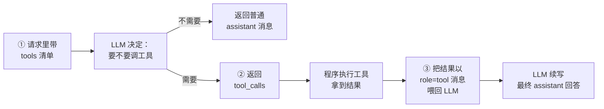
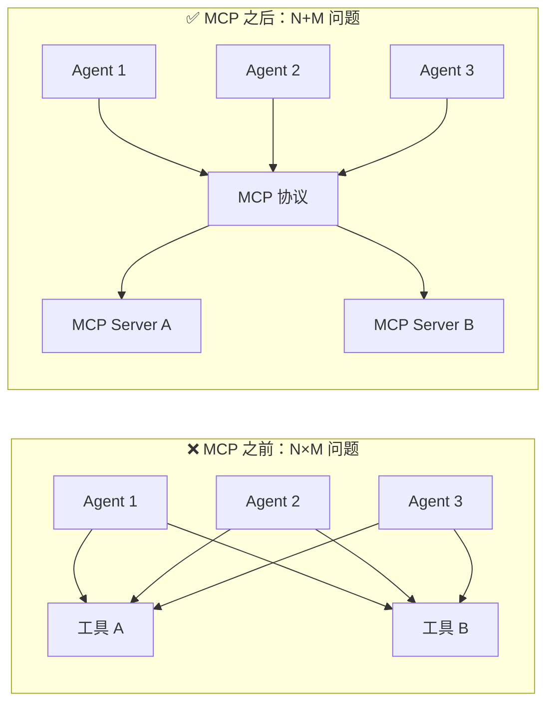

# Function Calling 与 Agent 范式

> 📖 **本篇定位**：专题 `10-ai-engineering` 的第 3 篇，承接 [LLM 接口与提示词工程](@ai-engineering-LLM接口与提示词工程) 的"LLM 无状态 + 只会文字续写"的限制，和 [RAG 架构与工程落地](@ai-engineering-RAG架构与工程落地) 里"意图不是知识问答就走旁路"的伏笔。本篇讲清一件事：**当 LLM 需要"查实时数据、调 API、操作系统"时，Function Calling 协议长什么样，以及如何在它之上搭出真正生产可用的 Agent**——而不是把一堆 Prompt 缝缝补补就叫"智能体"。

---

## 1. 类比：从"会说话的博士"到"能干活的实习生"

LLM 原生状态下就像一个**博学但被关在玻璃房里的博士**——他懂很多，但做不了任何"出房间"的事：

| 用户请求 | 原生 LLM 的尴尬 | 加上 Function Calling 后 |
| :-- | :-- | :-- |
| "现在深圳气温多少？" | "我不知道实时数据，根据我的训练数据..." | 调 `weather(city="深圳")` → 拿结果 → "深圳现在 26°C" |
| "帮我把这首歌加到歌单" | "我不能操作您的网易云账号" | 调 `add_to_playlist(song_id, playlist_id)` → "已加入" |
| "这个订单号发到哪了？" | "我不能查询贵司业务数据库" | 调 `query_logistics(order_id)` → 返回物流节点 |

**Function Calling 就是在玻璃房墙上打了一排按钮**——LLM 知道每个按钮的名字和作用，需要时可以"按下"（生成一段结构化的 JSON 告诉程序"我要调这个工具、参数是这些"），程序执行后把结果递回玻璃房，LLM 再基于结果说话。

再往上升一层：

> **Agent ≈ 带了一排工具按钮、有记忆、会自己循环思考的实习生。**
>
> - **博士（LLM）**：负责"思考下一步该按哪个按钮、看结果怎么解读"
> - **按钮（Tools）**：外部世界的接口（天气 API、数据库、HTTP 请求、Shell 命令……）
> - **工作台（Runtime）**：循环驱动——"让博士想一步 → 按按钮 → 看结果 → 再想一步 → ... → 交答案"
> - **便签本（Memory）**：短期工作记忆 + 长期经验积累

搞清这个分层，你就能理解为什么业界会说："**Function Calling 是 Agent 的必要条件，但不是充分条件**"——光有按钮没用，还得有循环、记忆、错误处理和止损机制。

---

## 2. Function Calling 协议：让 LLM "会按按钮"

### 2.1 三元闭环：`tools → tool_calls → tool`

Function Calling 在 OpenAI Compatible 接口（DeepSeek / 通义 / 智谱 / OpenAI 等）里是一组**固定的 3 元消息协议**，和 01 篇讲的 `role` 家族无缝衔接：



对应三段 JSON（抽取自一次真实的"查深圳天气"往返）：

**① 请求时的 `tools` 清单**（工具声明，结构固定为 JSON Schema）：

```json
{
  "model": "deepseek-chat",
  "messages": [
    {"role": "user", "content": "深圳现在多少度？"}
  ],
  "tools": [{
    "type": "function",
    "function": {
      "name": "get_weather",
      "description": "查询指定城市的实时天气。用户询问气温、天气、冷暖时调用。",
      "parameters": {
        "type": "object",
        "properties": {
          "city": {"type": "string", "description": "城市中文名，如：深圳"}
        },
        "required": ["city"]
      }
    }
  }]
}
```

**② LLM 决定调工具，返回 `tool_calls`**（注意 `content` 为 null）：

```json
{
  "role": "assistant",
  "content": null,
  "tool_calls": [{
    "id": "call_abc123",
    "type": "function",
    "function": {
      "name": "get_weather",
      "arguments": "{\"city\":\"深圳\"}"
    }
  }]
}
```

**③ 程序执行工具后，把结果以 `role=tool` 消息回传**（必须带 `tool_call_id` 对齐请求）：

```json
[
  {"role": "user", "content": "深圳现在多少度？"},
  {"role": "assistant", "content": null, "tool_calls": [...]},
  {
    "role": "tool",
    "tool_call_id": "call_abc123",
    "content": "{\"city\":\"深圳\",\"temp\":26,\"weather\":\"多云\"}"
  }
]
```

之后再调一次 LLM，它会基于 `tool` 消息续写出：`"深圳现在 26°C，多云。"`

!!! note "📖 术语家族：`Tool`"
    **字面义**：工具、器具。
    **在 LLM 协议中的含义**：让 LLM "可以按"的外部能力单元——用 JSON Schema 声明名字、描述、参数，LLM 用 JSON 返回"我要调哪个工具、参数是什么"。
    **同家族成员**：

    | 成员 | 含义 | 说明 |
    | :-- | :-- | :-- |
    | `tools`（请求字段） | 一次对话中可用的工具清单 | 放在请求 body 顶层 |
    | `tool_choice` | 工具调用策略 | `"auto"`（默认）/`"none"`/`"required"`/指定某个工具 |
    | `tool_calls`（响应字段） | LLM 决定要调的工具列表 | 可以一次返回多个（并行工具调用） |
    | `role: "tool"`（消息角色） | 工具执行结果专用消息类型 | 必须带 `tool_call_id` 对齐 |
    | `tool_call_id` | 某次工具调用的唯一 ID | OpenAI 规范，用于多工具并发时对齐响应 |
    | `Function Calling` | 最早的协议名（OpenAI 2023-06 首发） | 现已统一到 `tools` 字段（`functions` 字段废弃） |

    **命名规律**：`tool*` 围绕"**一次工具调用的生命周期**"——声明 (`tools`) → 决策 (`tool_choice`) → 发起 (`tool_calls` + `tool_call_id`) → 回传 (`role: tool`)。

### 2.2 tool_choice：决定 LLM 什么时候调工具

| 取值 | 语义 | 典型场景 |
| :-- | :-- | :-- |
| `"auto"`（默认） | LLM 自己决定调不调 | 通用对话助手 |
| `"none"` | 强制不调工具，只生成文字 | 用户明确说"别查数据库，直接聊" |
| `"required"` | 强制至少调一个工具 | 意图已确定就是要查数据 |
| `{"type":"function","function":{"name":"xxx"}}` | 强制调指定工具 | 固定工作流某一步 |

工程上最常用 `"auto"`，但**意图识别已经很明确的节点**用 `"required"` 可以显著减少"LLM 想偷懒不调工具"的失败案例。

### 2.3 并行工具调用：一次 tool_calls 多个函数

较新的模型（`gpt-4o` / `deepseek-chat` v3 / `qwen-plus` 等）支持**单次响应返回多个 `tool_calls`**，典型场景：

> 用户："帮我查一下深圳和北京现在各多少度"

```json
"tool_calls": [
  {"id": "call_1", "function": {"name": "get_weather", "arguments": "{\"city\":\"深圳\"}"}},
  {"id": "call_2", "function": {"name": "get_weather", "arguments": "{\"city\":\"北京\"}"}}
]
```

程序**必须并发执行这 N 次调用**，然后按顺序把 N 条 `role: tool` 消息都塞回 messages 再请求 LLM。工程实现里最常见的 bug 就是"只执行了第一个就 return"——要特别注意循环执行。

### 2.4 工具定义的工程规约：怎么写一个"好的" tool

LLM 能不能正确调用工具，**一半看模型能力，一半看你工具描述写得怎么样**。6 条硬规约：

| 规约 | 反例 | 正例 |
| :-- | :-- | :-- |
| **name 必须表意清晰** | `do_it` / `func1` | `get_weather` / `search_docs` |
| **description 给使用时机而非内部实现** | "调用天气 API 返回 JSON" | "**当用户询问气温、天气、冷暖时调用。**返回城市的实时温度。" |
| **参数 description 举例** | `"city": "城市"` | `"city": "城市中文名，如：深圳、北京"` |
| **`required` 精确声明** | 都标 required 导致 LLM 凑参数 | 必填的才标，选填给 default |
| **enum 收敛取值** | `"level": {"type":"string"}` → LLM 可能填"很紧急" | `"level": {"type":"string","enum":["low","medium","high"]}` |
| **别超过 ~20 个工具** | 一次塞 50 个工具 → LLM 选错率飙升 | 按领域分组，做"工具路由"或用不同 Agent 分治 |

!!! tip "工具描述也是 Prompt Engineering"
    很多人把 `description` 当"给开发者看的注释"写——这是错的。**`description` 是给 LLM 看的调用手册**，每个字都会进上下文、都会影响模型选择。把它当一小段 Prompt 认真打磨，收益极大。

### 2.5 最小完整示例：一次 Function Calling 往返

用裸 `OkHttp` 演示核心循环（不依赖任何 LLM SDK）：

```java
public class WeatherAgent {

    private final LlmClient llm;   // 就是 01 篇 §3.3 里的那个 LlmClient

    public String answer(String userQuestion) throws IOException {
        List<Message> messages = new ArrayList<>();
        messages.add(Message.user(userQuestion));

        // 📌 循环：只要 LLM 还想调工具，就继续跑
        while (true) {
            LlmResponse rsp = llm.chatWithTools(messages, WEATHER_TOOL);

            // ⭐ 情况 A：LLM 直接给答案了 → 收工
            if (rsp.getToolCalls() == null || rsp.getToolCalls().isEmpty()) {
                return rsp.getContent();
            }

            // ⭐ 情况 B：LLM 要调工具 → 先把它的 assistant 消息原样入列
            messages.add(Message.assistantToolCall(rsp.getToolCalls()));

            // 📌 并行执行所有 tool_calls
            for (ToolCall call : rsp.getToolCalls()) {
                String result = executeToolLocally(call);   // 真正调 API
                messages.add(Message.tool(call.getId(), result));
            }
            // 下一轮循环，让 LLM 基于工具结果继续
        }
    }

    private String executeToolLocally(ToolCall call) {
        if ("get_weather".equals(call.getName())) {
            String city = call.arg("city");
            return weatherApi.query(city);   // 返回 JSON 字符串
        }
        throw new IllegalArgumentException("未知工具: " + call.getName());
    }
}
```

**这段 20 行的 `while(true)` 循环就是最朴素的 Agent 内核**——下一节把它拆开来看。

---

## 3. 从 Function Calling 到 Agent：四要素模型

### 3.1 Agent 的本质公式

一句话定义：

> **Agent = LLM + Tools + Memory + Loop**

拆解每个要素：

| 要素 | 职责 | 不做这一步会怎样 |
| :-- | :-- | :-- |
| **LLM**（大脑） | 理解意图、决定下一步、生成回答 | 无智能决策，退化成静态工作流 |
| **Tools**（手脚） | 与外部世界交互的能力 | LLM 只能"说"，不能"做" |
| **Memory**（记忆） | 短期工作上下文 + 长期经验 | 每次都是"失忆症患者" |
| **Loop**（循环） | 多轮"想→做→看→再想" | 只能一次性问答，复杂任务做不完 |

### 3.2 ReAct 范式：让 Agent 的思考"可观测"

**ReAct**（Reasoning + Acting）是目前最主流的 Agent 工作范式，核心循环：

```txt
Thought：我现在应该做什么？
Action：调用 xxx 工具，参数 yyy
Observation：工具返回了 zzz
Thought：根据结果，我下一步该...
Action：...
Observation：...
...
Thought：已经有足够信息了
Final Answer：最终回答
```

一个真实对话示例（"帮我看看我上周发的订单到哪了"）：

```txt
Thought: 用户要查订单物流，但没给订单号。我先查最近一周的订单列表。
Action: query_recent_orders(user_id="u001", days=7)
Observation: [{order_id:"O1234", created_at:"2026-04-15"},
              {order_id:"O1235", created_at:"2026-04-17"}]

Thought: 有两笔订单，需要分别查物流状态。可以并行。
Action: query_logistics(order_id="O1234")
Action: query_logistics(order_id="O1235")
Observation: O1234: 已签收；O1235: 运输中，当前在"深圳转运中心"

Thought: 两笔都查到了，组织答案。
Final Answer: 您最近一周有两笔订单：O1234 已签收；O1235 运输中，
             当前在深圳转运中心。
```

!!! note "📖 术语家族：`Agent`"
    **字面义**：代理、代办者——"代替你去做事的人"。
    **在 LLM 语境中的含义**：一个由 LLM 驱动、能调用工具、有记忆、会多轮思考以完成复杂任务的程序。
    **同家族成员**：

    | 成员 | 含义 | 典型实现 |
    | :-- | :-- | :-- |
    | `Single-Agent` | 单个 Agent 独立完成任务 | LangChain AgentExecutor / Spring AI `ChatClient` |
    | `Multi-Agent` | 多个 Agent 协作（分工 / 对话 / 投票） | AutoGen / CrewAI / LangGraph |
    | `Sub-Agent` | 上级 Agent 把子任务分给下级 Agent | Claude Code / MetaGPT |
    | `Agent Loop` | Agent 的一次"想→做→看"循环 | 典型 5~15 轮收敛，需设上限防爆 |
    | `Agent Skill` | 一个 Agent 掌握的一项具体能力 | 如"订单查询"、"生成歌单"（即本专题 05 篇主题） |
    | `Agent Runtime` | Agent 的运行时框架 | LangChain / Spring AI / MonkeyClaw |

    **命名规律**：`Agent` 永远在回答"**谁来做决策**"——单 Agent（一个大脑）、多 Agent（多个大脑协作）、子 Agent（树状分工）、Skill（这个大脑具体会什么）。

### 3.3 三种 Agent 工作模式的选型

Agent 世界里流派很多，但选型其实就三种基本型态：

| 模式 | 本质 | 适合场景 | 不适合场景 |
| :-- | :-- | :-- | :-- |
| **Workflow（工作流）** | 人工写死步骤，LLM 只填每一步的内容 | 流程固定（如"抽取→校验→入库"） | 用户意图开放 |
| **ReAct Agent** | LLM 自主决定下一步，纯循环 | 探索性任务（"帮我分析竞品"） | 步骤冗长、成本敏感 |
| **Hybrid（工作流 + Agent）** | 顶层工作流骨架 + 某些节点跑 Agent | 95% 的生产场景 | — |

!!! tip "生产黄金法则：能用工作流就别用纯 Agent"
    纯 ReAct Agent 在演示时很炫，但生产里**成本、延迟、可控性都会崩**——一次任务 10~20 轮 LLM 调用，每轮都是独立超时风险。**95% 的企业场景应该用 Hybrid**：流程骨架是确定的工作流，只在某些需要"智能判断"的节点（如"判断用户想改需求还是报 Bug"）让 Agent 决策一下，**一层即止，不做深层递归**。

---

## 4. 生产级 Agent 的 5 道工程难题

玩具 Agent 和生产 Agent 的差距全在这一章。把 §2.5 的 20 行循环搬到生产，以下 5 个问题每一个都能搞出 P0 事故：

### 4.1 工具调用鲁棒性：LLM 会编造不存在的参数

**现象**：工具要求 `order_id` 是 18 位数字字符串，LLM 给了 `"O1234"`；或者参数名拼错成 `orderId`（camelCase）。

**对策**：

1. **JSON Schema 强校验**——收到 `arguments` 后先用 `jsonschema` 验，不通过直接返回 `role: tool` 消息告诉 LLM："参数不对，正确格式是 XXX"，让它自己重试
2. **参数清洗层**——对常见错误做宽容处理（去空格、类型转换），但不做"智能猜测"
3. **限制重试次数**——同一工具连续失败 3 次，走兜底（人工介入 / 降级话术）

### 4.2 幻觉工具调用：工具清单里没有却被调了

**现象**：LLM 返回 `tool_calls: [{name: "transfer_money"}]`，但你根本没在 `tools` 里注册这个工具。

**对策**：

```java
if (!toolRegistry.contains(call.getName())) {
    // ⭐ 不要静默忽略，必须把错误回传给 LLM
    messages.add(Message.tool(call.getId(),
        "错误：工具 '" + call.getName() + "' 不存在。可用工具：" + toolRegistry.names()));
    continue;
}
```

静默忽略会导致 LLM "以为工具执行成功了"，继续用虚假结果续写答案——这是**最隐蔽也最危险**的幻觉类型。

### 4.3 循环爆炸：Agent 自己把自己搞挂

**现象**：Agent 在"调工具→工具返回让它不满意→再调一次→还不满意→..."之间无限循环。

**三道保险**：

| 保险 | 实现 |
| :-- | :-- |
| **硬性步数上限** | `maxSteps = 10`，超了直接 break 并返回"任务过于复杂，请拆分" |
| **循环检测** | 检测最近 3 轮工具调用的 `(name, arguments)` 如果完全相同 → 立即中止 |
| **Token 预算** | `totalTokens > budget` → 中止，按"已有信息"生成降级回答 |

!!! warning "maxSteps 不是越大越好"
    很多人默认设 50 轮，觉得"万一复杂任务需要呢"——**错**。超过 10~15 轮还没收敛的任务 **99% 是 Agent 设计有问题**（工具粒度错、Prompt 不清、缺中间校验），不是"再多想几轮就能对"。maxSteps 应该作为**熔断器**，而不是"性能调参"。

### 4.4 成本失控：一次 Agent 对话烧掉 $5

**现象**：用户问一句简单的"我的订单状态"，Agent 调了 15 次工具、塞了 8 万 Token 上下文，账单惊人。

**三层控成本策略**：

| 层次 | 手法 | 典型降本 |
| :-- | :-- | :-- |
| **工具层** | 精简工具描述（description 不要超 200 字）、工具不要超 20 个 | 20~30% |
| **Memory 层** | 历史工具结果摘要化（长 JSON → 关键字段）、滑窗只保留最近 N 轮 | 30~50% |
| **模型层** | 路由：简单任务用 `gpt-4o-mini` / `deepseek-chat`，复杂任务再上 `gpt-4o` / `claude-opus` | 5~10 倍 |

结合 01 篇 §5 的 Token 经济学一起看：**Function Calling 的工具描述会算进每一次请求的 Input Token**，20 个工具可能就占你 3000~5000 Token/次，滚动到 10 轮就是 5 万 Token——**工具清单本身就是重头成本**。

### 4.5 Memory 压缩：长对话塞爆上下文窗口

Agent 多轮循环后，`messages` 列表会膨胀到 50+ 条（每轮至少有 `assistant + tool` 两条）。**三种压缩策略**：

| 策略 | 做法 | 适用 |
| :-- | :-- | :-- |
| **滑窗法** | 只保留最近 N 轮 + 最初的 system | 短期任务 |
| **摘要法** | 前 N 轮用小模型摘要成 1 条 `system`，替换原内容 | 长期对话、客服场景 |
| **记忆库法（RAG Memory）** | 把历史对话按"用户偏好/关键事实"入向量库，每轮检索相关片段回填 | 长期记忆型 Agent（如个人助理） |

!!! tip "Memory 的工程真相"
    **几乎所有号称"Agent 有长期记忆"的系统，底层都是 RAG**——把记忆当知识来检索。这也是为什么 02 篇讲的 RAG 架构是 Agent 的必备前置能力。

---

## 5. MCP 与 Spring AI：为什么它们正在改变游戏规则

Function Calling 协议本身有个**致命痛点**：每个 LLM 厂商的工具协议细节不完全兼容（OpenAI 用 `tool_calls`、早期版本用 `function_call`、Anthropic 有自己的 XML 风格、Google 又是另一套），**换模型就得改代码**。更糟的是，**工具本身也没有标准**——每家应用都得为每个 LLM 自己实现一遍。

### 5.1 MCP（Model Context Protocol）：工具侧的 USB-C

2024 年底 Anthropic 推出的开放协议，把"**工具的提供方**"和"**工具的使用方**"解耦：



MCP 的意义：

- 你写一个 MCP Server 暴露工具（例如"网易云歌单 API"），**任何支持 MCP 的 Agent 客户端**（Claude Desktop / Cursor / Codebuddy / Spring AI / MonkeyClaw）都能直接用
- Agent 侧不再关心工具是用什么语言实现的、部署在哪里
- 本专题 **05 篇**会完整展开 MCP 协议细节 + OpenClaw Skill 实战

### 5.2 Spring AI：把 Function Calling / Agent 变成 Spring 式开发

Spring AI 1.0（2025）的核心价值不是"又一个 LangChain 平替"，而是：**把 LLM / 工具 / RAG / Agent 都变成 `@Bean` 和注解**——让习惯 Spring 的 Java 开发者以最熟悉的方式构建 AI 应用：

```java
// 预览：一个 Function Calling 的 Bean 声明（Spring AI 风格）
@Bean
@Description("查询指定城市的实时天气")
public Function<WeatherRequest, WeatherResponse> weatherFunction() {
    return req -> weatherApi.query(req.city());
}

// 使用时只需传 Bean 名，Spring AI 自动把它翻译成 tools JSON Schema
chatClient.prompt()
    .user("深圳多少度?")
    .functions("weatherFunction")
    .call().content();
```

Spring AI 的详细用法、与 MCP 的集成、ChatClient / Advisor / VectorStore 等核心抽象，**04 篇**完整展开。

---

## 6. 常见问题 Q&A

**Q1：Agent 和 Workflow 到底怎么选？**

> 只问一个问题：**任务步骤是事先能画出流程图的，还是要到执行时才知道下一步？**
>
> - 能画流程图的（如"月报生成：查数据→填模板→发邮件"）→ **用 Workflow**，只在"生成文案"这一步调 LLM。便宜、快、可控。
> - 画不出来的（如"帮我分析竞品并给出建议"）→ **用 Agent**，让 LLM 自主决策。
> - 混合型（如"客服处理工单：意图分类→查资料→生成答复"）→ **Hybrid**，主干工作流 + 意图分类这一步用 Agent 判断走哪条分支。**这是 95% 生产场景的正确答案**。
>
> 反模式：把一个本来能用 5 步工作流解决的事情硬塞给 Agent 去循环推理——既慢又贵还不稳定。

**Q2：怎么防止 LLM 乱调工具或调错工具？**

> 四道防线按顺序部署：① **工具描述打磨**——`description` 里明确写"**什么时候应该调、什么时候不应该调**"，例如"当用户询问气温时调用，**用户只是闲聊天气时不要调**"；② **`tool_choice` 控制**——意图明确的分支用 `"required"` 或指定工具，降低 LLM 自由度；③ **参数 JSON Schema 强校验**——`enum`、`pattern`、`required` 收敛取值空间，非法参数直接打回让 LLM 重试；④ **调用前白名单**——`toolRegistry.contains(name)` 校验防止幻觉工具名，命中不存在工具要**显式回传错误消息**而不是静默忽略（§4.2 踩过的坑）。

**Q3：Function Calling、MCP、Agent 三者到底什么关系？**

> 一张图说清：**Function Calling 是 LLM 协议层、MCP 是工具生态层、Agent 是应用层**——它们不是竞品而是垂直分层。
>
> | 层级 | 关注点 | 归属方 |
> | :-- | :-- | :-- |
> | Agent（应用层） | 循环 / 记忆 / 决策 | 业务开发者 |
> | MCP（工具生态层） | 工具怎么被发现、被共享 | 工具提供方 + 协议 |
> | Function Calling（协议层） | LLM 怎么表达"我要调工具" | LLM 厂商 |
>
> 没有 Function Calling，LLM 不会"按按钮"；没有 MCP，每个工具都要为每个 LLM 重写一遍；没有 Agent，只是一次性问答不是"干活"。**三者垂直配合，任何一层缺位都会让整个系统退化**。

**Q4：并行工具调用真的并行了吗？我发现延迟没降多少**：

> 三个最常见的原因按概率排序：① **后端没并发执行**——拿到 `tool_calls` 数组后一个 for 循环串行跑了，必须用 `CompletableFuture.allOf()` 或协程并发；② **工具本身不支持并发**——下游 API 有限流（例如每秒只能 1 QPS），并行调用反而触发 429 退化成串行重试；③ **LLM 没真的返回多个 `tool_calls`**——虽然你期望它并行，但 LLM 判断"应该先查 A 再查 B"时会**串行多轮调用**（每轮只返一个），这时并行化要在**任务分解阶段**引导（Prompt 里明确说"可以并行查询多个城市"）。

**Q5：Agent 里要不要加 RAG？加了会不会越搞越复杂？**

> 默认答案是"要加"。Agent 里 RAG 的位置有两个：① **作为一个工具**（`search_docs(query)`）——Agent 需要知识时自己决定调不调，灵活但耗步数；② **作为前置召回**（先不经 LLM 把最相关的文档塞进 system）——确定性强、省步数但不够灵活。生产上常用**组合拳**：高频明确意图走前置召回（例如产品咨询场景把产品手册前置），低频开放意图走工具化检索（例如"帮我查一下公司内部最新的 X 政策"）。**不要两头都不做，那等于放弃了企业私域知识**——Agent 瞎猜会比不用 Agent 还糟。

---

## 7. 一句话口诀

> **Function Calling = 给 LLM 装按钮；Agent = LLM + Tools + Memory + Loop；生产级 Agent 的 95% 功夫不在"让它会调工具"，而在"让它不乱调、不死循环、不烧钱"。**
>
> 三条硬规则守住上线不翻车：
>
> 1. **工具描述是 Prompt**，不是给开发者看的注释——认真打磨每个字
> 2. **maxSteps 是熔断器**，不是性能调参——超 10 轮还不收敛就是设计错了
> 3. **能用 Workflow 就别用纯 Agent**——Hybrid 才是 95% 场景的正确答案
