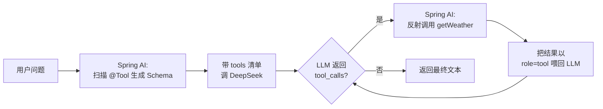
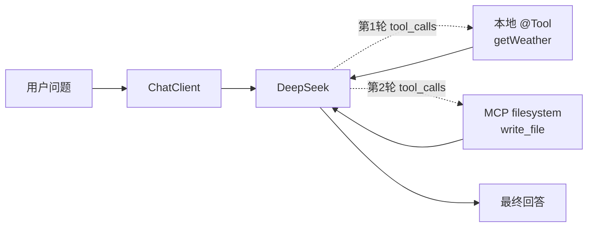

# Spring AI 入门与 MCP 集成

> 📖 **本篇定位**：专题 `10-ai-engineering` 的第 4 篇，把前三篇的"手工业"整合为"工业化"：[01 篇](@ai-engineering-LLM接口与提示词工程) 的裸调 `/chat/completions`、[02 篇](@ai-engineering-RAG架构与工程落地) 的手工 Embedding + 向量库、[03 篇](@ai-engineering-FunctionCalling与Agent范式) 的 `while(tool_calls)` 循环，全部可以被 Spring AI 的 `ChatClient` + `Advisor` + `@Tool` 三件套接管。本篇讲清：**Spring AI 到底是什么、它和 LangChain4j 的哲学差异、怎么用 5 分钟接 DeepSeek、怎么把 03 篇结尾提到的 MCP 生态一行配置接进来**——而不是又教你写一遍 OkHttp。

!!! warning "版本锚点"
    本篇所有代码与坐标以 **Spring AI `1.0.0-M6`**（2025 年主流里程碑版本）为基准。M6 的 API 已基本稳定，但**不是 GA**——坐标从 M6 到 1.0.0 GA 存在少量 artifactId 重命名（如 `spring-ai-mcp-client-spring-boot-starter` → `spring-ai-starter-mcp-client`），升级时需要按官方迁移指南替换。`@Tool` 注解、`ChatClient` / `Advisor` API 本身跨版本稳定。

---

## 1. 类比：从"手搓 HTTP 客户端"到"声明式 AI 开发"

前三篇教你的是"**AI 的 JDBC**"——协议、字段、循环、自己拼；本篇要讲的 Spring AI 是"**AI 的 Spring Data**"——声明式、注解驱动、约定优于配置。

看一张对比表，同样实现"**带会话记忆的智能客服接口**"：

| 维度 | 裸调（01~03 篇） | Spring AI（本篇） |
| :-- | :-- | :-- |
| **HTTP 调用** | `OkHttpClient` + 自己拼 JSON | `ChatClient.prompt().user(...).call()` |
| **会话记忆** | 自己维护 `List<Message>`、手动裁剪 | `MessageChatMemoryAdvisor` 一行加上 |
| **RAG 检索** | 手动 Embedding → 查库 → 拼 Prompt | `QuestionAnswerAdvisor` 一行加上 |
| **工具调用** | `while (tool_calls != null)` 手写循环 | `@Tool` 注解方法，Spring AI 自动回环 |
| **流式响应** | 手撸 SSE 解析 | `ChatClient.stream()` 返回 `Flux<String>` |
| **多模型切换** | 改 URL + 改请求体 | 改一行 `yaml` 配置 |
| **代码行数** | ≈ 80 行 | ≈ 15 行 |

!!! tip "一句话定位"
    **Spring AI 不是"Java 版 LangChain"，它是"让 LLM 变成 `@Bean`"的 Spring 风格 AI 框架。**——哲学差异见 §3，下文会反复呼应这一点。

---

## 2. 为什么需要 Spring AI：三个手工业痛点

不写 Spring AI，你照样能在 Spring Boot 里调 LLM——毕竟 01 篇已经证明了"80 行搞定"。那么 Spring AI 真正消灭的是哪些**结构性痛点**？

### 2.1 痛点一：重复造"胶水代码"

前三篇每篇都在写同一批胶水：

- `ObjectMapper` 拼 `messages` 数组
- `OkHttp` 或 `RestTemplate` 拼 `Authorization` 头
- SSE 流式响应的 `data: ...` 手动解析
- `tool_calls` 回环的 `while` 循环
- 会话历史的 `List<Message>` 手动裁剪

这些代码**零业务价值、高出错率、跨项目零复用**。Spring AI 把它们统一抽成 `ChatClient` 与 `Advisor`，你只写业务。

### 2.2 痛点二：多模型切换成本高

01 篇 §4 的对比表告诉你国产大模型大多走"OpenAI Compatible"协议——但**大多不等于全部**：

- OpenAI `/v1/chat/completions` 是事实标准
- 阿里云百炼某些模型走 `/api/v1/services/aigc/text-generation/generation` + AK/SK 签名
- Claude 原生 API 走 `/v1/messages`，字段名也不同（`content` 里嵌 block 数组）

手工切模型意味着改 URL、改鉴权、改请求体字段。**Spring AI 为每家模型提供了独立的 `ChatModel` 实现**（`OpenAiChatModel` / `AnthropicChatModel` / `OllamaChatModel` / `ZhipuAiChatModel`...），你只改 `yaml` 坐标与配置，业务层 `ChatClient` 完全不动。

### 2.3 痛点三：RAG / Tool / Memory 各自为战

03 篇结尾说过"Function Calling 是 Agent 的必要条件，但不是充分条件"——真实 Agent 需要同时具备 **记忆 + 知识 + 工具**三种能力。手工实现时，这三件事的代码风格完全不同：

- **Memory**：`List<Message>` 的裁剪与摘要
- **RAG**：向量检索 + Prompt 模板拼接
- **Tool**：JSON Schema + 循环调用

Spring AI 用一个统一抽象 `Advisor` 把它们**全部变成对话管道上的切面**——写一个 `@Around`，管你是记忆、RAG 还是审计日志，都能插进同一条流水线。这套设计哲学就是**Spring AOP 在 AI 世界的复刻**，下面 §5 会展开。

---

## 3. Spring AI 定位：它是什么、不是什么

!!! note "Spring AI 一句话定位"
    **Spring AI = LLM / Embedding / VectorStore / Tool / MCP / Memory 的 Spring 化抽象层 + Starter 生态**，目标是让"接 AI"和"接 Redis / MQ"在编码体验上完全一致。

### 3.1 对标产品：Spring AI vs LangChain4j

Java 生态目前有两个主流 AI 框架，很多读者会问"选哪个"。**差异不在功能，在哲学**：

| 对比项 | **Spring AI** | **LangChain4j** |
| :-- | :-- | :-- |
| **发起方** | Spring 官方（Pivotal / VMware Tanzu） | 社区驱动，参考 Python LangChain |
| **设计哲学** | "让 AI 变成 `@Bean`"——走 Spring 原生 AOP / Advisor / BeanPostProcessor | "把 LangChain 的 Chain / Agent 搬到 Java"——走链式编排 |
| **Starter 支持** | 原生 Spring Boot Starter，`yaml` 驱动配置 | 有 Starter 但非一等公民，偏向编程式配置 |
| **主抽象** | `ChatClient` / `Advisor` / `VectorStore` / `ToolCallback` | `ChatLanguageModel` / `AiServices` / `ContentRetriever` |
| **RAG 封装** | `QuestionAnswerAdvisor`（AOP 风格） | `ContentRetriever` + `RetrievalAugmentor`（组装风格） |
| **Tool 风格** | `@Tool` 注解方法（像 `@Scheduled`） | `@Tool` 注解方法（风格相近） |
| **上手成本** | 熟悉 Spring 的**更快**（0.5 天） | 熟悉 LangChain Python 的**更快**（0.5 天） |
| **适合场景** | 已有 Spring Boot 项目、团队是 Spring 技术栈 | 需要复杂 Chain 编排、跨 Spring/非 Spring 项目 |

!!! tip "没有"绝对的更好"，只有"更像你"的"
    如果你团队已经在写 `@Service` `@Autowired`，选 Spring AI 的学习曲线最平；如果你团队刚从 Python LangChain 迁移过来，选 LangChain4j 的心智负担最低。**本专题选 Spring AI 是因为目标读者是 Java 工程师**，不代表技术优劣。

### 3.2 术语家族：`ChatClient` 家族

!!! note "📖 术语家族：`ChatClient`"
    **字面义**：Chat Client = "对话客户端"
    **在本框架中的含义**：Spring AI 对 LLM 对话交互的**高层门面**——开发者只和 `ChatClient` 对话，底层的 `ChatModel`、消息拼装、流式解析、Advisor 编排都被它封装。
    **同家族成员**：

    | 成员 | 职责 | 源码位置 |
    | :-- | :-- | :-- |
    | `ChatModel` | 最底层的 LLM 调用接口，一家模型一个实现（`OpenAiChatModel` / `OllamaChatModel`） | `org.springframework.ai.chat.model.ChatModel` |
    | `ChatClient` | 高层门面，`ChatClient.create(chatModel)` 包装 `ChatModel` | `org.springframework.ai.chat.client.ChatClient` |
    | `ChatClient.Builder` | 链式构建器，配置默认 system / options / advisors / tools | `org.springframework.ai.chat.client.ChatClient$Builder` |
    | `ChatOptions` | 运行时参数（temperature / topP / maxTokens / model） | `org.springframework.ai.chat.prompt.ChatOptions` |
    | `ChatResponse` | LLM 返回体，含 `Generation` 列表与 `Usage` 计费信息 | `org.springframework.ai.chat.model.ChatResponse` |
    | `ChatMemory` | 会话记忆接口，持久化 `List<Message>` | `org.springframework.ai.chat.memory.ChatMemory` |

    **命名规律**：`ChatXxx` 前缀 = "所有和对话相关的"；**Model 是底层、Client 是门面、Options 是参数、Response 是结果、Memory 是存储**——和 Spring Web 的 `RestTemplate` / `RestTemplateBuilder` / `HttpEntity` / `ResponseEntity` 完全同构。

### 3.3 五大核心抽象速查

Spring AI 真正需要理解的抽象只有 5 个，**对应前三篇的每一处手工活**：

| 抽象 | 职责 | 替代前三篇的什么 |
| :-- | :-- | :-- |
| **`ChatModel` / `ChatClient`** | LLM 对话接口统一门面 | 01 篇的 `OkHttpClient` + 拼 `messages` |
| **`EmbeddingModel`** | 向量化统一接口 | 02 篇"调 embedding API"那段 |
| **`VectorStore`** | 向量库统一 API（pgvector / Milvus / Redis / ES 一个接口） | 02 篇各家 SDK 的客户端代码 |
| **`Advisor`** | 对话管道切面（Spring AOP 的 AI 版） | 02 篇的"手动拼 RAG Prompt"、Memory 裁剪 |
| **`ToolCallback` / `@Tool`** | Function Calling 注解化 | 03 篇的 `tools` JSON Schema + `while` 回环 |

---

## 4. 最小可运行 Demo：DeepSeek + Spring AI M6

把 01 篇 §3 的"裸调 DeepSeek"用 Spring AI 重写。**所有代码都能直接跑**，不省略任何关键配置。

### 4.1 项目骨架

**`pom.xml`**（Spring Boot 3.3.x + Spring AI 1.0.0-M6）：

```xml
<properties>
    <java.version>17</java.version>
    <spring-ai.version>1.0.0-M6</spring-ai.version>
</properties>

<dependencyManagement>
    <dependencies>
        <!-- ⭐ Spring AI BOM，统一管理所有 spring-ai-* 依赖的版本 -->
        <dependency>
            <groupId>org.springframework.ai</groupId>
            <artifactId>spring-ai-bom</artifactId>
            <version>${spring-ai.version}</version>
            <type>pom</type>
            <scope>import</scope>
        </dependency>
    </dependencies>
</dependencyManagement>

<dependencies>
    <dependency>
        <groupId>org.springframework.boot</groupId>
        <artifactId>spring-boot-starter-web</artifactId>
    </dependency>
    <!-- 📌 DeepSeek 走 OpenAI 兼容协议，因此用 openai 这个 starter -->
    <dependency>
        <groupId>org.springframework.ai</groupId>
        <artifactId>spring-ai-openai-spring-boot-starter</artifactId>
    </dependency>
</dependencies>

<!-- M6 还在 Spring 里程碑仓库，GA 后可去掉 -->
<repositories>
    <repository>
        <id>spring-milestones</id>
        <url>https://repo.spring.io/milestone</url>
        <snapshots><enabled>false</enabled></snapshots>
    </repository>
</repositories>
```

!!! warning "不要找"spring-ai-deepseek-starter""
    Spring AI 没有单独的 DeepSeek starter——**DeepSeek 官方提供 OpenAI 兼容端点**（`https://api.deepseek.com/v1`），所以直接用 `spring-ai-openai-spring-boot-starter` 配不同的 `base-url` 即可。同样方法接通义千问（DashScope 的兼容模式）、智谱（BigModel 的兼容模式）、月之暗面、DeepSeek 等全系国产模型。

**`application.yml`**：

```yaml
spring:
  ai:
    openai:
      # ⭐ DeepSeek 的 OpenAI 兼容端点（不要加 /v1 后缀，starter 会自动补）
      base-url: https://api.deepseek.com
      api-key: ${DEEPSEEK_API_KEY}         # 📌 通过环境变量注入，不要硬编码
      chat:
        options:
          model: deepseek-chat             # deepseek-chat | deepseek-reasoner
          temperature: 0.7
          max-tokens: 2048
```

### 4.2 最小 Controller

```java
@RestController
@RequestMapping("/ai")
public class ChatController {

    private final ChatClient chatClient;

    // ⭐ Builder 由 Starter 自动装配，注入后自定义默认行为
    public ChatController(ChatClient.Builder builder) {
        this.chatClient = builder
                .defaultSystem("你是一个资深 Java 工程师，回答简洁、给代码示例。")
                .build();
    }

    @GetMapping("/chat")
    public String chat(@RequestParam String q) {
        return chatClient.prompt()
                .user(q)
                .call()             // 📌 同步调用，拿到完整文本
                .content();
    }

    @GetMapping(value = "/stream", produces = MediaType.TEXT_EVENT_STREAM_VALUE)
    public Flux<String> stream(@RequestParam String q) {
        return chatClient.prompt()
                .user(q)
                .stream()           // 📌 流式调用，返回 Flux
                .content();
    }
}
```

### 4.3 启动即用

```bash
export DEEPSEEK_API_KEY=sk-xxx
mvn spring-boot:run

curl 'http://localhost:8080/ai/chat?q=用一句话解释 Spring AOP'
# → Spring AOP 基于动态代理在方法调用前后织入切面逻辑，实现事务、日志等横切关注点。

curl -N 'http://localhost:8080/ai/stream?q=写一个 Hello World 的 Spring Controller'
# → 流式输出，字符逐个涌现
```

**对比 01 篇**：同一个功能，01 篇用 `OkHttp` + `ObjectMapper` + SSE 解析写了 80 多行；这里加上 imports 也就 30 行，**核心业务只有 4 行**（第 18~22 行）。

---

## 5. Advisor 机制：Spring AOP 哲学在 AI 世界的复刻

!!! tip "理解 Advisor 的一把钥匙"
    **Advisor ≈ Spring AOP 的 `@Around`，只不过切的是"LLM 对话链路"而不是"方法调用链路"。**
    你熟悉的 `MethodInterceptor.invoke(invocation)` 能决定"是否放行 / 改参数 / 改返回值"——Advisor 对 `ChatRequest` / `ChatResponse` 做完全一样的事。

### 5.1 术语家族：`Advisor`

!!! note "📖 术语家族：`Advisor`"
    **字面义**：Advisor = "顾问 / 建议者"（源自 Spring AOP 里"建议 + 切点"的组合）
    **在本框架中的含义**：对 `ChatClient.prompt().call()` 整条对话链路提供**前置 / 后置 / 环绕增强**的切面组件——读者发出请求前、模型响应后都能被 Advisor 拦截改写。
    **同家族成员**：

    | 成员 | 职责 | 源码位置 |
    | :-- | :-- | :-- |
    | `CallAroundAdvisor` | 同步调用的环绕切面 | `org.springframework.ai.chat.client.advisor.api.CallAroundAdvisor` |
    | `StreamAroundAdvisor` | 流式调用的环绕切面 | `org.springframework.ai.chat.client.advisor.api.StreamAroundAdvisor` |
    | `MessageChatMemoryAdvisor` | 自动管理会话记忆（`List<Message>` 拼接） | `org.springframework.ai.chat.client.advisor.MessageChatMemoryAdvisor` |
    | `QuestionAnswerAdvisor` | **RAG 标配**——向量检索 + Prompt 注入一步到位 | `org.springframework.ai.chat.client.advisor.QuestionAnswerAdvisor` |
    | `SimpleLoggerAdvisor` | 请求响应日志 | `org.springframework.ai.chat.client.advisor.SimpleLoggerAdvisor` |
    | `SafeGuardAdvisor` | 敏感词 / 越界检测 | `org.springframework.ai.chat.client.advisor.SafeGuardAdvisor` |

    **命名规律**：`XxxAdvisor` = "对对话链路做 Xxx 增强的切面"；**Memory / QuestionAnswer / Logger / SafeGuard 各管一件事**，和 Spring AOP 的 `TransactionInterceptor` / `CacheInterceptor` 分工哲学完全一致。

### 5.2 内置 Advisor 三件套

**三行代码 = 带记忆 + 带 RAG + 带日志的智能客服**：

```java
@Bean
public ChatClient supportBot(ChatClient.Builder builder,
                              ChatMemory chatMemory,
                              VectorStore vectorStore) {
    return builder
        .defaultSystem("你是产品客服，基于提供的资料回答，资料没说就回复'暂无'")
        .defaultAdvisors(
            // ① 会话记忆：自动把最近 N 轮对话拼进 messages
            new MessageChatMemoryAdvisor(chatMemory),
            // ② RAG：自动向量检索并把 top-K 结果拼进 prompt
            new QuestionAnswerAdvisor(vectorStore, SearchRequest.defaults().withTopK(3)),
            // ③ 日志：打印每次请求与响应
            new SimpleLoggerAdvisor()
        )
        .build();
}
```

这三行代码**精确对应 02 篇 §5 手工写的那 200 行 RAG 服务**——Spring AI 用 Advisor 封装了所有胶水，业务代码只描述"**我要什么能力**"而不是"**怎么实现这个能力**"。

### 5.3 自定义 Advisor：敏感词过滤

线上合规场景常见需求：**用户输入包含敏感词时，不送给 LLM，直接返回固定话术**。这就是一个典型的 `CallAroundAdvisor`：

```java
@Component
public class SensitiveWordAdvisor implements CallAroundAdvisor {

    private static final Set<String> BLOCK_WORDS = Set.of("政治敏感词A", "暴力词B");
    private static final String FALLBACK = "抱歉，该问题不在我的服务范围内。";

    @Override
    public AdvisedResponse aroundCall(AdvisedRequest req, CallAroundAdvisorChain chain) {
        // 📌 前置拦截：检查最新一条 user 消息
        String userInput = req.userText();
        for (String word : BLOCK_WORDS) {
            if (userInput.contains(word)) {
                // ⭐ 直接短路，不调用下一个 Advisor，也不调 LLM
                ChatResponse fallback = new ChatResponse(
                    List.of(new Generation(new AssistantMessage(FALLBACK)))
                );
                return new AdvisedResponse(fallback, req.adviseContext());
            }
        }
        // ✅ 放行到下一个 Advisor（最终会打到 ChatModel）
        return chain.nextAroundCall(req);
    }

    @Override
    public String getName() { return "SensitiveWordAdvisor"; }

    @Override
    public int getOrder() { return Ordered.HIGHEST_PRECEDENCE; } // 📌 越小越先执行
}
```

这套代码在 02/03 篇若要手写，得散落在 Controller / Service / 拦截器多处；这里一个类搞定，还能用 `@Order` 和其他 Advisor 排序。**这就是"AI 世界的 Spring AOP"**。

!!! warning "Advisor 的 `order` 很重要"
    典型顺序（数字越小越先执行）：
    **`SensitiveWordAdvisor`（最高优先）→ `MessageChatMemoryAdvisor` → `QuestionAnswerAdvisor` → `SimpleLoggerAdvisor`（最低优先）**。
    顺序错了会出诡异 bug：比如日志 Advisor 放在最前，你记录的是"裁剪前"的 prompt；敏感词 Advisor 放在 RAG 之后，已经多跑了一次向量检索。

---

## 6. Tool Calling：从 03 篇的手写循环到 `@Tool` 注解

03 篇 §3 花了大篇幅讲 `while (response.tool_calls != null)` 回环——Spring AI 把**整段循环消灭**。

### 6.1 最短路径：`@Tool` 注解方法

定义工具就像写 `@Scheduled`：

```java
@Component
public class WeatherTools {

    @Tool(description = "查询指定城市的实时天气。用户询问气温、天气、冷暖时调用。")
    public String getWeather(
            @ToolParam(description = "城市中文名，如：深圳") String city) {
        // ⭐ 这里是你真实的业务实现——调天气 API / 查内部系统 / ...
        return "深圳当前 26°C，多云";
    }

    @Tool(description = "查询用户订单的物流状态")
    public String queryLogistics(
            @ToolParam(description = "订单号，格式 ORD-xxxxxxxx") String orderId) {
        return "订单 " + orderId + " 已送达菜鸟驿站";
    }
}
```

### 6.2 把工具挂到 `ChatClient`

```java
@RestController
public class AgentController {

    private final ChatClient chatClient;
    private final WeatherTools weatherTools;

    public AgentController(ChatClient.Builder builder, WeatherTools weatherTools) {
        this.weatherTools = weatherTools;
        this.chatClient = builder.build();
    }

    @GetMapping("/agent")
    public String agent(@RequestParam String q) {
        return chatClient.prompt()
                .user(q)
                .tools(weatherTools)   // ⭐ 注册工具对象，Spring AI 自动扫描 @Tool
                .call()
                .content();
    }
}
```

请求 `/agent?q=深圳现在多少度？`，Spring AI 内部会自动完成：



**对比 03 篇 §3 的手写循环**：

- 03 篇需要自己维护 `messages.add(toolMessage)` 的 list、自己写 `while` 退出条件、自己防 `max_iterations` 死循环
- 本篇**一行 `.tools(weatherTools)` 全搞定**，Spring AI 内部有默认的 10 次上限保护，可通过 `ToolCallingChatOptions` 调整

!!! tip "03 篇讲的工具设计 6 条硬规约依然适用"
    Spring AI 帮你省了**协议拼接**，但没帮你省**工具设计**。03 篇 §3.4 讲的 `description` 写法、参数枚举、工具数量控制、幂等性、并行调用等规约**依然是最佳实践**——写不清晰的 `@Tool(description=...)`，LLM 照样乱调。

---

## 7. MCP Client 集成：一行配置接入 MCP 生态

03 篇结尾的伏笔：**Function Calling 解决了"LLM 会做事"，但工具生态每家各搞一套**——A 公司写的"天气 Tool"不能直接被 B 公司的 Agent 用。**MCP（Model Context Protocol）就是解决这个互操作问题的开放协议**（Anthropic 2024.11 发布），被 Claude Desktop / OpenClaw / Cursor 等广泛支持。

> 📖 MCP 协议本身（Tool / Resource / Prompt 三件套、传输层、消息格式）将在 [05 篇 MCP协议与OpenClawSkill实战](@ai-engineering-MCP协议与OpenClawSkill实战) 展开。**本节只讲"如何在 Spring AI 里作为 Client 接入现成的 MCP Server"**。

### 7.1 加 starter

```xml
<dependency>
    <groupId>org.springframework.ai</groupId>
    <artifactId>spring-ai-mcp-client-spring-boot-starter</artifactId>
</dependency>
```

!!! warning "artifactId 版本差异"
    - **M6**：`spring-ai-mcp-client-spring-boot-starter`（本文用）
    - **1.0.0 GA 后**：`spring-ai-starter-mcp-client`
    升级时只需改 pom，代码不需要动。

### 7.2 配置 MCP Server

以官方 `filesystem` MCP Server 为例（无需任何 API Key，本地就能跑）：

```yaml
spring:
  ai:
    mcp:
      client:
        stdio:
          connections:
            filesystem:                                 # Server 逻辑名
              command: npx
              args:
                - "-y"
                - "@modelcontextprotocol/server-filesystem"
                - "/tmp/mcp-playground"                 # 📌 允许访问的目录白名单
```

Spring AI 启动时会：

1. 执行 `command + args` 启动 MCP Server 进程
2. 通过 stdio（标准输入输出）按 MCP 协议握手
3. 把 Server 暴露的所有工具（`list_directory` / `read_file` / `write_file` 等）**自动注册为 `ToolCallback`**

### 7.3 和本地 `@Tool` 混用

```java
@Component
public class AgentService {
    private final ChatClient chatClient;

    public AgentService(ChatClient.Builder builder,
                        WeatherTools weatherTools,               // 本地 @Tool
                        ToolCallbackProvider mcpTools) {         // MCP 远端工具
        this.chatClient = builder
            .defaultTools(weatherTools)
            .defaultToolCallbacks(mcpTools.getToolCallbacks())   // ⭐ 合并注入
            .build();
    }

    public String ask(String q) {
        return chatClient.prompt().user(q).call().content();
    }
}
```

请求"**把昨天的天气写进 /tmp/mcp-playground/log.txt**"时，LLM 会自主串联：



**这就是 MCP 的威力**——本地工具和远端 Server 在 LLM 眼里是一视同仁的"按钮"，你不用改任何 Prompt、不用写任何路由逻辑。

---

## 8. 取舍：什么时候别用 Spring AI

Spring AI 是好东西，但不是银弹。按三类场景判断：

| 场景 | 建议 | 理由 |
| :-- | :-- | :-- |
| ✅ Spring Boot 项目 + 需要 RAG / Tool / Memory 多能力组合 | **强烈推荐** | 代码量 1/5，维护成本 1/10 |
| ✅ 需要切换多个 LLM 或向量库做对比 | **强烈推荐** | 换 starter 即可，业务代码零改动 |
| ⚠️ 非 Spring 项目（裸 Java / Quarkus / Helidon） | **不推荐** | 依赖 Spring Boot 自动配置，强行用反而重 |
| ⚠️ 只调一次 LLM 的脚本或临时工具 | **不推荐** | 01 篇的 30 行 OkHttp 反而更轻 |
| ❌ 需要完全自定义协议字段、深度魔改请求体 | **别用** | `ChatOptions` 覆盖不到的字段会变得难处理 |
| ❌ 追求极致 Token 成本（需要精确控制每个 header / body 字节） | **别用** | 抽象层有额外封装，想省就得裸调 |

### 8.1 三个常见坑

**坑 1：M6 版本 API 还在变**
M6 不是 GA，升级到 1.0.0 时会有少量 API 重命名（`BaseAdvisor` → `CallAroundAdvisor` / `StreamAroundAdvisor` 拆分、`Advisor.aroundCall` 方法签名微调等）。**生产项目一定要在 `pom.xml` 锁死版本**，不要用范围版本号。

**坑 2：`QuestionAnswerAdvisor` 的 Prompt 模板不够用**
它内置的 Prompt 模板是通用版本（"根据上下文回答问题"），在**多轮对话 + RAG 融合**场景下容易把历史对话截进向量检索的 query 里导致召回漂移。真实业务建议自己写 Advisor，或者通过 `userTextAdvise` 参数覆盖模板。

**坑 3：Advisor 顺序是个隐性配置**
前面 §5.3 的 warning 已经强调过——`SimpleLoggerAdvisor` 放最前还是最后，打出来的内容完全不同；`MessageChatMemoryAdvisor` 放到 `QuestionAnswerAdvisor` 之后，RAG 检索的 query 就不是"压缩过的问题"而是"带历史噪音的问题"。**顺序错了很难排查，建议每个项目写一份 Advisor 链路图**。

---

## 9. 常见问题 Q&A

**Q1：Spring AI 和 LangChain4j 最终怎么选？**

> **结论**：团队是 Spring 技术栈 → **Spring AI**；团队来自 Python LangChain 或需要跨框架复用 → **LangChain4j**。两者功能 90% 重合，选错也不致命，但哲学不同：Spring AI 用 `Advisor` 走 AOP 风格，LangChain4j 用 `ContentRetriever` 走组装风格。本专题选 Spring AI 纯因为目标读者写 `@Service`。

**Q2：M6 和 1.0.0 GA 会有多大 API 变化？升级风险大吗？**

> **结论**：主抽象（`ChatClient` / `Advisor` / `@Tool`）**稳定**；周边 artifactId 与 starter 坐标**有重命名**（见 §7.1 warning）。升级策略：① 业务代码优先只依赖 `ChatClient` 层；② `pom.xml` 锁死版本；③ GA 发布后先在灰度环境升级验证一周再推全量。

**Q3：DeepSeek 用 OpenAI Starter 接入，所有功能都能用吗？**

> **结论**：`deepseek-chat` 模型**功能齐全**（对话、流式、Function Calling 全支持）；`deepseek-reasoner`（R1 推理模型）**不支持 Function Calling**，调用时会报错。另外 DeepSeek 的部分非 OpenAI 标准字段（如 `reasoning_content` 思维链输出）在 M6 的 `OpenAiChatModel` 里还拿不到，需要自己注册 `HttpClient` 拦截器抓响应体。

**Q4：`QuestionAnswerAdvisor` 封装的 RAG 够用吗？什么时候必须自己写？**

> **结论**：**POC 和简单客服够用，生产 RAG 不够**。不够用的典型场景：① 需要 hybrid search（BM25 + 向量融合，参考 02 篇 §6）——内置 Advisor 只会走向量；② 需要 reranker 精排——内置无此阶段；③ 多轮对话要先做 query 改写——内置直接把 user 最新消息当 query。自己写 Advisor 并不难，继承 `CallAroundAdvisor` 即可。

**Q5：MCP Client 配了多个 Server，工具同名冲突怎么办？**

> **结论**：Spring AI 会自动在工具名前加 Server 前缀（如 `filesystem_read_file`、`github_read_file`），**不会撞名**。但 LLM 可能因为名字变长而选择困难——建议：① 精简 Server 数量，按业务场景动态启用；② 在 `@Tool(description=...)` 的描述里突出业务差异（"从本地磁盘读 / 从 GitHub 仓库读"），让 LLM 能清晰区分。

---

## 10. 一句话口诀

> **💡 Spring AI 不是"Java 版 LangChain"，它是让 LLM 变成 `@Bean` 的 Spring 风格 AI 框架。**
> **`ChatClient` + `Advisor` + `@Tool` + MCP Starter 四件套，覆盖 90% 企业 AI 场景**——记忆、知识、工具、生态，一个 `@Bean` 全搞定。

---

## 附录：和前后文档的关系

| 本篇用到的前置知识 | 来源 |
| :-- | :-- |
| `messages` 协议、`role` 家族、流式 SSE | [01 篇 §3](@ai-engineering-LLM接口与提示词工程) |
| Embedding、VectorStore、Chunking、Hybrid Search | [02 篇 §3~§6](@ai-engineering-RAG架构与工程落地) |
| Function Calling 三元闭环、工具设计 6 规约、Agent Runtime | [03 篇 §2~§4](@ai-engineering-FunctionCalling与Agent范式) |

| 本篇未展开、延伸阅读 | 去处 |
| :-- | :-- |
| MCP 协议本身（Tool / Resource / Prompt 三件套） | [05 篇](@ai-engineering-MCP协议与OpenClawSkill实战) |
| 写一个 MCP Server（网易云歌单 Skill 实战） | [05 篇](@ai-engineering-MCP协议与OpenClawSkill实战) |
| Spring AOP 原生机制（对比理解 Advisor） | [AOP面向切面编程](@spring-核心基础-AOP面向切面编程) |
