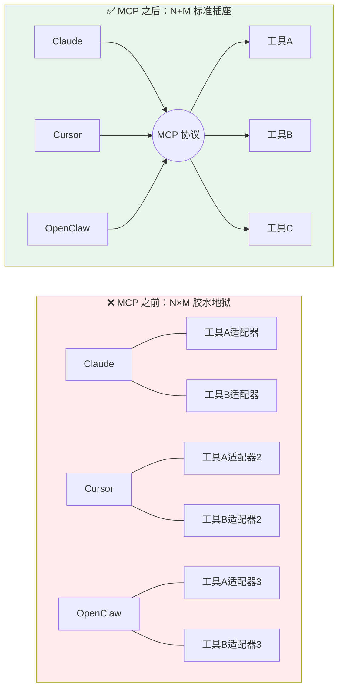
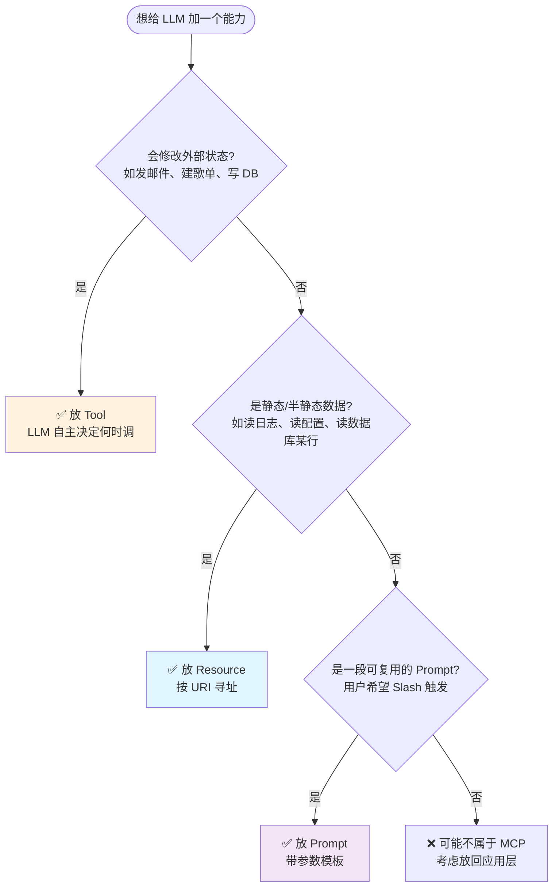
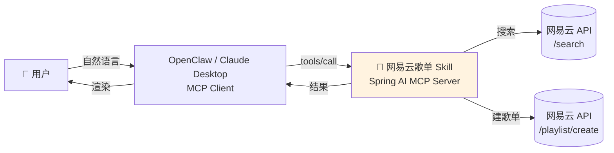
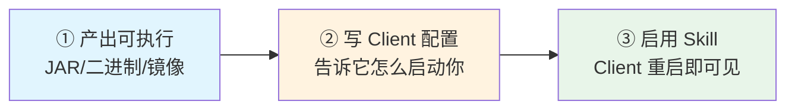
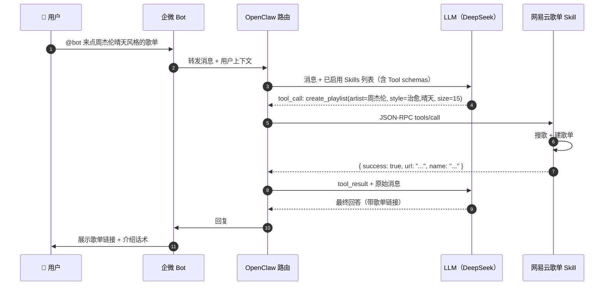

# MCP 协议与 OpenClaw Skill 实战

!!! info "**MCP 协议与 OpenClaw Skill 实战 一句话口诀**"
    **MCP = LLM 世界的 USB-C**——在它之前每家 Agent 给每个工具写一套胶水（N×M 问题），有了它工具一次开发、所有 Agent 可用（N+M 问题）。

    **MCP 三件套各司其职**：`Tool` 让 LLM "做事"（有副作用）、`Resource` 让 LLM "读数据"（只读）、`Prompt` 让用户"选模板"（可复用 Prompt 片段）——选型决策树看一次就够用一辈子。

    **Skill ≈ 打包好的 MCP Server**——协议层统一是 MCP，封装层是各家 Agent 平台（OpenClaw / Claude Desktop / Cursor）自定义的元数据，写一次、跨平台复用。

    **Spring AI 写 MCP Server 和写 `@Service` 一样简单**——`spring-ai-mcp-server-spring-boot-starter` 自动把 `@Tool` 方法暴露为 MCP Tool，开发者只关心业务逻辑。

    **生产级 Skill 的 6 条规约一条都别省**：描述写"使用时机"、参数强校验、幂等、鉴权隔离、结构化错误、速率保护——每一条都是血泪踩出来的。

> 📖 **边界声明**：本文聚焦"**如何按 MCP 协议规范写一个可跨平台复用的生产级 Skill**"，以下主题请见对应专题：
>
> - LLM 调用协议与 Token 计费 → [LLM接口与提示词工程](@ai-engineering-LLM接口与提示词工程)
> - RAG 数据同步、Chunking、召回融合 → [RAG架构与工程落地](@ai-engineering-RAG架构与工程落地)
> - Function Calling 协议本体与 Agent 范式 → [FunctionCalling与Agent范式](@ai-engineering-FunctionCalling与Agent范式)
> - Spring AI 的 `ChatClient` / `Advisor` / `VectorStore` → [SpringAI入门与MCP集成](@ai-engineering-SpringAI入门与MCP集成)
> - MCP 协议底层 JSON-RPC 帧格式的逐字段解析 → 留给未来的《MCP 源码深度解析》篇（暂未写）

---

## 1. 类比：从"孤岛工具"到"USB-C 时代"

2024 年 11 月之前，AI 工具生态有一个尴尬的现状：

- **Claude Desktop** 有自己的 MCP 雏形
- **Cursor** 有自己的插件协议
- **OpenAI GPTs** 有 Actions 规范
- **国内各家 Agent 平台**（OpenClaw / Coze / Dify）各搞一套 Skill 定义

**后果就是 N×M 问题**：有 N 家 Agent 平台、M 个工具，就要写 **N×M 个适配器**——同一个"查订单"能力，要给 Claude 写一遍、给 Cursor 写一遍、给 OpenClaw 再写一遍。



**MCP（Model Context Protocol）= LLM 世界的 USB-C**：

- USB-C 之前：手机厂商各搞接口（Micro-USB / Lightning / Type-C）→ 买一款手机配一堆线
- USB-C 之后：统一接口 → 一根线走天下
- **MCP 之于 AI 工具生态就是同一件事**：统一工具调用协议 → 一个 Skill 多平台复用

!!! tip "Skill 与 MCP Server 的关系"
    **协议层：MCP**（统一规范，Anthropic 2024.11 发布、各家跟进）
    **封装层：Skill**（各家 Agent 平台对"一个可上架的 MCP Server"的元数据封装）
    **对开发者的含义**：**写 MCP Server = 写 Skill 的 90%**，剩下 10% 是各平台的上架元数据（logo / 简介 / 权限声明 / 分类标签）。

---

## 2. MCP 协议规范

### 2.1 MCP 三件套：`Tool` / `Resource` / `Prompt`

!!! note "📖 术语家族：`MCP 三件套`"
    **字面义**：协议规定 MCP Server 可以向 Client 暴露三种能力基元（primitives）。
    **在 MCP 中的含义**：对应 LLM 在对话中需要的三种交互——"做事"、"读数据"、"选模板"，三者职责正交、不可混用。
    **同家族成员**：

    | 成员 | 职责一句话 | 谁决定调用 | 典型示例 | 有无副作用 |
    | :-- | :-- | :-- | :-- | :-- |
    | **`Tool`** | 让 LLM"**做事**" | LLM 自主决定（基于 description） | `create_playlist(songs)`、`send_email(to, body)` | ✅ 有副作用 |
    | **`Resource`** | 让 LLM"**读数据**" | Client 或 LLM 按 URI 读取 | `file://logs/2025-04-22.txt`、`db://orders/1001` | ❌ 只读 |
    | **`Prompt`** | 让用户"**选模板**" | 用户主动触发（如 Slash Command） | `/代码审查`、`/生成歌单` | 参数化模板 |

    **命名规律**：三者都是"协议原语"，通过 JSON-RPC 的 `tools/list`、`resources/list`、`prompts/list` 分别暴露；`tools/call`、`resources/read`、`prompts/get` 分别调用。

**选型决策树**（新增一个能力时按此判断放在哪一类）：



> 📌 **常见错误**：把"查订单状态"写成 `Tool` 而不是 `Resource`——查询是只读的，更适合 `Resource`，能让 Client 做缓存、批量预取、URI 引用。一个判断技巧：**如果重复调用 100 次结果一样，通常该放 `Resource`**。

### 2.2 三种 Transport：`stdio` / `SSE` / `Streamable HTTP`

!!! note "📖 术语家族：`Transport`"
    **字面义**：传输层，MCP 规范允许 Server/Client 通过不同物理通道通信。
    **在 MCP 中的含义**：协议本体是 JSON-RPC 消息，`Transport` 决定这些消息"跑在什么管道上"。
    **同家族成员**：

    | 成员 | 通道 | 适用场景 | 现状（2025.04） |
    | :-- | :-- | :-- | :-- |
    | **`stdio`** | 进程标准输入输出 | 本地 Server（Claude Desktop / OpenClaw 内网 / Cursor） | ✅ 稳定主流 |
    | **`SSE`** | Server-Sent Events over HTTP | 远程 Server（早期远程方案） | ⚠️ 2025.03 协议已标记废弃，新项目不推荐 |
    | **`Streamable HTTP`** | 双向流式 HTTP | 远程 Server（新一代推荐） | ✅ 2025.03 后新规范，SDK 逐步跟进 |

    **命名规律**：`stdio` 走进程通道、`SSE`/`Streamable HTTP` 走网络通道——**本地优先用 stdio（零网络开销、免鉴权），跨机器用 Streamable HTTP**。

**Transport 选型表**：

| 场景 | 推荐 | 原因 |
| :-- | :-- | :-- |
| **本地调试 / 个人工具** | `stdio` | 零配置、免鉴权、启停快 |
| **企业内部 Skill 上架** | `stdio`（平台代管进程）或 `Streamable HTTP`（独立服务） | 平台侧隔离，Server 只管业务 |
| **SaaS 化对外提供能力** | `Streamable HTTP` | 支持鉴权、水平扩展、限流 |
| **跨防火墙远程调用** | `Streamable HTTP` | 普通 HTTP 即可穿透 |
| **新项目、不考虑向后兼容** | ❌ 不要选 `SSE` | 规范已废弃，SDK 正在移除 |

### 2.3 一次 MCP 调用的完整报文

以最常用的 `tools/call` 为例，展示 Client → Server 一次完整交互（JSON-RPC 2.0 格式）：

**① Client 发起调用**：

```json
{
  "jsonrpc": "2.0",
  "id": 42,
  "method": "tools/call",
  "params": {
    "name": "create_playlist",
    "arguments": {
      "artist": "周杰伦",
      "style": "晴天风格",
      "size": 15
    }
  }
}
```

**② Server 返回结果**：

```json
{
  "jsonrpc": "2.0",
  "id": 42,
  "result": {
    "content": [
      {
        "type": "text",
        "text": "✅ 歌单已创建：https://music.163.com/playlist?id=987654321\n共 15 首，含《晴天》《稻香》《蒲公英的约定》..."
      }
    ],
    "isError": false
  }
}
```

**协议关键点**：

- **`method`** = MCP 规定的三件套动词：`tools/list`、`tools/call`、`resources/list`、`resources/read`、`prompts/list`、`prompts/get`
- **`isError: true/false`** = **Tool 执行失败要走这个字段**，**不要**抛异常让 Client 看到 JSON-RPC 层的 `error`——那是协议层错误（如方法不存在），不是业务错误
- **`content`** 支持多种 `type`：`text` / `image` / `resource`，一个 Tool 可以返回多块内容（比如"建完歌单 + 附上封面图"）

> 📖 `initialize` / `capabilities` 协商、`notifications/tools/list_changed` 等控制面消息已放入未来的《MCP 源码深度解析》篇，本文只给业务开发者最常用的 `tools/call`。

---

## 3. 用 Spring AI 写一个 MCP Server：网易云歌单 Skill

下面进入本篇的重头戏——**从零写一个可上架的 MCP Server**。这个 Skill 实现用户自然语言描述的歌单自动创建：

- 用户："来点周杰伦晴天风格的歌单，15 首" → LLM 解析偏好 → Skill 搜歌 → 创建歌单 → 返回链接

### 3.1 架构与数据流



**职责分层**：

| 层 | 组件 | 职责 |
| :-- | :-- | :-- |
| **协议层** | Spring AI MCP Starter | 自动处理 JSON-RPC 消息、工具列表暴露、参数反序列化 |
| **业务层** | `NeteasePlaylistTools` | 写 `@Tool` 方法，只关心业务逻辑 |
| **外部调用** | `NeteaseApiClient` | 封装网易云开放 API（WebClient + 超时 + 重试） |

### 3.2 项目骨架：`pom.xml`

基于 Spring Boot 3.3 + Spring AI 1.0.0-M6（与 04 篇版本对齐）：

```xml
<?xml version="1.0" encoding="UTF-8"?>
<project xmlns="http://maven.apache.org/POM/4.0.0">
    <modelVersion>4.0.0</modelVersion>

    <parent>
        <groupId>org.springframework.boot</groupId>
        <artifactId>spring-boot-starter-parent</artifactId>
        <version>3.3.5</version>
    </parent>

    <groupId>com.example</groupId>
    <artifactId>netease-playlist-skill</artifactId>
    <version>1.0.0</version>

    <properties>
        <java.version>17</java.version>
        <spring-ai.version>1.0.0-M6</spring-ai.version>
    </properties>

    <dependencyManagement>
        <dependencies>
            <dependency>
                <groupId>org.springframework.ai</groupId>
                <artifactId>spring-ai-bom</artifactId>
                <version>${spring-ai.version}</version>
                <type>pom</type>
                <scope>import</scope>
            </dependency>
        </dependencies>
    </dependencyManagement>

    <dependencies>
        <!-- ⭐ 核心：MCP Server Starter（stdio 模式） -->
        <dependency>
            <groupId>org.springframework.ai</groupId>
            <artifactId>spring-ai-mcp-server-spring-boot-starter</artifactId>
        </dependency>

        <!-- 远程模式备选：WebFlux + SSE/Streamable HTTP -->
        <!-- <dependency>
            <groupId>org.springframework.ai</groupId>
            <artifactId>spring-ai-starter-mcp-server-webflux</artifactId>
        </dependency> -->

        <!-- 调外部 HTTP API -->
        <dependency>
            <groupId>org.springframework.boot</groupId>
            <artifactId>spring-boot-starter-webflux</artifactId>
        </dependency>

        <!-- 参数校验 -->
        <dependency>
            <groupId>org.springframework.boot</groupId>
            <artifactId>spring-boot-starter-validation</artifactId>
        </dependency>
    </dependencies>

    <repositories>
        <!-- Spring AI M6 仍在里程碑仓库 -->
        <repository>
            <id>spring-milestones</id>
            <url>https://repo.spring.io/milestone</url>
        </repository>
    </repositories>
</project>
```

### 3.3 `application.yml`：Server 元数据

```yaml
spring:
  application:
    name: netease-playlist-skill
  # 📌 stdio 模式必须关闭 Banner 和控制台日志，否则会污染 JSON-RPC 流
  main:
    banner-mode: off
    web-application-type: none
  ai:
    mcp:
      server:
        name: netease-playlist            # ⭐ Skill 唯一标识
        version: 1.0.0
        type: sync                        # sync | async
        # stdio 模式无需额外配置；webflux 模式需要 transport: webflux
  # 📌 日志走 stderr（stdio 模式下 stdout 被 MCP 协议占用）
logging:
  file:
    name: logs/skill.log
  pattern:
    console: ""   # 禁用 console appender

# 网易云 API 配置（示例）
netease:
  api:
    base-url: https://music.163.com/api
    timeout-ms: 3000
    cookie: ${NETEASE_COOKIE:}          # 从环境变量注入
```

!!! warning "stdio 模式的致命坑：stdout 不能有任何杂质"
    MCP stdio 模式下，**Server 进程的 `stdout` 是 JSON-RPC 消息通道**——任何 `System.out.println`、Spring Boot Banner、logback 的 console appender 输出都会被 Client 当作非法报文，导致连接直接断开。
    **三条强制规约**：① `banner-mode: off`；② `logging.pattern.console: ""` 禁用控制台日志；③ 业务代码**禁用** `System.out.println`，统一用 `Logger`（日志文件走 stderr 或 file）。

### 3.4 `Tool` 实现：`@Tool` 注解方法

```java
package com.example.netease.skill;

import org.springframework.ai.tool.annotation.Tool;
import org.springframework.ai.tool.annotation.ToolParam;
import org.springframework.stereotype.Service;
import jakarta.validation.constraints.*;

/**
 * 网易云歌单相关的 MCP Tools
 * ⭐ Spring AI 会扫描所有 @Tool 方法并自动暴露为 MCP Tool
 */
@Service
public class NeteasePlaylistTools {

    private final NeteaseApiClient api;

    public NeteasePlaylistTools(NeteaseApiClient api) {
        this.api = api;
    }

    /**
     * Tool 1：创建歌单
     * 📌 description 要写"使用时机"，这是 LLM 判断调不调此 Tool 的唯一依据
     */
    @Tool(description = """
            当用户要求【生成/推荐/创建】一个网易云歌单时调用此工具。
            输入艺人与风格关键词，自动搜索并创建公开歌单。
            使用示例：
              - "来点周杰伦晴天风格的歌单" → artist=周杰伦, style=晴天,治愈, size=15
              - "给我 20 首 Taylor Swift 的情歌" → artist=Taylor Swift, style=情歌, size=20
            不要用于"只是搜歌"或"只是查艺人信息"的场景，那些场景请用 search_songs 或 get_artist_info。
            """)
    public PlaylistResult createPlaylist(
            @ToolParam(description = "艺人名，支持中英文，如：周杰伦 / Taylor Swift")
            @NotBlank String artist,

            @ToolParam(description = "风格关键词，多个用逗号分隔，如：流行,摇滚,治愈")
            @NotBlank String style,

            @ToolParam(description = "歌曲数量，默认 15，范围 [1, 50]", required = false)
            Integer size
    ) {
        int finalSize = (size == null) ? 15 : Math.max(1, Math.min(50, size));

        try {
            // 1. 搜索候选歌曲
            var songs = api.searchSongs(artist, style, finalSize * 2); // 多搜一倍留筛选余量
            if (songs.isEmpty()) {
                return PlaylistResult.failure("未搜到匹配歌曲，换个关键词试试");
            }

            // 2. 按热度+风格相似度筛选到目标数量
            var picked = songs.stream()
                    .sorted((a, b) -> Integer.compare(b.playCount(), a.playCount()))
                    .limit(finalSize)
                    .toList();

            // 3. 创建歌单
            var name = "%s · %s 风格精选".formatted(artist, style);
            var playlist = api.createPlaylist(name, picked);

            return PlaylistResult.success(playlist.url(), picked.size(), name);

        } catch (NeteaseApiException e) {
            // ⭐ 业务异常要转成结构化错误返回，不要抛给 MCP 层
            return PlaylistResult.failure("网易云 API 调用失败：" + e.getMessage());
        }
    }

    /**
     * Tool 2：搜歌（不建歌单，只返候选）
     * 📌 轻量只读操作，也可以考虑放到 Resource（但为演示完整性，此处保留为 Tool）
     */
    @Tool(description = """
            根据艺人与风格搜索歌曲候选，返回歌曲列表但不创建歌单。
            适用于"帮我找一下 XX 的歌"这种单纯搜索场景。
            """)
    public SearchResult searchSongs(
            @ToolParam(description = "艺人名") @NotBlank String artist,
            @ToolParam(description = "风格关键词") String style,
            @ToolParam(description = "返回数量，默认 10") Integer size
    ) {
        int limit = (size == null) ? 10 : Math.min(size, 30);
        var songs = api.searchSongs(artist, style, limit);
        return new SearchResult(songs);
    }
}
```

**返回值类型（Record 定义）**：

```java
// ⭐ 结构化返回：success / failure 都走统一结构，永远不抛异常出 MCP 边界
public record PlaylistResult(
        boolean success,
        String url,         // 成功时：歌单链接
        Integer songCount,  // 成功时：歌曲数
        String name,        // 成功时：歌单名
        String reason       // 失败时：原因
) {
    public static PlaylistResult success(String url, int count, String name) {
        return new PlaylistResult(true, url, count, name, null);
    }
    public static PlaylistResult failure(String reason) {
        return new PlaylistResult(false, null, null, null, reason);
    }
}

public record SearchResult(List<SongInfo> songs) {}
public record SongInfo(Long id, String name, String artist, int playCount) {}
```

### 3.5 `Resource` 实现：暴露歌单模板

除了"做事"的 Tool，还可以暴露只读 Resource，让 Client 或 LLM 按 URI 读取模板：

```java
@Component
public class PlaylistResourceProvider {

    /**
     * ⭐ Resource 通过 MCP Server 的资源注册点暴露
     * URI 协议：playlist-template://{style}
     * 典型用途：LLM 或 Client 读取一段参考模板作为上下文
     */
    @McpResource(uri = "playlist-template://{style}",
                 name = "歌单风格模板",
                 description = "按风格返回一段推荐描述模板，LLM 可用作歌单简介素材")
    public TextResourceContents getTemplate(String style) {
        var text = switch (style) {
            case "治愈"   -> "下雨天的窗台、热茶、不必回信的朋友——治愈是给自己留一点不被打扰的时间。";
            case "摇滚"   -> "一把失真吉他、一把咆哮的嗓子——摇滚是把不肯低头的那口气唱出来。";
            case "情歌"   -> "深夜里翻出旧照片——情歌是那些说不出口的话，借别人的调子唱给自己听。";
            default      -> "音乐本身就是故事。";
        };
        return TextResourceContents.builder()
                .uri("playlist-template://" + style)
                .mimeType("text/plain")
                .text(text)
                .build();
    }
}
```

### 3.6 `Prompt` 实现：预置"生成歌单"模板

`Prompt` 让用户在 Client 中通过 Slash Command（如 `/生成歌单`）触发一段预定义 Prompt：

```java
@Component
public class PlaylistPromptProvider {

    @McpPrompt(name = "generate_playlist_prompt",
               description = "生成歌单的 Prompt 模板，引导 LLM 按规则调 create_playlist")
    public GetPromptResult buildPrompt(
            @McpArg(name = "mood", description = "当前心情，如：开心/难过/想念") String mood
    ) {
        var text = """
                你是一个资深音乐编辑。用户当前心情是：%s。
                请遵循以下规则推荐并创建歌单：
                1. 根据心情选择 1~2 位代表性艺人与 2~3 个风格关键词；
                2. 调用 create_playlist 工具创建歌单，数量控制在 15~20 首；
                3. 用一段温柔但不煽情的话向用户介绍这个歌单。
                """.formatted(mood);

        return GetPromptResult.builder()
                .description("心情匹配的歌单生成流程")
                .addMessage(PromptMessage.user(text))
                .build();
    }
}
```

### 3.7 本地调试：用 MCP Inspector 跑通

**MCP Inspector** 是 Anthropic 官方调试工具，可视化查看 Server 暴露的所有 Tool/Resource/Prompt 并手动触发。

```bash
# 1. 打包 Skill
mvn clean package

# 2. 启动 Inspector 并连到你的 Skill（stdio 模式）
npx @modelcontextprotocol/inspector \
  java -jar target/netease-playlist-skill-1.0.0.jar

# 3. 浏览器自动打开 http://localhost:5173
#    在 "Tools" 标签页可以看到 create_playlist / search_songs
#    填入参数 → 点 "Call" → 看返回
```

**典型调试输出**（Inspector 的 Tool Call 面板）：

```txt
▶ Call: create_playlist
  arguments: { "artist": "周杰伦", "style": "治愈,晴天", "size": 15 }

◀ Response:
  {
    "success": true,
    "url": "https://music.163.com/playlist?id=987654321",
    "songCount": 15,
    "name": "周杰伦 · 治愈,晴天 风格精选"
  }
  isError: false
  duration: 1243ms
```

---

## 4. 发布到 OpenClaw（与通用 MCP Client）

> 📌 OpenClaw 内网版只有腾讯员工可访问，外部读者可将其视为"**一个典型的 MCP Client 平台**"；本节给出的发布流程在 Claude Desktop、Cursor、Cherry Studio 等 Client 上同样适用。

### 4.1 通用 MCP Server 发布三步法



**以 Claude Desktop 为例**——编辑 `claude_desktop_config.json`：

```json
{
  "mcpServers": {
    "netease-playlist": {
      "command": "java",
      "args": [
        "-jar",
        "/path/to/netease-playlist-skill-1.0.0.jar"
      ],
      "env": {
        "NETEASE_COOKIE": "your-cookie-here"
      }
    }
  }
}
```

**以 Cursor 为例**——编辑 `~/.cursor/mcp.json`：结构几乎一致，`command` + `args` + `env`。

### 4.2 OpenClaw 上架：Skill 元数据

OpenClaw 作为企业 Agent 平台，除了通用 MCP Server 配置外还需要一份 Skill 元数据（各 Agent 平台大同小异）：

| 元数据字段 | 说明 | 示例 |
| :-- | :-- | :-- |
| `skill_name` | 唯一标识 | `netease-playlist` |
| `display_name` | 展示名 | "网易云歌单生成器" |
| `description` | 一句话说明 | "根据心情和偏好自动生成网易云歌单" |
| `category` | 分类标签 | `娱乐 / 内容创作` |
| `transport` | 传输模式 | `stdio` / `http` |
| `startup_cmd` | 启动命令 | `java -jar ...` |
| `required_env` | 必需环境变量 | `NETEASE_COOKIE` |
| `permissions` | 权限声明 | `network:music.163.com`（平台侧做沙箱隔离） |

**OpenClaw 端到端流程**（以企微 Bot 召唤为例）：



### 4.3 调试：Client 看不到我的 Skill 怎么办

按此 Checklist 自查：

- [ ] ✅ JAR 能独立 `java -jar xxx.jar` 启动，且无任何 stdout 输出（stdio 模式铁律）
- [ ] ✅ Client 配置文件的 JSON 格式合法（JSON 多一个逗号就全挂）
- [ ] ✅ `command` 是绝对路径或已在 `PATH`，`java` 版本 ≥ 17
- [ ] ✅ `args` 数组中 JAR 路径绝对、文件存在、有执行权限
- [ ] ✅ 环境变量齐全（`NETEASE_COOKIE` 等），不要依赖 Client 继承 shell 环境
- [ ] ✅ Client **完全退出**后重启（后台进程不刷新 Skill 列表）
- [ ] ✅ 查看 Client 的日志（Claude Desktop：`~/Library/Logs/Claude/mcp*.log`）

---

## 5. 生产级 Skill 的 6 条工程规约

这 6 条是笔者在线上跑 Skill 时踩过坑后总结的硬性规约，**一条都别省**。

### 规约 1：Tool description 写"使用时机"而不是"是什么"

LLM 决定要不要调你的 Tool，**唯一**依据就是 `description`。写得模糊 → LLM 猜不到何时该用 → 你的 Skill 成摆设。

| ❌ 反例 | ✅ 正例 |
| :-- | :-- |
| `"创建歌单"` | `"当用户要求【生成/推荐/创建】一个网易云歌单时调用此工具。输入示例：..."` |
| `"查询订单"` | `"当用户询问【某个订单号的状态/详情/物流】时调用。不要用于查询全部订单，那用 list_orders。"` |

**写法公式**：`当用户【动作模式1 / 动作模式2 / ...】时调用 + 输入示例 + 不适用场景`。

### 规约 2：参数强校验 + 显式默认值

```java
// ❌ 不校验：LLM 传 size=-1 也会执行，浪费 API 调用
public PlaylistResult createPlaylist(Integer size) { ... }

// ✅ 正确：JSR-303 + 代码兜底
public PlaylistResult createPlaylist(
    @ToolParam(description = "歌曲数量，[1, 50]", required = false)
    @Min(1) @Max(50) Integer size
) {
    int finalSize = size == null ? 15 : size;
    // ... ⭐ LLM 不传该参数也能正常走
}
```

### 规约 3：幂等：重复调用不应产生重复副作用

LLM 会在网络重试 / 用户追问时重复发起同参 `tools/call`。**创建类 Tool 必须幂等**，否则会出现：

- 用户问一次 → 建了 3 个一模一样的歌单
- 付款类 Tool 重复扣款

**落地手法**（以歌单为例）：同参数 10 分钟内走缓存，返回同一个歌单 URL：

```java
@Tool(description = "...")
public PlaylistResult createPlaylist(String artist, String style, Integer size) {
    var cacheKey = "%s|%s|%d".formatted(artist, style, size == null ? 15 : size);
    var cached = cache.getIfPresent(cacheKey);
    if (cached != null) return cached;

    var result = doCreatePlaylist(artist, style, size);
    if (result.success()) cache.put(cacheKey, result);
    return result;
}
```

### 规约 4：鉴权隔离：不要全局共享 API Key

**反例**：Skill 进程全局持有一个 `NETEASE_COOKIE` → 所有用户建的歌单挂在开发者自己账号下。

**正例**：通过 MCP 的 **Roots 机制** 或 Client 传入的用户上下文按用户隔离：

```java
@Tool(description = "...")
public PlaylistResult createPlaylist(
    @ToolParam String artist,
    @ToolParam String style,
    Integer size,
    McpSyncServerExchange exchange  // ⭐ Spring AI 提供的上下文句柄
) {
    var userCookie = exchange.getRequestContext()
                              .getHeader("X-User-Cookie");
    return api.createPlaylist(userCookie, artist, style, size);
}
```

### 规约 5：错误结构化回传，不要抛异常出 MCP 边界

| ❌ 反例 | ✅ 正例 |
| :-- | :-- |
| Tool 里 `throw new RuntimeException("API 挂了")` → MCP 层返回 JSON-RPC `error` → LLM 拿到的是协议错误，无法组织人话 | `return PlaylistResult.failure("网易云 API 暂时不可用，请稍后重试")` → LLM 看到结构化失败原因，能对用户说人话 |

**判断标准**：**业务失败走 return，协议失败才走 throw**。

### 规约 6：速率保护 + 熔断

外部 API 挂了，你的 Skill 也要能降级。推荐用 **Resilience4j**：

```java
@CircuitBreaker(name = "netease", fallbackMethod = "fallback")
@RateLimiter(name = "netease")
@Tool(description = "...")
public PlaylistResult createPlaylist(...) { ... }

private PlaylistResult fallback(String artist, String style, Integer size, Throwable t) {
    return PlaylistResult.failure("网易云服务繁忙，请稍后再试（已触发熔断）");
}
```

**`application.yml` 配置**：

```yaml
resilience4j:
  ratelimiter:
    instances:
      netease:
        limit-for-period: 5       # 单用户 5 QPS
        limit-refresh-period: 1s
  circuitbreaker:
    instances:
      netease:
        failure-rate-threshold: 50   # 错误率 50% 触发熔断
        wait-duration-in-open-state: 30s
```

---

## 6. 踩坑 Checklist

| # | 踩坑现象 | 根本原因 | 解决 |
| :-- | :-- | :-- | :-- |
| 1 | Client 连上 Server 后立即断开 | stdout 被污染（Banner / println） | `banner-mode: off` + 禁用 console appender |
| 2 | LLM 不调我的 Tool，自己瞎编 | description 写得太抽象 | 按规约 1 改成"使用时机 + 示例" |
| 3 | 中文 description 召回率差 | 某些 LLM 对中文 tool schema 不敏感 | 可尝试双语：英文 description + 中文注释示例 |
| 4 | `@Tool` 方法 return `void` 报错 | MCP 规定 Tool 必须有返回值 | 至少返回 `{"success": true}` |
| 5 | 新增/改了 Tool 但 LLM 不知道 | Client 缓存工具列表 | 发 `notifications/tools/list_changed`，或让 Client 重启 |
| 6 | 网易云 API 挂死拖累 Skill | 未加超时 / 熔断 | 按规约 6 加 Resilience4j |
| 7 | 多用户共用同一个账号 | 未按规约 4 隔离鉴权 | 从 MCP Exchange 取用户上下文 |
| 8 | 升级 Spring AI 版本后 `@Tool` 失效 | API 迁移：旧版 `@AiFunction` → 新版 `@Tool` | 对齐当前版本（1.0.0-M6）的 API |
| 9 | stdio 模式日志看不到 | console 被禁 + 没配 file appender | `logging.file.name` 落地到文件 |
| 10 | Tool 参数里用了复杂嵌套对象 LLM 填不对 | JSON Schema 太复杂 | 扁平化参数，必要时拆成两个 Tool |

---

## 7. Q&A：排查与选型

**Q1（选型）：Tool / Resource / Prompt 怎么选？**

> 三步决策：**有副作用 → Tool；只读且有稳定 URI → Resource；是可复用 Prompt 模板 → Prompt**。最常见的误用是把"只读查询"塞到 Tool 里——这让 Client 失去了缓存、批量预取、按 URI 引用的能力。

**Q2（选型）：stdio / SSE / Streamable HTTP 怎么选？**

> **本地/企业内部 → stdio**（零网络开销、免鉴权，是 2025.04 生态最成熟的模式）；**SaaS 对外提供 → Streamable HTTP**（支持鉴权、水平扩展）；**坚决不要选 SSE**（2025.03 协议已废弃，SDK 正在移除）。

**Q3（排查）：Claude Desktop / OpenClaw 看不到我的 Tool 怎么办？**

> 按 §4.3 的 Checklist 自查。最常见的三个原因（按概率排序）：① stdout 有杂质导致连接秒断；② Client 没完全重启；③ JSON 配置格式错误。**定位手法**：用 MCP Inspector（§3.7）直接连 Skill，能连上 → 问题在 Client 配置；连不上 → 问题在 Skill 本身。

**Q4（排查）：LLM 总是不调我的 Tool 怎么办？**

> 99% 是 `description` 写得不好。**用 LLM 自检法**：把你的 tool 的 schema（name + description + params）贴给 ChatGPT / Claude，问它"用户什么样的输入会触发这个 tool"，如果它回答得不靠谱，那线上 LLM 也调不对。按规约 1 改成"使用时机 + 输入示例 + 不适用场景"格式。

**Q5（选型）：Skill 要不要做成 Docker 镜像？**

> **企业内部 stdio 模式**：不建议——平台方直接管进程，镜像反而增加部署复杂度；
> **对外 SaaS / Streamable HTTP 模式**：强烈建议——镜像 + K8s 能解决多实例、健康检查、版本回滚。
> **跨平台复用**：最佳实践是 **JAR 本身跨平台** + 各 Client 配置里用 `java -jar` 启动，无需镜像。

**Q6（调优）：Skill 响应慢，怎么优化？**

> 三层排查：① **Skill 内部**——给 `@Tool` 方法加 `@Timed` 指标，看是 API 调用慢还是业务逻辑慢；② **网络层**——外部 API 用 WebClient 并发调用、打开连接池复用；③ **协议层**——超时设置要合理（网易云 API 3s、DeepSeek 30s），MCP Client 默认 60s 超时会覆盖这些设置，需要业务侧自己兜底。

**Q7（选型）：什么能力不适合做成 Skill？**

> 三类能力慎做 Skill：① **需要大量上下文的**——如"分析这份 20MB 的日志"，应先让 Client 把日志摘要到 Prompt 里；② **实时交互的**——如"带用户走一个多步表单"，不适合无状态 Tool，应走 Agent 编排层；③ **需要 LLM 看到中间产物的**——如"生成图表 → 用户确认 → 再生成报告"，应拆成两个 Tool 让 LLM 串起来，而不是一个 Tool 闷头跑完。

---

## 8. 一句话口诀

> **💡 MCP = LLM 世界的 USB-C；Tool/Resource/Prompt 三件套各司其职；Skill = 打包好的 MCP Server；Spring AI 让发 MCP Server 和写 `@Service` 一样简单；生产 Skill 的 6 条规约一条都别省。**

把 MCP 吃透，你就从"调 LLM API 的工程师"升级成了"**给 LLM 造能力的工程师**"——这是 Agent 时代最值钱的一类人。

---

> 🎉 至此，整个 **10-ai-engineering/** 专题的 5 篇文档全部完成：从 LLM 接口、RAG 架构、Function Calling/Agent、Spring AI 集成，到 MCP 协议与 Skill 实战，构成一条完整的"**Java 工程师 AI 应用工程**"学习路径。欢迎回到 [AI 工程概览](@ai-engineering-AI工程概览) 选择你的下一步。
