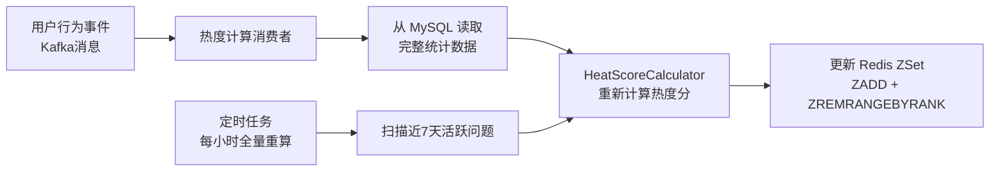
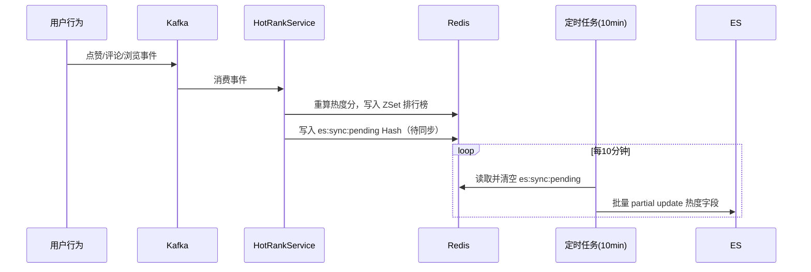

# 计数与热门排行

---

## 1. 系统概述

计数与热门排行系统负责维护平台内容的各类计数（浏览量、点赞数、评论数）以及热门内容排行榜，支撑首页热门推荐、圈子/标签热门内容、活跃用户榜单等功能。

### 1.1 统计维度

| 维度 | 更新方式 | 存储 |
|------|----------|------|
| 问题浏览量 | Redis INCR + 定时持久化 | Redis（实时）+ MySQL（持久） |
| 点赞数 / 点彩数 | Redis Lua 原子操作 + Kafka 异步持久化 | Redis（实时）+ MySQL（持久） |
| 评论数 / 回答数 | 数据库原子 UPDATE | MySQL |
| 热门问题排行 | Kafka 事件驱动 + 定时全量重算 | Redis ZSet |
| 热门标签 / 圈子 | 定时任务（每小时） | Redis ZSet |
| 活跃用户榜单 | 事件驱动实时更新 | Redis ZSet（日/周/月） |

---

## 2. 浏览量统计

### 2.1 方案选型

| 方案 | 优点 | 缺点 |
|------|------|------|
| 直接写 MySQL | 数据实时准确 | 高并发下写压力大，热门问题成为瓶颈 |
| **Redis INCR + 定时持久化** | 高性能，原子操作 | 存在少量数据丢失风险（Redis 宕机） |
| 消息队列异步写 | 削峰填谷 | 链路复杂，延迟较高 |

**选择方案**：Redis INCR + 定时持久化，兼顾性能与实现复杂度。

### 2.2 去重设计（Redis Bitmap）

同一用户 1 小时内重复访问不重复计数，使用 Redis **Bitmap** 实现高效去重。

去重判断、打标记、设过期、计数这四步通过 **Lua 脚本原子执行**，避免多次网络往返以及并发场景下的竞态问题：

```java
@Service
public class ViewCountService {

    private static final String VIEW_COUNT_KEY = "question:view:count:";
    private static final String VIEW_DEDUP_KEY  = "question:view:dedup:";

    /**
     * Lua 脚本：原子执行去重判断 + 计数
     * KEYS[1] = dedupKey, KEYS[2] = countKey
     * ARGV[1] = userId（bit offset）, ARGV[2] = 过期秒数
     * 返回 1 表示本次计数成功，返回 0 表示已去重跳过
     */
    private static final String RECORD_VIEW_SCRIPT =
        "local already = redis.call('GETBIT', KEYS[1], ARGV[1]) " +
        "if already == 1 then return 0 end " +
        "redis.call('SETBIT', KEYS[1], ARGV[1], 1) " +
        "redis.call('EXPIRE', KEYS[1], ARGV[2]) " +
        "redis.call('INCR', KEYS[2]) " +
        "return 1";

    public void recordView(Long questionId, Long userId) {
        String dedupKey = VIEW_DEDUP_KEY + questionId;
        String countKey = VIEW_COUNT_KEY + questionId;

        redisTemplate.execute(
            new DefaultRedisScript<>(RECORD_VIEW_SCRIPT, Long.class),
            Arrays.asList(dedupKey, countKey),
            String.valueOf(userId),  // ARGV[1]：userId 作为 bit offset
            "3600"                   // ARGV[2]：1小时去重窗口
        );
    }
}
```

> **为什么用 Bitmap 而不是 Set？**  
> 100 万用户的访问记录：Set 约需 40MB，Bitmap 仅需 **125KB**，内存节省 320 倍。
>
> **为什么用 Lua 脚本而不是多次独立调用？**  
> 原先的 `GETBIT → SETBIT → EXPIRE → INCR` 是 4 次独立 Redis 命令，存在两个问题：①并发时两个请求可能同时通过 `GETBIT` 检查，导致同一用户被重复计数；②中途服务宕机会造成去重标记已打但计数未增加的数据不一致。Lua 脚本在 Redis 单线程中原子执行，彻底消除竞态，同时将 4 次网络往返压缩为 1 次。

### 2.3 定时持久化（每 5 分钟）

```java
@Scheduled(fixedDelay = 5 * 60 * 1000)
public void syncViewCountToDb() {
    ScanOptions options = ScanOptions.scanOptions()
            .match("question:view:count:*").count(100).build();

    List<ViewCountDTO> updates = new ArrayList<>();
    try (Cursor<byte[]> cursor = redisTemplate.scan(options)) {
        while (cursor.hasNext()) {
            String key = new String(cursor.next());
            // getAndDelete 原子操作：读取并清零，防止重复统计
            Long increment = (Long) redisTemplate.execute(
                new DefaultRedisScript<>(
                    "local v = redis.call('GET', KEYS[1]); " +
                    "if v then redis.call('DEL', KEYS[1]) end; return v",
                    Long.class
                ),
                Collections.singletonList(key)
            );
            if (increment != null && increment > 0) {
                Long questionId = Long.parseLong(key.replace("question:view:count:", ""));
                updates.add(new ViewCountDTO(questionId, increment));
            }
        }
    }

    if (!updates.isEmpty()) {
        // 批量 UPDATE，幂等（使用 += 而非 =）
        questionMapper.batchIncrementViewCount(updates);
    }
}
```

```sql
-- 对应 SQL：原子累加，幂等安全
UPDATE question SET view_count = view_count + #{increment} WHERE id = #{questionId};
```

### 2.4 优雅关闭时主动刷盘

服务重启时，Redis 中尚未持久化的增量会丢失。通过监听 Spring 关闭事件，在服务停止前主动刷盘：

```java
@EventListener(ContextClosedEvent.class)
public void onShutdown() {
    log.info("服务关闭，开始持久化浏览量数据...");
    syncViewCountToDb();
    log.info("浏览量数据持久化完成");
}
```

---

## 3. 热度分计算模型

### 3.1 算法设计

参考 Hacker News 算法，综合多个行为维度并引入时间衰减：

```
热度分 = (点赞数 × W₁ + 点彩数 × W₂ + 评论数 × W₃ + 浏览量 × W₄) / 时间衰减系数

时间衰减系数 = (发布至今小时数 + 2) ^ 1.5
```

**权重配置（可动态调整）**：

| 行为 | 权重 | 说明 |
|------|------|------|
| 点彩（精华） | 5 | 代表高质量内容，权重最高 |
| 点赞 | 3 | 代表用户认可度 |
| 评论 | 2 | 代表内容讨论热度 |
| 浏览量 | 0.1 | 权重最低，防止刷量干扰 |

### 3.2 代码实现

```java
@Component
public class HeatScoreCalculator {

    public double calculate(QuestionStats stats, LocalDateTime publishTime) {
        double score = stats.getLikeCount()    * 3.0
                     + stats.getStarCount()    * 5.0
                     + stats.getCommentCount() * 2.0
                     + stats.getViewCount()    * 0.1;

        long hoursElapsed = ChronoUnit.HOURS.between(publishTime, LocalDateTime.now());
        double decay = Math.pow(hoursElapsed + 2, 1.5);

        return score / decay;
    }
}
```

### 3.3 防刷机制

- **浏览量去重**：Bitmap 记录，1 小时内同一用户只计一次
- **点赞唯一性**：Redis Set + Lua 原子操作，防止重复点赞
- **异常流量识别**：短时间内浏览量暴增（超过阈值）触发告警，人工审核

---

## 4. 热门排行榜

### 4.1 Redis ZSet 方案

Redis 有序集合（ZSet）天然支持按分值排序，是实现排行榜的标准方案：

```
Key 设计：
  hot:questions:global          → 全站热门问题（Top 500）
  hot:questions:circle:{id}     → 圈子热门问题（Top 100）
  hot:questions:tag:{id}        → 标签热门问题（Top 100）
  hot:tags:global               → 热门标签（Top 100）
  hot:circles:global            → 热门圈子（Top 100）
```

### 4.2 热度分更新流程



### 4.3 代码实现

```java
@Service
public class HotRankService {

    /**
     * 更新问题热度分（由 Kafka 消费者调用）
     */
    public void updateHeatScore(Long questionId) {
        QuestionStats stats = questionStatsMapper.selectByQuestionId(questionId);
        Question question = questionMapper.selectById(questionId);
        double heatScore = heatScoreCalculator.calculate(stats, question.getCreateTime());

        // 1. 更新全站排行榜
        redisTemplate.opsForZSet().add("hot:questions:global", questionId, heatScore);
        // 控制大小，只保留 Top 500
        redisTemplate.opsForZSet().removeRange("hot:questions:global", 0, -501);

        // 2. 更新圈子排行榜
        String circleKey = "hot:questions:circle:" + question.getCircleId();
        redisTemplate.opsForZSet().add(circleKey, questionId, heatScore);
        redisTemplate.opsForZSet().removeRange(circleKey, 0, -101);
        redisTemplate.expire(circleKey, Duration.ofDays(7));  // 7天过期

        // 3. 更新标签排行榜
        question.getTagIds().forEach(tagId -> {
            String tagKey = "hot:questions:tag:" + tagId;
            redisTemplate.opsForZSet().add(tagKey, questionId, heatScore);
            redisTemplate.opsForZSet().removeRange(tagKey, 0, -101);
            redisTemplate.expire(tagKey, Duration.ofDays(7));
        });

        // 4. 将最新热度数据暂存到 Redis Hash，等待批量同步到 ES
        //    Key: es:sync:pending  Field: questionId  Value: 序列化的热度快照
        EsSyncData syncData = EsSyncData.builder()
            .viewCount(stats.getViewCount())
            .likeCount(stats.getLikeCount())
            .answerCount(stats.getAnswerCount())
            .commentCount(stats.getCommentCount())
            .heatScore(heatScore)
            .lastActiveTime(stats.getLastActiveTime())
            .build();
        redisTemplate.opsForHash().put(
            "es:sync:pending",
            questionId.toString(),
            JSON.toJSONString(syncData)
        );
    }

    /**
     * 查询 Top N 热门问题 ID
     */
    public List<Long> getTopHotQuestions(int topN) {
        Set<Object> ids = redisTemplate.opsForZSet()
                .reverseRange("hot:questions:global", 0, topN - 1);
        return ids.stream().map(id -> Long.parseLong(id.toString())).collect(toList());
    }

    /**
     * 定时全量重算（每小时），防止数据漂移
     */
    @Scheduled(cron = "0 0 * * * ?")
    public void fullRecalculate() {
        // 只重算近 7 天有过行为的活跃问题，避免全表扫描
        LocalDateTime since = LocalDateTime.now().minusDays(7);
        List<Long> activeIds = questionMapper.selectActiveQuestionIds(since);
        activeIds.forEach(this::updateHeatScore);
        log.info("热门排行榜全量重算完成，共处理 {} 条", activeIds.size());
    }
}
```

### 4.4 缓存重建（服务启动时）

```java
@PostConstruct
public void rebuildHotRankCache() {
    log.info("开始重建热门排行榜缓存...");
    List<QuestionHeatDTO> topQuestions = questionMapper.selectTopByHeatScore(500, 7);
    topQuestions.forEach(dto ->
        redisTemplate.opsForZSet().add("hot:questions:global", dto.getQuestionId(), dto.getHeatScore())
    );
    log.info("热门排行榜缓存重建完成，共 {} 条", topQuestions.size());
}
```

---

## 5. 热度数据同步到 ES

### 5.1 为什么不在 Kafka 消费时直接写 ES？

| 方式 | 问题 |
|------|------|
| 每次 Kafka 消费都写 ES | 热门问题每秒可能触发几十次事件，ES 频繁 `update` 导致 segment merge 压力大 |
| **定时批量同步** | 合并多次变更为一次写入，ES 压力小，10 分钟延迟对排序影响可接受 |

**核心思路**：Kafka 消费时只更新 Redis ZSet 排行榜，并将最新热度快照写入 `es:sync:pending` Hash 暂存（同一问题多次更新天然覆盖，自动去重）；定时任务每 10 分钟将 Hash 中的数据批量刷入 ES。



### 5.2 批量同步实现

```java
@Service
public class HeatScoreSyncService {

    /**
     * 每 10 分钟将 Redis 中待同步的热度数据批量写入 ES
     */
    @Scheduled(fixedDelay = 10 * 60 * 1000)
    public void syncHeatScoreToEs() {
        // 1. 原子获取并清空待同步列表，防止重复同步
        Map<Object, Object> pendingMap = redisTemplate.opsForHash().entries("es:sync:pending");
        if (pendingMap.isEmpty()) {
            return;
        }
        redisTemplate.delete("es:sync:pending");  // 先删除，再处理

        // 2. 构建 ES 批量 partial update 请求
        List<BulkOperation> operations = pendingMap.entrySet().stream()
            .map(entry -> {
                Long questionId = Long.parseLong(entry.getKey().toString());
                EsSyncData data = JSON.parseObject(entry.getValue().toString(), EsSyncData.class);

                Map<String, Object> doc = Map.of(
                    "view_count",       data.getViewCount(),
                    "like_count",       data.getLikeCount(),
                    "answer_count",     data.getAnswerCount(),
                    "comment_count",    data.getCommentCount(),
                    "heat_score",       data.getHeatScore(),
                    "last_active_time", data.getLastActiveTime()
                );

                return BulkOperation.of(op -> op
                    .update(u -> u
                        .index("questions")
                        .id(questionId.toString())
                        .action(a -> a.doc(doc))  // partial update，不影响标题/内容等全文索引字段
                    )
                );
            })
            .collect(toList());

        // 3. 批量提交
        BulkResponse response = esClient.bulk(b -> b.operations(operations));
        if (response.errors()) {
            response.items().stream()
                .filter(item -> item.error() != null)
                .forEach(item -> log.error("ES 热度同步失败，questionId={}, error={}",
                    item.id(), item.error().reason()));
        }
        log.info("热度数据同步到 ES 完成，共 {} 条", operations.size());
    }
}
```

### 5.3 关键设计点

| 设计点 | 方案 | 原因 |
|--------|------|------|
| 同步频率 | 每 10 分钟批量 | 合并多次变更，降低 ES 写压力 |
| 中间暂存 | Redis Hash `es:sync:pending` | 同一问题多次更新只保留最新值，天然去重 |
| 只更新计数字段 | ES partial update | 不影响标题、内容等全文索引字段，避免重建倒排索引 |
| 失败处理 | 记录日志，下次重算时重新标记 | 热度数据允许短暂不一致，最终一致即可 |
| 冷数据兜底 | ES 中保留上次同步的快照值 | Redis 无数据时搜索结果仍有热度参考值 |

---

## 6. 标签 / 圈子计数

### 5.1 问题数统计

标签和圈子的问题数通过数据库原子 UPDATE 维护，Kafka 串行消费保证顺序：

```java
@KafkaListener(topics = "question-tag-event", groupId = "tag-count-group")
public void handleTagEvent(QuestionTagEvent event) {
    if (event.getType() == EventType.BIND) {
        tagMapper.incrementQuestionCount(event.getTagId());
    } else if (event.getType() == EventType.UNBIND) {
        tagMapper.decrementQuestionCount(event.getTagId());
    }
}
```

```sql
-- 原子自增（数据库行锁保证并发安全）
UPDATE tag SET question_count = question_count + 1 WHERE id = #{tagId};

-- 防止计数为负
UPDATE tag SET question_count = GREATEST(question_count - 1, 0) WHERE id = #{tagId};
```

### 5.2 热门标签排行

热门标签热度分 = 标签下近 24 小时内活跃问题的热度分之和，每小时定时计算：

```java
@Scheduled(cron = "0 0 * * * ?")
public void updateHotTags() {
    List<TagHeatDTO> tagHeats = tagMapper.calcTagHeatScores(LocalDateTime.now().minusHours(24));
    tagHeats.forEach(dto ->
        redisTemplate.opsForZSet().add("hot:tags:global", dto.getTagId(), dto.getHeatScore())
    );
    redisTemplate.opsForZSet().removeRange("hot:tags:global", 0, -101);  // 只保留 Top 100
}
```

---

## 7. 用户活跃度榜单

### 6.1 活跃度模型

```
活跃度分 = 发布问题 × 5 + 发布回答 × 3 + 发布评论 × 1 + 回答被采纳 × 10 + 内容被点彩 × 8
```

### 6.2 多周期榜单（日 / 周 / 月）

```java
@Service
public class UserActivityService {

    public void addActivityScore(Long userId, ActionType actionType) {
        int score = actionType.getScore();
        String today = LocalDate.now().format(DateTimeFormatter.BASIC_ISO_DATE);
        String week  = String.valueOf(LocalDate.now().get(WeekFields.ISO.weekOfYear()));
        String month = LocalDate.now().format(DateTimeFormatter.ofPattern("yyyyMM"));

        // Pipeline 批量操作，减少网络往返
        redisTemplate.executePipelined((RedisCallback<Object>) conn -> {
            conn.zIncrBy(("active:users:day:"   + today).getBytes(), score, userId.toString().getBytes());
            conn.zIncrBy(("active:users:week:"  + week).getBytes(),  score, userId.toString().getBytes());
            conn.zIncrBy(("active:users:month:" + month).getBytes(), score, userId.toString().getBytes());
            return null;
        });
    }
}
```

### 6.3 榜单归档

```java
@Scheduled(cron = "0 5 0 * * ?")  // 每天凌晨归档昨日榜单
public void archiveDailyRank() {
    String yesterday = LocalDate.now().minusDays(1).format(DateTimeFormatter.BASIC_ISO_DATE);
    String key = "active:users:day:" + yesterday;

    Set<ZSetOperations.TypedTuple<Object>> topUsers =
            redisTemplate.opsForZSet().reverseRangeWithScores(key, 0, 99);
    if (topUsers != null && !topUsers.isEmpty()) {
        userActivityMapper.batchInsertDailyRank(yesterday, topUsers);
    }
    redisTemplate.delete(key);  // 归档后删除 Redis 数据
}
```

---

## 8. 关键设计决策

| 问题 | 方案 | 原因 |
|------|------|------|
| 浏览量高并发写 | Redis INCR + 定时批量持久化 | 避免直接写 DB 的写压力，INCR 原子操作防并发 |
| 浏览量去重 | Redis Bitmap | 内存占用远低于 Set（节省 320 倍），O(1) 复杂度 |
| 点赞防重复 | Redis Set + Lua 脚本 | Lua 脚本保证判断和操作的原子性 |
| 排行榜实现 | Redis ZSet | 天然有序，ZADD/ZREVRANGE 操作 O(log N) |
| 热度分更新 | Kafka 事件驱动 + 定时全量兜底 | 准实时更新，定时任务修正数据漂移 |
| 热度同步到 ES | Redis Hash 暂存 + 定时批量刷入 | 合并多次变更，降低 ES segment merge 压力 |
| 计数并发安全 | 数据库原子 UPDATE + Kafka 串行消费 | 利用数据库行锁或消息队列串行化保证计数准确 |
| Redis 内存膨胀 | ZSet 裁剪 + Key 设置 TTL | 每个排行榜限制 Top N，圈子/标签 Key 7 天过期 |