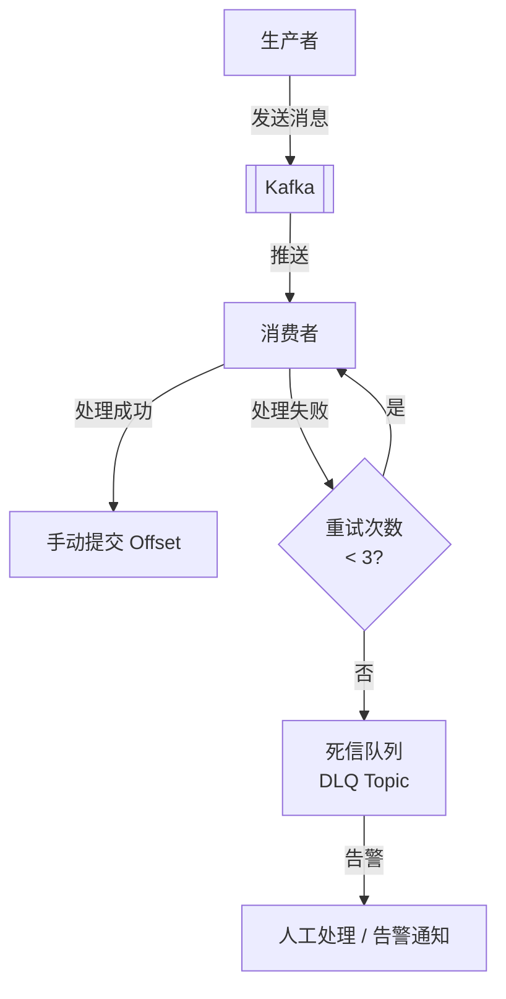
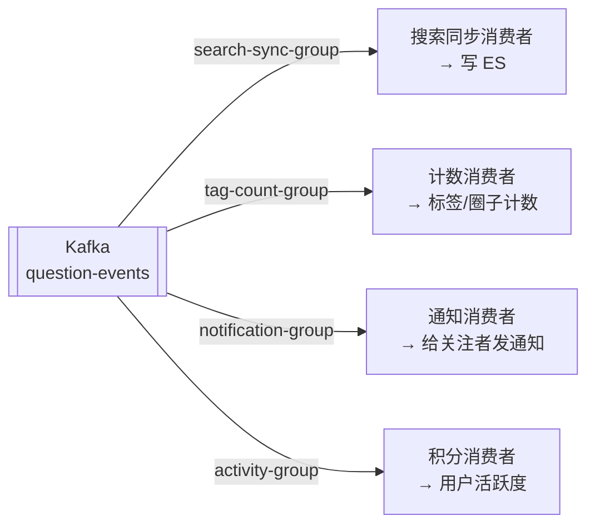

# 异步架构设计

---

## 1. 为什么引入 Kafka？

用户在问答系统中的每次交互（点赞、评论、@用户、发布问题）都会触发一系列后续操作：

- 更新 ES 搜索索引
- 重算内容热度分，更新排行榜
- 发送站内消息和 IM 通知
- 更新用户活跃度积分
- 持久化计数器到 MySQL

如果这些操作全部**同步执行**，接口响应时间会很长，且任何一个环节失败都会导致整个请求失败。

```mermaid
flowchart LR
    subgraph 同步方案（❌ 问题）
        A1["用户点赞"] --> B1["写MySQL"] --> C1["写ES"] --> D1["算热度"] --> E1["发通知"] --> F1["返回"]
        style A1 fill:#ffcccc
    end

    subgraph 异步方案（✅ 推荐）
        A2["用户点赞"] --> B2["写MySQL+Redis"] --> F2["立即返回"]
        B2 --> Kafka2[[Kafka]]
        Kafka2 --> C2["ES同步消费者"]
        Kafka2 --> D2["热度计算消费者"]
        Kafka2 --> E2["通知消费者"]
    end
```

**引入 Kafka 的收益**：
- 接口只需完成核心操作（写 MySQL + Redis），其余异步处理，响应时间从 200ms 降至 30ms
- 各消费者独立，互不影响，一个消费者故障不影响其他
- 天然削峰，应对突发流量

---

## 2. Topic 设计

| Topic | 生产者 | 消费者（消费者组） | 说明 |
|-------|--------|-----------------|------|
| `question-events` | 问答服务 | 搜索同步（`search-sync-group`）、统计服务（`stats-group`） | 问题发布/编辑/删除 |
| `user-actions` | 问答服务 | 统计服务（`stats-group`）、通知服务（`notification-group`） | 点赞/点彩/收藏/评论 |
| `mention-events` | 问答服务 | 通知服务（`notification-group`） | @用户事件 |
| `answer-events` | 问答服务 | 通知服务（`notification-group`）、统计服务（`stats-group`） | 回答发布/被采纳 |

**分区策略**：所有 Topic 均以 `userId` 作为消息 Key，保证同一用户的行为事件路由到同一分区，实现顺序消费。

---

## 3. 消息结构设计

```java
// 统一消息基类
@Data
public class BaseEvent {
    private String eventType;   // 事件类型
    private Long   userId;      // 操作用户
    private Long   timestamp;   // 事件时间戳（毫秒）
    private String traceId;     // 链路追踪 ID（用于日志关联）
}

// 用户行为事件
@Data
@EqualsAndHashCode(callSuper = true)
public class UserActionEvent extends BaseEvent {
    private Long    targetId;    // 目标ID（问题/回答/评论）
    private Integer targetType;  // 1问题 2回答 3评论
    private Integer actionType;  // 1点赞 2点彩 3收藏 4评论
    private Integer delta;       // +1 点赞 / -1 取消点赞
}

// 问题事件
@Data
@EqualsAndHashCode(callSuper = true)
public class QuestionEvent extends BaseEvent {
    private Long        questionId;
    private String      title;
    private String      content;
    private List<Long>  tagIds;
    private Long        circleId;
    private Set<Long>   mentionedUsers;  // @提及的用户列表
}
```

---

## 4. 消息可靠性保障

### 4.1 生产者配置

```yaml
spring:
  kafka:
    producer:
      acks: all                   # 所有副本确认才算成功（最强可靠性）
      retries: 3                  # 失败自动重试 3 次
      enable-idempotence: true    # 开启幂等，防止重试导致重复发送
      compression-type: snappy    # 消息压缩，减少网络传输
```

### 4.2 消费者配置

```yaml
spring:
  kafka:
    consumer:
      enable-auto-commit: false   # 关闭自动提交，改为手动提交
      auto-offset-reset: earliest # 新消费者组从最早的消息开始消费
      max-poll-records: 100       # 每次 poll 最多拉取 100 条
```

### 4.3 可靠性流程



---

## 5. 本地消息表（防消息丢失）

**问题**：MySQL 写入成功，但 Kafka 消息发送失败（网络抖动），导致 ES 数据未同步。

**解决方案**：本地消息表（Outbox Pattern），将业务操作和消息记录放在同一个 MySQL 事务中：

```sql
CREATE TABLE outbox_message (
    id          BIGINT   PRIMARY KEY AUTO_INCREMENT,
    topic       VARCHAR(64)  NOT NULL COMMENT 'Kafka Topic',
    message_key VARCHAR(64)           COMMENT '消息 Key（用于分区路由）',
    payload     TEXT         NOT NULL COMMENT '消息内容（JSON）',
    status      TINYINT      NOT NULL DEFAULT 0 COMMENT '0待发送 1已发送 2失败',
    created_at  DATETIME     NOT NULL DEFAULT CURRENT_TIMESTAMP,
    sent_at     DATETIME,
    retry_count INT          NOT NULL DEFAULT 0,
    INDEX idx_status_created (status, created_at)
);
```

```java
@Transactional
public void publishQuestion(QuestionDTO dto, Long userId) {
    // 1. 写入业务数据
    Question question = questionMapper.insert(buildQuestion(dto, userId));

    // 2. 同一事务写入消息记录（保证原子性）
    OutboxMessage msg = OutboxMessage.builder()
        .topic("question-events")
        .messageKey(userId.toString())
        .payload(JSON.toJSONString(QuestionCreatedEvent.of(question)))
        .build();
    outboxMapper.insert(msg);
    // 事务提交后，消息记录和业务数据同时落库
}

// 独立的消息投递服务，轮询 outbox_message 表
@Scheduled(fixedDelay = 1000)
public void relayMessages() {
    List<OutboxMessage> pending = outboxMapper.selectPending(100);
    for (OutboxMessage msg : pending) {
        try {
            kafkaTemplate.send(msg.getTopic(), msg.getMessageKey(), msg.getPayload()).get();
            outboxMapper.markSent(msg.getId());
        } catch (Exception e) {
            outboxMapper.incrementRetry(msg.getId());
            log.error("消息投递失败，msgId={}", msg.getId(), e);
        }
    }
}
```

---

## 6. 一个事件，多个消费者独立处理

### 6.1 设计原则

当一个动作触发多件事时，**不要在方法里依次串行处理**，而是发布一条事件消息，由多个独立消费者各自负责一件事。

```java
// ❌ 反模式：所有逻辑堆在一个方法里
@Transactional
public void publishQuestion(QuestionDTO dto) {
    questionMapper.insert(question);       // 主业务
    esClient.index(question);             // ES 同步（ES 挂了，发帖失败？）
    tagMapper.incrementCount(question);   // 标签计数（慢，用户等待）
    notificationService.notify(question); // 发通知（更慢）
    userActivityService.addScore(userId); // 积分
}
```

**问题**：任何一步失败都导致整个发帖失败；所有操作串行，响应慢；业务耦合严重。

```java
// ✅ 推荐：主业务只做核心写入 + 发一条消息
@Transactional
public void publishQuestion(QuestionDTO dto, Long userId) {
    // 1. 写主业务数据
    Question question = questionMapper.insert(buildQuestion(dto, userId));

    // 2. 同一事务写入本地消息表（保证消息不丢）
    outboxMapper.insert(OutboxMessage.builder()
        .topic("question-events")
        .messageKey(userId.toString())
        .payload(JSON.toJSONString(QuestionEvent.created(question)))
        .build());
    // 发帖完成，其他事情交给各消费者异步处理
}
```

### 6.2 多消费者组并行消费

同一条消息，不同 `groupId` 的消费者组都能独立收到，**互不干扰、并行处理**：



```java
// 消费者1：ES 同步
@KafkaListener(topics = "question-events", groupId = "search-sync-group")
public void handleForSearch(QuestionEvent event, Acknowledgment ack) {
    esClient.index(buildDocument(event));
    ack.acknowledge();
}

// 消费者2：标签计数
@KafkaListener(topics = "question-events", groupId = "tag-count-group")
public void handleForTagCount(QuestionEvent event, Acknowledgment ack) {
    event.getTagIds().forEach(tagMapper::incrementQuestionCount);
    ack.acknowledge();
}

// 消费者3：消息通知
@KafkaListener(topics = "question-events", groupId = "notification-group")
public void handleForNotification(QuestionEvent event, Acknowledgment ack) {
    notificationService.notifyFollowers(event.getUserId(), event.getQuestionId());
    ack.acknowledge();
}

// 消费者4：用户积分
@KafkaListener(topics = "question-events", groupId = "activity-group")
public void handleForActivity(QuestionEvent event, Acknowledgment ack) {
    userActivityService.addScore(event.getUserId(), ActionType.PUBLISH_QUESTION);
    ack.acknowledge();
}
```

**关键**：每个消费者用不同的 `groupId`，Kafka 会把同一条消息分发给每个 group，各自独立消费，一个消费者故障不影响其他消费者。

### 6.3 消费者性能调优

**多个 Listener 不会有性能问题**，每个 groupId 是独立的消费者组，各自维护 offset，并行消费。真正需要关注的是**单个消费者处理逻辑是否足够轻量**。

#### 并发消费配置

```yaml
spring:
  kafka:
    listener:
      concurrency: 3   # 启动 3 个并发消费者线程，建议与分区数一致
```

> **注意**：同一 group 内消费者实例数不要超过分区数，否则多余的实例会空转浪费资源。

#### 批量消费（提升吞吐）

```java
// 批量消费，比逐条处理性能高 10 倍以上
@KafkaListener(
    topics = "question-events",
    groupId = "search-sync-group",
    concurrency = "3",
    containerFactory = "batchKafkaListenerContainerFactory"
)
public void handleForSearchBatch(List<QuestionEvent> events, Acknowledgment ack) {
    // 批量写 ES，减少网络往返
    esClient.bulkIndex(events.stream()
        .map(this::buildDocument)
        .collect(Collectors.toList()));
    ack.acknowledge();
}
```

#### 消费者内部耗时操作异步化

```java
// 通知消费者：给大量关注者发通知，不能在消费者线程里同步处理
@KafkaListener(topics = "question-events", groupId = "notification-group")
public void handleForNotification(QuestionEvent event, Acknowledgment ack) {
    // ❌ 错误：同步遍历发通知，消费者阻塞，消息积压
    // followerService.getFollowers(event.getUserId())
    //     .forEach(userId -> notificationService.push(userId, event));

    // ✅ 正确：只写入通知任务表，由专门的线程池异步处理
    notificationTaskMapper.insert(buildTask(event));
    ack.acknowledge();  // 快速提交，不阻塞消费者
}
```

#### 串行 vs 事件驱动对比

| 维度 | 直接串行写 | 事件驱动（推荐） |
|------|-----------|----------------|
| 响应速度 | 慢（所有操作同步完成） | 快（主业务完成即返回） |
| 故障隔离 | ES 挂了发帖失败 | ES 挂了不影响发帖，恢复后补偿 |
| 代码耦合 | 高（改通知要动发帖代码） | 低（各消费者独立迭代） |
| 适用场景 | 强一致性要求、业务初期 | 业务复杂、多个下游系统 |

> **判断标准**：如果某个下游操作失败了，主业务是否应该回滚？是 → 同一事务串行写；否 → 消息队列异步处理。

---

## 7. 消费者幂等处理

Kafka 至少一次（at-least-once）语义下，消息可能被重复消费，消费者必须做幂等处理：

```java
@KafkaListener(topics = "user-actions", groupId = "statistics-group")
public void handleUserAction(UserActionEvent event, Acknowledgment ack) {
    // 幂等键：用户ID + 目标ID + 行为类型 + 时间窗口（分钟级）
    String idempotentKey = String.format("action:%d:%d:%d:%d",
        event.getUserId(), event.getTargetId(),
        event.getActionType(), event.getTimestamp() / 60000);

    // Redis SETNX，60秒内相同操作只处理一次
    Boolean isNew = redisTemplate.opsForValue()
        .setIfAbsent(idempotentKey, "1", Duration.ofSeconds(60));

    if (Boolean.TRUE.equals(isNew)) {
        statisticsService.updateCount(event);
    }

    ack.acknowledge();  // 手动提交 offset
}
```

---

## 8. 遇到的问题

### 问题 1：消息积压

**现象**：活跃度暴增时，`user-actions` topic 消息积压超过 50 万条，通知延迟严重。

**原因**：消费者只有 1 个实例，处理速度跟不上生产速度。

**解决**：
1. 将 topic 分区数从 1 增加到 6
2. 消费者实例扩容到 6 个（与分区数对应）
3. 通知服务与统计服务拆分为独立消费者组，互不影响

### 问题 2：消息顺序问题

**现象**：用户先点赞后取消点赞，但消费者先处理了"取消点赞"消息，导致计数出现负数。

**原因**：多分区情况下，同一用户的消息可能分配到不同分区，无法保证顺序。

**解决**：发送消息时以 `userId` 作为 Kafka 消息的 Key，同一用户的消息路由到同一分区：

```java
kafkaTemplate.send("user-actions",
    event.getUserId().toString(),  // Key：保证同一用户消息有序
    event
);
```

### 问题 3：事务消息问题

**现象**：MySQL 写入成功，但 Kafka 消息发送失败，导致 ES 数据未同步。

**解决**：采用**本地消息表**方案（见第 5 节），业务操作和消息记录在同一事务中提交，独立投递服务保证消息最终发出。