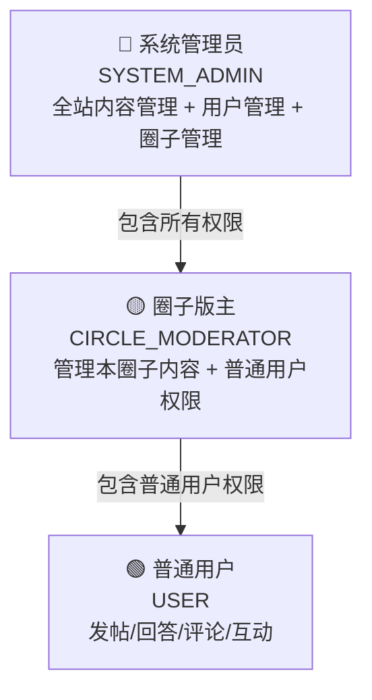
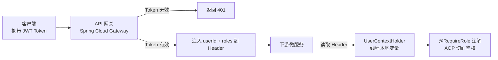

# 权限与安全设计

---

## 1. 角色体系

系统共三种角色，权限逐级递增：



---

## 2. 权限矩阵

| 操作 | 普通用户 | 圈子版主 | 系统管理员 |
|------|---------|---------|-----------|
| 提问 / 回答 / 评论 | ✅ | ✅ | ✅ |
| 点赞 / 点彩 / 收藏 | ✅ | ✅ | ✅ |
| 删除**自己的**内容 | ✅ | ✅ | ✅ |
| 删除**圈子内**违规内容 | ❌ | ✅（仅本圈子） | ✅ |
| 新建 / 编辑圈子 | ❌ | ❌ | ✅ |
| 设置圈子版主 | ❌ | ❌ | ✅ |
| 删除任意内容 | ❌ | ❌ | ✅ |
| 查看用户管理后台 | ❌ | ❌ | ✅ |

---

## 3. 数据库设计

```sql
-- 全局角色表
CREATE TABLE user_role (
    user_id   BIGINT      NOT NULL,
    role      VARCHAR(32) NOT NULL COMMENT 'USER / SYSTEM_ADMIN',
    PRIMARY KEY (user_id, role)
);

-- 圈子成员表（圈子级别角色）
CREATE TABLE circle_member (
    circle_id BIGINT   NOT NULL,
    user_id   BIGINT   NOT NULL,
    role      TINYINT  NOT NULL DEFAULT 0 COMMENT '0普通成员 1版主',
    joined_at DATETIME NOT NULL DEFAULT CURRENT_TIMESTAMP,
    PRIMARY KEY (circle_id, user_id),
    INDEX idx_user_id (user_id)
);
```

---

## 4. 认证与鉴权流程

### 4.1 整体架构



### 4.2 网关层：JWT 解析与转发

```java
@Component
public class AuthGlobalFilter implements GlobalFilter, Ordered {

    @Override
    public Mono<Void> filter(ServerWebExchange exchange, GatewayFilterChain chain) {
        String token = extractToken(exchange.getRequest());

        if (token == null) {
            return unauthorized(exchange);
        }

        try {
            Claims claims = jwtUtil.parseToken(token);
            Long userId = claims.get("userId", Long.class);
            String roles = claims.get("roles", String.class);

            // 将用户信息注入 Header，下游服务直接读取，无需再查 DB
            ServerHttpRequest mutatedRequest = exchange.getRequest().mutate()
                .header("X-User-Id", userId.toString())
                .header("X-User-Roles", roles)
                .build();

            return chain.filter(exchange.mutate().request(mutatedRequest).build());
        } catch (JwtException e) {
            return unauthorized(exchange);
        }
    }

    @Override
    public int getOrder() {
        return -100;  // 最高优先级
    }
}
```

### 4.3 服务层：注解 + AOP 鉴权

```java
// 自定义权限注解
@Target(ElementType.METHOD)
@Retention(RetentionPolicy.RUNTIME)
public @interface RequireRole {
    String[] value();  // 允许的角色列表
}

// AOP 切面
@Aspect
@Component
public class AuthAspect {

    @Around("@annotation(requireRole)")
    public Object checkRole(ProceedingJoinPoint pjp, RequireRole requireRole) throws Throwable {
        UserContext user = UserContextHolder.get();
        if (user == null) {
            throw new UnauthorizedException("未登录");
        }
        boolean hasRole = Arrays.stream(requireRole.value())
            .anyMatch(role -> user.getRoles().contains(role));
        if (!hasRole) {
            throw new ForbiddenException("权限不足，需要角色：" + Arrays.toString(requireRole.value()));
        }
        return pjp.proceed();
    }
}

// 使用示例
@DeleteMapping("/questions/{id}")
@RequireRole({"SYSTEM_ADMIN"})
public Result deleteQuestion(@PathVariable Long id) { ... }

@PostMapping("/circles")
@RequireRole({"SYSTEM_ADMIN"})
public Result createCircle(@RequestBody CircleDTO dto) { ... }
```

### 4.4 圈子版主的特殊校验

版主权限是**圈子级别**的，需要额外校验操作者是否是**该内容所在圈子**的版主：

```java
public void deleteQuestionByModerator(Long questionId, Long operatorId) {
    Question question = questionMapper.selectById(questionId);
    if (question == null) {
        throw new NotFoundException("问题不存在");
    }

    // 双重校验：1. 问题所属圈子  2. 操作者是否是该圈子的版主
    Long circleId = question.getCircleId();
    CircleMember member = circleMemberMapper.selectByCircleAndUser(circleId, operatorId);
    if (member == null || member.getRole() != 1) {
        throw new ForbiddenException("您不是该圈子的版主，无权删除此内容");
    }

    questionMapper.softDelete(questionId);  // 软删除
    kafkaTemplate.send("question-events", QuestionDeletedEvent.of(questionId));
}
```

> **踩坑记录**：早期只校验了用户是否是"某个圈子的版主"，没有校验问题是否属于该版主管理的圈子，导致 A 圈子的版主可以删除 B 圈子的问题。修复方案：先查问题所属圈子，再校验操作者是否是**该圈子**的版主。

---

## 5. 用户上下文传递

```java
// 拦截器：从 Header 中读取用户信息，存入 ThreadLocal
@Component
public class UserContextInterceptor implements HandlerInterceptor {

    @Override
    public boolean preHandle(HttpServletRequest request, HttpServletResponse response, Object handler) {
        String userId = request.getHeader("X-User-Id");
        String roles  = request.getHeader("X-User-Roles");

        if (userId != null) {
            UserContext ctx = new UserContext(Long.parseLong(userId),
                Arrays.asList(roles.split(",")));
            UserContextHolder.set(ctx);
        }
        return true;
    }

    @Override
    public void afterCompletion(HttpServletRequest req, HttpServletResponse res,
                                Object handler, Exception ex) {
        UserContextHolder.clear();  // 请求结束后清理，防止内存泄漏
    }
}
```

---

## 6. 接口安全设计

### 6.1 内容安全过滤

发布问题/回答/评论时，对内容进行安全过滤，防止 XSS 攻击：

```java
@Service
public class ContentSanitizer {

    private final PolicyFactory policy = Sanitizers.FORMATTING
        .and(Sanitizers.LINKS)
        .and(Sanitizers.BLOCKS);

    /**
     * 清理 HTML 内容，保留安全标签，过滤脚本等危险内容
     */
    public String sanitize(String content) {
        return policy.sanitize(content);
    }
}
```

### 6.2 操作频率限制

防止用户短时间内大量发帖/评论（防刷）：

```java
@Aspect
@Component
public class RateLimitAspect {

    @Around("@annotation(rateLimit)")
    public Object checkRateLimit(ProceedingJoinPoint pjp, RateLimit rateLimit) throws Throwable {
        Long userId = UserContextHolder.get().getUserId();
        String key = "rate:" + rateLimit.action() + ":" + userId;

        Long count = redisTemplate.opsForValue().increment(key);
        if (count == 1) {
            redisTemplate.expire(key, rateLimit.window(), TimeUnit.SECONDS);
        }
        if (count > rateLimit.limit()) {
            throw new TooManyRequestsException(
                "操作过于频繁，请 " + rateLimit.window() + " 秒后再试");
        }
        return pjp.proceed();
    }
}

// 使用示例：每分钟最多发布 5 个问题
@PostMapping("/questions")
@RateLimit(action = "publish_question", limit = 5, window = 60)
public Result publishQuestion(@RequestBody QuestionDTO dto) { ... }
```